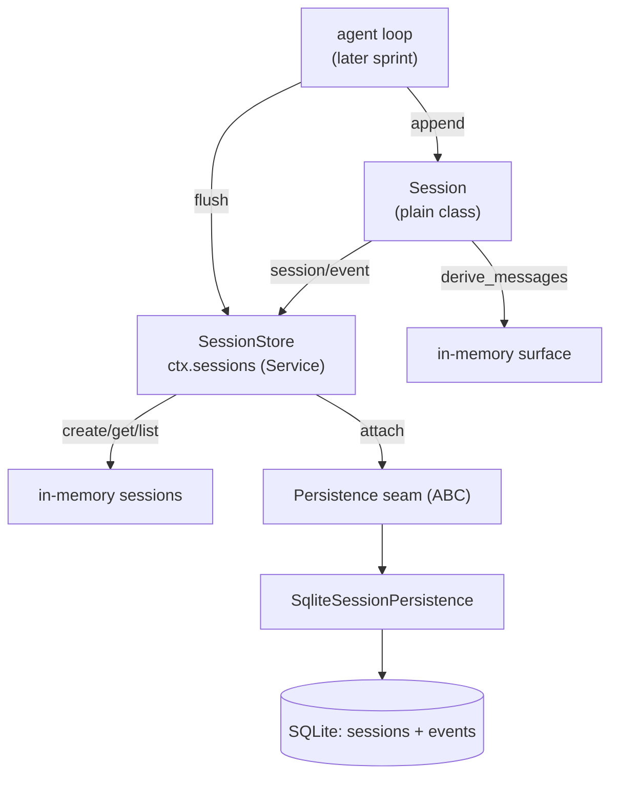

# Design: Session log with SQLite persistence

Conforms to `docs/design/data-architecture.md` — this sprint writes the
storage tier (SQLite session log), the computation tier (in-memory surface /
`derive_messages`), and the storage ↔ computation boundary (append-only log).
The business tier (agent loop) is out of scope here.

## End-to-End Walkthrough

A running harness boots by mounting `SessionStore` and the SQLite persistence
backend. The agent loop (later sprint) opens a conversation: it calls
`ctx.sessions.create("s1")` and gets a live `Session`. As the model call
proceeds, the loop records durable facts — `turn/start`, `user/message`,
`assistant/message`, `tool/call`, `tool/result`, `turn/end` — via
`session.append(type, data)`. Each append updates the in-memory log and, for a
surface event, the derived message list. When a checkpoint is owed, the loop
`await ctx.sessions.flush(session)`; that awaits the SQLite write, so an
acknowledged turn is on disk.

The process dies. On restart, the harness re-mounts the backend, which loads
`s1` from SQLite: reads the `sessions` header row and every `events` row in
`seq` order, reconstructs a `Session`, and recomputes the surface. The resumed
loop calls `derive_messages()` and receives the same model history it had
before the crash. No event is lost, none is reordered, none is edited.

## Tech Stack

- **Language**: Python 3.13 (`pyproject.toml` + `uv`)
- **Kernel**: the local `plugkit` package (path dependency on
  `bayeslearner-microkernel` canonical checkouts; see Connectivity below)
- **Persistence**: `sqlite3` stdlib, WAL mode, one transaction per event
- **Testing**: `pytest` (no hypothesis in this sprint; the invariants are
  simple enough for directed asserts)

### Connectivity

The kernel ships as a local package at
`~/Dropbox/Projects/bayeslearner-microkernel` and remotely at
`github.com/bayeslearner/plugkit` (fresh, empty). For this sprint, add a path
dependency that resolves the kernel's source for tests:

```toml
[tool.uv.sources]
plugkit = { path = "../bayeslearner-microkernel" }
```

`ponytail:` hardcoded relative path to the kernel checkout. When the kernel
gets a tagged release, switch to a normal `plugkit = ">=x"` dependency-pin in
the Sources block. `'][~publish'` skip importing the kernel through PyPI.

## Directory Structure

```
src/pydsh/
  __init__.py            # package marker + re-exports
  session/
    __init__.py          # public surface: Session, SessionStore, session_events
    events.py            # SessionEventMap types, surface set, version constant
    session.py           # Session (plain class), SessionHeader, derive_messages
    store.py             # SessionStore (kernel Service, ctx.sessions)
    persistence.py       # persistence seam (ABC) + SqliteSessionPersistence
tests/
  conftest.py            # mounts a fresh plugkit Context for each test
  test_session.py        # Requirement 1 (+ derive_messages, edge cases)
  test_store.py          # Requirement 2 (create/get/list, lifecycle broadcast)
  test_persistence.py    # Requirement 3 (flush/load/version/replay)
  test_events.py         # Requirement 4 (vocabulary + surface set)
scripts/
  spec_lint.py           # (stub reference; see tasks)
docs/
  steering/pillars.md    # (scaffolded)
  design/data-architecture.md  # (anchor, scaffolded)
```

## Architecture Overview



## Workflow

```mermaid
flowchart TD
    Start([create session]) --> Store["SessionStore.create"]
    Store --> S["Session (in-memory, seq=0)"]
    S --> Append["session.append(type, data)"]
    Append -->{is surface?}
    Append -->|no| Log["append to log"]
    Append -->|yes| LogS["append + add to surface"]
    Append -->|invalid JSON| Rej["reject, no write"]
    Log --> Idle{"checkpoint owed?"}
    Idle -->|no| Append
    Idle -->|yes| Flush["await sessions.flush(session)"]
    Flush --> DB[("SQLite write")]
    Idle -->|process dies| Reboot["restart: backend.load(id)"]
    Reboot --> S2["rebuild Session + recompute surface"]
    S2 --> Review["derive_messages()"]
    Review --> Idle
```

## Module Design

### `events.py` — vocabulary and version
- **Purpose**: the reference's `SessionEventType` / `SessionEventMap` surface
  as Python constants, the surface event set, and `SESSION_FORMAT_VERSION`.
- **Interface**:
  ```python
  SESSION_FORMAT_VERSION = 0
  SURFACE_EVENTS = ("user/message", "assistant/message", "tool/result")
  TURN_EVENTS: tuple = ("turn/start", "turn/end")
  STEP_EVENTS: tuple = ("step/start", "step/end")
  # event payload field specs live with each type's doc constant
  ```
- **Dependencies**: stdlib `typing` only.

### `session.py` — Session
- **Purpose**: the append-only event log and its derived message list. A plain
  class (never imports the kernel); constructed with `ctx` only so `append`
  can emit `session/event` through the owning store.
- **Interface**:
  ```python
  @dataclass(frozen=True)
  class SessionEvent:
      type: str
      seq: int
      time: float
      data: Any
      surface_op: Any = None     # present only on surface events
      source_event_seqs: tuple = ()

  @dataclass
  class SessionHeader:
      version: int
      id: str
      created_at: float
      cwd: Optional[str] = None

  class Session:
      def __init__(self, ctx, id, header=None, seed_events=()): ...
      @property def seq(self) -> int
      @property def events(self) -> tuple[SessionEvent, ...]   # immutable view
      @property def surface_nodes(self) -> list[int]
      def append(self, event_type, data, *, surface_op=None,
                 source_event_seqs=()) -> SessionEvent
      def derive_messages(self) -> list[Any]
      # -- serialization used by the persistence backend --
      def to_json(self) -> dict      # {"header": ..., "events": [...]}
      @classmethod
      def from_json(cls, ctx, payload) -> Session
  ```
- **Dependencies**: stdlib `json`, `time`; `events.py`.

### `store.py` — SessionStore
- **Purpose**: the `ctx.sessions` Service. Creates, holds, looks up live
  sessions; forwards `session/event` broadcasts; owns the persistence backend.
- **Interface**:
  ```python
  class SessionStore(Service):
      provide = "sessions"
      def __init__(self, ctx, config=None): ...
      def attach_persistence(self, backend) -> None
      def has_persistence(self) -> bool
      async def flush(self, session) -> None
      def create(self, id=None, *, cwd=None, meta=None) -> Session
      def get(self, id) -> Optional[Session]
      def list(self) -> list[Session]
  ```
- **Dependencies**: `session.py`, `persistence.py`; the kernel (`Service`,
  `EventsService`).

### `persistence.py` — seam + SQLite backend
- **Purpose**: durability. The seam is the ABC the store hangs off; the SQLite
  backend writes and reloads a session. Async stepped off the synchronous
  `sqlite3` driver via `asyncio.to_thread`.
- **Interface**:
  ```python
  class SessionPersistence(ABC):        # the seam
      @abstractmethod
      async def create(self, session) -> None
      @abstractmethod
      async def append(self, session, events) -> None
      @abstractmethod
      async def load(self, id) -> Session | None
      @abstractmethod
      async def list(self) -> list[str]

  class SqliteSessionPersistence(SessionPersistence):
      def __init__(self, db_path: str): ...
  ```
- **Dependencies**: stdlib `sqlite3`, `asyncio`, `json`, `pathlib`;
  `session.py`.

## Key Algorithms (pseudo-code)

```
ALGORITHM flush — persist one session's unsaved events
  input:  session, backend
  for each unsaved event (seq > last_persisted_seq) in order:
      backend.append(session.header.id, [event])      # one txn each
  backend.flush()                                      # final txn + fsync
  last_persisted_seq = session.seq
```

```
ALGORITHM load — rebuild a Session from SQLite
  input:  id, backend
  1. row = SELECT * FROM sessions WHERE id = ?
     if none: return None
     if row.version != SESSION_FORMAT_VERSION: raise SessionFormatUnsupported
  2. events = SELECT type, seq, time, data, surface_op, source_event_seqs
              FROM events WHERE session_id = ? ORDER BY seq
  3. for each event: validate lossless-JSON, rebuild SessionEvent
  4. return Session.from_json({header, events})       # recomputes surface
```

## Sequence Diagrams

```mermaid
sequenceDiagram
    participant Loop as Agent loop
    participant Store as SessionStore
    participant S as Session
    participant Persist as SqlitePersistence
    participant DB as SQLite
    Loop->>Store: create("s1")
    Store->>S: new Session
    Store->>DB: persist.create (header)
    Store-->>Loop: Session
    Loop->>S: append("assistant/message", {...})
    S->>Persist: append([event])            # when flush owed
    Persist->>DB: INSERT (txn + fsync)
    Loop->>Store: await flush(s)
    Store->>Persist: flush()
    Persist-->>Store: ok
    Loop->>S: derive_messages()
    S-->>Loop: history
```

## Error Handling Strategy

- **Invalid JSON on append**: reject at the source, before any memory write —
  `Session.append` raises on data that is not lossless-JSON (cycle, `NaN`,
  unsupported scalar). This is the trust boundary: a non-serializable event
  would corrupt the durable log, so failing loud beats silent corruption.
- **Version mismatch on load**: `SessionFormatUnsupportedError` — refuse to
  reconstruct, never silently skip. Pre-release, no migration.
- **Missing session on load**: return `None` (a legitimate "no such session").
- **Persistence errors** (`SessionPersistenceError`): surface from `flush`
  so the caller knows the checkpoint did not land; never swallow to memory.
- **Reentrant/duplicate appends**: the store rejects an append to a session
  it no longer owns (stale after dispose).

## Testing Strategy

Ponytail's one-runnable-check rule, on top of a real pytest suite (the spec's
verification is behavior, not a unit-test reflex):

- **Conformance-first**: a small `test_session.py` asserts the reference
  invariants directly — contiguous seq, surface-set membership, derive
  projection — and (where cheapest) a conformance assertion against the TS
  source's documented event map, mirroring plugkit's `test_conformance.py`.
- **Integration (the real proof)**: `test_persistence.py` runs the complete
  create → append → flush → close → `load` → `derive_messages` round-trip on a
  real `tmp_path` SQLite file. This is the MVP proof: the session survives a
  restart.
- **Unit**: `Session.append` rejection on invalid JSON; surface/derive
  projection; version-mismatch refusal.
- **Test command**: `uv run pytest tests -q`
- **Lint**: `uv run ruff check` (ruff if pinned; else `python -m compileall`
  smoke — decide in tasks)

## Correctness Properties

### Property 1: Append-only and contiguous
- **Statement**: *For any* session, the `seq` values of its events are exactly
  `1..N` with no gaps and no edits — the log a reader sees is the log that was
  appended.
- **Validates**: Req 1.1, 1.2, 1.3
- **Test approach**: append a sequence, assert `[e.seq] == list(range(1, N+1))`
  and that events are immutable (frozen dataclass).

### Property 2: Lossless JSON round-trip
- **Statement**: *For any* lossless-JSON `data`, `Session.append` then (flush
  then `load`) reproduces the identical event `data` — the round-trip is
  byte-identical.
- **Validates**: Req 3.2, NF 2
- **Test approach**: append representative values (nested dicts, unicode,
  booleans, finite ints/floats, arrays), flush, load, compare.

### Property 3: Surface projection is deterministic
- **Statement**: *For any* event log, `derive_messages()` returns the same
  ordered list whether computed incrementally during append or recomputed from
  the loaded log.
- **Validates**: Req 1.4, 3.2, NF 2
- **Test approach**: derive live, flush, load, derive again, assert equal.

## Edge Cases

- Event type not in the vocabulary: allowed to append but never surfaces
  (the reference's `ignorable` guard covers vocabulary growth) — verify it does
  not break `derive_messages`.
- `assistant/message` without a `message` key, or `tool/result` whose `message`
  is absent → `derive_messages` drops it (no crash).
- Empty session: `seq == 0`, `derive_messages() == []`, `load` of a never-flushed
  id returns `None`.
- Two flushes with no new events between: idempotent, no error.
- `flush` on a session the store no longer owns (post-dispose): rejected.

## Retirement of Superseded Features

None — this repo is new; this sprint replaces nothing. (A consumer's existing
backend is retired by that consumer's own repo, never from here.)

## Decisions

### Decision: SQLite over JSONL
**Context:** The reference defaults to one `.jsonl` file per session; dsh-python
mirrors that with `JsonlSessionPersistence`.
**Options:** 1. JSONL — minimal, faithful to reference, but no querying, no
atomic multi-event transaction. 2. SQLite — one stdlib import, WAL, indexed,
transactional flush; a single discoverable store.
**Decision:** SQLite. **Rationale:** the owner directed it; it also serves
persistence beyond the log (later: sessions list, titles, stats) into one store
without a generic-KV detour.

### Decision: Session is a plain class, not a Service
**Context:** The reference keeps `Session` as a plain (non-Cordis-Service)
class; `SessionStore` is the Service.
**Options:** 1. Plain class — matches reference, avoids rebinding surprises.
2. `Service` subclass — tighter kernel integration but wrong ownership.
**Decision:** Plain class. **Rationale:** the reference and the kernel's guide
04 both keep callable-data semantics cleanest as a plain class with behavior
held by the Service.

### Decision: Only the `append` surface op now
**Context:** The reference's surface supports `surfaceOp: replace` for
compaction.
**Options:** 1. Implement replace now. 2. Define the fields, exercise only
`append`.
**Decision:** Define + append only. **Rationale:** YAGNI until compaction
exists; surface metadata stays part of the envelope so no schema change later.
`ponytail:` replace path, add with compaction in a later sprint.

## Security Considerations

- The persistence backend takes a caller-supplied `db_path`; it never
  interpolates untrusted input into SQL — session ids and event payloads are
  bound as parameters, never formatted into a query string.
- Lossless-JSON validation at the append trust boundary prevents malformed
  payloads from reaching the durable log.
