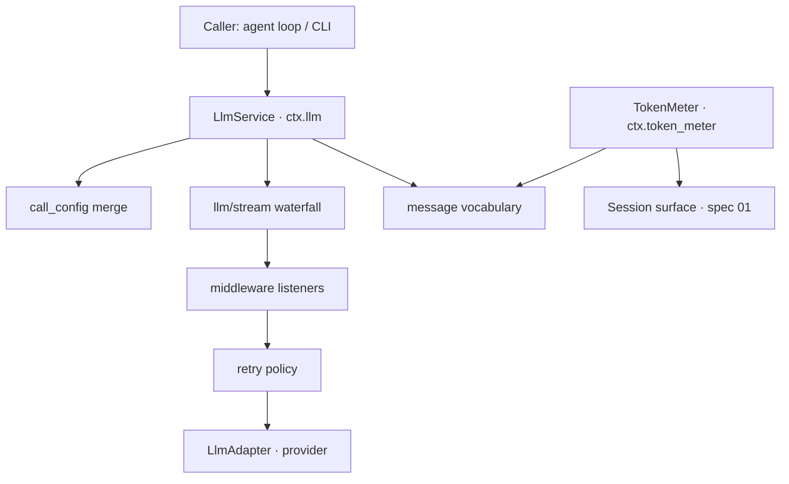
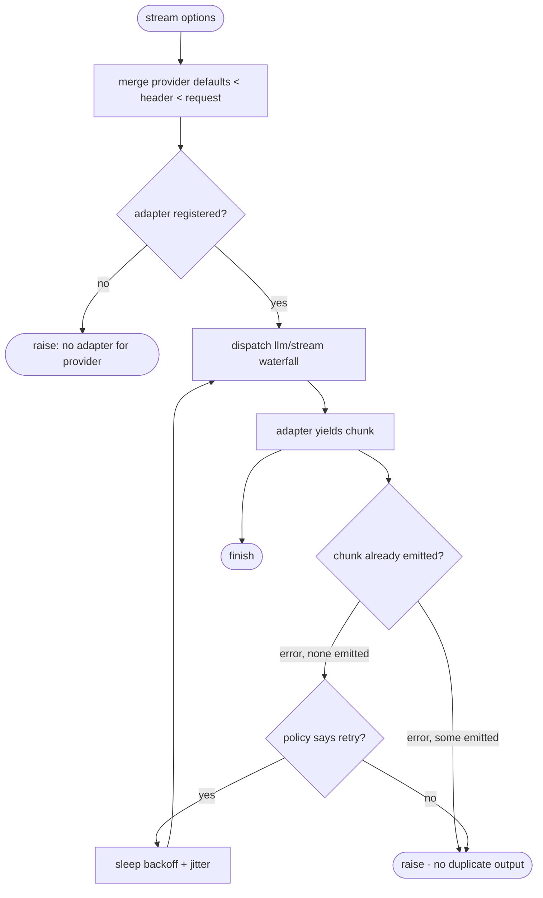
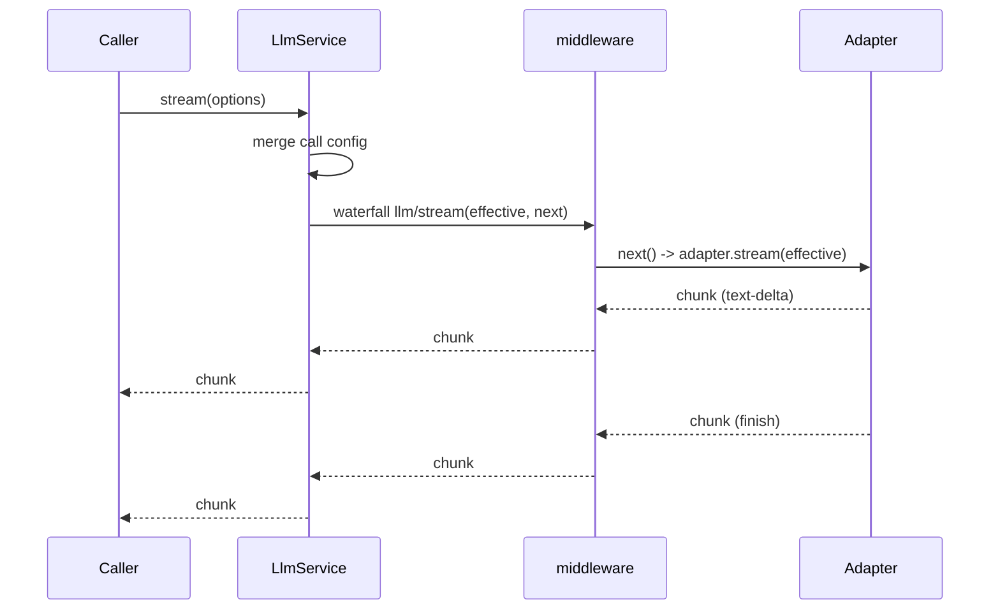
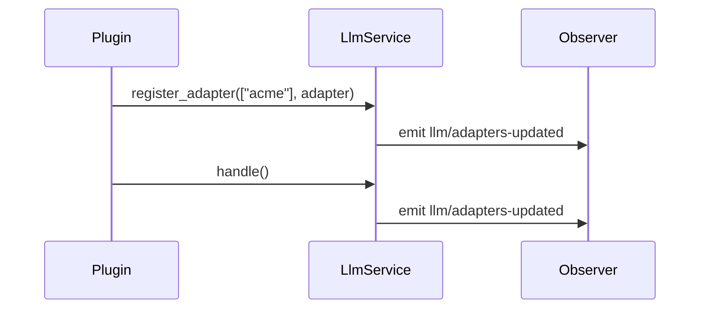

# LLM seam + the shared message vocabulary

# 1 · Requirements

## Introduction

The second sprint ports the reference's **LLM seam** — `ctx.llm` — plus the
`message` value vocabulary that the agent loop and the session log both consume.

Nothing provider-specific ships here. `openai_compatible`, `deepseek` and
`pi_ai` are provider-domain plugins queued for a later sprint
(`service-catalogue.md` → "LLM seam"). This sprint delivers the *seam* and a
fake adapter that proves it.

## Glossary

- **Seam** — a general service other code depends on by name (`ctx.llm`),
  whose implementation is swappable by mounting a different plugin.
- **Adapter** — a provider backend implementing `stream(options)`.
- **Chunk** — one token-level frame on an LLM stream.
- **Surface** — the model-visible projection of the session log (spec 01).
- **Call config** — the epoch-level request configuration (provider, model,
  sampling), merged from three layers.

## Mental Model & Invariants

- `ctx.llm` is a **registry plus a stream**. Adapters register into it;
  callers stream through it. Core never speaks HTTP — transport lives at the
  adapter boundary only.
- `message` is the **shared value vocabulary**, not an LLM-private type. The
  session log and the agent loop both consume it, which is why it lands in
  this sprint rather than with the agent.
- **Call config merges in three layers**: provider defaults < session header <
  this request. The request wins; missing fields fall through.
- **Attribution is mandatory, not optional.** Every HTTP adapter sends a
  `User-Agent` carrying public product facts only.
- **A stream is interceptable.** `llm/stream` is a waterfall so middleware can
  wrap the raw adapter stream without the caller knowing.

Invariants any implementation must hold:

1. **I1 — no transport in core.** No module under `pydsh/llm/` imports an HTTP
   client. The adapter ABC is the only door.
2. **I2 — layer precedence is total.** For every call-config field, the
   effective value is the highest layer that set it non-`None`.
3. **I3 — attribution carries no secrets.** No key, path, session id, prompt
   text, or per-user identifier reaches a header.
4. **I4 — the log stays lossless-JSON.** A `Message` is not JSON; anything
   persisted to the session log passes `encode_payload` first, and
   `decode_payload(encode_payload(x)) == x`.
5. **I5 — retry never duplicates output.** A retried call must not re-emit
   chunks the caller already saw.

## Decisions & Corrections (log)

- 2026-08-24 — Frame ratified by the owner: seam only, no provider adapter;
  `message` folded into this sprint because the agent loop depends on it.
- 2026-08-24 — Owner directive: target is full service-catalogue parity at the
  service + default-plugin level, ported from the reference and modified where
  the kernel demands. This sprint is step 1 of that sequence.

## Dev Environment

Pointers only (Rule 18 — the executable config owns the values):

- Python/deps: `pyproject.toml` + `uv` (`uv sync`)
- Kernel: `[tool.uv.sources] plugkit` path dependency
- Test command: `uv run pytest tests -q`

## Requirements

### Requirement 1: The message vocabulary

**User Story:** As a seam author, I want one immutable message/content-block
vocabulary, so that the session log, the agent loop, and every adapter describe
model conversation the same way.

#### Acceptance Criteria

1. WHEN a content block is constructed, THE vocabulary SHALL provide exactly
   four kinds — text, reasoning, tool-call, tool-result — as frozen values.
2. WHEN a `Message` is constructed, THE vocabulary SHALL carry an id, a role
   (`system`/`user`/`assistant`), an immutable content tuple, and a
   `MessageSource` recording who produced it.
3. WHEN `as_text` is called on a content tuple, THE vocabulary SHALL join the
   text blocks only, ignoring other kinds.
4. WHEN a value containing messages is encoded, THE vocabulary SHALL produce a
   JSON-safe structure that `decode_payload` restores to an equal value.
5. IF a payload carries an unknown block tag, THEN decoding SHALL raise rather
   than silently return a partial value.

### Requirement 2: Call config and its three-layer merge

**User Story:** As a caller, I want request configuration resolved by a stated
precedence, so that model routing cannot drift silently between calls.

#### Acceptance Criteria

1. WHEN configs are merged, THE merge SHALL apply provider defaults, then
   session header, then request, with later layers overriding earlier ones.
2. IF a field is `None` in a layer, THEN that layer SHALL NOT override a value
   already set by a lower layer.
3. WHEN two configs are compared, THE comparison SHALL be field-by-field, with
   `stop` compared element-wise.
4. WHEN a config is persisted to a session header, THE encoding SHALL omit
   unset optional fields.

### Requirement 3: Retry policy

**User Story:** As an operator, I want a declared retry policy per provider
route, so that transient provider failures don't surface as hard errors.

#### Acceptance Criteria

1. WHEN mode is `normal`, THE policy SHALL retry only codes in its retryable
   set, and at most `max_retries` times.
2. WHEN mode is `always`, THE policy SHALL retry every failure.
3. WHEN a delay is computed for attempt *n*, THE policy SHALL apply bounded
   exponential backoff with symmetric jitter, capped at `max_delay_ms`.
4. IF a policy config carries an unknown field or an out-of-range value, THEN
   resolution SHALL raise rather than silently accept it.
5. WHILE a stream has already emitted a chunk, THE seam SHALL NOT retry it.

### Requirement 4: The LLM service (`ctx.llm`)

**User Story:** As a plugin author, I want to register a provider adapter and
have every caller reach it through one seam.

#### Acceptance Criteria

1. WHEN an adapter registers for a provider set, THE service SHALL bind all of
   them or none, and return a handle that releases exactly those routes.
2. IF a provider already has an adapter and `replace` is not set, THEN
   registration SHALL raise and bind nothing.
3. WHEN a registration is released, THE service SHALL remove its routes and
   leave other registrations untouched.
4. WHEN `stream` is called, THE service SHALL resolve the effective call config
   before dispatching, and pass the merged options to the adapter.
5. WHEN `stream` is called, THE service SHALL route through the `llm/stream`
   waterfall so middleware can wrap the adapter stream.
6. IF no adapter is registered for the requested provider, THEN `stream` SHALL
   raise a clear error naming the provider.
7. WHEN an adapter registration changes, THE service SHALL broadcast
   `llm/adapters-updated` without letting a failing observer break the commit.

### Requirement 5: Attribution

**User Story:** As a provider, I want to know which product is calling me.

#### Acceptance Criteria

1. WHEN attribution headers are built, THE module SHALL emit a `user-agent` of
   the form `product/version (+url)`.
2. WHEN the version is resolved, THE module SHALL read installed package
   metadata rather than a hand-copied constant, falling back if unavailable.
3. WHEN a custom identity is supplied, THE module SHALL use it; when omitted,
   THE module SHALL fall back to the pydsh default rather than suppressing the
   header.

### Requirement 6: Token meter

**User Story:** As a compaction author, I want one estimator, so that pressure
is measured the same way everywhere.

#### Acceptance Criteria

1. WHEN text is estimated, THE meter SHALL count CJK characters as one token
   each and other characters at a fixed characters-per-token ratio.
2. WHEN a session is measured, THE meter SHALL return one entry per surface
   node plus a total.
3. IF a surface node has no matching log event, THEN measurement SHALL raise —
   a corrupt surface is not silently priced at zero.

### Non-Functional

- **NF 1** — Core stays stdlib-pure. No third-party runtime dependency beyond
  plugkit enters this sprint.
- **NF 2** — Every public function carries an English docstring; the reference's
  Chinese comments are translated, not transcribed.
- **NF 3** — Async streaming is native (`async for`); no thread pools.

## Out of Scope

- Provider adapters (`openai_compatible`, `deepseek`, `pi_ai`) — sprint 11.
- The agent loop and `system_prompt` — sprint 04.
- Compaction's use of the token meter — sprint 09.
- Session-header persistence of call config — the encoding ships here; the
  session-header write path lands with the agent loop that owns the epoch.

# 2 · Design

## End-to-End Walkthrough

A caller wants a model to answer. It builds `GenerateOptions` naming a provider,
a model, and the messages so far, and calls `ctx.llm.stream(options)`.

The seam first resolves **what the call actually is**. The provider route may
carry defaults (say, a default model); the request carries its own fields. The
merge runs provider-defaults < header < request, and the winner becomes the
effective options. This is the point where "which model am I really calling"
stops being ambiguous.

The seam then dispatches through the **`llm/stream` waterfall**. Any middleware
that registered a listener gets handed the effective options and a `next`
callable, and may wrap, observe, or replace the stream beneath it. The innermost
`next` is the adapter's own stream, wrapped in the route's retry policy.

Chunks flow back out as they arrive: block starts, text and reasoning deltas,
tool-call deltas, block ends, a usage frame, and a finish frame. The caller
consumes them with `async for`, and can stop early simply by breaking.

If the adapter raises a recognized error **before any chunk has been emitted**,
the retry policy decides whether to try again, waits a jittered backoff, and
re-enters. Once a chunk has escaped to the caller, retry is off the table — the
error propagates, because re-running the stream would duplicate output the
caller already saw.

## Tech Stack

- **Language**: Python ≥ 3.13
- **Kernel**: plugkit (`Service`, `ctx.waterfall`, `ctx.emit`, fibers)
- **Testing**: pytest + pytest-asyncio (`asyncio_mode = auto`)

## Directory Structure

```
src/pydsh/
  message/__init__.py      # the shared value vocabulary
  message/blocks.py        # content blocks + Message + MessageSource
  message/payload.py       # encode_payload / decode_payload
  llm/__init__.py
  llm/errors.py            # LlmError + api-key normalization
  llm/chunks.py            # ChunkType + StreamChunk + GenerateOptions
  llm/adapter.py           # LlmAdapter ABC + LlmProviderInfo
  llm/call_config.py       # LlmCallConfig + three-layer merge
  llm/retry.py             # ResolvedRetryPolicy + resolve_retry_policy
  llm/attribution.py       # AppIdentity + attribution_headers
  llm/service.py           # LlmService  (ctx.llm)
  llm/token_meter.py       # TokenMeter  (ctx.token_meter)
tests/
  test_message.py  test_call_config.py  test_retry.py
  test_llm_service.py  test_attribution.py  test_token_meter.py
```

## Architecture Overview



## Workflow



## Module Design

### `message`

- **Purpose**: the shared, immutable conversation vocabulary.
- **Interface**: `TextBlock`, `ReasoningBlock`, `ToolCallBlock`,
  `ToolResultBlock`, `ContentBlock`, `MessageSource`, `Message`, `as_text`,
  `create_user_message`, `create_assistant_message`, `encode_payload`,
  `decode_payload`.
- **Dependencies**: stdlib only. Deliberately does **not** import `llm` — the
  reference's `message.py` imports `ChunkType` for one helper, which inverts the
  dependency; see Decisions.

### `llm.service.LlmService`

- **Purpose**: `ctx.llm` — the adapter registry and the stream seam.
- **Interface**: `register_adapter(providers, adapter, *, replace=False,
  retry=None, defaults=None) -> handle`, `list_providers()`,
  `resolve_model_info(provider, model)`, `stream(options)`.
- **Dependencies**: `call_config`, `retry`, `adapter`, plugkit `Service`.

### `llm.token_meter.TokenMeter`

- **Purpose**: `ctx.token_meter` — one estimator for pressure measurement.
- **Interface**: `estimate_text(text)`, `estimate_message(message)`,
  `measure(session)`.
- **Dependencies**: `message`, spec 01's `Session`.

## Key Algorithms (pseudo-code)

```
ALGORITHM merge_call_config
  input:  provider_defaults, header, request  (each a dict or None)
  output: LlmCallConfig
  1. merged := {}
  2. for layer in (provider_defaults, header, request):
       for key, value in layer:
         if value is not None: merged[key] := value      # I2: None never overrides
  3. coerce merged.stop to a tuple if present
  4. return LlmCallConfig(**merged)
```

```
ALGORITHM stream_with_retry
  input:  options, policy
  output: async stream of chunks
  1. attempts := 0
  2. loop:
  3.    emitted := false
  4.    try:
  5.       for chunk in adapter.stream(options):
  6.          emitted := true                              # I5 latch
  7.          yield chunk
  8.       return
  9.    except LlmError as err:
 10.       if emitted: raise                               # I5: never duplicate
 11.       if policy is None or not policy.should_retry(err.code, attempts): raise
 12.       attempts := attempts + 1
 13.       signal.throw_if_aborted() if a signal is present
 14.       sleep(policy.delay_for(attempts))
```

```
ALGORITHM estimate_text
  input:  text
  output: token count
  1. if text is empty: return 0
  2. cjk   := count of CJK codepoints in text
  3. other := len(text) - cjk
  4. return max(1, ceil(cjk + other / CHARS_PER_TOKEN))
```

## Sequence Diagrams

A call with one middleware registered:



Registration and release:



## Data Models

`LlmCallConfig` — `provider`, `model`, `reasoning_effort`, `temperature`,
`max_tokens`, `stop`. All optional except the two identifiers, which default to
the empty string.

`StreamChunk` — a tagged union keyed on `ChunkType`, carrying whichever of
`index`/`block_type`/`text`/`reasoning`/`tool_call_id`/`tool_call_name`/
`arguments_delta`/`block`/`usage`/`finish` the tag implies.

## Error Handling Strategy

`LlmError` carries a stable `code` (`EMPTY_RESPONSE`, `RATE_LIMIT`, `SERVER`,
`TIMEOUT`, `TRANSPORT`, `UNKNOWN`) so the retry policy can decide without
parsing messages. Configuration errors (`RetryPolicyError`) raise at resolve
time — fail loud, not at the first failed call.

## Testing Strategy

- **Integration tests** (primary): a fake adapter mounted on a real plugkit
  root context, driven through `ctx.llm.stream` — this exercises the seam,
  the waterfall, and the registry together.
- **Property-ish tests**: `decode_payload(encode_payload(x)) == x` over the
  vocabulary; the merge precedence table.
- **Unit tests**: backoff bounds, api-key normalization, text estimation.
- **Test command**: `uv run pytest tests -q`

## Correctness Properties

### Property 1: Merge precedence is total
- **Statement**: *For any* three layers and any field, the effective value
  equals the value from the highest layer that set it non-`None`.
- **Validates**: Requirement 2.1, 2.2 (I2)
- **Test approach**: table-driven over every field, all 8 set/unset combinations.

### Property 2: Payload round-trip
- **Statement**: *For any* value built from the vocabulary,
  `decode_payload(encode_payload(v)) == v`.
- **Validates**: Requirement 1.4 (I4)
- **Test approach**: nested messages, tool results inside tool results, dicts,
  lists, and bare scalars.

### Property 3: Retry never duplicates
- **Statement**: *For any* adapter that emits *k* ≥ 1 chunks then fails, the
  caller sees exactly *k* chunks and then the error — never 2*k*.
- **Validates**: Requirement 3.5 (I5)
- **Test approach**: a fake adapter with a scripted failure after *k* chunks.

## Edge Cases

- Registering an empty provider list — binds nothing, returns a no-op handle.
- Releasing a handle twice — idempotent, second call is a no-op.
- `stop` supplied as a list in one layer and a tuple in another — normalized.
- A middleware that never calls `next` — the adapter is never reached, and that
  is legitimate (it replaced the stream).
- Estimating a tool-result block that nests text blocks — recursion, not zero.

## Decisions

### Decision: `message` does not import `llm`

**Context:** The reference's `message.py` imports `ChunkType` from `llm.py` for
one predicate, `is_token_delta`.
**Options:** 1. Port as-is — faithful, but the shared vocabulary now depends on
the LLM seam, so the session log transitively does too. 2. Move the predicate to
`llm.chunks`, where `ChunkType` already lives.
**Decision:** Option 2. **Rationale:** the vocabulary is the more stable layer;
having it depend on the seam is a dependency inversion (S6) that would force
every future consumer of `message` to drag the LLM seam in. The predicate is
about chunks, not messages, so it belongs with chunks.

### Decision: retry only before the first chunk

**Context:** The reference retries by re-entering `adapter.stream` from the top,
including after chunks were already yielded to the caller.
**Options:** 1. Port faithfully — duplicated output on a mid-stream failure.
2. Latch on first emission and refuse to retry after it.
**Decision:** Option 2 (invariant I5). **Rationale:** the reference's behavior
silently corrupts the caller's message assembly — a text-delta stream retried
halfway yields the prefix twice. This is a correctness deviation, taken
deliberately and recorded here. Resuming mid-stream would need adapter-level
checkpointing, which no provider protocol offers.

### Decision: `ctx.token_meter`, not `ctx.tokenMeter`

**Context:** The reference names the service `tokenMeter` (TS heritage).
**Decision:** snake_case, matching plugkit's `snake_case` context-member
convention. **Rationale:** consistency with the kernel beats transliteration of
a JS name; `service-catalogue.md` tracks the reference *service*, not its
spelling.

## Security Considerations

Attribution headers are public product facts only (I3) — the tests assert no
key, path, or session id can reach them. `normalize_api_key` rejects keys with
whitespace or non-printable characters before they can reach a header, and
returns a verdict rather than a raw echo of the offending value.

# 3 · Tasks

## Status marks
<!-- [ ] pending | [x] done | [!] BLOCKED: reason | [ ]* optional
     [-] DROPPED: <reason> — cut/superseded/wrong, gone for good
     [>] → <spec_id> — deferred/moved; a real spec now owns it -->

## Tasks

- [ ] 1. Foundation — the shared vocabulary
  - [ ] 1.1 `message/blocks.py` — content blocks, `MessageSource`, `Message`
    - Four frozen block kinds, `as_text`, the two constructors.
    - **Depends**: —
    - **Requirements**: 1.1, 1.2, 1.3
  - [ ] 1.2 `message/payload.py` — `encode_payload` / `decode_payload`
    - Tagged encoding, recursive, raising on unknown tags.
    - **Depends**: 1.1
    - **Requirements**: 1.4, 1.5
    - **Properties**: 2

- [ ] 2. Core — the seam's parts
  - [ ] 2.1 `llm/chunks.py` — `ChunkType`, `StreamChunk`, `GenerateOptions`
    - Plus `is_token_delta` (moved here per Decisions).
    - **Depends**: —
    - **Requirements**: 4.4
  - [ ] 2.2 `llm/errors.py` — `LlmError` + `normalize_api_key`
    - **Depends**: —
    - **Requirements**: 3.1, 4.6
  - [ ] 2.3 `llm/call_config.py` — the three-layer merge
    - **Depends**: —
    - **Requirements**: 2.1, 2.2, 2.3, 2.4
    - **Properties**: 1
  - [ ] 2.4 `llm/retry.py` — policy resolution + backoff
    - **Depends**: 2.2
    - **Requirements**: 3.1, 3.2, 3.3, 3.4
  - [ ] 2.5 `llm/attribution.py` — identity + headers
    - **Depends**: —
    - **Requirements**: 5.1, 5.2, 5.3
  - [ ] 2.6 `llm/adapter.py` — the `LlmAdapter` ABC
    - **Depends**: 2.1
    - **Requirements**: 4.4, 4.6

- [ ] 3. Core — the service
  - [ ] 3.1 `llm/service.py` — registry, handles, `llm/adapters-updated`
    - All-or-nothing binding; handle release; replace.
    - **Depends**: 2.6
    - **Requirements**: 4.1, 4.2, 4.3, 4.7
  - [ ] 3.2 `llm/service.py` — `stream` through the waterfall + retry
    - Config merge, `llm/stream` waterfall, the I5 emission latch.
    - **Depends**: 3.1, 2.3, 2.4
    - **Requirements**: 4.4, 4.5, 3.5
    - **Properties**: 3
  - [ ] 3.3 `llm/token_meter.py` — `ctx.token_meter`
    - **Depends**: 1.1
    - **Requirements**: 6.1, 6.2, 6.3

- [ ] 4. Tests
  - [ ] 4.1 `test_message.py` — vocabulary + round-trip property
    - **Depends**: 1.2
    - **Requirements**: 1.1–1.5
    - **Properties**: 2
  - [ ] 4.2 `test_call_config.py` — the precedence table
    - **Depends**: 2.3
    - **Properties**: 1
  - [ ] 4.3 `test_retry.py` — modes, bounds, config rejection
    - **Depends**: 2.4
    - **Requirements**: 3.1–3.4
  - [ ] 4.4 `test_attribution.py` — header shape + no-secrets assertion
    - **Depends**: 2.5
    - **Requirements**: 5.1–5.3
  - [ ] 4.5 `test_llm_service.py` — the seam, on a real kernel context
    - Fake adapter; registry lifecycle; waterfall middleware wrapping;
      no-duplicate-on-retry.
    - **Depends**: 3.2
    - **Requirements**: 4.1–4.7, 3.5
    - **Properties**: 3
  - [ ] 4.6 `test_token_meter.py` — estimation + surface measurement
    - **Depends**: 3.3
    - **Requirements**: 6.1–6.3

- [ ] 5. Wrap
  - [ ] 5.1 Export surface + README "what works today"
    - **Depends**: 4.6
  - [ ] 5.2 Close spec — all gates green, mark CLOSED
    - **Depends**: 5.1

## Log

**[2026-08-24]** — Created and activated. Frame ratified by the owner; sprint is
step 1 of the catalogue-parity sequence.
