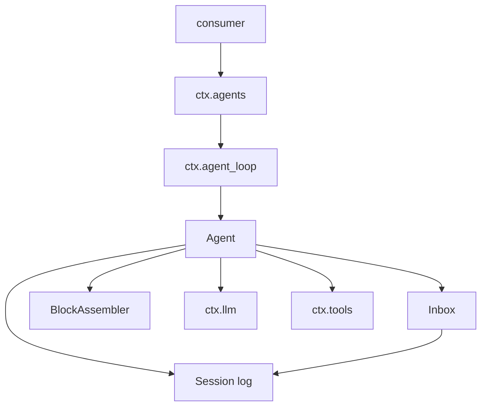
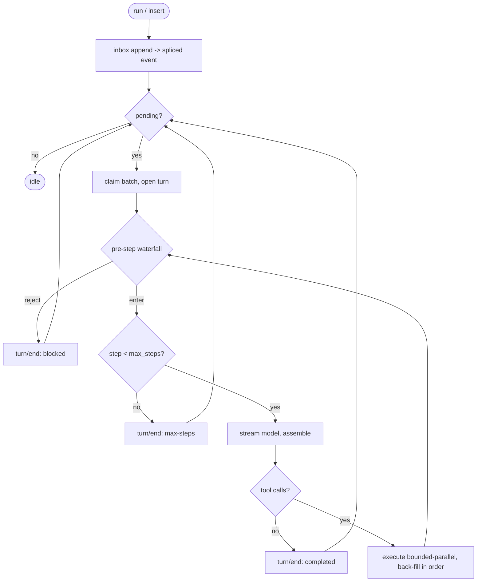
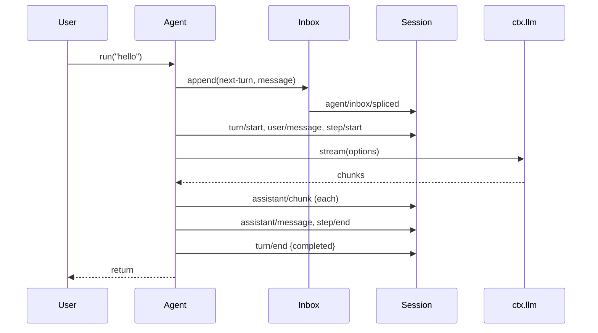
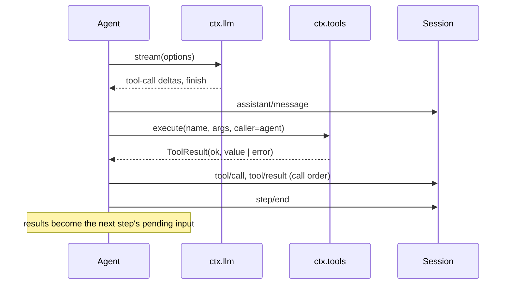
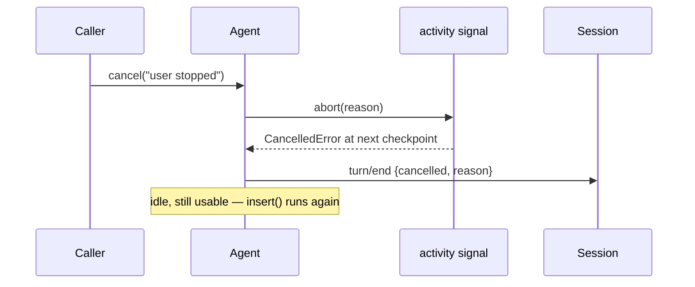

# The agent loop — turns, steps, and the inbox that feeds them

# 1 · Requirements

## Introduction

Sprints 01 and 02 built the two halves the agent stands on: an append-only
session log that survives a restart, and an interceptable model stream. Neither
one *drives* anything. This sprint ports the piece that does — the loop that
turns a user's sentence into a model call, executes the tools the model asked
for, feeds the results back, and stops when the answer is done.

Scope is the **loop driver**: cancellation, the inbox, the turn/step machine,
the block assembler, tool execution over plugkit's `ToolsService`, and the
registry that makes the loop itself replaceable. `system_prompt` and
`plan_mode` — the other two rows of the catalogue's Agent-seam block — are a
later sprint; the loop falls back to `AgentOptions.system` when no prompt
service is mounted, so the cut is clean.

Two items carried in from earlier sprints land here because this is the sprint
that owns them: the session header's call-config write path (spec 02 deferred it
to "the agent loop that owns the epoch"), and a lossy-encode defect in the
payload codec that only shows up once stream chunks reach the log.

## Glossary

- **Turn**: one exchange. Opened by user input, closed when the model stops
  asking for tools. Bracketed by `turn/start` / `turn/end` events.
- **Step**: one model call plus the tool calls it requested. A turn is one or
  more steps. Bracketed by `step/start` / `step/end`.
- **Inbox**: the projection of user input *waiting* to be processed — two
  queues, `next-turn` and `next-step`. Every change is a session event, so
  pending input survives a restart.
- **Claim**: taking a batch out of the inbox to process in a turn.
- **Cancel signal**: pydsh's equivalent of the web `AbortSignal` — `abort(reason)`,
  `throw_if_aborted()`, listeners, and `any([...])` fusion.
- **Lifetime signal / activity signal**: the agent's two cancellation scopes.
  The lifetime signal dies with the agent (caller teardown, loop unmount); the
  activity signal covers one drain and is what `cancel()` aborts.
- **Factory**: the object registered on `ctx.agents` that builds agents. The
  default is `AgentLoop`; registering another is how a consumer swaps the loop.
- **Block assembler**: folds a stream of `StreamChunk` frames into finished
  content blocks, usage, and a finish reason.

## Mental Model & Invariants

**Model** (the frame this sprint is built on):

- The loop is a *reader and writer of the session log*, not a new store. Every
  decision it makes lands as an event, so the log alone explains what happened.
- A step is the atom: build a request from the log, stream it, write what came
  back, run what the model asked for. Everything else is looping over that.
- Input is decoupled from processing. A caller delivers a message; the loop
  claims it when it reaches a turn boundary. That indirection is what makes
  interruption and restart possible.
- Cancellation is a *scope*, not a flag on the agent. Cancelling the work in
  flight must not kill the agent.
- The loop is a plugin like any other. Nothing calls `Agent` directly —
  everything goes through `ctx.agents.create_agent`, so another implementation
  can take over without touching a caller.

**Invariants:**

- **I1 — Every turn closes.** `turn/end` is appended on every exit path,
  including cancellation and an exception, and always carries a reason.
- **I2 — The log is the whole story.** Anything the loop learns (input
  claimed, message assembled, tool run, turn ended) is an event before it is
  anything else. No loop state exists that the log cannot reconstruct.
- **I3 — Tool execution never raises into the loop.** A failing, unknown,
  denied, or malformed-argument tool call becomes an error result the model
  reads. A tool cannot abort a turn.
- **I4 — Results are back-filled in call order.** Tools may run in parallel;
  their `tool/call` and `tool/result` events land in the order the model
  requested them, so a replay is deterministic.
- **I5 — Cancelling is not killing.** After `cancel()`, the agent accepts new
  input and runs it. Only a lifetime abort (loop unmount, caller teardown)
  ends the agent for good.
- **I6 — Nothing enters the log that cannot round-trip.** Messages and chunks
  are encoded on the way in; the vocabulary tags of anything nested inside them
  survive.

## Decisions & Corrections (log)

- 2026-08-24 — scope ratified by the owner: **loop driver only**.
  `system_prompt` and `plan_mode` are a later sprint, not this one.

## Dev Environment (config-as-code — pointers only)

- Deps + kernel path dependency: `pyproject.toml` (`uv sync`)
- Test gate: `uv run pytest tests -q`
- Reference checkouts: `reference/dsh-python`, `reference/deepseek-harness`

## Requirements

### Requirement 1: Cancellation signal

**User Story:** As a consumer, I want to stop work in flight and have every
layer notice, so that a user's "stop" reaches the model adapter and the loop
at once.

#### Acceptance Criteria

1. WHEN `abort(reason)` is called, THE CancelSignal SHALL record the aborted
   state and reason and notify every listener synchronously.
2. WHEN `abort` is called a second time, THE CancelSignal SHALL do nothing —
   the first reason stands.
3. WHEN a listener raises during `abort`, THE CancelSignal SHALL still notify
   the remaining listeners and still complete the abort.
4. WHEN `throw_if_aborted()` runs on an aborted signal, THE CancelSignal SHALL
   raise `CancelledError` carrying the reason.
5. WHEN `CancelSignal.any([a, b])` fuses sources and either aborts, THE fused
   signal SHALL abort with that source's reason.
6. IF a source is already aborted at fusion time, THE fused signal SHALL be
   aborted immediately with that source's reason.
7. WHEN a fused signal is disposed, THE CancelSignal SHALL remove its listeners
   from every source, so a long-lived source does not accumulate one listener
   per fusion.

### Requirement 2: The inbox

**User Story:** As a consumer, I want delivered-but-unprocessed input to
survive a restart, so that nothing a user typed is silently lost.

#### Acceptance Criteria

1. THE Inbox SHALL hold two ordered queues, `next-turn` and `next-step`, and
   expose read-only views of each plus `has_pending`.
2. WHEN any queue changes (append, prepend, claim, remove, clear), THE Inbox
   SHALL first append an `agent/inbox/spliced` session event describing the
   change, then apply it to memory.
3. THE splice event data SHALL carry `target`, `start`, and `inserted`, plus
   `removedCount` when entries were removed and `outcome: "canceled"` when
   entries were removed without replacement.
4. WHEN `claim(target, turn)` runs, THE Inbox SHALL take all of `next-step`,
   and additionally the head of `next-turn` when `target` is `next-turn`.
5. WHEN messages are inserted, discarded, or claimed, THE Inbox SHALL invoke
   the matching notification callback if one is registered.
6. THE splice event data SHALL be lossless-JSON — messages are encoded before
   they reach the log.
7. WHEN an inbox is rebuilt by replaying a session's `agent/inbox/spliced`
   events, THE resulting queues SHALL equal the queues at the time of the last
   event.

### Requirement 3: The turn/step loop

**User Story:** As a consumer, I want one call to run a user's message all the
way to an answer, so that I do not have to orchestrate steps myself.

#### Acceptance Criteria

1. WHEN `run(text)` is called, THE Agent SHALL deliver a user message to the
   inbox and return only after processing finishes — including when a drain
   was already in flight.
2. WHEN a turn begins, THE Agent SHALL append `turn/start` with its turn
   number; turn numbers SHALL be consecutive from the session's existing log.
3. WHILE a turn runs, THE Agent SHALL for each step: run the `agent/pre-step`
   waterfall (default decision `enter` with the pending messages), append each
   entered message as `user/message`, append `step/start`, run the step, and
   append `step/end`.
4. WHEN the pre-step waterfall returns a `reject` decision, THE Agent SHALL end
   the turn with reason `blocked`.
5. WHEN a step's assembled reply contains tool-call blocks, THE Agent SHALL
   execute them, collect the tool results as the next step's pending input, and
   continue.
6. WHEN a step's assembled reply contains no tool-call blocks, THE Agent SHALL
   end the turn with reason `completed`.
7. IF the step count would exceed `max_steps`, THE Agent SHALL end the turn with
   reason `max-steps` without making a further model call.
8. WHEN the stream's finish reason is `max-tokens`, THE Agent SHALL append the
   assistant message and end the turn with reason `max-tokens`.
9. WHEN the stream's finish reason is `error`, THE Agent SHALL end the turn with
   that finish as the reason and SHALL NOT append an assistant message.
10. WHEN the activity signal aborts mid-turn, THE Agent SHALL end the turn with
    reason `cancelled` carrying the abort reason.
11. THE Agent SHALL append `turn/end` on every exit path, including an
    unexpected exception, and SHALL let that exception propagate afterwards.
12. WHEN `ctx.llm.stream` raises `LlmError`, THE Agent SHALL run the
    `agent/request-error` waterfall; a `retry` decision SHALL re-attempt the
    step from the current surface, and any other outcome SHALL re-raise.
13. WHEN a drain starts and ends, THE Agent SHALL emit `agent/status` with
    `running` and `idle` respectively.
14. WHEN an agent is constructed, THE Agent SHALL emit `agent/session-start`
    carrying itself and its source (`startup` or `resume`).
15. WHEN each stream chunk arrives, THE Agent SHALL append `assistant/chunk`
    with the turn, step, and encoded chunk.

### Requirement 4: The block assembler

**User Story:** As a consumer, I want a stream of frames turned into a finished
message, so that partial output is never written to the log as if it were
complete.

#### Acceptance Criteria

1. WHEN text or reasoning deltas arrive, THE assembler SHALL accumulate them
   into the open block of that kind.
2. WHEN tool-call deltas arrive, THE assembler SHALL accumulate id, name, and
   argument text per call index.
3. WHEN a `block-end` frame carries a finished block, THE assembler SHALL
   record that block and close the open one of its kind.
4. WHEN a `usage` frame arrives, THE assembler SHALL record the usage.
5. WHEN a `finish` frame arrives, THE assembler SHALL record the finish reason
   and force-close any block still open.
6. IF the stream ends without a `finish` frame, THE assembler SHALL still
   force-close open blocks before the caller reads them.

### Requirement 5: Tool execution

**User Story:** As a consumer, I want the model's tool calls run through the
kernel's tool pipeline, so that guards and approvers apply without the loop
knowing about them.

#### Acceptance Criteria

1. WHEN building a request, THE Agent SHALL pass the registered tools' schemas
   (name, description, parameters) from `ctx.tools`, or `None` when no tools
   service is mounted.
2. WHEN executing a tool call, THE Agent SHALL parse the model's argument text
   as JSON into the dict `ctx.tools.execute` expects.
3. IF the argument text is not a JSON object, THE Agent SHALL produce an error
   tool result naming the parse failure and SHALL NOT call the tool.
4. THE Agent SHALL execute at most `max_parallel_tool_calls` tool calls
   concurrently.
5. THE Agent SHALL append `tool/call` and `tool/result` for every call in the
   order the model requested them, regardless of completion order.
6. WHEN a tool result is not `ok`, THE Agent SHALL mark the tool-result block
   as an error and carry the error's message as its text.
7. THE Agent SHALL treat every tool outcome as data — no tool call SHALL raise
   out of the step.

### Requirement 6: The registry and the swappable loop

**User Story:** As a consumer, I want to replace the loop without touching any
caller, so that a custom strategy is a mounting decision.

#### Acceptance Criteria

1. THE AgentRegistry SHALL provide `ctx.agents` and hold at most one factory,
   the most recently registered one.
2. WHEN `create_agent` is called with no factory registered, THE AgentRegistry
   SHALL raise an error naming how to mount one.
3. WHEN the AgentLoop service is constructed, THE AgentLoop SHALL register
   itself as the registry's factory.
4. IF the registry is not mounted when the loop is constructed, THE AgentLoop
   SHALL raise an error naming the ordering requirement.
5. THE AgentLoop SHALL expose `get(session_id)` and `roots()` over the agents
   it created.
6. WHEN `resume(session_id)` is called, THE AgentLoop SHALL rebuild the session
   through `ctx.sessions`, create an agent with source `resume`, and fuse the
   caller's signal with the loop's teardown signal.
7. WHEN the AgentLoop is unmounted, THE AgentLoop SHALL abort its teardown
   signal, ending every agent whose lifetime is fused with it.

### Requirement 7: The call-config epoch on the session header

**User Story:** As a consumer, I want a resumed session to remember how it was
being called, so that continuing a conversation does not silently change the
route.

#### Acceptance Criteria

1. WHEN a step builds a request, THE Agent SHALL record the effective call
   config on the session header.
2. THE session header's recorded call config SHALL survive `to_json` /
   `from_json` and the SQLite backend unchanged.
3. WHEN a session is resumed, THE session header SHALL carry the call config
   recorded by the last step before the flush.

### Requirement 8: Payload encoding fidelity

**User Story:** As a consumer, I want a replayed chunk to hold the same blocks
the live chunk did, so that the log's token-level fidelity is real.

#### Acceptance Criteria

1. WHEN encoding a dataclass the vocabulary does not know, THE payload codec
   SHALL encode its fields individually so that any vocabulary value nested
   inside keeps its tag.
2. WHEN a `StreamChunk` carrying a content block is encoded and decoded, THE
   decoded chunk's block SHALL be the same block type with the same values.

### Non-Functional

- **NF 1**: Core stays stdlib-only. No new runtime dependency; nothing here
  opens a socket.
- **NF 2**: Turn numbering is derived from the log once, at construction, and
  maintained in memory thereafter — not rescanned per turn.
- **NF 3**: Every tunable (`max_steps`, `max_parallel_tool_calls`) is a named
  constant with a documented default on `AgentOptions`, never a literal buried
  in the loop.

## Out of Scope

- `system_prompt` and `plan_mode` — the rest of the catalogue's Agent seam.
  Deferred to a later sprint; the loop uses `AgentOptions.system` until then.
- The `settings`-driven live parallel limit. The reference reads
  `max_parallel_tool_calls` from a runtime settings namespace; `settings` is
  not ported, so the value comes from `AgentOptions`.
- The `additionalContexts` side channel that lets a tool inject a message into
  the next step. plugkit's `ToolResult` has no such channel, and its only
  consumer (`guard_repeat_tool`) is not ported — building the channel with
  nothing to carry would be an abstraction with no variation point.
- `session.request_header` (system + tools snapshot for compaction's summary
  prefix). Compaction is not ported; a field nothing reads is dead code.
- Subagent lineage and forking — `roots()` returns every agent because there is
  no nesting yet.
- Declarative agents in plugin config (`Config.agents`), which belong with the
  app-layer boot shells.

# 2 · Design

## End-to-End Walkthrough

A consumer mounts three things onto a context: the session store, the LLM seam,
and the agent loop. It creates a session and asks the registry for an agent:

```python
session = ctx.sessions.create()
agent = ctx.agents.create_agent(session, AgentOptions(provider="p", model="m"))
await agent.run("what files changed today?")
```

Here is what happens between those last two lines.

`run` wraps the sentence in a user message and hands it to the **inbox**. That
delivery is itself a session event — if the process died right here, a restart
would find the sentence still waiting. Then the agent drains: it announces
`agent/status: running`, takes the next turn number, and **claims** the batch.

The turn opens with `turn/start`. Step 1 begins by asking the plugins whether
this input may enter, through the `agent/pre-step` waterfall — the default
answer is yes, and a plugin can inject extra context or refuse. The messages
that were let in are appended as `user/message`, which is what makes them
model-visible; `step/start` follows.

Now the request. The agent derives the model history from the log, decodes it
back into the message vocabulary, collects the registered tool schemas from
`ctx.tools`, records the effective call config on the session header, and calls
`ctx.llm.stream`. Frames come back one at a time: each is appended as
`assistant/chunk` and pushed into the **block assembler**, which accumulates
text, reasoning, and tool-call arguments until the finish frame closes
everything.

If the assembled reply has no tool calls, the agent appends the
`assistant/message`, closes the turn `completed`, and `run` returns. That is
the simple case.

If it does have tool calls, the agent appends the assistant message and then
runs each call through `ctx.tools.execute` — the kernel's five-stage pipeline,
so guards and approvers apply without the loop knowing they exist. Calls run
concurrently up to a bound, but `tool/call` and `tool/result` are written in
the order the model asked for them. Each result becomes a tool-result message.
`step/end` closes step 1; those results become step 2's pending input, and the
loop goes round again — now with the tool output in the model's history.

That repeats until the model stops asking for tools, the step budget runs out,
the model hits its token ceiling, a plugin rejects the input, or someone
cancels. Every one of those exits appends `turn/end` with a reason, and the
agent goes back to `idle`.

Cancelling deserves its own sentence, because it is where the reference is
easy to misread. `cancel()` aborts the *activity* scope — the drain in flight
stops, the turn ends `cancelled`, and the agent goes idle **still usable**. The
agent only dies when its *lifetime* scope aborts, which happens when the caller
tears down or the loop plugin is unmounted.

## Tech Stack

- **Language**: Python 3.11+, stdlib only in core
- **Kernel**: plugkit (`Context`, `Service`, `ToolsService`, waterfall dispatch)
- **Testing**: pytest + pytest-asyncio
- **Test command**: `uv run pytest tests -q`

## Directory Structure

```
src/pydsh/
  cancel.py              # CancelSignal, CancelledError — no kernel import
  agent/
    __init__.py          # the seam's public names
    inbox.py             # Inbox — the pending-input projection
    assembler.py         # BlockAssembler — frames -> blocks
    agent.py             # AgentOptions, Agent — the turn/step machine
    registry.py          # AgentRegistry (ctx.agents), AgentLoop (ctx.agent_loop)
tests/
  test_cancel.py
  test_inbox.py
  test_assembler.py
  test_agent_loop.py
  test_agent_tools.py
  test_agent_registry.py
  test_header_request.py
```

## Architecture Overview



## Workflow



## Module Design

### `pydsh.cancel`

- **Purpose**: cancellation as a scope that several layers share.
- **Interface**:
  ```
  class CancelledError(Exception): reason
  class CancelSignal:
      aborted: bool ; reason: Any
      abort(reason=None) -> None            # idempotent, contains listener errors
      throw_if_aborted() -> None
      add_listener(cb) -> remove_callable
      dispose() -> None                     # detach from fused sources
      @staticmethod any(signals) -> CancelSignal
  ```
- **Dependencies**: none. Imports nothing from plugkit or pydsh.

### `pydsh.agent.inbox.Inbox`

- **Purpose**: the projection of input waiting to be processed, backed by the
  session log so it survives a restart.
- **Interface**:
  ```
  Inbox(session, notifications=None)
  next_turn / next_step -> list[Message]   # read-only copies
  has_pending -> bool
  append(target, message) ; prepend(target, message)
  claim(target, turn) -> list[Message]
  remove(message_id) -> bool ; clear()
  @classmethod replay(session) -> Inbox     # rebuild from spliced events
  ```
- **Dependencies**: `pydsh.message` (encode/decode), the session.

### `pydsh.agent.assembler.BlockAssembler`

- **Purpose**: fold `StreamChunk` frames into blocks, usage, and a finish.
- **Interface**: `push(chunk)`, `finalize()`, `.blocks`, `.usage`, `.finish`.
- **Dependencies**: `pydsh.llm.chunks`, `pydsh.message.blocks`.

### `pydsh.agent.agent.Agent`

- **Purpose**: drive one session's conversation.
- **Interface**:
  ```
  Agent(ctx, session, options, source="startup", signal=None)
  id -> str                                  # the session id
  insert(message, target="next-turn") -> None   # fire-and-forget
  followup(message) -> None                     # plugin-sourced insert
  async run(text) -> None                       # deliver + await completion
  cancel(cause=None) -> None                    # abort the activity scope
  async when_idle() -> None
  dispose() -> None                             # abort lifetime, detach
  ```
- **Dependencies**: `ctx.llm`, `ctx.tools` (optional), the session, Inbox,
  BlockAssembler, CancelSignal.

### `pydsh.agent.registry`

- **Purpose**: make the loop replaceable.
- **Interface**:
  ```
  class AgentRegistry(Service):   # provides "agents"
      set_factory(f) ; has_factory() -> bool
      create_agent(session, options=None, **kw) -> Agent
  class AgentLoop(Service):       # provides "agent_loop"
      create_agent(session, options=None, source="startup", signal=None)
      get(session_id) ; roots()
      resume(session_id, options=None, signal=None)
  ```

## Key Algorithms (pseudo-code)

```
ALGORITHM drain
  input:  the agent's inbox and lifetime signal
  output: none; the log records everything
  1. if already draining: await the running activity and return
  2. activity <- CancelSignal.any([lifetime])
  3. emit agent/status running
  4. try:
       while inbox.has_pending:
         activity.throw_if_aborted()
         turn <- next_turn_number()          # in-memory counter, not a scan
         claimed <- inbox.claim('next-turn', turn)
         if claimed is empty: break          # nothing claimable; avoid a spin
         run_turn(turn, claimed, activity)
     except Cancelled: pass                  # the turn already recorded it
     finally:
       activity.dispose(); emit agent/status idle
```

```
ALGORITHM run_turn
  input:  turn number, the claimed messages, the activity signal
  output: none; appends turn/start .. turn/end
  1. append turn/start {turn}
  2. step <- 0 ; pending <- claimed ; reason <- None
  3. try:
       loop:
         signal.throw_if_aborted()
         if step >= options.max_steps: reason <- {max-steps}; break
         step <- step + 1
         decision <- waterfall('agent/pre-step',
                               {agent, messages: pending, turn, step, signal},
                               default = {enter, pending})
         if decision.kind == 'reject': reason <- {blocked}; break
         for message in decision.messages: append user/message (encoded)
         append step/start {turn, step}
         try:
           reason <- run_step(turn, step, signal)
         finally:
           append step/end {turn, step}      # a step always closes (I1)
         if reason is not None: break
         pending <- tool result messages produced by this step
     except Cancelled as c:
       reason <- {cancelled, c.reason}
     finally:
       append turn/end {turn, reason or {completed}}
```

```
ALGORITHM run_step
  input:  turn, step, signal
  output: a turn-end reason, or None to keep going
  1. await parallel('agent/request', {agent, turn, step, signal})
  2. messages  <- decode_payload(session.derive_messages())
  3. system    <- options.system or None
  4. tools     <- schemas from ctx.tools when mounted, else None
  5. options_o <- GenerateOptions(provider, model, messages, system, tools,
                                  max_tokens, signal)
  6. session.header.request <- call_config_from_options(options_o)   # R7
  7. assembler <- BlockAssembler()
     loop:                                    # request-error recovery
       try:
         for chunk in ctx.llm.stream(options_o):
           append assistant/chunk {turn, step, encode(chunk)}
           assembler.push(chunk)
         break
       except LlmError as e:
         d <- waterfall('agent/request-error', {agent, failure: e, signal},
                        default = None)
         if d is a retry decision: assembler <- BlockAssembler(); continue
         raise
  8. assembler.finalize()
  9. if assembler.finish.kind == 'error': return assembler.finish
 10. append assistant/message {turn, step, encode(message), usage}
 11. if assembler.finish.kind == 'max-tokens': return {max-tokens}
 12. calls <- tool-call blocks in assembler.blocks
 13. if calls is empty: return {completed}
 14. execute_tool_calls(calls, turn, step, signal)
 15. return None                              # keep going
```

```
ALGORITHM execute_tool_calls
  input:  the tool-call blocks, turn, step, signal
  output: none; appends tool/call + tool/result in call order
  1. gate <- Semaphore(max(1, options.max_parallel_tool_calls))
  2. for each call, concurrently under the gate:
       parsed <- parse_json_object(call.arguments)
       if parsed failed:
         outcome <- error("arguments were not a JSON object: <detail>")
       else:
         outcome <- ctx.tools.execute(call.name, parsed, caller=agent, id=call.id)
  3. await all; results keep their input order
  4. for (call, outcome) in order:
       append tool/call   {turn, step, callId, name, arguments}
       text <- outcome.value as text, or outcome.error.message
       append tool/result {turn, step, encode(tool-result message),
                           error: not outcome.ok, meta: None}
```

## Sequence Diagrams

One turn, no tools:



One step with tool calls:



Cancellation:



## State Management

Two scopes per agent, and the distinction is load-bearing:

| Scope | Created | Aborted by | Effect |
|---|---|---|---|
| lifetime | at construction, fused from caller + factory teardown | caller teardown, loop unmount, `dispose()` | the agent is finished; further drains abort at once |
| activity | at the start of each drain, fused from lifetime | `cancel(cause)`, or lifetime aborting | the work in flight stops; the agent stays usable |

Turn numbering is a counter seeded once from the log (`max turn` in
`turn/start` events) and incremented in memory.

## Data Models

One addition to the session event vocabulary:

| Event | Surface? | Data |
|---|---|---|
| `agent/inbox/spliced` | log-only | `target`, `start`, `inserted`, `removedCount?`, `outcome?` |

And one addition to the session header, per R7:

| Field | Meaning | Lifecycle |
|---|---|---|
| `SessionHeader.request` | the call config the last step used | written per step, persisted with the header, read on resume |

Conforming to `data-architecture.md`: the session log stays the single writer
and single source of truth. The inbox and the turn counter are **derived
projections** — both reconstructible from the log, neither authoritative. No
new store appears in this sprint.

## Error Handling Strategy

- Tool failures are data (I3): unknown tool, guard denial, malformed arguments,
  and a raising tool body all become error tool results.
- `LlmError` gets one recovery chance through `agent/request-error`; anything
  else propagates after `turn/end` is written.
- A listener raising during `abort` is contained — one bad observer cannot stop
  a cancellation.
- Session appends stay uncontained: they are the commit, and a failure there
  must not be swallowed.

## Testing Strategy

- **Integration (primary)**: the loop on a real plugkit context with a fake
  adapter — the seams actually composed, not mocked.
- **Property tests**: turn always closes; results back-filled in call order;
  inbox replay equals live state.
- **Persistence**: header call config through SQLite and back (R7).
- **Unit**: the assembler and the cancel signal, both pure logic.
- **Test command**: `uv run pytest tests -q`

## Correctness Properties

### Property 1: Every turn closes with a reason
- **Statement**: *For any* exit path — completion, rejection, step budget,
  token ceiling, cancellation, or an unexpected exception — the log ends the
  turn with exactly one `turn/end` carrying a reason.
- **Validates**: 3.4, 3.6–3.11 (I1)
- **Test approach**: drive each exit and assert one `turn/end` with the
  expected reason; for the exception path, assert the event exists *and* the
  exception still propagates.

### Property 2: Tool results are back-filled in call order
- **Statement**: *For any* set of tool calls with any completion order, the
  `tool/call` and `tool/result` events appear in the model's request order.
- **Validates**: 5.4, 5.5 (I4)
- **Example**: two calls where the second finishes first still log first-then-second.
- **Test approach**: tools with inverted sleeps; assert event order.

### Property 3: The inbox replays
- **Statement**: *For any* sequence of inbox operations, rebuilding from the
  session's `agent/inbox/spliced` events yields the same queues.
- **Validates**: 2.7 (I2)
- **Test approach**: random-ish operation sequence, then compare replay to live.

### Property 4: Cancelling leaves the agent usable
- **Statement**: *For any* agent cancelled mid-turn, a subsequent `run` starts
  a new turn and completes.
- **Validates**: 6.7 by contrast, 3.10 (I5)
- **Test approach**: cancel during a stream, assert `cancelled`, then run again
  and assert `completed`.

## Edge Cases

- **A claim that returns nothing** while `has_pending` is true would spin the
  drain loop; break instead.
- **A stream that ends without a `finish` frame** — `finalize()` force-closes
  open blocks so a truncated reply is still a well-formed message.
- **Tool-call arguments that are valid JSON but not an object** (`"[1,2]"`,
  `"7"`) — rejected the same way malformed text is; `execute` needs a dict.
- **A tool call with an empty name** from a truncated stream — goes to
  `ctx.tools.execute`, which returns `UNKNOWN_TOOL`; the model sees the error.
- **`run` called while a drain is in flight** — must await the running drain,
  not return immediately (the reference's `_drain` re-entry guard returns, so
  its `run` can return before the work is done).
- **Cancelling before any turn starts** — the drain aborts at its first
  checkpoint, no `turn/start` is written, and nothing needs closing.
- **A session resumed with a partial turn in the log** — the turn counter is
  seeded from `turn/start` events, so the next turn does not reuse a number.

## Decisions

### Decision: cancellation is ported, not borrowed from plugkit
**Context:** plugkit exports `Signal`, but it is reactive state (a value with
subscribers), not the one-way `AbortSignal` the loop needs.
**Options:** 1. Reuse `Signal` — no new module, but the semantics are wrong and
would confuse every reader. 2. Port the reference's `CancelSignal` into
`pydsh.cancel` — one small stdlib-only module.
**Decision:** port it. **Rationale:** the two things share a name and nothing
else; forcing one onto the other is exactly the naming dishonesty Rule 15
warns about. `pydsh.cancel` imports nothing, so it stays testable and cheap.

### Decision: two cancellation scopes, not one
**Context:** the reference gives an agent a single fused signal, aborts it in
`cancel()`, and catches the cancellation in `_drain`. Because a signal never
un-aborts, an agent cancelled once can never run again — every later drain
throws at its first checkpoint.
**Options:** 1. Match the reference exactly, defect included. 2. Split into a
lifetime scope and a per-drain activity scope.
**Decision:** split them. **Rationale:** "stop this" and "this agent is over"
are different requests, and the reference's own docstring describes `cancel`
as cancelling *the current activity*. This is a deliberate deviation from the
Python reference toward what the TypeScript original means (a fresh
`AbortController` per run). Recorded here as required by the porting method.

### Decision: fused signals are disposable
**Context:** `CancelSignal.any` registers a listener on each source and never
removes it. The loop's teardown signal is long-lived and fused once per
`resume`, so listeners accumulate for the process's life.
**Options:** 1. Leave it — small leak. 2. Return a disposable fused signal.
**Decision:** disposable. **Rationale:** unbounded growth keyed on a normal
operation is a Q4 defect, not a nit; a `dispose()` that detaches is four lines.

### Decision: the step budget ends a turn with `max-steps`, not `max-tokens`
**Context:** the reference reports a step-budget exhaustion as
`{"kind": "max-tokens"}`, the same reason it uses for the model's token
ceiling. The two are different failures and a consumer must distinguish them.
**Decision:** use `max-steps`. **Rationale:** conflating them makes the log lie
about why a turn stopped. Deliberate deviation, recorded.

### Decision: tool arguments are parsed by the loop, not the tool
**Context:** the model emits arguments as text; plugkit's `execute` takes a
dict.
**Options:** 1. Pass the raw string and let each tool parse. 2. Parse once in
the loop and turn a failure into an error result.
**Decision:** parse in the loop. **Rationale:** otherwise every tool
re-implements the same parse and the same error text, and a malformed-JSON
failure (common with real models) would reach tools that never expected it.

### Decision: the generic dataclass encode stops using `asdict`
**Context:** `encode_payload` flattens unknown dataclasses with
`dataclasses.asdict`, which recurses *deeply* and converts nested dataclasses
itself. A `StreamChunk` carrying a `TextBlock` therefore reaches the log as a
plain `{"text": ...}` — the vocabulary tag is gone and the decode cannot
restore the block, which contradicts the "token-level replay fidelity" the
`assistant/chunk` event exists for.
**Options:** 1. Special-case `StreamChunk` in the codec — but `message` must
not import `llm` (spec 02's own decision). 2. Encode an unknown dataclass
field-by-field and recurse through `_encode`.
**Decision:** field-by-field. **Rationale:** strictly more correct for every
dataclass, not just this one, and it keeps the layering intact — the codec
still knows nothing about the LLM seam.

## Security Considerations

Tool arguments come from the model and are untrusted. The loop parses them as
JSON and hands the result to `ctx.tools.execute`, which is where guards and
approvers sit — the loop adds no path of its own to reach a tool, and does not
log tool arguments anywhere but the session log the consumer already owns.

# 3 · Tasks

## Status marks
<!-- [ ] pending | [x] done | [!] BLOCKED: reason | [ ]* optional
     [-] DROPPED: <reason> | [>] → <spec_id> -->

## Tasks

- [x] 1. Foundation
  - [x] 1.1 `pydsh/cancel.py` — `CancelSignal`, `CancelledError`, disposable `any`
    - **Depends**: —
    - **Requirements**: 1.1–1.7
  - [x] 1.2 Add `agent/inbox/spliced` to the session event vocabulary
    - Log-only; data fields `target`, `start`, `inserted`, `removedCount`, `outcome`.
    - **Depends**: —
    - **Requirements**: 2.2, 2.3
  - [x] 1.3 Encode unknown dataclasses field-by-field instead of `asdict`
    - Fixes the lost vocabulary tag inside an encoded `StreamChunk`.
    - Also correct `events.py`'s claim that `append` validates data keys — it
      validates the type and lossless-JSON only.
    - **Depends**: —
    - **Requirements**: 8.1, 8.2
  - [x] 1.4 `SessionHeader.request` + `to_json`/`from_json` round-trip
    - **Depends**: —
    - **Requirements**: 7.1, 7.2

- [x] 2. Core
  - [x] 2.1 `agent/inbox.py` — the two queues, splice events, `replay`
    - **Depends**: 1.2
    - **Requirements**: 2.1–2.7
    - **Properties**: 3
  - [x] 2.2 `agent/assembler.py` — `BlockAssembler` + `finalize`
    - **Depends**: —
    - **Requirements**: 4.1–4.6
  - [x] 2.3 `agent/agent.py` — `AgentOptions`, the drain / turn / step machine
    - No tool execution yet; a reply with no tool calls completes a turn.
    - **Depends**: 1.1, 2.1, 2.2, 1.4
    - **Requirements**: 3.1–3.4, 3.6–3.15, 7.1
    - **Properties**: 1, 4
  - [x] 2.4 Tool execution over `ctx.tools`
    - Schemas from the registry, JSON argument parsing, bounded parallelism,
      ordered back-fill, errors as data.
    - **Depends**: 2.3
    - **Requirements**: 3.5, 5.1–5.7
    - **Properties**: 2
  - [x] 2.5 `agent/registry.py` — `AgentRegistry`, `AgentLoop`, resume, teardown
    - **Depends**: 2.4
    - **Requirements**: 6.1–6.7
  - [x] 2.6 Export surface — `pydsh.agent` and the package `__init__`
    - **Depends**: 2.5

- [x] 3. Tests
  - [x] 3.1 `test_cancel.py` — abort/idempotence/listener containment/fusion/dispose
    - **Depends**: 1.1
    - **Requirements**: 1.1–1.7
  - [x] 3.2 `test_inbox.py` — queues, splice shape, claim semantics, replay equality
    - **Depends**: 2.1
    - **Requirements**: 2.1–2.7
    - **Properties**: 3
  - [x] 3.3 `test_assembler.py` — deltas, block-end, finish flush, no-finish flush
    - **Depends**: 2.2
    - **Requirements**: 4.1–4.6
  - [x] 3.4 `test_agent_loop.py` — the loop on a real kernel with a fake adapter
    - Every turn-end reason, pre-step injection and rejection, request-error
      retry, `run` while draining, cancel-then-run-again.
    - **Depends**: 2.3
    - **Requirements**: 3.1–3.15
    - **Properties**: 1, 4
  - [x] 3.5 `test_agent_tools.py` — order under inverted latency, malformed
        arguments, unknown tool, guard denial, raising tool
    - **Depends**: 2.4
    - **Requirements**: 5.1–5.7
    - **Properties**: 2
  - [x] 3.6 `test_agent_registry.py` — no factory, swap factory, resume source,
        unmount aborts the loop's agents
    - **Depends**: 2.5
    - **Requirements**: 6.1–6.7
  - [x] 3.7 `test_header_request.py` — call config through SQLite and back
    - **Depends**: 2.3, 1.4
    - **Requirements**: 7.1–7.3
  - [x] 3.8 Extend `test_message.py` — a chunk's nested block survives encoding
    - **Depends**: 1.3
    - **Requirements**: 8.1, 8.2

- [ ] 4. Wrap
  - [ ] 4.1 README "what works today" + the mount order for the agent seam
    - **Depends**: 3.8
  - [ ] 4.2 Close the sprint — full suite green, frontmatter to CLOSED
    - **Depends**: 4.1

## Log

**[2026-08-24]** — Created. Scope ratified by the owner: loop driver only,
`system_prompt` and `plan_mode` deferred. Frame taken from
`reference/dsh-python/dsh_py/services/agent.py` + `inbox.py` read in full, and
from plugkit's `ToolsService` (five-stage pipeline, `execute` never raises).
