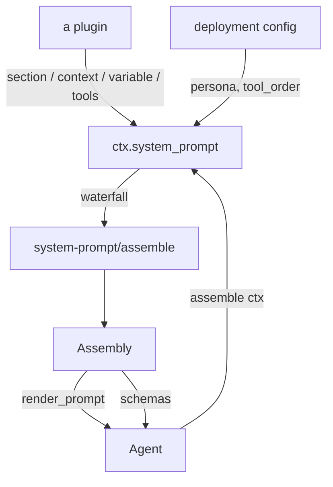
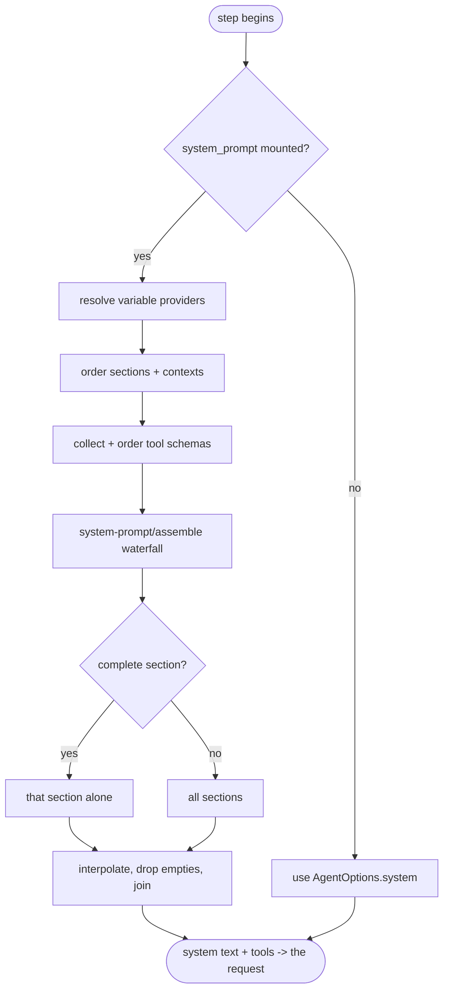
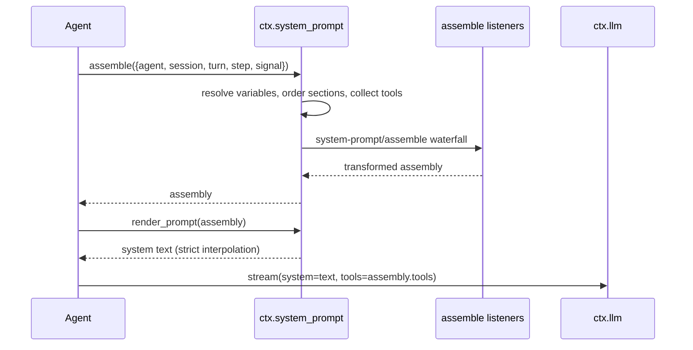

# The system prompt — assembled from registered pieces, not a string

# 1 · Requirements

## Introduction

Sprint 03 left the loop taking its system prompt from `AgentOptions.system` —
one string, set by whoever created the agent. That is the fallback, not the
design. In the reference, the system prompt is *assembled* from ordered pieces
that independent plugins register: the harness identity, the deployment
persona, tool guidance, a policy section a mode plugin contributes. Each is
registered against a fiber, so unloading the plugin removes its contribution.

This sprint ports `system_prompt` (`ctx.system_prompt`) and wires the loop to
it. Four registries: **sections** (the prompt itself, ordered), **contexts**
(dynamic runtime snapshots), **variables** (`{{name}}` substitution, strict),
and **tool schema providers** (with a configurable order).

`plan_mode` — the other row of the catalogue's Agent seam — is **not** here.
It needs `commands`, `sessionProjections`, and a user-questions channel, none
of which are ported. Porting it now would mean three `hasattr` guards over
services that do not exist, which ships the shape of a feature without the
feature.

## Glossary

- **Section**: one ordered piece of the system prompt. Lower `order` first.
- **Complete section**: a section that *replaces* the whole prompt rather than
  joining it. At most one may be in effect.
- **Context**: a dynamic runtime snapshot (the time, the working directory)
  that reaches the model as *history*, not as part of the system prompt.
- **Variable**: a named value a section or context interpolates with
  `{{name}}`, resolved per assembly.
- **Assembly**: the resolved result — sections, contexts, tools, variables —
  before rendering, and the value the `system-prompt/assemble` waterfall may
  transform.
- **Rest marker**: `<unlisted-tools>`, the position in a configured tool order
  where everything not named explicitly is inserted.

## Mental Model & Invariants

**Model:**

- The system prompt is a *registry*, not a string. A plugin contributes a
  piece and never sees the whole.
- Order is data, not registration sequence. A plugin loaded last can still
  come first in the prompt.
- Contributions are scoped: registering returns a disposer, and the fiber that
  registered owns it. Unload the plugin, lose the section.
- Interpolation is strict on purpose. A prompt that silently renders
  `{{user_name}}` as empty ships a broken prompt to the model; failing loudly
  at assembly is the only way anyone finds out.
- Runtime context is *not* system prompt. It is registered here so it can be
  rendered consistently, but it reaches the model as a message, which is what
  lets it be superseded turn by turn.

**Invariants:**

- **I1 — A disposer only removes what it registered.** Disposing a section
  that has since been re-registered under the same name must not remove the
  newer one.
- **I2 — Suppression nests.** Two callers suppressing runtime context means it
  stays suppressed until both release.
- **I3 — Assembly is pure with respect to the registries.** Assembling twice
  with the same registrations and context yields the same result; assembly
  never mutates what is registered.
- **I4 — A missing variable is an error, never an empty string.**

## Decisions & Corrections (log)

- 2026-08-24 — `plan_mode` moved out of this sprint to where `commands` and
  `sessionProjections` exist. Recorded in Out of Scope with the destination.

## Dev Environment (config-as-code — pointers only)

- Deps: `pyproject.toml` (`uv sync`) · Gate: `uv run pytest tests -q`
- Reference: `reference/dsh-python/dsh_py/services/system_prompt.py`

## Requirements

### Requirement 1: Prompt sections

**User Story:** As a plugin author, I want to contribute a piece of the system
prompt without knowing what else is in it, so that composition is the kernel's
job rather than mine.

#### Acceptance Criteria

1. THE SystemPrompt SHALL register a named section with an integer order and
   either static text or a callable resolved against the assembly context.
2. WHEN a section name is already registered, THE SystemPrompt SHALL raise
   rather than silently replace.
3. WHEN a section's order is not a finite number, THE SystemPrompt SHALL raise.
4. THE SystemPrompt SHALL return a disposer that removes only the registration
   it was returned for (I1).
5. WHEN assembling, THE SystemPrompt SHALL order sections by ascending order.
6. WHEN two sections share an order, THE SystemPrompt SHALL keep them in
   registration order, so an assembly is deterministic.
7. WHEN exactly one registered section is marked complete, THE assembly SHALL
   contain that section alone.
8. IF more than one complete section is registered, THE SystemPrompt SHALL
   raise at assembly naming all of them.
9. WHEN rendering, THE SystemPrompt SHALL drop sections whose resolved text is
   empty and join the rest with a blank line.

### Requirement 2: Runtime contexts

**User Story:** As a plugin author, I want to contribute a runtime snapshot,
so that the model sees current facts without anyone rewriting the prompt.

#### Acceptance Criteria

1. THE SystemPrompt SHALL register a named, ordered context, resolved the same
   way a section is.
2. WHEN assembling, THE SystemPrompt SHALL order contexts by ascending order
   and include them separately from sections.
3. WHEN runtime context is suppressed, THE assembly SHALL contain no contexts.
4. WHEN two callers suppress and one releases, THE SystemPrompt SHALL keep
   runtime context suppressed until the second releases too (I2).
5. WHEN rendering a snapshot, THE SystemPrompt SHALL drop empty contexts, join
   the rest with a blank line, and prefix the result with the supersession
   notice; an empty set SHALL render as the empty string.

### Requirement 3: Variables and strict interpolation

**User Story:** As a prompt author, I want a broken variable reference to fail
loudly, so that a malformed prompt is never sent to a model.

#### Acceptance Criteria

1. THE SystemPrompt SHALL register a variable name matching `[a-z][a-z0-9_]*`
   with a provider resolved per assembly; an invalid or duplicate name raises.
2. WHEN text contains `{{name}}` for a registered variable with a value, THE
   SystemPrompt SHALL substitute the value.
3. IF the variable is not registered, THE SystemPrompt SHALL raise, naming the
   variable, the containing section, and the registered names.
4. IF the variable resolves to `None`, THE SystemPrompt SHALL raise (I4).
5. IF a `{{` opens a reference that is malformed but later closed by a `}}`,
   THE SystemPrompt SHALL raise rather than guess.
6. WHEN a `{{` has no `}}` anywhere after it, THE SystemPrompt SHALL treat it
   as literal text.

### Requirement 4: Tool schemas and their order

**User Story:** As a deployment, I want to control the order tools are
presented in, so that the important ones are not buried.

#### Acceptance Criteria

1. THE SystemPrompt SHALL collect tool schemas from registered providers,
   keeping the first schema seen for a given name.
2. WHEN no tool order is configured, THE SystemPrompt SHALL sort tools by name.
3. WHEN a tool order is configured, it SHALL contain the rest marker, or
   construction fails.
4. WHEN a tool order is configured, THE SystemPrompt SHALL emit the named tools
   in that order and insert the remainder, name-sorted, at the rest marker.
5. IF a configured order names a tool that is not registered, THE SystemPrompt
   SHALL raise naming the unknown entries and the known tools.

### Requirement 5: Assembly

#### Acceptance Criteria

1. THE SystemPrompt SHALL resolve variables, sections, contexts and tools into
   one assembly, and SHALL NOT mutate any registry while doing so (I3).
2. THE SystemPrompt SHALL dispatch the assembly through the
   `system-prompt/assemble` waterfall so a plugin may transform it.
3. WHEN a complete section is in effect, THE assembly returned SHALL carry that
   section alone regardless of what the waterfall produced for the others.
4. WHEN runtime context is suppressed, THE assembly returned SHALL carry no
   contexts regardless of what the waterfall produced.

### Requirement 6: The loop uses it

**User Story:** As a consumer, I want mounting the prompt service to change
what the model is told, without touching the agent.

#### Acceptance Criteria

1. WHEN `ctx.system_prompt` is mounted, THE Agent SHALL build its system text
   from an assembly rather than from `AgentOptions.system`.
2. WHEN it is not mounted, THE Agent SHALL keep using `AgentOptions.system`.
3. THE Agent SHALL pass the agent, session, turn, step and signal as the
   assembly context, so a provider can resolve against the live run.
4. WHEN the assembly carries tool schemas, THE Agent SHALL send those rather
   than the unordered registry listing.
5. WHEN the assembled prompt is empty, THE Agent SHALL send no system prompt
   rather than an empty string.

### Non-Functional

- **NF 1**: stdlib only; the service opens nothing and imports no seam other
  than the message vocabulary it does not, in fact, need.
- **NF 2**: the harness identity text and the persona order are named
  constants, not literals in a method (EP1).

## Out of Scope

- `plan_mode` — needs `commands`, `sessionProjections` and a user-questions
  channel. Deferred to the sprint that ports commands and projections.
- The `time_context` / `system_instructions` plugins that *inject* a rendered
  context snapshot as history. The registry and the rendering ship here; the
  plugins that use them are the default-plugins sprint.
- Prompt caching / cache breakpoints — not in the reference's Python port.

# 2 · Design

## End-to-End Walkthrough

A deployment mounts the prompt service with a persona:

```python
await root.plugin(SystemPrompt, {"persona": "You are Ada, a research aide."})
```

That registers two sections immediately: `harness:identity` at order -100 and
`deployment:persona` at order 0. A plugin loaded later adds its own:

```python
root.system_prompt.section(PromptSection("fs:guidance", order=100,
                                         text="Prefer relative paths."))
```

Now the agent runs a step. Instead of reading `AgentOptions.system`, it calls
`assemble()` with the live run as context — the agent, its session, the turn
and step, the cancel signal. Assembly resolves every variable provider,
resolves each section's text (a callable gets that same context, so a section
can say something different on step 3 than on step 1), orders them, collects
tool schemas from the providers and puts them in the configured order.

The assembly then goes through the `system-prompt/assemble` waterfall, where a
plugin can transform the whole thing — drop a section, add one, reorder tools.

Rendering interpolates `{{variables}}` strictly: an unknown name, or one whose
provider returned nothing, raises with the section named. This is deliberate.
A prompt that renders `{{user_name}}` as empty is a broken prompt that nobody
notices; one that fails at assembly is a bug someone fixes.

The rendered text becomes the step's system prompt, and the assembly's tools
become the request's tool list. If the rendered text is empty, no system
prompt is sent at all — an empty string is a different thing to a provider.

Contexts take a different road. They are registered here and rendered here,
but they are not part of the system prompt: a snapshot of *now* belongs in the
conversation, where the next turn's snapshot can supersede it. The plugins that
inject them arrive in a later sprint; what ships here is the registry and
`render_context_snapshot`.

## Tech Stack

- Python 3.13+, stdlib only · plugkit `Service` + waterfall dispatch
- Test command: `uv run pytest tests -q`

## Directory Structure

```
src/pydsh/prompt/
  __init__.py
  sections.py     # PromptSection, PromptContext, PromptAssembly
  interpolate.py  # strict {{variable}} substitution
  ordering.py     # order_tools + the rest marker
  service.py      # SystemPrompt (ctx.system_prompt)
tests/
  test_prompt_interpolate.py
  test_prompt_ordering.py
  test_prompt_service.py
  test_prompt_in_loop.py
```

## Architecture Overview



## Workflow



## Module Design

### `prompt.sections`

```
PromptSection(name, order, text: str | Callable[[dict], str], complete=False)
PromptContext(name, order, text: str | Callable[[dict], str])
PromptAssembly(sections, contexts, tools, variables)
```

### `prompt.interpolate`

```
VARIABLE_NAME = re.compile(r"[a-z][a-z0-9_]*")
interpolate(name, text, variables, kind="section") -> str
```

### `prompt.ordering`

```
TOOL_ORDER_REST = "<unlisted-tools>"
order_tools(tools, tool_order) -> list[dict]
```

### `prompt.service.SystemPrompt`

```
provide = "system_prompt"
section(section) -> disposer ; context(context) -> disposer
variable(name, provider) -> disposer ; tools(provider) -> disposer
suppress_runtime_context() -> release
async assemble(context=None) -> PromptAssembly
render_prompt(assembly) -> str
render_context_snapshot(assembly) -> str
```

## Key Algorithms (pseudo-code)

```
ALGORITHM interpolate
  input:  the owner's name, the text, the resolved variables
  output: the text with every {{name}} replaced
  1. out <- "" ; last <- 0 ; at <- index of "{{" from last
  2. while at >= 0:
       group <- match "{{ ([^{}]*) }}" at `at`
       if no group:
         if a "}}" exists after at+2: raise  (malformed, not literal)
         else: copy through at+2 as literal; advance; continue
       name <- group body
       if name does not match [a-z][a-z0-9_]*: raise
       if name not registered: raise, listing the registered names
       if value is None: raise (a variable with no value this assembly)
       out <- out + text[last:at] + value ; last <- at + group length
       at <- index of "{{" from last
  3. return out + text[last:]
```

```
ALGORITHM order_tools
  input:  the collected schemas, the configured order or None
  output: the schemas in presentation order
  1. if no order configured: return schemas sorted by name
  2. unknown <- order entries (other than the rest marker) naming no schema
     if unknown: raise, listing them and the known names
  3. rest <- schemas not named in the order, sorted by name
  4. for entry in order:
       if entry is the rest marker: emit rest
       else: emit the schema of that name
```

```
ALGORITHM assemble
  input:  the assembly context (agent, session, turn, step, signal)
  output: a PromptAssembly
  1. variables <- {name: provider(context) for each registered variable}
  2. complete <- registered sections marked complete
     if more than one: raise, naming them
  3. sections <- registered sections sorted by (order, registration seq),
                 each with its text resolved against context
  4. contexts <- [] if suppressed else the same for registered contexts
  5. tools <- first-wins by name across providers, then order_tools
  6. assembly <- PromptAssembly(sections, contexts, tools, variables)
  7. transformed <- waterfall("system-prompt/assemble", assembly, context,
                              inner = () -> assembly)
  8. return transformed, except:
       - sections replaced by [the complete section] if one is in effect
       - contexts replaced by [] if suppressed
```

## Sequence Diagrams



## Data Models

No new stores and no new session events. This sprint adds a registry that
lives for the life of its fibers; nothing here is persisted, which is why it
carries no `data-architecture` anchor.

## Error Handling Strategy

Assembly and rendering fail loudly: an unknown variable, a variable without a
value, a malformed reference, two complete sections, or a tool order naming an
unregistered tool all raise with the offending name and the valid options. The
model must never receive a half-rendered prompt.

## Testing Strategy

- **Unit**: interpolation and tool ordering — pure functions with sharp edges.
- **Integration**: the service on a real context (registration, disposal,
  suppression nesting, the assemble waterfall).
- **Integration**: the loop with and without the service mounted, asserting on
  what the adapter actually received.
- **Test command**: `uv run pytest tests -q`

## Correctness Properties

### Property 1: A disposer removes only its own registration
- **Statement**: *For any* section registered, disposed, and re-registered
  under the same name, disposing the first handle again leaves the second in
  place.
- **Validates**: 1.4 (I1)

### Property 2: Suppression nests
- **Statement**: *For any* number of overlapping suppressions, runtime context
  returns only when the last releases.
- **Validates**: 2.4 (I2)

### Property 3: Assembly does not mutate the registries
- **Statement**: *For any* sequence of assemblies, the registered sections,
  contexts, variables and tool providers are unchanged afterwards.
- **Validates**: 5.1 (I3)

## Edge Cases

- **A `{{` with no closing `}}`** anywhere — literal text, not an error.
- **`{{}}`** — an empty name, which fails the name pattern; an error.
- **A section whose callable raises** — propagates; assembling a broken prompt
  is worse than failing.
- **A tool order naming the same tool twice** — the tool is emitted once, at
  its first position; a duplicate listing is a config typo, not an intent to
  show a tool twice.
- **An empty persona** — registers as an empty section, which rendering drops.
- **Two sections with the same order** — registration order breaks the tie, so
  assembly is deterministic rather than dict-order dependent.

## Decisions

### Decision: `ctx.system_prompt`, not `ctx.systemPrompt`
**Context:** the reference uses camelCase service names.
**Decision:** snake_case. **Rationale:** consistent with `ctx.token_meter` and
`ctx.agent_loop` already shipped, and with the language. The reference's
casing is a TypeScript inheritance, not a semantic.

### Decision: disposers are identity-guarded
**Context:** the reference's disposer is `lambda: self._sections.pop(name)`.
Register `A` as "x", dispose it, register `B` as "x", dispose the *stale*
handle for `A` — and `B` is gone.
**Decision:** each disposer removes the entry only if it is still the one it
registered. **Rationale:** stale handles are normal in a plugin system (a fiber
unloads after another has taken over the name); silently deleting a live
registration is the worst outcome available.

### Decision: suppression is a count, not a flag
**Context:** the reference's release sets the flag to `False` unconditionally,
so with two suppressors the first release un-suppresses for both.
**Decision:** a counter, released once per acquisition, idempotent per handle.
**Rationale:** the same defect class as the disposers — a scoped acquisition
that one holder can end for everyone.

### Decision: the assembly's tool list is wired up, not left orphaned
**Context:** the reference registers *no* tool provider on `systemPrompt`. Its
agent loop reads `ctx.tools.list_schemas()` directly and never consults the
assembly, so `PromptAssembly.tools` is always empty and the `toolOrder` config
controls nothing — a capability nothing reaches (lens S2).
**Options:** 1. Port it as-is, dead. 2. Register a built-in provider that
surfaces `ctx.tools`, and have the loop take tools from the assembly.
**Decision:** wire it up. **Rationale:** porting the shape of a feature that
does nothing is worse than not porting it — a reader assumes `tool_order`
works. With the bridge, ordering and the `system-prompt/assemble` waterfall can
both reach the registered tools, which is what the config claims. Switchable
off with `include_registered_tools`.

### Decision: an empty tool registry does not fail a configured order
**Context:** validating `tool_order` against an empty registry means a
composition that mounts the prompt service before (or without) any tools raises
on every assembly.
**Decision:** with no tools registered at all, the order is vacuous and the
result is empty; with *some* registered, an unnamed entry still raises.
**Rationale:** "no tools mounted" and "you typed a tool name wrong" are
different situations, and only the second is a mistake worth failing on.

### Decision: ties in `order` break by registration sequence
**Context:** the reference sorts by `order` alone over a dict's values, so two
sections at the same order come out in insertion order *by accident* of dict
ordering, and nothing says so.
**Decision:** record a registration sequence and sort by `(order, seq)`.
**Rationale:** makes the guarantee explicit and testable rather than an
implementation detail readers must infer.

## Security Considerations

Section text and variable values come from the deployment and its plugins, not
from the model, so interpolation is not a trust boundary. Strictness protects
the deployment from its own typos.

# 3 · Tasks

## Status marks
<!-- [ ] pending | [x] done | [!] BLOCKED: reason | [-] DROPPED: <reason> |
     [>] → <spec_id> -->

## Tasks

- [x] 1. Foundation
  - [x] 1.1 `prompt/sections.py` — PromptSection, PromptContext, PromptAssembly
    - **Depends**: —
    - **Requirements**: 1.1, 2.1
  - [x] 1.2 `prompt/interpolate.py` — strict `{{variable}}` substitution
    - **Depends**: —
    - **Requirements**: 3.2–3.6
  - [x] 1.3 `prompt/ordering.py` — `order_tools` + the rest marker
    - **Depends**: —
    - **Requirements**: 4.2–4.5

- [x] 2. Core
  - [x] 2.1 `prompt/service.py` — registries, identity-guarded disposers,
        counted suppression
    - **Depends**: 1.1
    - **Requirements**: 1.1–1.6, 2.1–2.4, 3.1, 4.1
    - **Properties**: 1, 2
  - [x] 2.2 `assemble()` + the `system-prompt/assemble` waterfall
    - **Depends**: 2.1, 1.3
    - **Requirements**: 1.7, 1.8, 5.1–5.4
    - **Properties**: 3
  - [x] 2.3 `render_prompt` / `render_context_snapshot`
    - **Depends**: 2.2, 1.2
    - **Requirements**: 1.9, 2.5
  - [x] 2.4 Wire the loop to the assembly when it is mounted
    - **Depends**: 2.3
    - **Requirements**: 6.1–6.5
  - [x] 2.5 Export surface
    - **Depends**: 2.4

- [x] 3. Tests
  - [x] 3.1 `test_prompt_interpolate.py`
    - **Depends**: 1.2
    - **Requirements**: 3.2–3.6
  - [x] 3.2 `test_prompt_ordering.py`
    - **Depends**: 1.3
    - **Requirements**: 4.2–4.5
  - [x] 3.3 `test_prompt_service.py` — registration, disposal identity,
        suppression nesting, complete sections, the waterfall
    - **Depends**: 2.3
    - **Requirements**: 1.1–1.9, 2.1–2.5, 3.1, 4.1, 5.1–5.4
    - **Properties**: 1, 2, 3
  - [x] 3.4 `test_prompt_in_loop.py` — what the adapter actually received
    - **Depends**: 2.4
    - **Requirements**: 6.1–6.5

- [x] 4. Wrap
  - [x] 4.1 README + export surface
    - **Depends**: 3.4
  - [x] 4.2 Close the sprint
    - **Depends**: 4.1

## Log

**[2026-08-24]** — Created and activated. `plan_mode` deliberately excluded;
its dependencies are not ported and guarding for them would ship the shape of
a feature without the feature.

**[2026-08-24]** — CLOSED / SHIPPED. All tasks done, 294 tests green, up from
226. The loop now builds its system prompt from the registry when the service
is mounted and falls back to `AgentOptions.system` when it is not — the seam
sprint 03 left open.

Four defects found in the reference, each fixed and recorded in Decisions: a
disposer that pops whatever holds the name (so a stale handle deletes a live
registration), a suppression release that un-suppresses for every holder, an
order tie-break left to dict ordering, and — the largest — a tool registry and
`toolOrder` config that nothing ever reads, because the reference's loop takes
tools straight from `ctx.tools` and never consults the assembly. Wiring that
bridge is what makes `tool_order` mean anything.

One test of mine was wrong rather than the code: it asserted that a literal
`{{` may precede a real reference. It may not, deliberately — once a `}}`
appears after a `{{` the text is ambiguous between prose and the very common
`{{ name }}` typo, and strictness refuses to guess. The test now records that
reasoning.
