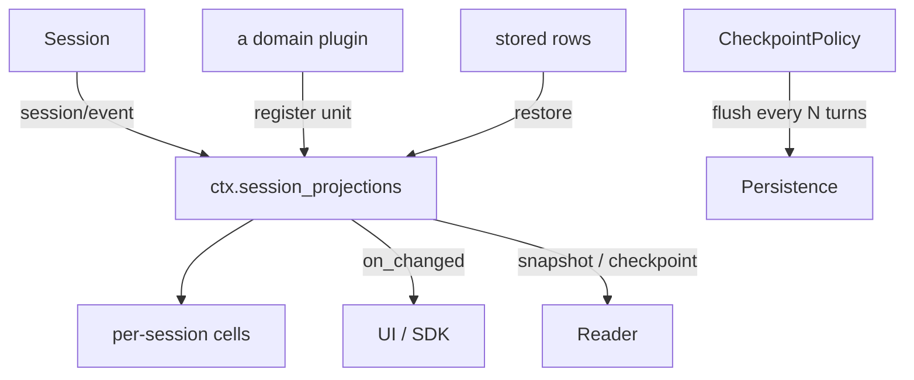
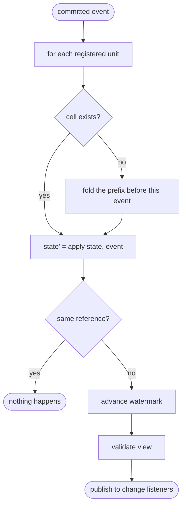
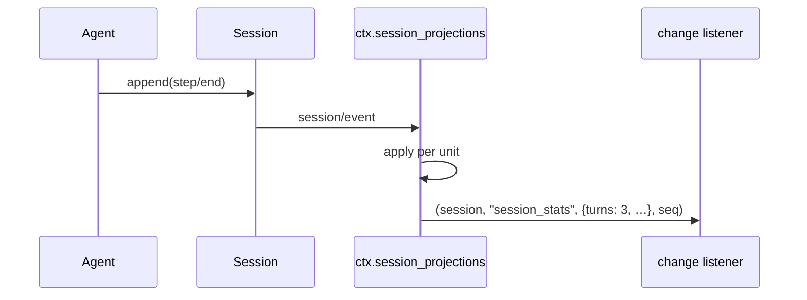
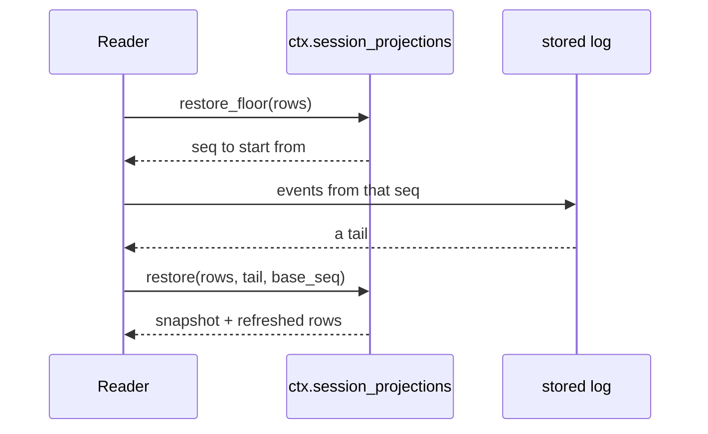

# Projections — reading the log as state, and keeping it durable

# 1 · Requirements

## Introduction

The session log is the source of truth, and nothing yet reads it as *state*.
Every consumer that wants to know "how many turns has this had", "is plan mode
on", "what is the current goal" would otherwise walk the whole log itself,
each with its own rules, each drifting.

A **projection** is the seam that fixes that: a domain contributes three pure
functions — `init`, `apply`, `view` — and the framework owns the subscription,
the per-session watermark cache, and the change stream. The domain never
subscribes to anything; the consumer never folds anything.

This sprint ports that primitive, its first real unit (`session_stats`), and
the checkpoint policy that makes durability automatic. The last one matters
more than its size suggests: today a session's events live in memory until
someone remembers to call `sessions.flush()`, and the agent loop never does.

The *persistent* projection cache (`projection_cache`) is not here — it writes
checkpoint rows to a KV table, and the storage seam is the next sprint.

## Glossary

- **Unit**: one `ProjectionDefinition` — a key plus `init` / `apply` / `view`.
- **Cell**: one unit's folded state for one session, plus the seq it has
  observed up to (its **watermark**).
- **Snapshot**: a consistent read across every registered unit for one session.
- **Checkpoint**: the state-level rows a durable cache would persist.
- **Cold read**: rebuilding a snapshot from stored checkpoint rows plus a tail
  of stored events, without loading the whole log.
- **Full-value event**: an event carrying its complete post-state, never a
  delta — the rule that keeps every transition cheap and self-describing.

## Mental Model & Invariants

**Model:**

- A projection is *maths over the log*, not a cache with its own truth. Delete
  every cell and the next read rebuilds the same values.
- The domain owns the maths; the framework owns the plumbing. That split is
  what lets a plugin contribute a view without knowing when sessions are
  created, evicted, or resumed.
- `apply` returning the *same object* means "this event does not concern me".
  Identity, not equality, is the change gate — which is what makes a unit that
  cares about one event type cost nothing on all the others.
- A snapshot is a consistent slice: every value in it reflects the same point
  in the log, so a consumer never sees two units disagreeing about *when*.

**Invariants:**

- **I1 — Rebuild equals drive.** Folding a log from `init` gives the same state
  as having been driven event by event.
- **I2 — Unchanged is untouched.** If `apply` returns the same reference, no
  change is published and no view is computed.
- **I3 — A checkpoint is detached.** What `checkpoint()` hands back is a deep
  copy; a caller mutating it cannot corrupt a live cell.
- **I4 — A stale row is dropped, never applied forward.** A checkpoint row from
  an older `state_version` is discarded and refolded, never fed to an `apply`
  that no longer understands it.
- **I5 — Registration is scoped and counted.** N registrations of one key share
  one cell, and the key survives until the last one disposes.

## Decisions & Corrections (log)

- 2026-08-24 — `projection_cache` deferred to the storage sprint; it persists
  through a KV table that does not exist yet.

## Dev Environment (config-as-code — pointers only)

- Deps: `pyproject.toml` (`uv sync`) · Gate: `uv run pytest tests -q`
- Reference: `reference/dsh-python/dsh_py/services/projection.py`,
  `session_stats.py`, `session_persistence.py` (`CheckpointPolicy`)

## Requirements

### Requirement 1: The unit contract

#### Acceptance Criteria

1. THE registry SHALL accept a definition of a key, an optional validator,
   `init`, `apply`, `view`, and a non-negative integer `state_version`.
2. IF `state_version` is not a non-negative integer, THE registry SHALL raise.
3. WHEN the same key is registered again with the same `state_version`, THE
   registry SHALL share one cell and count the registration (I5).
4. IF the same key is registered with a different `state_version`, THE registry
   SHALL raise — a versioned contract says the cached shape differs, so two
   registrants cannot share a cell.
5. THE registry SHALL return a disposer that decrements the count, removing the
   key only when the last registrant disposes.

### Requirement 2: Driving

#### Acceptance Criteria

1. THE registry SHALL subscribe once to `session/event` and drive every
   registered unit on every committed event.
2. WHEN a unit's `apply` returns the same reference, THE registry SHALL publish
   no change and SHALL NOT compute the view (I2).
3. WHEN a unit's `apply` returns a different reference, THE registry SHALL
   advance the cell's watermark and publish the validated view to every change
   listener.
4. WHEN a unit is registered after events have already been committed, THE
   registry SHALL fold the log prefix before that event on first touch (I1).
5. THE registry SHALL keep cells per session without keeping the session alive.
6. WHEN a change listener raises, THE registry SHALL still drive the remaining
   units and notify the remaining listeners.

### Requirement 3: Reading

#### Acceptance Criteria

1. `snapshot(session)` SHALL return `as_of_seq` and one validated value per
   registered unit, all reflecting the same point in the log.
2. WHEN no unit is registered, `snapshot` SHALL return empty values rather than
   failing.
3. `checkpoint(session)` SHALL return, per unit, its `state_version`, its
   watermark, and a deep copy of its state (I3).
4. `view_checkpoint(rows)` SHALL return a validated view per row whose version
   matches a registered unit, and SHALL omit any row that does not (I4).
5. `restore_floor(rows)` SHALL return the event seq a cold read must start
   from, or `None` when no unit is registered.
6. `restore(rows, events, base_seq)` SHALL seed each unit from a usable row and
   fold the provided events onto it, returning both a snapshot and refreshed
   rows.
7. IF a row is unusable and `base_seq` is past the start of the log, `restore`
   SHALL raise telling the caller to re-read from the beginning, rather than
   returning a value folded from an incomplete history.

### Requirement 4: The session-stats unit

#### Acceptance Criteria

1. THE unit SHALL count turns and steps from step boundaries, counting a turn
   once however many steps it had.
2. THE unit SHALL accumulate model time per step, from `step/start` to the
   assembled `assistant/message`.
3. THE unit SHALL accumulate time-to-first-token from the first token-bearing
   chunk of a step, and count the steps that contributed one.
4. THE unit SHALL accumulate decode time and output tokens when a step reported
   both a first token and a usage count.
5. THE unit SHALL accumulate tool time by pairing `tool/result` back to the
   `tool/call` that dispatched it.
6. WHEN a turn ends with tool calls still unpaired, THE unit SHALL drop them
   rather than carry them forever.
7. THE unit SHALL read chunks and messages in the *encoded* form the log
   stores, so a real conversation is not measured as zero.

### Requirement 5: Automatic durability

**User Story:** As a consumer, I want a conversation to be on disk without my
remembering to flush, so that a crash does not lose the turn that just ran.

#### Acceptance Criteria

1. THE CheckpointPolicy SHALL flush a session after every `every_turns` turn
   boundaries observed on its log.
2. IF `every_turns` is not a positive integer, THE CheckpointPolicy SHALL raise
   at construction.
3. WHEN no persistence backend is attached, THE CheckpointPolicy SHALL do
   nothing rather than fail.
4. WHEN a flush fails, THE CheckpointPolicy SHALL log it and continue — a
   durability checkpoint that throws would abort the turn that triggered it.
5. WHEN the policy is unmounted, THE CheckpointPolicy SHALL stop observing.

### Non-Functional

- **NF 1**: driving one event across one unit that ignores it SHALL do no work
  beyond the `apply` call — no view, no validation, no copy.
- **NF 2**: stdlib only.

## Out of Scope

- `projection_cache` — the durable checkpoint store. Needs the storage seam;
  the read ladder it calls (`view_checkpoint`, `restore_floor`, `restore`)
  ships here so it has something to call.
- `session_query` / `session_reference` — the history read and cross-session
  reference API, their own sprint.
- `brand` — the reference's module is a type alias and a docstring with no
  runtime behaviour. Porting an empty module to claim a catalogue row is
  paper coverage; the convention it documents (a `str` subclass per id type) is
  recorded in the catalogue instead.

# 2 · Design

## End-to-End Walkthrough

A consumer mounts the registry and the stats unit:

```python
await root.plugin(SessionProjections)
await root.plugin(SessionStats)
```

Nothing else changes. The agent runs its turns exactly as before, appending to
the log. But now, on every committed event, the registry hands that event to
each registered unit's `apply`, along with the state that unit had. Most events
are ignored — `apply` returns the state it was given, unchanged, and the
registry does nothing at all: no view computed, no listener called. That
identity check is why a registry with twenty units is not twenty times slower.

When an event *does* matter — `step/start` opens a step, `assistant/message`
closes it — `apply` returns a new state, the cell's watermark advances, and the
validated view goes out on the change stream. A UI subscribed to that stream
sees `turns: 3, steps: 7, llmMs: 4210` without ever reading the log.

Reading is a ladder, and which rung you use depends on what you have:

- **`snapshot(session)`** — a live session in memory. Every unit's current
  value, all as of the same seq.
- **`checkpoint(session)`** — the same states, deep-copied, ready to persist.
- **`view_checkpoint(rows)`** — no session, no I/O, just stored rows. Values as
  stale as the last checkpoint but never wrong; rows from an old
  `state_version` are simply absent rather than misread.
- **`restore(rows, events, base_seq)`** — a cold read: seed from the rows, fold
  the stored tail, and get both a snapshot and refreshed rows to write back.

The last rung has the sharpest edge. If a row is unusable — wrong version,
missing, or newer than the events supplied — and the caller only handed over a
*tail* of the log, `restore` refuses. It could fold from `init` over that tail
and return a confident number computed from half a history, and nobody would
know. Raising, and telling the caller to re-read from the beginning, is the
only honest option.

Separately, `CheckpointPolicy` makes durability happen. It watches turn
boundaries and flushes every N of them. Until now the loop appended everything
to memory and the log reached disk only if the consumer called `flush` — which
the loop never does.

## Tech Stack

- Python 3.13+, stdlib only · plugkit `Service`
- Test command: `uv run pytest tests -q`

## Directory Structure

```
src/pydsh/session/
  projection.py   # ProjectionDefinition, SessionProjections
  stats.py        # the sessionStats unit + its plugin
  checkpoint.py   # CheckpointPolicy
tests/
  test_projection.py
  test_projection_restore.py
  test_session_stats.py
  test_checkpoint_policy.py
```

## Architecture Overview



## Workflow



## Module Design

### `session.projection`

```
ProjectionDefinition(key, init, apply, view, validate=None, state_version=1)
class SessionProjections(Service):          # provide = "session_projections"
    register(definition) -> dispose
    on_changed(listener) -> dispose
    snapshot(session) -> {"as_of_seq", "values"}
    checkpoint(session) -> {key: {"ver", "seq", "val"}}
    view_checkpoint(rows) -> {key: value}
    restore_floor(rows) -> int | None
    restore(rows, events, base_seq) -> {"snapshot", "checkpoint"}
```

### `session.stats`

```
SESSION_STATS_KEY = "session_stats"
session_stats_definition : ProjectionDefinition
class SessionStats(Service)                 # registers the unit
```

### `session.checkpoint`

```
class CheckpointPolicy(Service):            # provide = "checkpoint_policy"
    every_turns: int                        # default DEFAULT_EVERY_TURNS
```

## Key Algorithms (pseudo-code)

```
ALGORITHM drive (one committed event)
  1. for each registered unit:
       cell <- its cell for this session, or built by folding every event
               with a lower seq than this one (a unit registered mid-stream)
       next <- unit.apply(cell.state, event)
       if next is cell.state:            # identity, not equality
          continue                        # the unit does not care: no work
       cell.state <- next ; cell.watermark <- event.seq
       if any listener:
          value <- validate(unit.view(next))
          notify each listener (session, key, value, event.seq), contained
```

```
ALGORITHM restore (cold read)
  input:  stored rows, a tail of stored events, the seq that tail starts at
  output: a snapshot and refreshed rows
  1. end <- last event's seq, or base_seq - 1 when the tail is empty
  2. for each registered unit:
       row <- rows[unit.key]
       usable <- row exists
                 and row.ver == unit.state_version
                 and row.seq >= base_seq - 1     # covers everything before
                 and row.seq <= end              # not ahead of the tail
       if not usable and base_seq > FIRST_SEQ:
          raise — folding from init over a tail would produce a confident
                  number computed from half a history
       state <- row.val if usable else unit.init()
       from  <- row.seq if usable else base_seq - 1
       fold every event with seq > from
       values[key] <- validate(unit.view(state))
       refreshed[key] <- {ver, seq: end, val: deep copy of state}
```

## Sequence Diagrams





## Data Models

Conforming to `data-architecture.md`: **no new store**. Cells are derived
state, reconstructible from the log at any time, and the registry is explicit
that they are a cache and never authority. Checkpoint rows are a *shape* this
sprint defines; the sprint that persists them owns their lifecycle row.

| Value | Writer | Source of truth? | Read path | Reproducible? |
|---|---|---|---|---|
| projection cell | the registry, driven by `session/event` | no — derived | `snapshot` | yes, by folding the log |
| checkpoint rows | `checkpoint()` (returned, not stored here) | no — derived | `view_checkpoint` / `restore` | yes, and version-gated |

## Error Handling Strategy

- A listener that raises is contained: the change already happened.
- A unit whose `apply` raises is *not* contained — its maths is broken, and a
  silently frozen projection is worse than a loud failure.
- An unusable checkpoint row over a partial log raises rather than guessing.

## Testing Strategy

- **Property tests**: rebuild-equals-drive; unchanged-is-untouched.
- **Integration**: the registry on a real context with a real session; stats
  measured over a conversation the *agent loop* actually produced.
- **Unit**: the restore ladder's version and watermark gates.

## Correctness Properties

### Property 1: Rebuild equals drive
- **Statement**: *For any* log, a unit registered before the events and a unit
  registered after them reach the same state.
- **Validates**: 2.4 (I1)

### Property 2: Unchanged is untouched
- **Statement**: *For any* event a unit ignores, no view is computed and no
  listener is called.
- **Validates**: 2.2 (I2)

### Property 3: A checkpoint cannot corrupt a cell
- **Statement**: *For any* mutation of what `checkpoint()` returned, subsequent
  snapshots are unaffected.
- **Validates**: 3.3 (I3)

## Edge Cases

- **A unit registered mid-stream** — folds the prefix strictly before the
  current event, then takes the normal path, so it is never double-applied.
- **An empty log** — watermark is the empty sentinel, and `snapshot` returns
  each unit's `init` view.
- **A row newer than the supplied tail** — unusable; a row cannot be trusted
  past the evidence available to check it.
- **Two units, one stale row, `base_seq == FIRST_SEQ`** — the whole log is
  available, so the stale one refolds from `init` and no one raises.
- **A session evicted from the store** — its cells go with it; nothing keeps a
  session alive for the sake of a derived value.

## Decisions

### Decision: sequence numbers are 1-based here, and the empty watermark is 0
**Context:** the reference uses `-1` for "nothing observed" and computes a
snapshot's `as_of_seq` as `session.seq - 1`. That arithmetic assumes its own
`seq` is the *next* sequence number. pydsh's `Session.seq` is the *last
committed* one, and events start at 1.
**Decision:** the empty watermark is `0`, and `as_of_seq` is `session.seq`.
**Rationale:** transcribing the reference's `- 1` would silently report every
snapshot one event stale — the kind of off-by-one that no test catches unless
someone thinks about it first. The sentinel is a named constant so the next
reader sees the choice rather than a magic number.

### Decision: validation is a callable, not a schema object
**Context:** the reference validates views with its own `core/schema`. pydsh
has no schema library and plugkit ships none.
**Decision:** `validate` is an optional `Callable[[Any], Any]` — pass-through
when absent.
**Rationale:** a unit that wants Pydantic passes its model's validator; one
that wants nothing passes nothing. Adding a schema dependency to gain a hook
that a one-line callable already provides is complexity with no variation
point.

### Decision: the stats unit reads the encoded log form
**Context:** the reference's stats unit calls `is_token_delta(chunk)` on a live
`StreamChunk` and reads a `ToolResultBlock` off a live `Message`. In pydsh the
log holds *encoded* payloads.
**Decision:** read the tagged encoding directly, without decoding.
**Rationale:** transcribing the reference would make every stat zero on a real
conversation — the same defect spec 02's token meter was written to avoid, and
the reason its `estimate_message` decodes first. Decoding per event in a fold
that runs on every append is the wrong cost, so this reads the tags instead.

### Decision: a failing `apply` faults the cell rather than the append
**Context:** this spec first said `apply` failures should propagate while
listener failures are contained. A test found that unenforceable: projections
are driven from `session/event`, which spec 01 broadcasts through
`emit_contained` precisely so an observer can never undo a committed append.
The registry is one observer among many, and letting a bad projection abort the
log would be a worse defect than the one being avoided.
**Options:** 1. Break spec 01's containment for this listener. 2. Contain, and
let the cell go on serving a stale value. 3. Contain, and mark the cell faulted
so reads fail.
**Decision:** contain and fault (option 3). The append commits; the cell records
the exception; `snapshot` and `checkpoint` raise `ProjectionFaultError` naming
the key. The fault is per session and terminal — refolding would replay the same
event onto the same maths.
**Rationale:** option 2 is the failure this whole decision exists to prevent — a
projection frozen at an old value is a number that looks fine and is wrong.
Option 1 trades a contained defect for an uncontained one. Faulting keeps both
guarantees: history is never rewritten, and nobody reads a confidently wrong
value.

### Decision: ties in `order` break by registration sequence

## Security Considerations

Projections read the log a consumer already owns and add no path to it. A
`view` crossing a process boundary is validated by its own unit before it
leaves, which is where a consumer puts its own redaction if it needs any.

# 3 · Tasks

## Status marks
<!-- [ ] pending | [x] done | [!] BLOCKED: reason | [-] DROPPED: <reason> |
     [>] → <spec_id> -->

## Tasks

- [x] 1. Core
  - [x] 1.1 `session/projection.py` — definition, registration, ref-counting
    - **Depends**: —
    - **Requirements**: 1.1–1.5
  - [x] 1.2 Driving: cells, identity gate, change stream, mid-stream build
    - **Depends**: 1.1
    - **Requirements**: 2.1–2.6
    - **Properties**: 1, 2
  - [x] 1.3 The read ladder: snapshot, checkpoint, view_checkpoint,
        restore_floor, restore
    - **Depends**: 1.2
    - **Requirements**: 3.1–3.7
    - **Properties**: 3
  - [x] 1.4 `session/stats.py` — the sessionStats unit over encoded payloads
    - **Depends**: 1.3
    - **Requirements**: 4.1–4.7
  - [x] 1.5 `session/checkpoint.py` — CheckpointPolicy
    - **Depends**: —
    - **Requirements**: 5.1–5.5
  - [x] 1.6 Export surface
    - **Depends**: 1.4, 1.5

- [x] 2. Tests
  - [x] 2.1 `test_projection.py` — registration, ref-counting, driving,
        identity gate, mid-stream registration, contained listeners
    - **Depends**: 1.2
    - **Requirements**: 1.1–1.5, 2.1–2.6
    - **Properties**: 1, 2
  - [x] 2.2 `test_projection_restore.py` — the ladder's version and watermark
        gates, deep-copy isolation, the refusal to fold over a partial log
    - **Depends**: 1.3
    - **Requirements**: 3.1–3.7
    - **Properties**: 3
  - [x] 2.3 `test_session_stats.py` — over a conversation the agent loop
        actually produced, not a hand-built log
    - **Depends**: 1.4
    - **Requirements**: 4.1–4.7
  - [x] 2.4 `test_checkpoint_policy.py` — flush cadence, no backend, a failing
        flush, unmount
    - **Depends**: 1.5
    - **Requirements**: 5.1–5.5

- [x] 3. Wrap
  - [x] 3.1 README + catalogue note on `brand`
    - **Depends**: 2.4
  - [x] 3.2 Close the sprint
    - **Depends**: 3.1

## Log

**[2026-08-24]** — Created and activated. `projection_cache` deferred to the
storage sprint; `brand` recorded as a convention rather than ported as an empty
module.

**[2026-08-24]** — CLOSED / SHIPPED. All tasks done, 356 tests green, up from
294.

The spec was wrong about one thing and a test caught it. It required a failing
`apply` to propagate; projections are driven from `session/event`, which spec
01 contains on purpose so an observer can never undo a committed append. The
resolution keeps both guarantees rather than trading one for the other: the
append commits, the cell faults, and reads raise instead of serving a value
that missed a transition. Recorded in Decisions.

Two porting hazards handled rather than transcribed. The reference computes a
snapshot's watermark as `seq - 1` because its own `seq` is the *next* number;
pydsh's is the last committed one, so copying that arithmetic would have
reported every snapshot one event stale. And the stats unit reads the encoded
payloads the log actually holds — the reference reads live vocabulary objects,
which on this port would have measured every conversation as zero, plausibly
and silently. `test_session_stats.py` measures a conversation the agent loop
really produced, which is the only test shape that catches it.

`CheckpointPolicy` closes a gap nobody had named: the loop appended entire
conversations to memory and flushed only if a consumer remembered to ask.
`brand` was not ported — the reference's module is a type alias and a
docstring, and porting an empty module to claim a catalogue row is paper
coverage.
