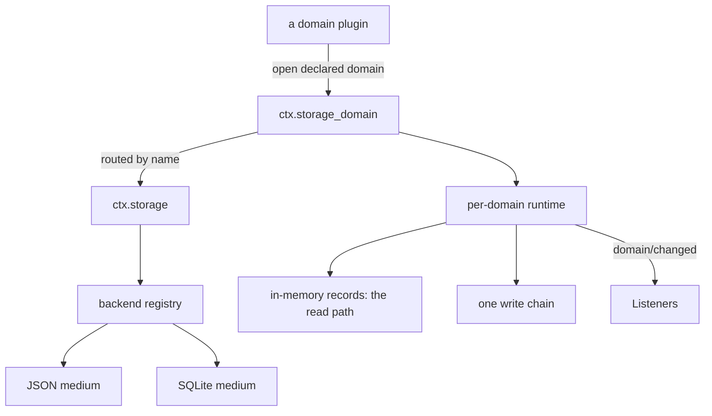
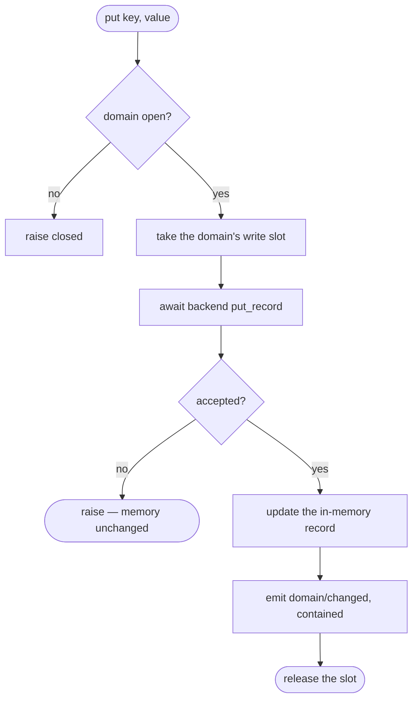
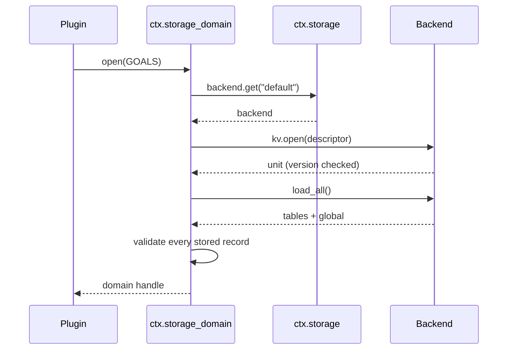
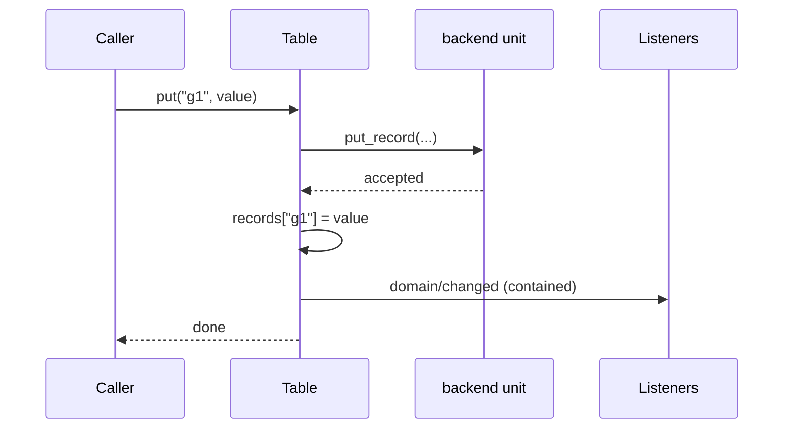

# Storage — a hub, two media, and one place that owns "what a record means"

# 1 · Requirements

## Introduction

Everything so far persists exactly one thing: the session log, through one
backend, with the schema baked into `persistence.py`. That was right while the
log was the only store. It stops being right the moment a second one appears —
and several are queued: the projection cache, settings, goals, schedules,
attachments, long-term memory.

Without a shared seam each of those invents its own file format, its own
validation, its own "is it on disk yet", and drifts. The reference's answer is
three layers with a sharp split:

- **The hub** (`ctx.storage`) does no I/O at all. It is a named registry of
  backends plus a mount table for *data forms*.
- **A backend** owns one medium — a JSON file, a SQLite database — and knows
  nothing about what the values mean.
- **The domain form** (`ctx.storage_domain`) owns the meaning: declared
  domains, schema-validated tables, in-memory reads, a single write chain per
  domain, and a change event.

The load-bearing rule sits in that last layer: **durable first, memory second,
event third.** A write reaches the medium before the in-memory copy changes,
so a rejected write leaves the reader seeing exactly what is on disk. Reads and
writes never fork.

## Glossary

- **Backend**: the owner of one medium, registered under a name.
- **Facet**: an optional capability of a backend. `kv` is the only one here; a
  backend that cannot serve a shape simply omits it.
- **Unit**: one opened KV container — a domain's tables and its global slot.
- **Form**: a mounted way of using backends. `domain` is the only one here.
- **Domain**: a named, versioned group of tables declared up front.
- **Write chain**: the per-domain serialization that makes concurrent writers
  land in a defined order.

## Mental Model & Invariants

**Model:**

- The hub is a phone book, not a database. It never touches a medium.
- Backends are plural and named. Which backend serves which consumer is the
  *consumer's* configuration, never a global choice the hub makes.
- A domain is declared before it is opened, and the declaration is the
  contract: these tables, this version, this record schema.
- Memory is the read path; the medium is the truth. They are kept identical by
  never letting memory move first.

**Invariants:**

- **I1 — Durable before visible.** A record changes in memory only after the
  backend has accepted it. A failed write leaves memory untouched.
- **I2 — One write chain per domain.** Concurrent writers are serialized, so
  the medium's order and the event order agree.
- **I3 — A version mismatch refuses to open.** A stored unit whose version is
  not the declared one raises rather than being read as the current shape.
- **I4 — A stale disposer removes only its own registration.**
- **I5 — A change event is a notification, not a participant.** It is emitted
  after the commit point, and a failing listener cannot undo the write.
- **I6 — Reads are synchronous.** A consumer reading a record does not await;
  the value is already in memory.

## Decisions & Corrections (log)

- 2026-08-24 — `fs` moved out of this sprint. It is a path/text capability for
  tools, not a store, and belongs with `shell`/`terminal`.

## Dev Environment (config-as-code — pointers only)

- Deps: `pyproject.toml` (`uv sync`) · Gate: `uv run pytest tests -q`
- Reference: `reference/dsh-python/dsh_py/services/storage.py`,
  `storage_json.py`, `storage_sqlite.py`, `storage_domain.py`,
  `util/atomic_write.py`

## Requirements

### Requirement 1: The hub

#### Acceptance Criteria

1. THE Storage hub SHALL provide `ctx.storage` and perform no I/O itself.
2. THE hub SHALL register a backend under a name and return a disposer.
3. IF a name is already registered, THE hub SHALL raise `duplicate-backend`.
4. WHEN a disposer runs after its name was re-registered, THE hub SHALL leave
   the newer registration in place (I4).
5. WHEN an unregistered backend is requested, THE hub SHALL raise
   `backend-not-found` naming what *is* registered.
6. THE hub SHALL mount a named data form, return an unmount, and raise
   `duplicate-mount` for a name already mounted.
7. WHEN an unmounted form is requested, THE hub SHALL raise `form-not-mounted`.
8. THE hub SHALL NOT close a backend when its registration is disposed — the
   plugin that registered it owns its lifetime.

### Requirement 2: Atomic writes

#### Acceptance Criteria

1. `write_file_atomic` SHALL replace a file's contents in one step, creating
   parent directories as needed.
2. IF the write fails partway, THE original file SHALL be unchanged.
3. THE temporary file SHALL be removed on both the success and failure paths.

### Requirement 3: Backend contract and the JSON medium

#### Acceptance Criteria

1. A KV unit SHALL expose `load_all`, `put_record`, `delete_record`,
   `set_global`, and `close`.
2. WHEN a unit is opened for the first time, THE backend SHALL create it from
   the descriptor with empty tables and no global value.
3. WHEN a stored unit's version differs from the descriptor's, THE backend
   SHALL raise `version-mismatch` (I3).
4. WHEN a stored file cannot be parsed or has the wrong shape, THE backend
   SHALL raise `malformed-medium`.
5. WHEN a unit is closed, every later call SHALL raise `closed`.
6. THE JSON backend SHALL persist through an atomic replace, so a crash mid-write
   cannot truncate the unit.

### Requirement 4: The SQLite medium

#### Acceptance Criteria

1. THE SQLite backend SHALL serve the same unit contract as the JSON one, so a
   consumer swaps media by configuration.
2. THE SQLite backend SHALL keep records under `(unit, table, key)` and the
   global value under `(unit)`.
3. THE SQLite backend SHALL run its blocking driver off the event loop.
4. THE SQLite backend SHALL enforce the same version and `closed` rules.

### Requirement 5: The domain form

#### Acceptance Criteria

1. `define_domain` SHALL reject a domain or table name that is not a safe
   identifier, and a version that is not a non-negative integer, at declaration
   time rather than at open time.
2. `define_domain` SHALL reject a global schema that accepts `None`, because
   `None` is the medium's "never written" sentinel and a nullable global cannot
   round-trip.
3. THE facility SHALL provide `ctx.storage_domain` and open a declared domain
   against a routed backend, returning a handle with table and global access.
4. WHEN a domain is already open, THE facility SHALL raise rather than hand out
   a second runtime over one medium.
5. WHEN a stored record fails its table's schema, THE facility SHALL raise
   `invalid-record` naming the table and key.
6. Table reads (`get`, `entries`, `keys`, `size`) SHALL be synchronous (I6).
7. `put`, `delete` and `update` SHALL write to the backend, then update memory,
   then emit `domain/changed` — in that order (I1).
8. IF the backend rejects a write, THE in-memory record SHALL be unchanged and
   no change event SHALL be emitted.
9. Concurrent writes to one domain SHALL be serialized (I2).
10. `update` on a missing key SHALL raise `missing-key`; `delete` of a missing
    key SHALL return `False` without writing.
11. WHEN a change listener raises, THE facility SHALL log it and continue (I5).
12. `close` SHALL refuse new writes, drain the ones already queued, close the
    unit, release the name, and be idempotent.
13. WHEN the facility is unmounted, THE facility SHALL close any domain still
    open.

### Non-Functional

- **NF 1**: stdlib only — `json`, `sqlite3`, `os`, `asyncio`.
- **NF 2**: no blocking I/O on the event loop.

## Out of Scope

- `fs` (path/text capability) — a tool capability, not a store; ships with
  `shell` and `terminal`.
- `projection_cache` — the first real consumer of this seam, next sprint.
- Migrating the session log onto the hub. Its table is specific and working,
  and moving it would be a rewrite with no behaviour change. `ponytail:` when a
  third store wants the same shape, revisit.
- Cross-process write locking. `with_file_lock` in the reference guards
  multi-process writers; nothing in this port runs two processes against one
  medium yet, and an unused lock is a lock nobody tests.

# 2 · Design

## End-to-End Walkthrough

A deployment mounts the hub, a backend, and the domain form:

```python
await root.plugin(Storage)
await root.plugin(JsonStorage, {"root": "/var/lib/app/storage"})
await root.plugin(StorageDomain)
```

A plugin declares what it stores — up front, at module load, so a typo fails
when the module is imported rather than the first time someone saves:

```python
GOALS = define_domain(
    name="goals",
    version=1,
    tables={"entries": domain_table(validate_goal)},
)
```

Then it opens the domain and uses it:

```python
goals = await root.storage_domain.open(GOALS)
await goals.table("entries").put("g1", {"text": "ship the port"})
goals.table("entries").get("g1")          # synchronous — already in memory
```

The read is synchronous because the domain holds every record in memory. That
is the point of the layer: a consumer asking "what is the current goal" does
not await a disk read.

The write is where the care is. `put` does three things *in order*: it waits
for the backend to accept the record, then updates the in-memory copy, then
emits `domain/changed`. Do it the other way — memory first, disk after — and a
rejected write leaves the reader seeing a value that is not stored anywhere.
Reads and writes fork, and nothing tells you.

Writes also queue. Every domain has one chain, so two callers writing the same
key land in a defined order and the medium's order matches the event order. A
consumer that wants a compare-and-set uses `update`, which reads and writes
inside one slot on that chain.

Closing drains rather than cancels: new writes are refused, queued ones finish
(and emit), then the unit is released.

## Tech Stack

- Python 3.13+, stdlib only (`json`, `sqlite3`, `asyncio`, `os`)
- Test command: `uv run pytest tests -q`

## Directory Structure

```
src/pydsh/storage/
  __init__.py
  errors.py       # StorageError + the stable code vocabulary
  atomic.py       # write_file_atomic
  hub.py          # Storage (ctx.storage), BackendRegistry
  json_backend.py # JsonBackend / JsonKvFacet / JsonKvUnit
  sqlite_backend.py
  domain.py       # define_domain, domain_table, StorageDomain, the runtime
tests/
  test_storage_hub.py
  test_storage_atomic.py
  test_storage_backends.py
  test_storage_domain.py
```

## Architecture Overview



## Workflow



## Module Design

### `storage.errors`

```
STORAGE_ERROR_CODES = (backend-not-found, form-not-mounted, duplicate-backend,
                       duplicate-mount, version-mismatch, malformed-medium,
                       closed, invalid-record, missing-key)
class StorageError(Exception):  code, message
class DomainError(StorageError): detail
```

### `storage.hub.Storage` — `provide = "storage"`

```
backend.register(name, backend) -> dispose ; backend.get(name) ; backend.names()
mount(form, facility) -> unmount ; form(name) ; domain (property)
```

### backend contract

```
class KvUnit(Protocol):
    async load_all() -> {"tables": {...}, "global": Any}
    async put_record(table, key, value) ; async delete_record(table, key)
    async set_global(value) ; async close()
class KvFacet(Protocol):    async open(descriptor) -> KvUnit
class StorageBackend(Protocol):  kv: KvFacet | None ; async close()
```

### `storage.domain`

```
domain_table(validate) -> spec
define_domain(name, version, tables, global_=None) -> DomainSpec
class StorageDomain(Service):        # provide = "storage_domain"
    async open(spec, backend="default") -> Domain
    async close_all()
class Domain:
    table(name) -> Table ; global_ -> GlobalHandle ; async close()
class Table:
    get(key) ; entries() ; keys() ; size          # synchronous
    async put(key, value) ; async delete(key) ; async update(key, fn)
```

## Key Algorithms (pseudo-code)

```
ALGORITHM put (and every other write)
  1. if the domain is closing: raise closed
  2. take the domain's write slot (one chain per domain — I2)
  3. await backend.put_record(table, key, value)      # durable FIRST
     - if it raises, release the slot and propagate:
       memory is untouched, so a reader still sees what is stored (I1)
  4. records[key] <- value                            # visible SECOND
  5. emit domain/changed, contained                   # notified THIRD (I5)
```

```
ALGORITHM open a declared domain
  1. reject if this domain name is already open — two runtimes over one medium
     would each believe their memory is authoritative
  2. backend <- hub.backend.get(route)   ; fail loud if it has no kv facet
  3. unit <- backend.kv.open(descriptor_of(spec))     # version-gated (I3)
  4. stored <- await unit.load_all()
  5. for each table, for each record: validate against the table's schema
       - a stored record that no longer validates raises invalid-record,
         naming table and key: silently dropping it would lose data, and
         silently keeping it would let an invalid value spread
  6. validate the global slot, or use the declared initial when never written
  7. return a runtime holding the records in memory and one write chain
```

## Sequence Diagrams





## Data Models

This sprint adds the project's **second and third stores**, which is the
condition `data-architecture.md` deferred the hub for. Conforming rows:

| Store | Writer | Immutable? | Source of truth? | Read path | Retention | Reproducible? |
|---|---|---|---|---|---|---|
| JSON unit file | the JSON backend, via atomic replace | no — rolling | yes for its domain | in-memory records loaded at open | until the consumer deletes it | no — it *is* the record |
| SQLite storage tables | the SQLite backend | no — rolling | yes for its domain | same | same | no |
| in-memory records | the domain runtime | no | **no — derived** | synchronous `get` | process lifetime | yes, by reopening |

The third row is the one that earns the layer: memory is explicitly derived,
and I1 is what keeps it identical to the row above it.

## Error Handling Strategy

Codes are the contract, prose is diagnosis. `StorageError.code` is stable and
matchable; the message names what was found and what was expected. Backend
errors pass through the domain layer unwrapped — the domain adds meaning, not
a second exception hierarchy over the same failure.

## Testing Strategy

- **Integration**: the whole stack on a real context with a real temp file and
  a real SQLite file — both backends through one shared conformance test, since
  "a consumer swaps media by configuration" is only true if they behave alike.
- **Property**: durable-before-visible, under an injected write failure.
- **Property**: serialized writes, under genuine concurrency.

## Correctness Properties

### Property 1: A rejected write leaves no trace
- **Statement**: *For any* write the backend refuses, the in-memory value, the
  stored value, and the change stream are all as they were.
- **Validates**: 5.8 (I1)

### Property 2: Concurrent writers land in a defined order
- **Statement**: *For any* set of concurrent writes to one domain, the medium's
  final state and the emitted change order agree.
- **Validates**: 5.9 (I2)

### Property 3: The two media are interchangeable
- **Statement**: *For any* sequence of domain operations, JSON and SQLite give
  the same reads, the same errors, and the same reload.
- **Validates**: 4.1

## Edge Cases

- **A backend with no `kv` facet** — fails at open, naming the backend; a
  backend omits what it cannot serve rather than stubbing it.
- **A domain opened, closed, and reopened** — the name is released on close, so
  the second open reads what the first wrote.
- **`delete` racing `put` on one key** — the write chain decides; the delete
  sees whatever the earlier slot left.
- **A stored record that no longer validates** — raises at open, naming table
  and key. Dropping it loses data; keeping it spreads an invalid value.
- **A global never written** — reads as the declared initial, not `None`, which
  is why a nullable global schema is refused at declaration.
- **A unit file that is valid JSON but the wrong shape** — `malformed-medium`,
  not a crash halfway through loading.

## Decisions

### Decision: writes take a callable, not an already-created coroutine
**Context:** the reference's table handles build the job coroutine eagerly
(`return job()`) and hand it to `enqueue`, which may reject it — on a closing
domain — *before* awaiting. The coroutine is then never awaited, which Python
reports as a `RuntimeWarning` at collection time, far from the cause.
**Decision:** enqueue takes a thunk and calls it inside the slot.
**Rationale:** an un-awaited coroutine is a resource leak with a confusing
report; creating the coroutine only when it will run removes the case.

### Decision: backends are plain objects; the service classes are a convenience
**Context:** the backends began as plugkit services, each with a `provide`
name. A test that registered two JSON backends found the flaw: a service class
can provide its name only once, so two instances collide — and the hub's whole
design is that backends are **plural** and named by the deployment.
**Decision:** `JsonBackend` and `SqliteBackend` are plain objects a deployment
registers itself. `JsonStorage` / `SqliteStorage` remain as one-line plugins
for the common single-backend case.
**Rationale:** the constraint was arguing with the architecture. Registering by
hand also makes the *name* a deployment decision rather than one a plugin
made, which is exactly what "which backend serves which consumer is the
consumer's configuration" means.

### Decision: schemas are callables, not a schema library
**Context:** the reference validates records with its own `core/schema`.
**Decision:** a table's schema is `Callable[[Any], Any]` — return the value (or
a coerced form), raise to reject.
**Rationale:** the same reasoning as spec 04's prompt validator, and it lets a
consumer bring Pydantic, `zod`-style helpers, or nothing at all. One protocol,
no dependency.

### Decision: snake_case on the unit contract
**Context:** the reference's unit methods are `loadAll` / `putRecord` /
`setGlobal`, carried over from TypeScript.
**Decision:** `load_all`, `put_record`, `set_global`.
**Rationale:** this is a Python interface consumers implement. Matching the
language matters more than matching the reference's transliteration, and the
rest of this port already made that call.

### Decision: the session log stays on its own table
**Context:** the log predates the hub and has a bespoke schema.
**Decision:** leave it; do not migrate.
**Rationale:** a rewrite with no behaviour change, on the one store that is
already proven across a process restart, buys nothing today. Marked
`ponytail:` for when a third store wants the same shape.

## Security Considerations

Paths come from deployment configuration, not from a model, and unit names are
constrained to a safe identifier pattern so a name can never escape its root as
a path segment or an unescaped SQL identifier. Values are opaque JSON to the
backends: no medium interprets them.

# 3 · Tasks

## Status marks
<!-- [ ] pending | [x] done | [!] BLOCKED: reason | [-] DROPPED: <reason> |
     [>] → <spec_id> -->

## Tasks

- [x] 1. Foundation
  - [x] 1.1 `storage/errors.py` — the code vocabulary
    - **Requirements**: 1.3, 1.5, 1.7, 3.3–3.5
  - [x] 1.2 `storage/atomic.py` — `write_file_atomic`
    - **Requirements**: 2.1–2.3
  - [x] 1.3 `storage/hub.py` — the registry and the mount table
    - **Depends**: 1.1
    - **Requirements**: 1.1–1.8

- [x] 2. Media
  - [x] 2.1 `storage/json_backend.py`
    - **Depends**: 1.2, 1.3
    - **Requirements**: 3.1–3.6
  - [x] 2.2 `storage/sqlite_backend.py`
    - **Depends**: 1.3
    - **Requirements**: 4.1–4.4
    - **Properties**: 3

- [x] 3. The domain form
  - [x] 3.1 `define_domain` / `domain_table` — declaration-time validation
    - **Depends**: 1.1
    - **Requirements**: 5.1, 5.2
  - [x] 3.2 The runtime: memory, the write chain, change events
    - **Depends**: 3.1, 2.1
    - **Requirements**: 5.6–5.11
    - **Properties**: 1, 2
  - [x] 3.3 `StorageDomain` — open, route, validate on load, close
    - **Depends**: 3.2
    - **Requirements**: 5.3–5.5, 5.12, 5.13
  - [x] 3.4 Export surface
    - **Depends**: 3.3

- [x] 4. Tests
  - [x] 4.1 `test_storage_atomic.py`
    - **Depends**: 1.2
    - **Requirements**: 2.1–2.3
  - [x] 4.2 `test_storage_hub.py`
    - **Depends**: 1.3
    - **Requirements**: 1.1–1.8
  - [x] 4.3 `test_storage_backends.py` — one conformance suite over both media
    - **Depends**: 2.2
    - **Requirements**: 3.1–3.6, 4.1–4.4
    - **Properties**: 3
  - [x] 4.4 `test_storage_domain.py` — declaration, load validation, ordering,
        the rejected-write property, close semantics
    - **Depends**: 3.3
    - **Requirements**: 5.1–5.13
    - **Properties**: 1, 2

- [x] 5. Wrap
  - [x] 5.1 README + the data-architecture rows
    - **Depends**: 4.4
  - [x] 5.2 Close the sprint
    - **Depends**: 5.1

## Log

**[2026-08-24]** — Created and activated. `fs` moved to the execution sprint;
`projection_cache`, the seam's first consumer, follows next.

**[2026-08-24]** — CLOSED / SHIPPED. All tasks done, 424 tests green, up from
356.

Two defects found by tests rather than reasoning. The SQLite backend tore
itself down at construction: `ctx.effect` runs its argument *now* and keeps the
return value as the teardown, so a body that *is* the teardown runs
immediately. And the backends could not be plural while they were plugkit
services — a service class provides its name once, and two JSON backends
collided — which was the constraint arguing with the architecture. Both
recorded; the second in Decisions, because it changed the shape of the seam.

One reference defect fixed while porting: its table handles build the job
coroutine eagerly and hand it to a queue that may refuse it on a closing
domain, leaving an un-awaited coroutine that Python reports at collection time,
far from the cause. Writes here take a thunk called inside the slot.

The two properties that justify the layer are both tested against a backend
that can be made to fail and to stall: a rejected write leaves memory, the
medium, and the change stream untouched; and concurrent writers land in an
order the medium and the event stream agree on.
