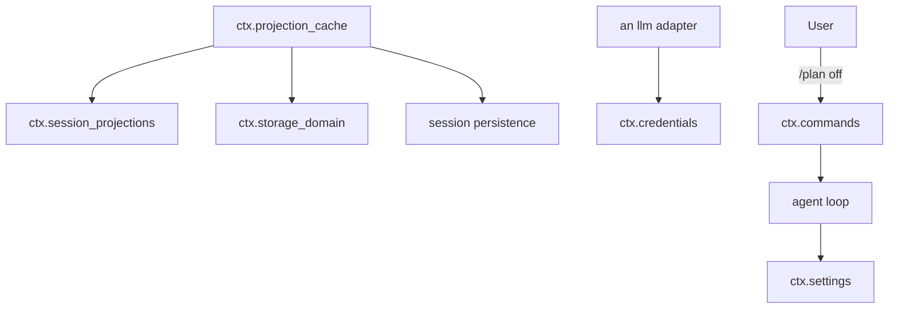
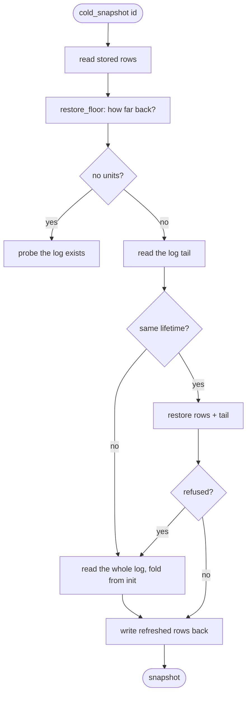
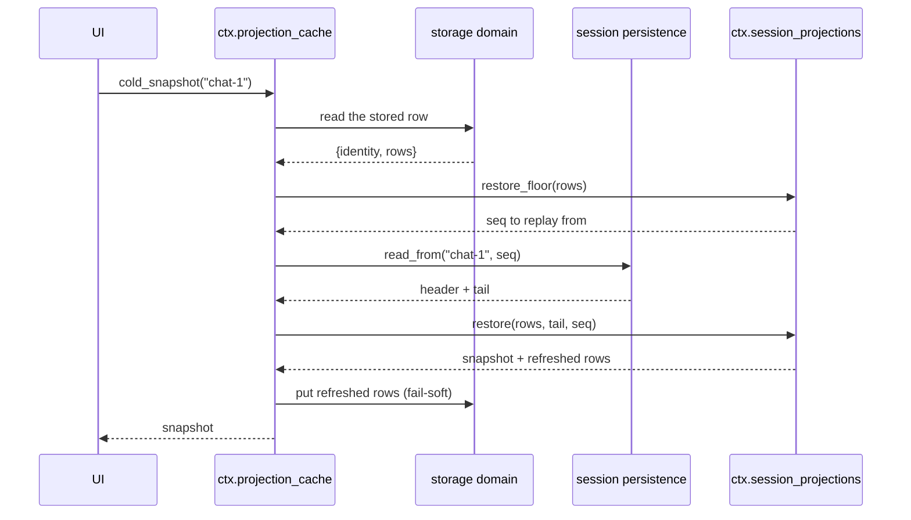
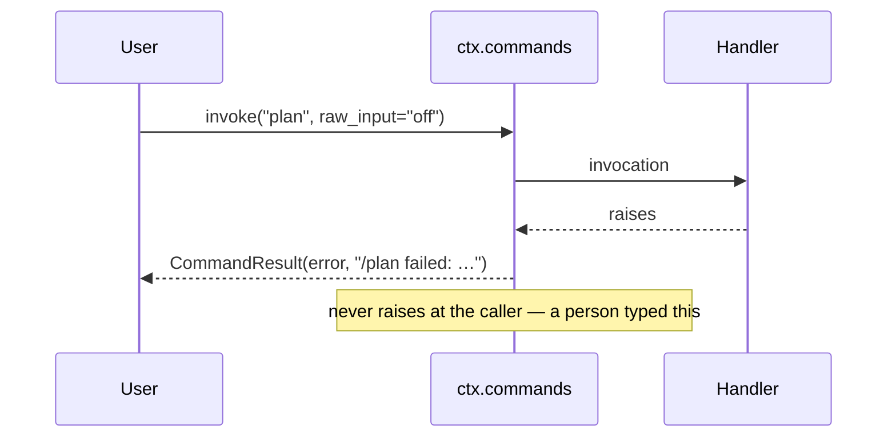

# The operating core — cold reads, settings, credentials, commands

# 1 · Requirements

## Introduction

Five services a harness needs before it can be operated rather than merely run,
plus the storage seam's first real consumer.

**The projection cache** is that consumer, and it is the interesting one. Spec
05 built a cold-read ladder — `checkpoint`, `view_checkpoint`, `restore` — with
nothing to persist the rows. This sprint persists them, which turns "list a
hundred archived conversations with their stats" from "load a hundred full logs
and fold them" into a single table read. It needs one thing the session
persistence layer does not have yet: reading a *tail* of a log rather than all
of it.

The other four are small and independent. **Settings** is namespaced,
schema-checked runtime config that can change while the process runs —
including the agent loop's parallel-tool limit, which spec 03 had to leave as a
constructor argument because there was nothing to read it from.
**Credentials** resolves a named reference to a secret without the value ever
being config. **Commands** registers the slash-commands a user invokes without
spending a model turn. **Anonymous user id** is a stable, home-scoped
identifier for a machine.

## Glossary

- **Cold read**: reading a persisted session's projections without loading its
  whole log — cached rows plus a replayed tail.
- **Identity witness**: the stored header that proves cached rows belong to
  *this* session's lifetime rather than a rebuilt or swapped one.
- **Forced point**: a moment the cache must write, regardless of throttling.
- **Namespace**: a settings section's name, and the unit of registration.
- **Ref**: a credential's name — the thing that goes in config, in place of
  the secret.

## Mental Model & Invariants

**Model:**

- The projection cache is a *shortcut, never authority*. Every value it serves
  is reproducible from the log, and when it disagrees with the log the log
  wins.
- A cached row is only meaningful next to the log it was folded from. The
  stored header is what ties them together.
- Settings are read at the moment of use, not captured at construction — that
  is the difference between configurable and configured-once.
- A credential's *reference* is config; its value never is.

**Invariants:**

- **I1 — The cache may lag the log; it must never lead it.** A crash between
  the two writes leaves a longer tail to replay. The reverse would serve values
  folded from events the log does not contain.
- **I2 — Rows from another lifetime are discarded whole.** Not merged, not
  partially trusted.
- **I3 — A cache failure is never a caller's failure.** Every throttled write
  is fail-soft: the cache stays stale and heals on the next one.
- **I4 — A settings write is validated before it is visible.**
- **I5 — A command never raises at its caller.** A failure comes back as
  result text, because the caller is a user typing a slash-command.

## Decisions & Corrections (log)

- 2026-08-24 — `retention` and `timeout` moved to the sprint that ports their
  consumers (tool output trimming, the timeout guard). Utilities with no caller
  are untested utilities.

## Dev Environment (config-as-code — pointers only)

- Deps: `pyproject.toml` (`uv sync`) · Gate: `uv run pytest tests -q`
- Reference: `services/projection_cache.py`, `settings.py`, `credentials.py`,
  `commands.py`, `anonymous_user_id.py`

## Requirements

### Requirement 1: Reading a tail of a persisted log

#### Acceptance Criteria

1. THE persistence backend SHALL expose `read_from(id, from_seq)` returning the
   stored header and the events at or after `from_seq`.
2. WHEN the session is not persisted, `read_from` SHALL return `None`.
3. WHEN `from_seq` is past the end of the log, `read_from` SHALL return the
   header and no events, rather than failing.
4. THE returned events SHALL be ordered by seq and carry the same fields a
   full load produces.

### Requirement 2: The projection cache

#### Acceptance Criteria

1. THE cache SHALL provide `ctx.projection_cache` and persist checkpoint rows
   per session through the storage domain form.
2. `cached_snapshot(header)` SHALL serve values from stored rows with no log
   read at all, returning `None` when no usable row exists.
3. `cached_snapshot` SHALL report the lowest watermark among the rows it
   served, so a value is never claimed fresher than it is.
4. `cold_snapshot(id)` SHALL read the stored rows, ask the registry how far
   back the log must be replayed, read that tail, and restore.
5. IF the stored rows belong to another session lifetime, `cold_snapshot` SHALL
   discard them entirely and re-read the log from the start (I2).
6. IF `restore` refuses the rows, `cold_snapshot` SHALL fall back to a full
   re-read rather than propagating.
7. WHEN a session is not persisted at all, `cold_snapshot` SHALL raise.
8. `write(session)` SHALL take the checkpoint, then flush the log, then persist
   the rows — in that order (I1).
9. THE cache SHALL write at every `turn/end`, and after a configurable number
   of events between turns.
10. WHEN a throttled write fails, THE cache SHALL log it and continue (I3).

### Requirement 3: Settings

#### Acceptance Criteria

1. THE Settings service SHALL provide `ctx.settings` and register a namespaced
   section with an optional validator and a base value.
2. `set` SHALL validate before storing, and leave the old value in place when
   validation fails (I4).
3. `set` SHALL notify watchers after a successful write.
4. WHEN a watcher raises, THE section SHALL still notify the rest.
5. `watch` SHALL return an unwatch that removes only its own registration.
6. Reading or writing an unregistered namespace SHALL raise, naming the
   registered ones.
7. THE agent loop SHALL read its parallel-tool limit from settings when the
   service is mounted, so changing it takes effect on the next step.

### Requirement 4: Credentials

#### Acceptance Criteria

1. THE Credentials service SHALL provide `ctx.credentials` and resolve a ref to
   `{"value", "source"}`, or `None` when it is nowhere.
2. Resolution SHALL prefer an explicitly stored value over the environment.
3. Resolution SHALL happen per call, so a change is visible to the next
   operation without a restart.
4. A ref that is not a safe identifier SHALL raise.
5. `set` and `delete` SHALL broadcast `credentials/updated`.
6. `delete` SHALL remove only a stored value, never touch the environment, and
   report whether anything was removed.
7. `describe` SHALL report availability and source **without** the value.

### Requirement 5: Commands

#### Acceptance Criteria

1. THE Commands service SHALL provide `ctx.commands`, registering a name, a
   description, and a handler.
2. An empty name SHALL be rejected; a repeat registration SHALL replace.
3. `invoke` SHALL accept sync and async handlers alike.
4. `invoke` of an unregistered command SHALL return an error result naming it.
5. WHEN a handler raises, `invoke` SHALL return an error result carrying the
   message (I5).
6. WHEN a handler returns something that is not a result, `invoke` SHALL return
   an error result rather than passing the value on.
7. `list` SHALL report every command's name and description.

### Requirement 6: Anonymous user id

#### Acceptance Criteria

1. THE service SHALL return a stable identifier for this machine, creating and
   persisting one on first use.
2. THE identifier SHALL be a UUID, and a stored value that is not one SHALL be
   replaced rather than returned.
3. WHEN the home directory cannot be written, THE service SHALL return a
   per-process identifier rather than failing.

### Non-Functional

- **NF 1**: stdlib only.
- **NF 2**: `describe` and every log line SHALL be free of credential values.

## Out of Scope

- `retention` and `timeout` — utilities whose consumers are the tool sprints.
- `plan_mode` — now that projections and commands exist it is unblocked, but it
  also wants a user-questions channel; it goes with the tool/plugin sprint.
- Settings persistence. A section's value is runtime state here; the sprint
  that needs a setting to survive a restart puts it in a storage domain.

# 2 · Design

## End-to-End Walkthrough

**The cache.** A consumer listing archived conversations wants each one's turn
count. Without a cache that means loading a hundred full logs and folding each.
With one it is a table read: `cached_snapshot(header)` returns the values from
stored rows, no log touched at all, marked with the lowest watermark among them
so nobody mistakes them for current.

When the consumer opens one of those conversations it wants current values.
`cold_snapshot(id)` asks the registry how far back the log has to be replayed
given what the rows already cover, reads only that tail, folds it onto the
rows, and writes the refreshed rows back.

Two things can go wrong and both are handled by re-reading rather than by
trusting. The stored header is an **identity witness**: if the rows were folded
from a *different* lifetime — an id reused after a rebuild, a store swapped
underneath — they are discarded whole rather than merged. And if `restore`
refuses them (spec 05's refusal to fold from `init` over a partial log), the
answer is the same: read the whole log and fold from scratch. Slower, correct.

The write path has one ordering rule, and it is the mirror of the storage
seam's:

1. take the checkpoint,
2. flush the *log*,
3. persist the rows.

A crash between 2 and 3 leaves the cache behind the log — the next cold read
replays a longer tail and gets the right answer. A crash with the order
reversed leaves the cache *ahead*: rows folded from events the log does not
contain, and a cold read serves numbers for a conversation that never happened.
The cache is a shortcut, never authority, and this order is what enforces it.

**Settings.** A section is registered under a namespace with a validator and a
base value; `set` validates first, so a rejected write leaves the old value
standing rather than a half-applied one. Watchers hear about accepted changes.
The agent loop reads its parallel-tool limit through this, which is why spec 03
left that as a deferred item: the limit is a live setting, not a constructor
argument frozen when the agent was built.

**Credentials.** Config carries a *ref* — `DEEPSEEK_API_KEY` — never a secret.
Resolution checks the explicit store, then the environment, on every call, so
rotating a key does not need a restart. `describe` answers "is this available,
and from where" without ever returning the value, which is what makes it safe
to show a user.

**Commands.** A slash-command runs without a model turn. Handlers may be sync
or async and are allowed to fail: a failure comes back as an error *result*,
because the caller is a person who typed `/plan off`, and an exception there
would surface as a crash instead of a message.

## Tech Stack

- Python 3.13+, stdlib only · plugkit `Service`
- Test command: `uv run pytest tests -q`

## Directory Structure

```
src/pydsh/session/
  cache.py           # ProjectionCache — the storage seam's first consumer
  persistence.py     # + read_from(id, from_seq)
src/pydsh/operating/
  __init__.py
  settings.py        # Settings, SettingsScope
  credentials.py     # Credentials
  commands.py        # Commands, CommandInvocation, CommandResult
  identity.py        # AnonymousUserId
tests/
  test_projection_cache.py
  test_settings.py
  test_credentials.py
  test_commands.py
  test_identity.py
```

## Architecture Overview



## Workflow



## Module Design

### `session.cache.ProjectionCache` — `provide = "projection_cache"`

```
cached_snapshot(header) -> {"as_of_seq", "values"} | None   # zero I/O on the log
async cold_snapshot(id) -> {"as_of_seq", "values"}
async write(session)                                        # forced checkpoint
async drain()                                               # for tests/shutdown
```

### `operating.settings`

```
class SettingsScope:  get() ; set(value) ; watch(cb) -> unwatch
class Settings(Service):     # provide = "settings"
    register(namespace, validate=None, base=None) -> SettingsScope
    get(namespace) ; set(namespace, value) ; has(namespace) ; namespaces()
```

### `operating.credentials.Credentials` — `provide = "credentials"`

```
async resolve(ref) -> {"value", "source"} | None
async set(ref, value) ; async delete(ref) -> bool ; async describe(ref) -> dict
```

### `operating.commands.Commands` — `provide = "commands"`

```
register(name, description, handler) -> dispose
async invoke(name, agent=None, signal=None, raw_input="") -> CommandResult
has(name) ; list()
```

## Key Algorithms (pseudo-code)

```
ALGORITHM write (a forced checkpoint)
  1. rows <- projections.checkpoint(session)   # the slice, taken FIRST
  2. mark the session clean (cancel any pending throttle)
  3. await sessions.flush(session)             # the log reaches disk SECOND
  4. await domain.table("rows").put(id, {identity, rows})   # the cache THIRD
  # A crash between 3 and 4 leaves the cache behind the log: the next cold read
  # replays a longer tail and is still right. Reversed, a crash leaves rows
  # folded from events the log does not contain — values for a conversation
  # that never happened.
```

```
ALGORITHM cold_snapshot
  1. record <- stored row for this session ; cached <- record.rows or {}
  2. floor <- projections.restore_floor(cached)
     if floor is None:                      # no units registered
        probe the log exists; return an empty snapshot
  3. tail <- persistence.read_from(id, floor)   ; raise if the log is absent
  4. related <- record is None or record.identity matches tail.header (I2)
  5. try:
       if not related: fall through to the re-read
       restored <- projections.restore(cached, tail.events, floor)
     on failure:
       whole <- persistence.read_from(id, FIRST_SEQ)
       restored <- projections.restore({}, whole.events, FIRST_SEQ)
  6. write the refreshed rows back, fail-soft (I3)
  7. return restored.snapshot
```

## Sequence Diagrams





## Data Models

One new store, conforming to `data-architecture.md`:

| Store | Writer | Source of truth? | Read path | Retention | Reproducible? |
|---|---|---|---|---|---|
| `projection_cache` domain | the cache, at forced points and on a throttle | **no — derived** | `cached_snapshot` / `cold_snapshot` | one row per session, replaced | yes — fully rebuildable by folding the log |

The row is explicitly derived, and I1's write order is what keeps it a
shortcut rather than a second, disagreeing authority.

## Error Handling Strategy

- Cache writes on the throttled path are fail-soft; the forced path propagates,
  and its callers wrap it.
- A cold read never trusts what it cannot check: an unrelated identity or a
  refused restore both fall back to a full re-read.
- Commands convert failure into result text (I5). Everything else raises.

## Testing Strategy

- **Integration**: the cache over a real storage domain, a real SQLite log and
  the real registry — including a crash-shaped test where rows are written
  without the log flush and the read still comes out right.
- **Unit**: settings validation and watcher isolation; credential precedence
  and redaction; command failure conversion.

## Correctness Properties

### Property 1: The cache never leads the log
- **Statement**: *For any* interleaving of checkpoint and crash, a cold read
  returns the values the log implies — never values from events the log lacks.
- **Validates**: 2.8 (I1)

### Property 2: A stale value is never mistaken for a current one
- **Statement**: *For any* set of rows, `cached_snapshot`'s `as_of_seq` is at
  most the watermark of every value it returned.
- **Validates**: 2.3

### Property 3: A rejected setting leaves the old value
- **Statement**: *For any* failing validation, `get` returns what it did before
  and no watcher fired.
- **Validates**: 3.2 (I4)

## Edge Cases

- **No projection units registered** — a cold read still has to prove the
  session exists, so it probes rather than returning an empty answer for a
  session that was never persisted.
- **Rows for a session whose log was truncated** — `restore` refuses (the row
  is ahead of the evidence), and the fallback re-read fixes it.
- **A credential set *and* present in the environment** — the explicit value
  wins; the environment is the fallback, not an override.
- **A watcher that unwatches itself during a notification** — iteration is over
  a copy, so the change takes effect next time.
- **A command handler returning `None`** — an error result, not a crash and not
  a silent success.
- **A read-only home directory** — a per-process id, so telemetry degrades
  instead of the process failing to start.

## Decisions

### Decision: the cache stores through the storage domain, not its own file
**Context:** the reference's cache writes to a bespoke `KvTable`.
**Decision:** declare a `projection_cache` domain and use it.
**Rationale:** sprint 06 built this seam precisely so the next store would not
invent its own format and validation. The cache is its first consumer, and
using it is also the honest test of whether the seam is usable.

### Decision: throttling is by event count and forced points, not a timer
**Context:** the reference also runs a `threading.Timer` for a maximum age.
**Decision:** write at every `turn/end` and after N events; no timer.
**Rationale:** a background thread firing into async state is a concurrency
hazard for a bound the forced points already provide — a turn boundary arrives
at least as often as anything a user would notice. `ponytail:` add an interval
if a real workload shows long gaps between turns.

### Decision: `describe` never returns the value
**Context:** the natural shape of a "describe this credential" call is to
include what it resolved to.
**Decision:** availability and source only.
**Rationale:** `describe` exists to be *shown* — in a status line, a log, an
error. A call that is safe to display must not carry the secret, or the first
person to log its output leaks the key.

### Decision: a settings watcher's unwatch is per registration, not per callable
**Context:** removing a watcher by callback identity looks right until the same
callable is registered twice — the two registrations are then
indistinguishable, and one handle's unwatch silently consumes the other's.
**Decision:** each registration is its own object; the unwatch matches on that.
**Rationale:** the same defect the prompt registry and the tool providers
already carry a guard for. Found here by a test asserting that a second call to
one handle returns `False`.

## Security Considerations

Credential values live in the process and the environment, never in config,
never in `describe`, never in a log line. Refs are constrained to a safe
identifier so a ref cannot name something outside the environment namespace.

# 3 · Tasks

## Status marks
<!-- [ ] pending | [x] done | [!] BLOCKED: reason | [-] DROPPED: <reason> |
     [>] → <spec_id> -->

## Tasks

- [x] 1. The cold-read path
  - [x] 1.1 `read_from(id, from_seq)` on the persistence seam + SQLite
    - **Requirements**: 1.1–1.4
  - [x] 1.2 `session/cache.py` — the domain, the read ladder, the write order
    - **Depends**: 1.1
    - **Requirements**: 2.1–2.10
    - **Properties**: 1, 2

- [x] 2. Operating services
  - [x] 2.1 `operating/settings.py`
    - **Requirements**: 3.1–3.6
    - **Properties**: 3
  - [x] 2.2 Wire the agent loop's parallel limit to settings
    - **Depends**: 2.1
    - **Requirements**: 3.7
  - [x] 2.3 `operating/credentials.py`
    - **Requirements**: 4.1–4.7
  - [x] 2.4 `operating/commands.py`
    - **Requirements**: 5.1–5.7
  - [x] 2.5 `operating/identity.py`
    - **Requirements**: 6.1–6.3
  - [x] 2.6 Export surface
    - **Depends**: 1.2, 2.5

- [x] 3. Tests
  - [x] 3.1 `test_projection_cache.py` — the ladder, the identity witness, the
        write order, fail-soft
    - **Depends**: 1.2
    - **Requirements**: 1.1–1.4, 2.1–2.10
    - **Properties**: 1, 2
  - [x] 3.2 `test_settings.py`
    - **Depends**: 2.2
    - **Requirements**: 3.1–3.7
    - **Properties**: 3
  - [x] 3.3 `test_credentials.py`
    - **Depends**: 2.3
    - **Requirements**: 4.1–4.7
  - [x] 3.4 `test_commands.py`
    - **Depends**: 2.4
    - **Requirements**: 5.1–5.7
  - [x] 3.5 `test_identity.py`
    - **Depends**: 2.5
    - **Requirements**: 6.1–6.3

- [x] 4. Wrap
  - [x] 4.1 README + the data-architecture row
    - **Depends**: 3.5
  - [x] 4.2 Close the sprint
    - **Depends**: 4.1

## Log

**[2026-08-24]** — Created and activated. `retention` and `timeout` moved to
the sprint that ports their consumers.

**[2026-08-24]** — CLOSED / SHIPPED. All tasks done, 477 tests green, up from
424.

**The sprint's most valuable finding was in code that had already shipped.**
The projection cache's forced checkpoints flush concurrently with appends, and
that surfaced a silent data-loss bug in spec 01's persistence: `flush` recorded
the watermark from `session.seq` *after* the write, so any event appended while
the write was off on its thread was marked persisted without ever being
written. The next incremental flush skipped it and it was gone — with nothing
in the path erroring. The watermark now comes from what the write actually
covered. `tests/test_store.py` carries the regression.

That is the argument for building the consumer rather than only the seam: the
ladder in spec 05 and the store in spec 06 were both fine in isolation, and the
defect only appeared when something drove them together.

Two smaller defects, both the same shape as ones caught earlier: a settings
unwatch that removed by callback identity (so a repeat registration of one
callable made two handles interchangeable), and a class-level mutable set in
the cache that would have been shared by every instance in the process.

`emit_contained` is now silent when there is no context at all — a session
rebuilt by a persistence backend has none, which is a valid state, and logging
it filled every cold read with warnings about something working as designed.

Spec 03's deferred item is closed: the agent loop reads its parallel-tool limit
from settings at the moment of use, so lowering it affects the next step rather
than only agents built afterwards.
