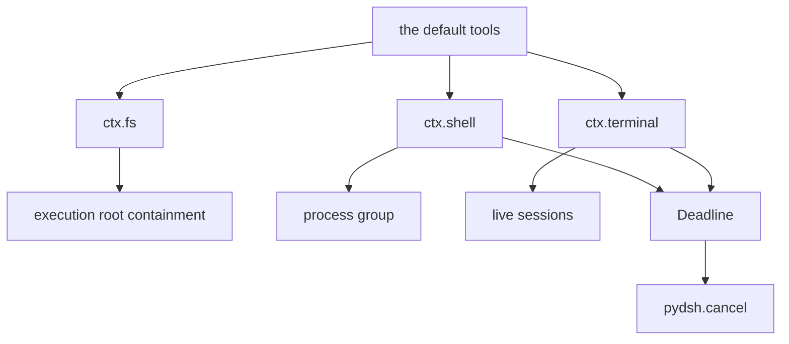
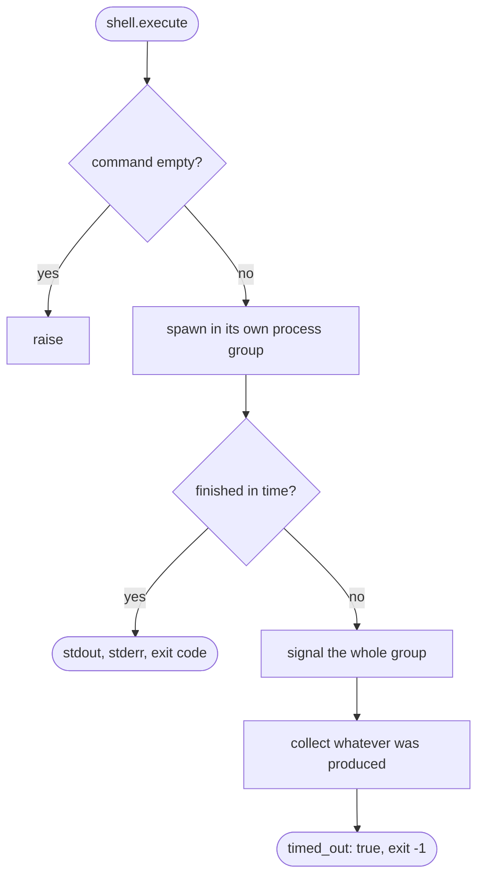
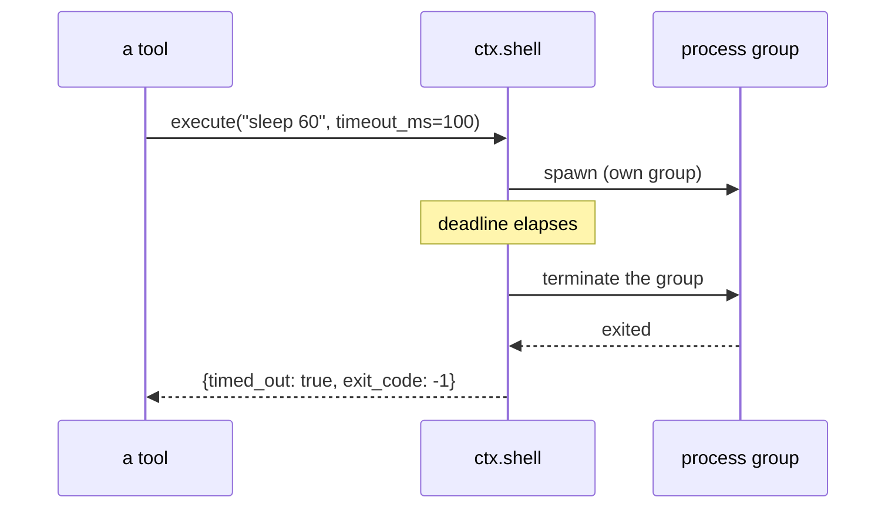
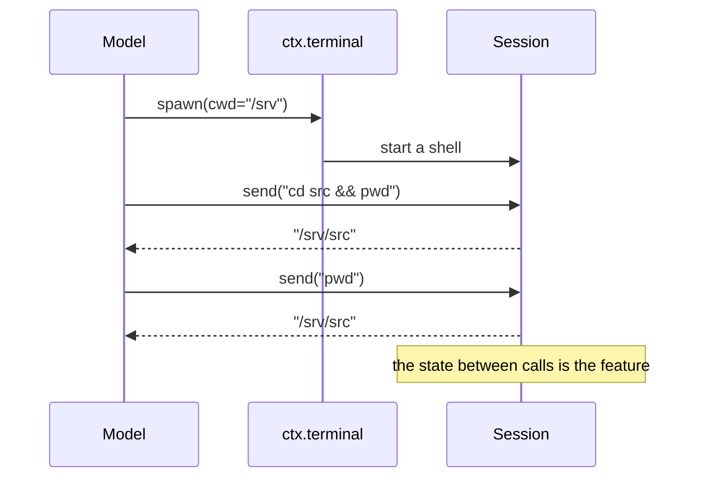

# Capability seams — the file system, a shell, a terminal, and a deadline

# 1 · Requirements

## Introduction

Everything so far is a conversation and its bookkeeping. Nothing yet *does*
anything: a model can ask for a tool, the loop will run it through plugkit's
pipeline, and there are no tools to run.

This sprint ports the three capability seams the default tools are built on —
`fs`, `shell`, `terminal` — plus the timeout primitive they all need. The tools
themselves come next; these are the seams under them, and keeping the two apart
is what lets a consumer swap a sandboxed file system in without touching the
tool a model sees.

They are also the first code here that touches the world outside the process,
which changes what "careful" means. Three of the reference's implementations
have defects that only matter because of that: a sandbox root that a symlink
walks straight out of, a whole-file read behind a byte budget that is applied
too late to help, and a killed process whose children survive it.

## Glossary

- **Execution root**: an optional directory every path must resolve inside.
- **Deadline**: a cancel signal that aborts itself after a bounded time, fused
  with whatever the caller already had.
- **Idle watchdog**: a deadline that re-arms on activity, so a slow-but-alive
  stream is not killed for being slow.
- **Terminal session**: a long-lived interactive shell, as opposed to `shell`'s
  one-shot execution.

## Mental Model & Invariants

**Model:**

- These seams provide *capability*, not *policy*. `shell` runs a command; it
  does not decide whether the command may run. That decision belongs to the
  tools pipeline's guards and approvers, which is where a consumer puts it.
- The file system is the one seam with a containment story of its own, because
  a path is the thing that escapes.
- A one-shot command and a persistent terminal are different services on
  purpose: one has no state between calls, and the other is nothing *but*
  state.

**Invariants:**

- **I1 — Containment survives symlinks.** A path is checked after the links
  are resolved, not before.
- **I2 — A bound is applied before the cost, not after.** A read limited to a
  megabyte does not first load a gigabyte.
- **I3 — Killing a command kills what it started.** A timed-out shell command
  does not leave its children running.
- **I4 — A timeout is distinguishable from a cancellation.** A caller can tell
  "you ran out of time" from "someone stopped you".
- **I5 — Every seam that opens something closes it**, including on the failure
  path and at unmount.

## Decisions & Corrections (log)

- 2026-08-25 — `spill`, `retention` and `tool_result_pruner` split into their
  own sprint: they are one family (what to do when output is too big), and
  belong together rather than scattered here.

## Dev Environment (config-as-code — pointers only)

- Deps: `pyproject.toml` (`uv sync`) · Gate: `uv run pytest tests -q`
- Reference: `services/fs.py`, `shell.py`, `terminal.py`, `util/timeout.py`

## Requirements

### Requirement 1: Path resolution and containment

#### Acceptance Criteria

1. THE FileSystem SHALL provide `ctx.fs` and resolve a relative path against a
   given working directory or the process's.
2. WHEN an execution root is configured, THE FileSystem SHALL reject a resolved
   path outside it.
3. THE containment check SHALL be made against the **fully resolved** path, so
   a symlink inside the root that points outside it is rejected (I1).
4. THE containment check SHALL resolve the root itself, so a root that is
   reached through a symlink still matches its own contents.
5. WHEN no root is configured, THE FileSystem SHALL resolve paths without
   restriction.
6. An empty path SHALL be rejected.

### Requirement 2: Reading

#### Acceptance Criteria

1. `read_text` SHALL return a line window: the path, the total line count, the
   numbered lines, and whether anything was truncated.
2. THE read SHALL stop once its byte budget is spent, **without having read the
   whole file first** (I2).
3. A line longer than the line limit SHALL be truncated and marked.
4. Reading a directory or a missing file SHALL raise distinguishable errors.
5. Invalid UTF-8 SHALL be replaced rather than raising, so one bad byte does
   not make a file unreadable.

### Requirement 3: Writing and editing

#### Acceptance Criteria

1. `write_text` SHALL replace a file atomically and report the bytes written.
2. `write_text` SHALL broadcast a write intent before writing, so a guard can
   observe it.
3. `edit_text` SHALL replace an exact string and SHALL raise when the old
   string is absent.
4. `edit_text` SHALL raise when the old string appears more than once, unless
   the caller asked to replace all — an ambiguous edit is a silent corruption.
5. `list` SHALL report each entry's name, whether it is a directory, and its
   size.
6. `info` SHALL report existence, kind, and size without raising for a missing
   path.

### Requirement 4: One-shot command execution

#### Acceptance Criteria

1. THE ShellService SHALL provide `ctx.shell` and run a command, returning the
   command, its stdout, its stderr, its exit code, and whether it timed out.
2. An empty command SHALL be rejected.
3. THE service SHALL merge caller-supplied environment over the process's.
4. WHEN a timeout elapses, THE service SHALL terminate the command **and every
   process it started** (I3), and report `timed_out`.
5. WHEN a cancel signal aborts, THE service SHALL terminate the command the
   same way and surface the cancellation.
6. THE service SHALL decode output as UTF-8 with replacement.

### Requirement 5: Persistent terminals

#### Acceptance Criteria

1. THE TerminalService SHALL provide `ctx.terminal`, spawning a named session
   with its own working directory.
2. `send` SHALL write a command and return the output that settles within a
   bounded wait.
3. `read_available` SHALL return output produced since the last read, without
   blocking.
4. A session SHALL report whether it is closed, and every call after close
   SHALL raise.
5. `close` SHALL terminate the session's process and be idempotent.
6. WHEN the service is unmounted, THE service SHALL close every session it
   spawned (I5).

### Requirement 6: Deadlines

#### Acceptance Criteria

1. `deadline(upstream, timeout_ms, code)` SHALL return a signal that aborts
   when either the upstream aborts or the time elapses.
2. THE abort reason for a timeout SHALL be identifiable as one, carrying the
   code and the elapsed bound (I4).
3. Disposing a deadline SHALL cancel its timer and be safe to repeat.
4. A non-positive timeout SHALL mean "no timer", forwarding the upstream alone.
5. `clamp_timeout` SHALL apply a default when nothing is requested, cap the
   result, and reject a non-positive request.
6. An idle watchdog SHALL re-arm on each activity, so time spent by the
   *consumer* is not counted against the producer.

### Non-Functional

- **NF 1**: stdlib only.
- **NF 2**: no blocking call on the event loop.
- **NF 3**: every limit is a named constant with a documented default (EP1).

## Out of Scope

- The tools themselves (`tool_fs`, `tool_bash`, `tool_terminal`) — these are
  the seams; the tools are the next sprint.
- `spill`, `retention`, `tool_result_pruner` — the large-output family, their
  own sprint.
- Sandboxing beyond a path root: no chroot, no container, no syscall filter.
  `shell` runs what it is given, and containment is the guard's job.

# 2 · Design

## End-to-End Walkthrough

A deployment mounts the capabilities, optionally rooted:

```python
await root.plugin(FileSystem, {"root": "/srv/workspace"})
await root.plugin(ShellService)
await root.plugin(TerminalService)
```

With a root configured, every path the file system touches must resolve inside
it. "Resolve" is the load-bearing word. Normalising `..` out of a path
lexically is not enough: a symlink *inside* the root pointing at `/etc` passes
a lexical check and then reads `/etc` anyway. So containment resolves the links
first, and compares real paths to a real root.

Reading returns a line window rather than a file. The budget matters as much as
the window: the reference reads the entire file into memory and *then* applies
a byte limit, which protects the model's context and not the process — a
gigabyte log still becomes a gigabyte in memory. Here the file is read line by
line and the read stops when the budget is spent, so the limit bounds the cost
rather than describing it.

`shell` runs one command and returns what it produced. The interesting path is
the timeout: killing the process is not enough, because a shell command that
started its own children leaves them running when it dies. The command runs in
its own process group and the whole group is signalled, so "the command timed
out" means the work actually stopped.

`terminal` is the opposite shape — a shell that stays alive between calls, so a
model can `cd` somewhere and have the next command land there. That state is
the whole feature and also the whole risk: the service owns every session it
spawned and closes them when it unmounts, because a leaked interactive shell
outlives the harness.

Underneath all three is `deadline`: a cancel signal fused from whatever the
caller already had plus a timer. Its reason is a *typed* timeout, so a caller
can tell "you ran out of time" from "someone pressed stop" — a distinction that
decides whether retrying makes sense.

## Tech Stack

- Python 3.13+, stdlib only (`asyncio`, `os`, `subprocess`, `pathlib`)
- Test command: `uv run pytest tests -q`

## Directory Structure

```
src/pydsh/capability/
  __init__.py
  timeout.py     # TimeoutReason, deadline, clamp_timeout, IdleWatchdog
  fs.py          # FileSystem (ctx.fs)
  shell.py       # ShellService (ctx.shell)
  terminal.py    # TerminalService (ctx.terminal), TerminalSession
tests/
  test_timeout.py
  test_fs.py
  test_shell.py
  test_terminal.py
```

## Architecture Overview



## Workflow



## Module Design

### `capability.timeout`

```
class TimeoutReason(Exception):  code, timeout_ms
clamp_timeout(requested, default, maximum, name) -> float
deadline(upstream, timeout_ms, code) -> Deadline   # context manager
class Deadline:  signal ; dispose()
class IdleWatchdog: signal ; touch() ; dispose()
timeout_of(value) -> TimeoutReason | None
```

### `capability.fs.FileSystem` — `provide = "fs"`

```
resolve(path, cwd=None) -> str
read_text(path, offset=1, limit=…, max_line_length=…, max_bytes=…) -> dict
write_text(path, content) -> dict
edit_text(path, old, new, replace_all=False) -> dict
list(path=".") -> list[dict] ; exists(path) -> bool ; info(path) -> dict
```

### `capability.shell.ShellService` — `provide = "shell"`

```
async execute(command, cwd=None, timeout_ms=None, env=None, signal=None) -> dict
```

### `capability.terminal`

```
class TerminalSession: id ; send(command, …) ; read_available() ; close() ; closed
class TerminalService(Service):   # provide = "terminal"
    spawn(id=None, cwd=None) -> TerminalSession
    get(id) ; list() ; close(id) ; close_all()
```

## Key Algorithms (pseudo-code)

```
ALGORITHM resolve (containment)
  input:  a path, an optional cwd, an optional execution root
  output: an absolute path known to be inside the root
  1. reject an empty path
  2. absolute <- normalise(cwd or process cwd, path)
  3. if no root: return absolute
  4. real     <- fully resolve symlinks in `absolute`
     real_root<- fully resolve symlinks in the root
     # Resolution, not normalisation. A symlink inside the root pointing at
     # /etc passes a lexical check and then reads /etc anyway.
  5. if real is not real_root and not under real_root + separator: reject
  6. return absolute
```

```
ALGORITHM read_text (bounded)
  1. resolve; reject a directory or a missing file
  2. budget <- max_bytes ; lines <- []
  3. stream the file line by line:
       count every line for `total_lines`
       skip lines before the window
       once the window is full, keep counting but stop collecting
       truncate an over-long line and mark it
       subtract the line's encoded size from the budget; when it would go
       negative, mark truncated and stop collecting
  # The budget is spent as the file is read, not after: a limit that is applied
  # to an already-loaded gigabyte protects the model and not the process.
```

```
ALGORITHM execute (with a real kill)
  1. reject an empty command
  2. spawn through the shell in its OWN process group (start_new_session)
  3. race communicate() against the deadline
  4. on timeout or cancellation:
       signal the whole process group, not just the leader
       # A shell command that started children leaves them running when only
       # the leader is killed, so "it timed out" would not mean it stopped.
       escalate to a kill if the group is still alive after a grace period
       collect whatever was produced and report timed_out
```

## Sequence Diagrams





## Data Models

No stores. These seams hold process handles and open files, which are
*resources* rather than state, and I5 is the rule that governs them.

## Error Handling Strategy

Distinguishable failures: a missing file, a directory where a file was
expected, a path outside the root, an ambiguous edit, and a timeout are each
their own error type. A caller deciding whether to retry needs to tell them
apart, and a single `OSError` for all of them makes that impossible.

## Testing Strategy

- **Integration**: real files in a temp directory, real subprocesses. A shell
  that is mocked proves nothing about process groups.
- **Property**: containment, including through a symlink actually created on
  disk — the defect this fixes is invisible to a test that only uses `..`.
- **Property**: a timed-out command's children are gone, checked by process
  liveness rather than by trusting the return value.

## Correctness Properties

### Property 1: A symlink does not escape the root
- **Statement**: *For any* symlink created inside the root pointing outside it,
  resolving through it is rejected.
- **Validates**: 1.3 (I1)

### Property 2: A bounded read is bounded in cost
- **Statement**: *For any* file larger than the byte budget, the read returns
  without having materialised the whole file.
- **Validates**: 2.2 (I2)

### Property 3: A timed-out command leaves nothing running
- **Statement**: *For any* command that spawns a child and outlives its
  timeout, no descendant is alive afterwards.
- **Validates**: 4.4 (I3)

## Edge Cases

- **A root that is itself a symlink** — resolved on both sides, so its own
  contents still match.
- **A path that does not exist yet, under a root** — containment resolves the
  existing prefix, so writing a new file inside the root is allowed.
- **A file with no trailing newline** — the last line is still a line.
- **A command that writes a great deal and then hangs** — the timeout still
  fires, and what was produced is still returned.
- **`edit_text` where old and new are identical** — rejected: it is a no-op
  the caller almost certainly did not mean.
- **A terminal session whose shell dies on its own** — reported closed rather
  than hanging the next `send`.

## Decisions

### Decision: containment resolves symlinks
**Context:** the reference checks `os.path.abspath(...)` against the root with
`startswith`. `abspath` normalises `..` lexically and does **not** resolve
symlinks, so a link inside the root pointing at `/etc` passes the check.
**Decision:** compare fully resolved paths on both sides.
**Rationale:** the root exists to contain; a containment check a symlink walks
out of is decoration. This is the one seam where a path is the thing that
escapes, so it is the one place the check has to be real.

### Decision: reads stream, and the budget is spent as they go
**Context:** the reference does `f.read()` then applies `max_bytes`.
**Decision:** stream lines and stop when the budget is gone.
**Rationale:** as written the limit bounds what the *model* sees while the
process still loads the whole file. A limit that does not bound the cost is a
description, not a limit.

### Decision: a timeout kills the process group
**Context:** the reference calls `proc.kill()`, which signals only the shell it
spawned. A command like `sleep 60 & sleep 60` leaves children behind.
**Decision:** spawn detached into its own group and signal the group, escalating
from terminate to kill after a grace period.
**Rationale:** otherwise "the command timed out" does not mean the work stopped,
and the harness accumulates orphans across a long-running session.

### Decision: `_command_line` is not ported
**Context:** the reference builds a quoted shell invocation in `_command_line`
and then never calls it — `execute` passes the raw command to
`create_subprocess_shell`.
**Decision:** drop it.
**Rationale:** dead code is a lie (axiom 5), and this particular dead code is a
hand-rolled shell-quoting routine — the kind of thing a reader would assume is
load-bearing and copy.

### Decision: `shell` provides capability, not policy
**Context:** the service runs an arbitrary command string. That looks like an
injection sink.
**Decision:** keep it, and say plainly that it is one.
**Rationale:** running a command *is* the capability, and the reference is the
same. Containment belongs to the tools pipeline — plugkit's guards and
approvers — which is where a consumer can express "not this command, not from
this caller". Putting a half-policy here would give the appearance of safety
while the real decision has nowhere to live.

### Decision: a terminal read ends on a sentinel, not on silence
**Context:** the reference reads until output goes quiet for a settle interval.
That cannot distinguish "this command produced nothing" from "this command has
not started yet", so `cd` — which prints nothing at all — waits out the entire
timeout. The first test run took ten seconds for fifteen assertions, which is
what surfaced it.
**Decision:** each command is followed by an echo of a unique marker, and the
read ends when the marker arrives.
**Rationale:** the marker's arrival *is* the end of the command, so there is
nothing to infer. A silent command returns at once and a long one is still
bounded by the wait.

## Security Considerations

`ctx.shell` and `ctx.terminal` execute arbitrary commands with the harness's
own privileges. That is the point of them, and it means **a deployment that
exposes them to a model without a guard has given the model its shell**. The
protections that belong here are the ones about *containment of paths* (I1) and
*not leaking processes* (I3); the protection about *which commands may run at
all* belongs to the tools pipeline, and the sprint that ports the tools carries
the guards that use it.

# 3 · Tasks

## Status marks
<!-- [ ] pending | [x] done | [!] BLOCKED: reason | [-] DROPPED: <reason> |
     [>] → <spec_id> -->

## Tasks

- [x] 1. Foundation
  - [x] 1.1 `capability/timeout.py` — TimeoutReason, clamp, deadline, watchdog
    - **Requirements**: 6.1–6.6

- [x] 2. Seams
  - [x] 2.1 `capability/fs.py` — resolution with real containment
    - **Depends**: —
    - **Requirements**: 1.1–1.6
    - **Properties**: 1
  - [x] 2.2 Reading: a streamed, genuinely bounded window
    - **Depends**: 2.1
    - **Requirements**: 2.1–2.5
    - **Properties**: 2
  - [x] 2.3 Writing, editing, listing
    - **Depends**: 2.1
    - **Requirements**: 3.1–3.6
  - [x] 2.4 `capability/shell.py` — execution, deadline, group kill
    - **Depends**: 1.1
    - **Requirements**: 4.1–4.6
    - **Properties**: 3
  - [x] 2.5 `capability/terminal.py` — persistent sessions and their lifetime
    - **Depends**: 1.1
    - **Requirements**: 5.1–5.6
  - [x] 2.6 Export surface
    - **Depends**: 2.5

- [x] 3. Tests
  - [x] 3.1 `test_timeout.py`
    - **Depends**: 1.1
    - **Requirements**: 6.1–6.6
  - [x] 3.2 `test_fs.py` — containment through a real symlink, bounded reads,
        ambiguous edits
    - **Depends**: 2.3
    - **Requirements**: 1.1–1.6, 2.1–2.5, 3.1–3.6
    - **Properties**: 1, 2
  - [x] 3.3 `test_shell.py` — real subprocesses, and a child that must die
    - **Depends**: 2.4
    - **Requirements**: 4.1–4.6
    - **Properties**: 3
  - [x] 3.4 `test_terminal.py` — state between calls, close, unmount
    - **Depends**: 2.5
    - **Requirements**: 5.1–5.6

- [x] 4. Wrap
  - [x] 4.1 README
    - **Depends**: 3.4
  - [x] 4.2 Close the sprint
    - **Depends**: 4.1

## Log

**[2026-08-25]** — Created and activated. The large-output family (`spill`,
`retention`, `tool_result_pruner`) split into its own sprint.

**[2026-08-25]** — CLOSED / SHIPPED. All tasks done, 557 tests green, up from
477.

Three reference defects fixed, each recorded in Decisions, and each one only
matters because this is the first code here that touches the world outside the
process:

- Containment was checked with `os.path.abspath`, which normalises `..` and
  does **not** resolve symlinks. A link inside the execution root pointing at
  `/etc` passed the check and then read `/etc`. `test_fs.py` creates a real
  symlink, because the defect is invisible to a test that only tries `..`.
- A read applied its byte budget *after* loading the whole file, so the limit
  bounded what the model saw and not what the process cost. Reads stream now.
- A timeout called `proc.kill()`, which signals only the shell. Anything it
  started kept running, so "the command timed out" did not mean the work
  stopped. Commands now run in their own process group and the group is
  signalled; the test asks the OS whether the child is alive rather than
  trusting the return value.

A fourth was found by the tests being slow rather than by reading: a terminal
read that waits for silence pays the full timeout for any command that prints
nothing. Replaced with a sentinel.

`_command_line` was not ported — the reference builds a quoted shell invocation
there and never calls it. Dead code is a lie, and hand-rolled shell quoting is
exactly the kind a reader assumes is load-bearing.
