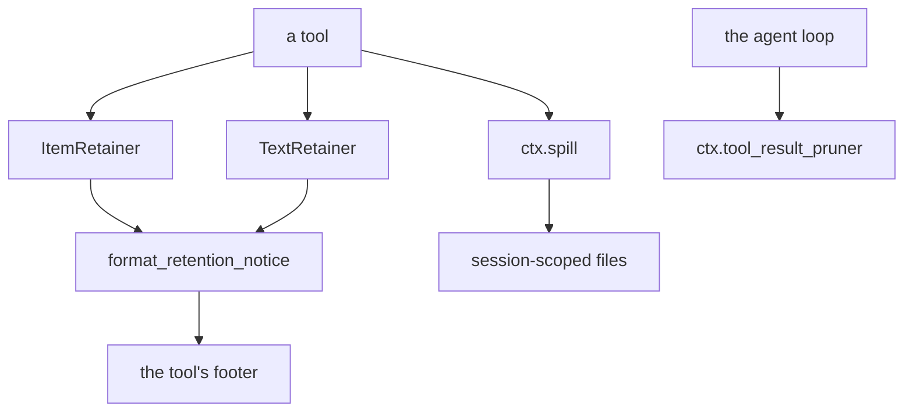
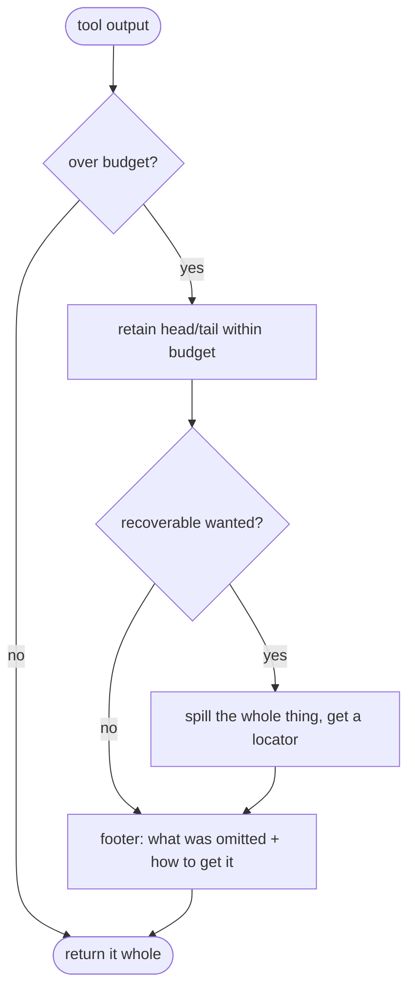
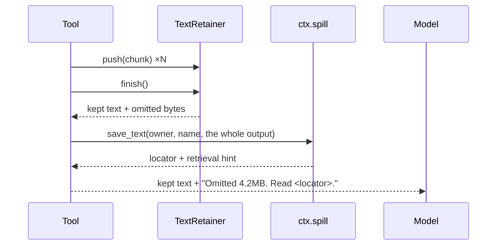

# Bounded output — keeping what matters when there is too much

# 1 · Requirements

## Introduction

A tool that lists a directory can return ten entries or ten thousand. One that
greps a repository can return a line or a hundred megabytes. The model has a
finite context and the harness has finite memory, and neither can be protected
by hoping tools are well behaved.

Three related answers, which is why they are one sprint:

- **Retention** bounds a stream as it arrives — keep the first N items, or the
  first and last N bytes, and count what was dropped exactly.
- **Spill** puts the whole output somewhere the model can go back to, and hands
  back a locator instead of the content.
- **Pruning** cuts the middle out of a tool result that is already too large,
  deterministically, keeping the head and the tail.

The thread joining them is honesty about loss. Every one of these reports what
it dropped, in its own units, and never rounds "some" into silence. A truncated
result that does not say it was truncated is worse than no result, because the
model reasons confidently from a fragment.

## Glossary

- **Omitted**: what was dropped, as a value — nothing, an exact count, or an
  unknown amount. Never a bare boolean.
- **Retainer**: a bounded accumulator fed a stream, asked at the end what it
  kept.
- **Spill**: writing an oversized output to a session-scoped file and returning
  its locator.
- **Prune**: replacing the middle of an over-budget result with a marker.

## Mental Model & Invariants

**Model:**

- A retainer counts and keeps. It does not sort, group, format, or decide what
  the loss *means* — those belong to the tool, which knows its domain.
- The library owns the wording of *what was omitted*; the tool owns the wording
  of *how to get it back*. Only the tool knows whether the answer is "narrow
  your pattern" or "read this file".
- Pruning is deterministic. The same result pruned twice gives the same text,
  because a replay that produced a different history would not be a replay.

**Invariants:**

- **I1 — Loss is always reported.** Anything that drops data says so, and says
  how much when it can.
- **I2 — A cut never leaves a broken character.** Byte-oriented retention
  trims to a UTF-8 boundary, so a truncation cannot introduce a replacement
  character of its own making.
- **I3 — Memory is bounded by the budget, not by the input.** A retainer given
  a gigabyte holds its budget, not the gigabyte.
- **I4 — Pruning shrinks.** A prune that produced something no smaller than
  what it replaced is a bug, and fails rather than passes it on.
- **I5 — A spill is scoped to its session** and cannot be written outside it.

## Decisions & Corrections (log)

- 2026-08-25 — `prune_session` deferred: it rewrites the session surface
  through `surfaceOp: replace`, which spec 01 defined and did not implement.
  It lands with compaction, whose whole purpose is that machinery.

## Dev Environment (config-as-code — pointers only)

- Deps: `pyproject.toml` (`uv sync`) · Gate: `uv run pytest tests -q`
- Reference: `util/retention.py`, `services/spill.py`, `spill_local.py`,
  `tool_result_pruner.py`

## Requirements

### Requirement 1: The omitted vocabulary

#### Acceptance Criteria

1. THE library SHALL express what was dropped as one of: nothing, an exact
   count, or an unknown amount.
2. `describe_omitted` SHALL render each case in words, and render "nothing" as
   the empty string.
3. `describe_omitted` SHALL NOT claim a number it does not have — an unknown
   amount reads as "more were omitted", never as a guess.

### Requirement 2: Item retention

#### Acceptance Criteria

1. `ItemRetainer(max_items)` SHALL keep the first `max_items` items pushed and
   count the rest.
2. `push` SHALL report whether the item was kept and whether anything has been
   dropped so far.
3. `finish` SHALL report the kept items, how many were seen, how many were
   kept, and the exact omitted count (I1).
4. A negative or non-integer budget SHALL be rejected.
5. A budget of zero SHALL keep nothing and count everything as omitted.

### Requirement 3: Text retention

#### Acceptance Criteria

1. `TextRetainer` SHALL support head, tail, and head-and-tail strategies, each
   budgeted in **bytes** — the unit that bounds memory.
2. `push` SHALL accept bytes or text, and SHALL hold no more than the budget
   however much is pushed (I3).
3. `finish` SHALL decode what was kept and report the omitted byte count.
4. WHEN anything was omitted, each cut SHALL be trimmed to a UTF-8 boundary, so
   the returned text carries no replacement character introduced by the cut
   itself (I2).
5. WHEN nothing was omitted, the head and tail SHALL be decoded together, since
   they are adjacent slices of one stream and a character may span the split.
6. THE reported omitted count SHALL include bytes dropped by boundary trimming,
   not only by the budget.

### Requirement 4: Retention notices

#### Acceptance Criteria

1. `format_retention_notice` SHALL join the library's omission clause with a
   caller-supplied recovery clause.
2. THE library SHALL NOT author recovery wording — the caller receives the
   whole notice and returns its own sentence.
3. Either half being empty SHALL produce a clean result with no stray spacing.

### Requirement 5: Spilling

#### Acceptance Criteria

1. THE SpillStore SHALL provide `ctx.spill` and save text to a session-scoped
   artifact, returning a locator, the byte count, and a retrieval hint.
2. Session ids and suggested names SHALL be encoded so that no value can escape
   the spill root (I5).
3. A save failure SHALL raise rather than silently returning nothing — the
   caller decides how to degrade.
4. THE store SHALL be an interface with a local-filesystem implementation, so a
   consumer can put spills elsewhere.

### Requirement 6: Tool-result pruning

#### Acceptance Criteria

1. THE pruner SHALL provide `ctx.tool_result_pruner` with configurable
   threshold, head, and tail budgets in characters.
2. Configuration SHALL be rejected when a budget is not a positive (or, for
   head/tail, non-negative) integer, when a key is unknown, or when head plus
   the marker plus tail would exceed the threshold.
3. `measure_content` SHALL count the characters of text blocks and ignore
   non-text ones.
4. `prune_content` SHALL return `None` when content is within budget.
5. WHEN over budget, `prune_content` SHALL keep the head and tail characters,
   replace the middle with a marker, and preserve non-text blocks in order.
6. `prune_content` SHALL raise if the result is not smaller than the original
   or still exceeds the threshold (I4).
7. Pruning SHALL be deterministic: the same input gives the same output.

### Non-Functional

- **NF 1**: stdlib only.
- **NF 2**: every budget is a named constant with a documented default (EP1).

## Out of Scope

- `prune_session` — rewriting the session surface needs `surfaceOp: replace`,
  which is compaction's machinery. `[>] → 10-compaction`.
- `spill_policy` — the plugin that decides *when* to spill a tool result. It
  hooks `tools/post-execute`, which is the tool sprint's territory.
- Deciding what a tool does with a notice; the library supplies the clause.

# 2 · Design

## End-to-End Walkthrough

A `grep` tool is about to return more than anyone wants. It pushes matches
through an `ItemRetainer` budgeted at 200:

```python
retainer = ItemRetainer(200)
for match in matches:
    retainer.push(match)
kept = retainer.finish()
```

`kept` carries the items, how many were seen, and the exact omitted count. The
tool then writes its footer with the two halves that belong to two different
owners:

```python
format_retention_notice(
    {"omitted": kept["omitted"], "unit": "matches", **kept},
    recovery=lambda notice: "Narrow the pattern, or grep the spilled file.",
)
# "Omitted 4812 matches. Narrow the pattern, or grep the spilled file."
```

The library wrote the first sentence and could not have written the second: it
does not know that this tool has a pattern to narrow. That split is deliberate,
and it is why the recovery clause is a callback rather than a config string.

For raw output rather than items, `TextRetainer` bounds *bytes* — the unit that
bounds memory. Bytes bring a hazard: a cut can land in the middle of a UTF-8
character, and decoding then produces a replacement character that was never in
the data. So each cut is trimmed back to a boundary, and the omitted count
includes what the trimming dropped. When nothing was omitted at all, the head
and tail are decoded *together*, because they are adjacent slices of one stream
and the split between them is arbitrary — a character can span it.

When the output should be recoverable rather than merely summarised, the tool
spills it: the whole text goes to a session-scoped file and the tool returns a
locator plus a hint about how to read it. The model gets a path it can grep
instead of a wall of text it cannot.

Pruning is the last resort, for a result that is already assembled and still
too big. It keeps the head and the tail and replaces the middle with a marker,
walking the content blocks so non-text blocks survive in place. It is
deterministic — a replay that produced different history would not be a replay
— and it verifies its own work: a prune whose output is not smaller than its
input raises, because passing that on would mean the budget silently did
nothing.

## Tech Stack

- Python 3.13+, stdlib only
- Test command: `uv run pytest tests -q`

## Directory Structure

```
src/pydsh/bounded/
  __init__.py
  omitted.py     # the Omitted vocabulary + describe/format
  retention.py   # ItemRetainer, TextRetainer
  spill.py       # SpillStore (interface) + LocalSpillStore
  pruner.py      # ToolResultPruner
tests/
  test_retention.py
  test_spill.py
  test_pruner.py
```

## Architecture Overview



## Workflow



## Module Design

### `bounded.omitted`

```
omitted_none() / omitted_exact(count) / omitted_unknown() -> dict
describe_omitted(omitted, unit) -> str
format_retention_notice(notice, recovery) -> str
```

### `bounded.retention`

```
class ItemRetainer:  push(item) -> dict ; finish() -> dict
class TextRetainer:  TextRetainer.head(n) / .tail(n) / .head_tail(h, t)
                     push(chunk) -> dict ; finish() -> dict
```

### `bounded.spill`

```
class SpillStore(Service):    # provide = "spill"
    async save_text(owner, suggested_name, content) -> dict   # abstract
class LocalSpillStore(SpillStore):  root
```

### `bounded.pruner.ToolResultPruner` — `provide = "tool_result_pruner"`

```
measure_content(blocks) -> int
prune_content(blocks) -> list | None
```

## Key Algorithms (pseudo-code)

```
ALGORITHM TextRetainer.push (bounded memory — I3)
  1. total += len(chunk)
  2. head: take only up to the remaining head budget
  3. tail: append the chunk, then drop leading chunks that have slid entirely
     out of the last `tail_cap` bytes, then trim the leading bytes of the
     chunk that is only partly inside the window
     # Without that final trim a single chunk larger than the window is held
     # whole, and the accumulator is bounded by the *input* rather than the
     # budget — which is the thing this class exists to prevent.
```

```
ALGORITHM TextRetainer.finish (UTF-8 safety — I2)
  1. head_len <- min(total, head_cap) ; tail_len <- min(total - head_len, tail_cap)
  2. if nothing was omitted:
       decode head + tail TOGETHER
       # They are adjacent slices of one stream; the split is arbitrary and a
       # character can span it. Decoding separately would break that character
       # for no reason at all.
  3. else:
       trim the head back past any trailing partial character
       trim the tail forward past any leading continuation byte
       decode each, concatenate
       omitted <- total - len(kept head) - len(kept tail)
       # Counting the boundary trim too, so the number is what was really lost.
```

```
ALGORITHM prune_content
  1. total <- characters across text blocks ; if within threshold: return None
  2. removed <- [head_chars, total - tail_chars)
  3. walk the blocks, tracking the character offset:
       non-text block -> keep as is, in place
       text block     -> keep the part before `removed`, insert the marker once
                         at the first block that overlaps it, keep the part after
  4. verify the result is smaller AND within the threshold, else raise (I4)
```

## Sequence Diagrams



## Data Models

One new store:

| Store | Writer | Source of truth? | Read path | Retention | Reproducible? |
|---|---|---|---|---|---|
| spill artifacts | the spill store, per session | **yes** for the spilled text | the locator, read back through `fs` | until the consumer clears the session's directory | no — it is the only copy of what was too big to keep |

Worth stating plainly: a spill is *not* derived. The whole point is that the
content is not anywhere else, which makes its retention the consumer's problem
rather than something this layer can quietly clean up.

## Error Handling Strategy

Retention never fails — it is arithmetic over a stream. Spilling fails loudly,
because a caller that thinks it saved the output and did not will hand the
model a locator pointing at nothing. Pruning verifies its own result and fails
rather than emitting something that did not shrink.

## Testing Strategy

- **Property**: bounded memory, by pushing far more than the budget and
  checking what is held.
- **Property**: a multi-byte character split across chunk boundaries survives,
  and a cut through one never produces a replacement character.
- **Unit**: pruning determinism and the shrink check.

## Correctness Properties

### Property 1: A retainer holds its budget, not its input
- **Statement**: *For any* input size, the bytes retained never exceed the
  configured budget.
- **Validates**: 3.2 (I3)

### Property 2: A cut never breaks a character
- **Statement**: *For any* cut position in multi-byte text, the returned text
  contains no replacement character that the input did not.
- **Validates**: 3.4 (I2)

### Property 3: Pruning shrinks or fails
- **Statement**: *For any* content it prunes, the result is strictly smaller
  and within the threshold, or it raises.
- **Validates**: 6.6 (I4)

## Edge Cases

- **A single chunk larger than the whole tail window** — trimmed to the window,
  not held whole.
- **A character spanning the head/tail split with nothing omitted** — decoded
  together, so it survives.
- **Content whose text is entirely inside the removed middle** — the block
  collapses away and the marker appears once.
- **A prune where head and tail budgets are zero** — everything but the marker
  goes; still smaller, so still valid.
- **A suggested spill name with slashes or dots** — encoded, so it cannot climb
  out of the session directory.
- **An item budget of zero** — keeps nothing, and says how many it dropped.

## Decisions

### Decision: omission is a value, not a boolean
**Context:** the obvious signature is `truncated: bool`.
**Decision:** an `Omitted` value — nothing, an exact count, or unknown.
**Rationale:** "some were omitted" and "4812 were omitted" are different facts,
and so is "we know we lost some but not how many". A boolean throws all three
into one bucket, and the wording downstream then either invents precision it
does not have or discards precision it does.

### Decision: the library writes the loss, the caller writes the recovery
**Context:** it would be simpler for `format_retention_notice` to take a string.
**Decision:** it takes a callback that receives the whole notice.
**Rationale:** only the tool knows what the user should *do* — "narrow the
pattern", "request a more specific URL", "read the spilled file". A config
string cannot vary with what was actually kept, and a library sentence would be
generic exactly where it needs to be specific.

### Decision: text retention is budgeted in bytes, items in items
**Context:** characters would be friendlier for text.
**Decision:** bytes.
**Rationale:** the budget exists to bound memory and payload size, and both are
measured in bytes. A character budget over unpredictable input does not bound
either — which is the whole job.

### Decision: `finish` computes its omitted count in one place
**Context:** the reference binds `kept_prefix`/`kept_suffix` inside a branch and
then reads them in a conditional expression outside it. It works, because the
condition is evaluated first — and it breaks the moment anyone reorders the
expression.
**Decision:** compute the kept slices unconditionally and derive the count from
them.
**Rationale:** correct-by-coincidence is a defect waiting for a refactor, and
this one would fail as a `NameError` far from the change that caused it.

## Security Considerations

Spill paths are built from encoded segments so neither a session id nor a
suggested name can traverse out of the spill root. Spilled content is whatever
a tool produced — potentially secrets a command printed — so the root is
private to the process owner and a consumer that needs stricter handling
implements the store interface itself.

# 3 · Tasks

## Status marks
<!-- [ ] pending | [x] done | [!] BLOCKED: reason | [-] DROPPED: <reason> |
     [>] → <spec_id> -->

## Tasks

- [x] 1. Retention
  - [x] 1.1 `bounded/omitted.py` — the vocabulary and its wording
    - **Requirements**: 1.1–1.3, 4.1–4.3
  - [x] 1.2 `bounded/retention.py` — ItemRetainer
    - **Depends**: 1.1
    - **Requirements**: 2.1–2.5
  - [x] 1.3 TextRetainer — bounded memory and UTF-8 boundaries
    - **Depends**: 1.2
    - **Requirements**: 3.1–3.6
    - **Properties**: 1, 2

- [x] 2. Spill and prune
  - [x] 2.1 `bounded/spill.py` — the store interface and the local backend
    - **Requirements**: 5.1–5.4
  - [x] 2.2 `bounded/pruner.py` — config, measure, prune
    - **Requirements**: 6.1–6.7
    - **Properties**: 3
  - [x] 2.3 Export surface
    - **Depends**: 2.2

- [x] 3. Tests
  - [x] 3.1 `test_retention.py`
    - **Depends**: 1.3
    - **Requirements**: 1.1–1.3, 2.1–2.5, 3.1–3.6, 4.1–4.3
    - **Properties**: 1, 2
  - [x] 3.2 `test_spill.py`
    - **Depends**: 2.1
    - **Requirements**: 5.1–5.4
  - [x] 3.3 `test_pruner.py`
    - **Depends**: 2.2
    - **Requirements**: 6.1–6.7
    - **Properties**: 3

- [x] 4. Wrap
  - [x] 4.1 README
    - **Depends**: 3.3
  - [x] 4.2 Close the sprint
    - **Depends**: 4.1

## Log

**[2026-08-25]** — Created and activated. `prune_session` deferred to the
compaction sprint, which owns the surface-replacement machinery it needs.

**[2026-08-25]** — CLOSED / SHIPPED. All tasks done, 609 tests green, up from
557.

The reference's `finish()` binds its kept slices inside a branch and reads them
in a conditional expression outside it. It works — the condition is evaluated
first — and it would fail as a `NameError` the moment anyone reordered the
expression, far from the change that caused it. Restructured so the count comes
from the slices unconditionally.

The rest of the sprint was porting rather than repairing. The two properties
worth having are both tested against inputs that would expose their absence: a
megabyte pushed through a twenty-byte budget, holding twenty bytes; and a cut
landing inside a three-byte character, returning no replacement character of
its own making.

`prune_session` is deferred with a destination — it rewrites the surface
through `surfaceOp: replace`, which spec 01 defined and left unimplemented, and
which compaction exists to provide. Renumbered the route so compaction is the
next sprint, since it now blocks two things rather than one.
