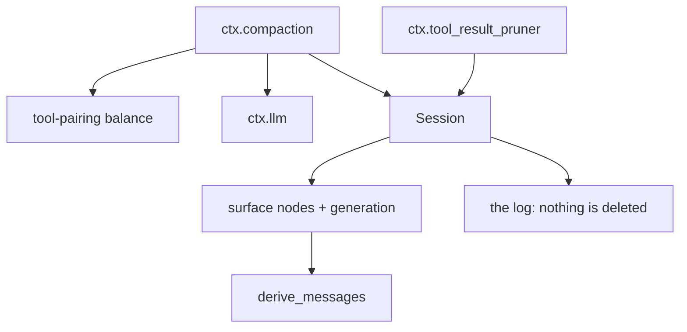
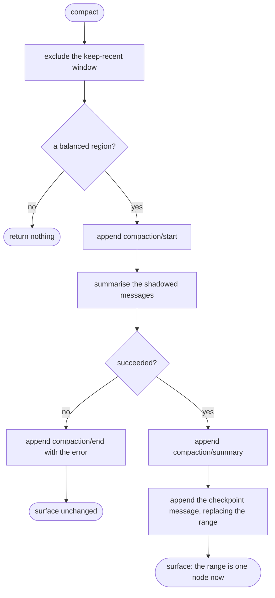
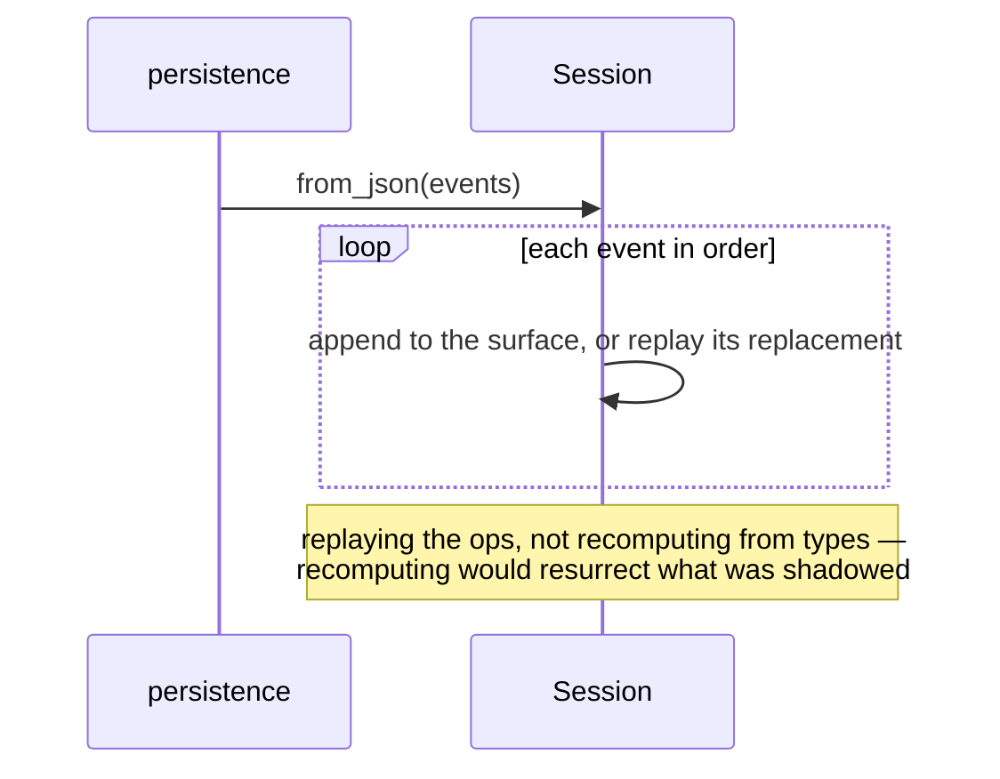

# Compaction — replacing history without losing it

# 1 · Requirements

## Introduction

A long conversation eventually exceeds what a model can be given. The answer is
not to forget the beginning; it is to *replace* a stretch of it with a summary,
while the original stays in the log exactly where it was.

That is what the surface has been for since spec 01. The log is append-only and
immutable; the **surface** is the projection of it the model sees. Compaction
appends one new event and declares that it shadows a range of surface nodes.
Nothing is deleted, nothing is rewritten, and a reader who wants the original
still has it.

Spec 01 defined `surface_op` and `source_event_seqs` and implemented only
`append`. Two things now wait on the other half, which is why this sprint moved
up the queue: compaction itself, and `prune_session` from sprint 09.

The constraint that shapes everything here is **tool pairing**. A cut that
separates a tool call from its result leaves the model looking at a request
that was never answered — which most providers reject outright, and which no
amount of good summarising repairs. So a region may only be replaced if both
its edges are balanced.

## Glossary

- **Surface**: the ordered model-visible projection of the log.
- **Shadowed**: a surface node replaced by a later one. Still in the log,
  no longer in the projection.
- **Replace generation**: a counter bumped on every replacement, so anything
  caching a surface can tell it is stale.
- **Balanced cut**: a point in the surface where no tool call is still waiting
  for its result.
- **Checkpoint message**: the user-role message carrying a summary, which takes
  the place of everything it shadows.

## Mental Model & Invariants

**Model:**

- The log never changes. Compaction is an *append* that says "from here on,
  read these nodes as this one instead".
- The surface is derived, and after a replacement its sequence numbers are no
  longer monotonic — a later event sits where an earlier range used to be.
- A summary is content like any other. It is a user-role message on the
  surface, so nothing downstream needs to know it was produced by compaction.
- Provenance is kept: the replacing event names every event it descends from.

**Invariants:**

- **I1 — Nothing is deleted.** Every original event stays in the log, readable
  by sequence, after any number of compactions.
- **I2 — A replacement never splits a tool pair.** Both edges of a replaced
  region are balanced cuts, or the replacement is refused.
- **I3 — The surface survives a reload.** Rebuilding a session from storage
  reproduces the compacted surface, not the pre-compaction one.
- **I4 — A replacement is atomic on the surface.** The range goes and the new
  node arrives in one step; there is no moment where the surface is missing
  both.
- **I5 — A failed compaction leaves the surface untouched.** The lifecycle
  records the attempt; the projection is unchanged.

## Decisions & Corrections (log)

- 2026-08-25 — moved ahead of the tool sprint: it unblocks two consumers.

## Dev Environment (config-as-code — pointers only)

- Deps: `pyproject.toml` (`uv sync`) · Gate: `uv run pytest tests -q`
- Reference: `services/session.py` (`_apply_surface_replace`),
  `compaction.py`, `compaction_basic.py`, `tool_result_pruner.py`

## Requirements

### Requirement 1: Surface replacement

#### Acceptance Criteria

1. `Session.append` SHALL accept a surface operation naming a range of surface
   node sequence numbers to replace.
2. THE replacement SHALL substitute the new event's sequence for every surface
   node in that range, in one step (I4).
3. THE replaced events SHALL remain in the log, unchanged and readable (I1).
4. THE session SHALL expose a replace generation that increases on every
   replacement, so a cached surface can be recognised as stale.
5. THE session SHALL record, per replacement, the new node and the nodes it
   shadowed.
6. A replacement naming a range with no surface nodes in it SHALL raise.
7. A replacement on a non-surface event type SHALL raise, since only surface
   events have a place in the projection.
8. `derive_messages` SHALL follow the current surface, so a compacted session
   yields the summary and not what it shadowed.

### Requirement 2: Surviving a reload

#### Acceptance Criteria

1. `to_json` SHALL carry each event's surface operation and source sequences.
2. `from_json` SHALL rebuild the surface by replaying those operations in
   order, rather than recomputing it from event types (I3).
3. A reloaded compacted session SHALL derive the same messages as the live one.
4. THE replace generation SHALL be restored, so a cache built before a reload
   is not mistaken for a current one.
5. THE SQLite backend SHALL round-trip a compacted session unchanged.

### Requirement 3: Tool-pairing balance

#### Acceptance Criteria

1. THE module SHALL compute, for each surface node, whether the cut before it
   and the cut after it are balanced.
2. A cut is balanced when no tool call before it is still awaiting its result.
3. An assistant message SHALL raise the count by the number of tool calls it
   contains; a tool result SHALL lower it by one.
4. IF the running count goes negative, THE module SHALL raise — a result with
   no call means the surface is corrupt.
5. THE computation SHALL be cached per session and invalidated by the replace
   generation.
6. Asking about a sequence not on the current surface SHALL raise.

### Requirement 4: The compaction engine

#### Acceptance Criteria

1. THE engine SHALL be an interface providing `ctx.compaction`, with
   `compact_region`, `compact_now`, and `compact_if_needed`.
2. `compact_region(start, end)` SHALL refuse a region whose edges are not both
   balanced cuts (I2).
3. `compact_region` SHALL refuse an empty or inverted region.
4. A compaction SHALL append a start record, a summary record, and the
   replacing checkpoint message, in that order.
5. THE checkpoint message SHALL name, as its source events, the start record,
   the summary record, and every shadowed event.
6. WHEN summarising fails, THE engine SHALL append an end record carrying the
   error and SHALL leave the surface unchanged (I5).
7. `compact_if_needed` SHALL do nothing when the session is below its
   configured threshold.
8. `compact_now` SHALL compact regardless of the threshold, and SHALL return
   nothing when no balanced region exists.
9. THE engine SHALL keep a configurable number of recent surface nodes out of
   any compaction, so the newest exchanges are never summarised away.

### Requirement 5: Pruning a session

#### Acceptance Criteria

1. `prune_session` SHALL replace each over-budget tool result on the current
   surface with its pruned form.
2. Candidates SHALL be fixed before any replacement is made, so the walk is not
   disturbed by its own writes.
3. THE replacement for a tool result SHALL shadow exactly that node.
4. `prune_session` SHALL report what it pruned and how many characters went.
5. A failure partway SHALL leave the replacements already made in place — they
   are independent, and undoing a durable append is not possible.

### Non-Functional

- **NF 1**: stdlib only in the session layer; the engine calls `ctx.llm`.
- **NF 2**: balance computation is O(surface) once per generation, not per query.

## Out of Scope

- Choosing *what* to summarise beyond "the oldest balanced region outside the
  keep-recent window". A smarter selector is a different engine, which is what
  the interface is for.
- Sub-agent or forked-session compaction.
- `command_compact` — the slash command, which belongs with the plugins.

# 2 · Design

## End-to-End Walkthrough

A conversation has run long. The engine is asked to compact:

```python
result = await root.compaction.compact_now(agent)
```

First it decides *what* it may touch. The most recent exchanges are off limits
— summarising the thing the user just said would be absurd — so a keep-recent
window is excluded. Within what remains it looks for a region whose edges are
**balanced cuts**.

That is the constraint everything else bends around. Walking the surface,
an assistant message that requests three tool calls raises the count of
outstanding calls by three; each tool result lowers it by one. A cut where the
count is zero is safe. A cut where it is not would put a tool call on one side
and its answer on the other, and the model would be shown a request that was
never answered — which providers reject and no summary repairs.

Having chosen a region, the engine appends a `compaction/start` record, asks
the model to summarise the shadowed messages, appends a `compaction/summary`
record with the provenance, and finally appends the **checkpoint message**: a
user-role message carrying the summary, with a surface operation saying it
replaces that range.

That last append is the whole mechanism. The log grows by one event; the
surface loses the range and gains the new node in its place; the replace
generation ticks so any cached view knows it is stale. Nothing was deleted —
every shadowed event is still in the log at its original sequence, and the
checkpoint message names them all as its sources, so "what did this summary
replace" is answerable forever.

Reloading has one trap worth naming. Spec 01 rebuilt the surface by collecting
every event whose *type* is a surface type — which after a compaction would
resurrect exactly what was shadowed. So reconstruction replays the surface
operations in order instead: append, append, replace, append. The reloaded
surface is the compacted one, and `derive_messages` gives the same history the
live session gave.

`prune_session` uses the same machinery for a smaller job: each over-budget
tool result on the surface is replaced by its pruned self, one node for one
node. Its candidates are fixed before the first write, because a walk that
mutates what it is walking is a bug waiting for its second test case.

## Tech Stack

- Python 3.13+, stdlib in the session layer; the engine uses `ctx.llm`
- Test command: `uv run pytest tests -q`

## Directory Structure

```
src/pydsh/session/
  session.py       # + surface replacement, generation, provenance
  pairing.py       # tool-pairing balance over a surface
src/pydsh/compaction/
  __init__.py
  engine.py        # CompactionEngine interface, CompactionResult
  basic.py         # BasicCompaction — the default policy
tests/
  test_surface_replace.py
  test_pairing.py
  test_compaction.py
```

## Architecture Overview



## Workflow



## Module Design

### `session.Session` — additions

```
append(type, data, surface_op=None, source_event_seqs=())
    surface_op = {"op": "replace", "start": s, "end": e}
replace_generation -> int
replacements -> list[{"new_seq", "shadowed_seqs"}]
```

### `session.pairing`

```
surface_balance(session) -> {"generation", "cut_balanced", "index_by_seq"}
balanced_before(session, seq) -> bool
balanced_after(session, seq) -> bool
```

### `compaction.engine`

```
@dataclass CompactionResult:
    compaction_id ; start_seq ; summary_seq ; checkpoint_seq
    summary ; shadowed_seqs ; shadowed_tokens
class CompactionEngine(Service):     # provide = "compaction"
    async compact_region(start, end, agent, signal=None) -> CompactionResult
    async compact_now(agent, signal=None) -> CompactionResult | None
    async compact_if_needed(agent, trigger, signal=None) -> CompactionResult | None
```

### `compaction.basic.BasicCompaction`

Config: `threshold_tokens`, `keep_recent_nodes`, `summary_max_tokens`.

## Key Algorithms (pseudo-code)

```
ALGORITHM apply_surface_replace(start, end, new_seq)
  1. indices <- positions in the surface whose seq is within [start, end]
  2. if none: raise — the caller named a range that is not on the surface
  3. shadowed <- the surface nodes at those positions
  4. surface[first..last] <- [new_seq]        # one step, so the surface is
                                              # never missing both (I4)
  5. replace_generation += 1                  # every cached view is now stale
  6. record {new_seq, shadowed}               # provenance, kept forever
```

```
ALGORITHM surface_balance(session)     — cached per replace generation
  1. outstanding <- 0 ; cut_balanced <- [True]   # before the surface: trivially
  2. for each surface node, in order:
       event <- the log event with that seq   (mismatch => the surface is corrupt)
       outstanding += (tool calls in an assistant message)
                    - (1 for a tool result)
       if outstanding < 0: raise — a result with no call
       cut_balanced.append(outstanding == 0)
  # A cut is safe only where nothing is outstanding: otherwise a summary would
  # land between a tool call and its answer, and the model is shown a request
  # that was never answered.
```

```
ALGORITHM compact_region(start, end)
  1. refuse unless balanced_before(start) and balanced_after(end)     (I2)
  2. append compaction/start {compaction_id, region}
  3. try:
       summary <- summarise the shadowed messages via ctx.llm
     except:
       append compaction/end {compaction_id, error}
       raise            # surface untouched (I5)
  4. append compaction/summary {provenance, shadowed seqs, token counts}
  5. append user/message(checkpoint) with
       surface_op = replace(start, end)
       source_event_seqs = [start_seq, summary_seq, *shadowed]
  6. append compaction/end {compaction_id}
```

## Sequence Diagrams

```mermaid
sequenceDiagram
    participant Caller
    participant Engine as ctx.compaction
    participant Pairing
    participant Llm as ctx.llm
    participant Session
    Caller->>Engine: compact_now(agent)
    Engine->>Pairing: where are the balanced cuts?
    Pairing-->>Engine: a safe region
    Engine->>Session: append compaction/start
    Engine->>Llm: summarise the shadowed messages
    Llm-->>Engine: summary
    Engine->>Session: append compaction/summary
    Engine->>Session: append checkpoint, replacing the region
    Note over Session: the log grew by three; the surface shrank by many
    Engine-->>Caller: CompactionResult
```



## Data Models

No new store. The change is to how an existing one is *read*:

| Value | Writer | Source of truth? | Read path | Reproducible? |
|---|---|---|---|---|
| the log | `Session.append` | **yes**, and now genuinely append-only under compaction too | by sequence | yes |
| surface nodes | `Session`, via append and replace | **no — derived** | `surface_nodes`, `derive_messages` | yes, by replaying the surface ops in order |
| replacement records | `Session`, on each replace | no — derived | `replacements` | yes |

The row that matters is the second one, and specifically its last column.
Before this sprint the surface was reproducible by *filtering* the log; now it
is reproducible only by *replaying* it. A reader that filters gets the
pre-compaction surface and never knows.

## Error Handling Strategy

An unbalanced region, an empty region, and a range that is not on the surface
are all refusals before anything is appended. A summarisation failure is
recorded as a lifecycle event and re-raised, with the surface untouched. A
corrupt surface — a tool result with no call, a node with no matching event —
raises rather than producing a plausible balance.

## Testing Strategy

- **Integration**: compaction over a session the agent loop actually produced,
  with a scripted model for the summary.
- **Property**: nothing is deleted; the reload reproduces the compacted surface.
- **Property**: an unbalanced cut is always refused, over generated tool
  arrangements.

## Correctness Properties

### Property 1: Compaction never deletes
- **Statement**: *For any* sequence of compactions, every original event is
  still in the log at its original sequence.
- **Validates**: 1.3 (I1)

### Property 2: A reload reproduces the compacted surface
- **Statement**: *For any* compacted session, a session rebuilt from its
  serialized form derives the same messages.
- **Validates**: 2.2, 2.3 (I3)

### Property 3: An unbalanced region is always refused
- **Statement**: *For any* region whose edge cuts an unanswered tool call, the
  engine refuses.
- **Validates**: 4.2 (I2)

## Edge Cases

- **A region that is the whole surface** — allowed if balanced; the surface
  becomes one node.
- **Two compactions in a row** — the second may shadow the first's checkpoint,
  and the provenance chains.
- **A tool result whose call was already shadowed** — the balance walk sees the
  surface, not the log, so the shadowed call is not counted and the result
  would take the count negative. That is a corrupt surface and raises.
- **An empty surface** — no region, so `compact_now` returns nothing.
- **A summary that is longer than what it replaced** — allowed; the engine
  reports the token delta and the caller can judge. Refusing would be a policy
  decision this layer does not own.

## Decisions

### Decision: the surface is rebuilt by replaying operations, not by filtering
**Context:** spec 01's `from_json` collects every event whose type is a surface
type. That was right when only `append` existed and is wrong the moment a
replacement lands: reloading would resurrect exactly what compaction shadowed,
and nothing would report it — the session would simply be uncompacted again.
**Decision:** replay each event's surface operation during reconstruction.
**Rationale:** the surface is a fold over the log's operations, and it always
was; filtering happened to give the same answer while there was only one
operation. This is the sprint that makes the difference observable.

### Decision: a compaction failure is recorded, not silent
**Context:** the simplest failure path is to raise and leave nothing behind.
**Decision:** append a `compaction/end` carrying the error first.
**Rationale:** compaction is triggered automatically, often on a schedule
nobody is watching. A failure that leaves no trace is a capability that
silently stops working, and the log is the one place an operator will look.

### Decision: the checkpoint is a plain user message
**Context:** a summary could be its own message role or event type.
**Decision:** a user-role message on the surface, like any other.
**Rationale:** everything downstream — `derive_messages`, the token meter, the
adapters — already handles user messages. A new kind would need each of them to
learn about compaction, which is exactly the coupling the surface exists to
avoid.

### Decision: balance is cached per replace generation
**Context:** the walk is O(surface) and every candidate region queries it.
**Decision:** compute once per generation, invalidate when it ticks.
**Rationale:** the generation counter already exists for precisely this — a
cheap, exact staleness signal — and a per-query walk would make region
selection quadratic in the surface.

### Decision: a replaced run is selected positionally, not by sequence number
**Context:** the reference selects the nodes to shadow with
`start <= seq <= end`. That is correct while the surface is still ordered by
sequence — which is to say, until the first replacement. After one, a high
sequence sits where a low range used to be (`[7, 4, 5, 6]` is an ordinary
surface), and the comparison then selects the wrong nodes or none at all.
**Decision:** `start` and `end` name the first and last *nodes* of a run, taken
by their positions on the surface.
**Rationale:** the failure mode is "compaction works exactly once per session",
which is close to the worst shape a defect can have: it passes every test that
compacts a fresh session, and fails in production on the long conversations
compaction exists for.

### Decision: `prune_session` measures inside the result block
**Context:** `measure_content` takes a list of content blocks, and a tool
result's message holds one `ToolResultBlock` which holds the text. Measuring
the message's top-level content finds no text blocks, reports zero, and prunes
nothing.
**Decision:** measure and prune the blocks *inside* each result block.
**Rationale:** the outer reading is silently a no-op on every real tool result
— the budget appears configured and never fires. Caught by a test that built a
result the way the agent loop actually builds one.

## Security Considerations

A summary is produced by a model from conversation content and then becomes
conversation content. Nothing here filters it: a consumer that must not let
model output re-enter as user-role history should not mount an automatic
compaction engine, and the interface exists so it can mount its own.

# 3 · Tasks

## Status marks
<!-- [ ] pending | [x] done | [!] BLOCKED: reason | [-] DROPPED: <reason> |
     [>] → <spec_id> -->

## Tasks

- [x] 1. The session layer
  - [x] 1.1 Surface replacement, generation, provenance
    - **Requirements**: 1.1–1.8
    - **Properties**: 1
  - [x] 1.2 Reconstruction by replaying surface operations
    - **Depends**: 1.1
    - **Requirements**: 2.1–2.5
    - **Properties**: 2
  - [x] 1.3 `session/pairing.py` — balance, cached by generation
    - **Depends**: 1.1
    - **Requirements**: 3.1–3.6

- [x] 2. Compaction
  - [x] 2.1 `compaction/engine.py` — the interface and its result
    - **Depends**: 1.3
    - **Requirements**: 4.1
  - [x] 2.2 `compaction/basic.py` — region selection, lifecycle, commit
    - **Depends**: 2.1
    - **Requirements**: 4.2–4.9
    - **Properties**: 3
  - [x] 2.3 `prune_session` on the pruner
    - **Depends**: 1.1
    - **Requirements**: 5.1–5.5
  - [x] 2.4 Export surface
    - **Depends**: 2.2, 2.3

- [x] 3. Tests
  - [x] 3.1 `test_surface_replace.py` — replacement, reload, provenance
    - **Depends**: 1.2
    - **Requirements**: 1.1–1.8, 2.1–2.5
    - **Properties**: 1, 2
  - [x] 3.2 `test_pairing.py`
    - **Depends**: 1.3
    - **Requirements**: 3.1–3.6
  - [x] 3.3 `test_compaction.py` — over a real loop-produced session
    - **Depends**: 2.3
    - **Requirements**: 4.1–4.9, 5.1–5.5
    - **Properties**: 3

- [x] 4. Wrap
  - [x] 4.1 README + the data-architecture row
    - **Depends**: 3.3
  - [x] 4.2 Close the sprint
    - **Depends**: 4.1

## Log

**[2026-08-25]** — Created and activated. Moved ahead of the tool sprint
because it unblocks both compaction and spec 09's `prune_session`.

**[2026-08-25]** — CLOSED / SHIPPED. All tasks done, 644 tests green, up from
609.

Two defects worth the sprint on their own, both found by tests rather than by
reading:

- The reference selects the run to shadow with `start <= seq <= end`, which
  holds only while the surface is ordered by sequence — that is, until the
  first replacement. After one, a high sequence sits where a low range was, and
  the comparison finds the wrong nodes or none. **Compaction works exactly once
  per session**, passing every test that compacts a fresh one and failing on the
  long conversations it exists for. Selection is positional now.
- `prune_session` measured the message's top-level content, where a tool
  result has no text blocks at all — the text is inside the `ToolResultBlock`.
  It reported zero and pruned nothing, silently, on every real tool result.

Also fixed on the way: SQLite could not bind a surface operation, so a
compacted session failed to persist at the exact moment it was compacted.

The design point this sprint turns on is in `from_json`. Spec 01 rebuilt the
surface by collecting every event whose *type* is a surface type, which was
indistinguishable from correct while `append` was the only operation. With a
replacement it resurrects precisely what compaction shadowed — the session is
quietly uncompacted on every reload. Reconstruction replays the operations
instead.
