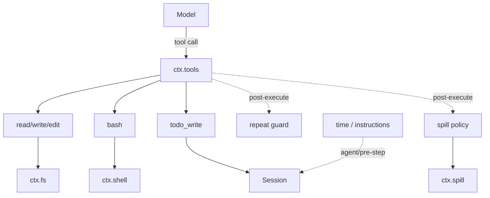
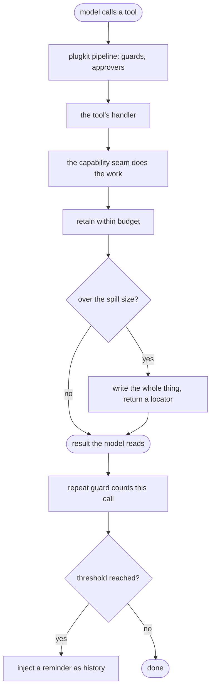
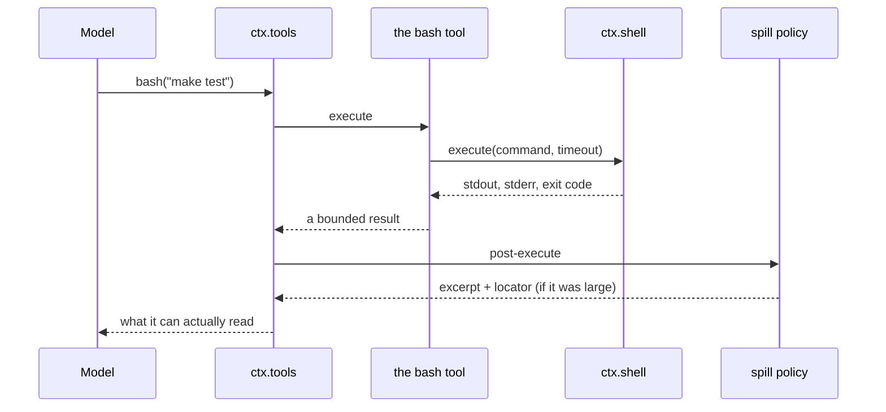

# The default tools — the behaviour that proves the seams compose

# 1 · Requirements

## Introduction

Ten sprints of seams, and a model still cannot do anything. The loop will run a
tool through plugkit's pipeline; `ctx.fs`, `ctx.shell` and `ctx.terminal` will
do the work; and nothing connects them, because a *tool* — a name, a schema, a
handler — is a different thing from a capability.

This sprint ships the connection, and the catalogue is explicit about why it
counts as parity rather than extra: these plugins are "the default behaviour
that proves the seams compose". A seam with no consumer is a claim. A seam with
a working default is a demonstration, and the piece a consumer swaps rather
than writes.

Three groups:

- **Tools** — `read`/`write`/`edit` over the file system, `bash` over the
  shell, `terminal` over persistent sessions, and `todo_write`, which owns its
  own state rather than fronting a seam.
- **Guards** — the repeat-call reminder, which notices a model going in
  circles, and the spill policy, which sends oversized results to a file.
- **Context injectors** — `time_context` and `system_instructions`, which are
  small and matter more than their size: they are the demonstration that
  context reaches the model as *model-visible history*, not by rewriting the
  system prompt.

## Glossary

- **Tool**: a name, a description, a parameter schema, and a handler, registered
  on `ctx.tools`.
- **Guard**: a plugin on the tools pipeline that observes or rewrites a call
  without owning it.
- **Injector**: a plugin on `agent/pre-step` that adds a message to what enters
  the model's history.
- **Notice**: a plugin-sourced message tagged so a renderer does not mistake it
  for something the user said.

## Mental Model & Invariants

**Model:**

- A tool is a *thin* shell over a capability. Every decision worth making —
  containment, bounding, killing a process group — was made in the seam, and a
  tool that re-implements one has forked it.
- A guard advises; it does not veto. The repeat reminder tells the model it is
  looping and leaves the call alone, because a plugin that silently refuses a
  call teaches the model nothing.
- Injected context is *history*, not prompt. That is what lets a later snapshot
  supersede an earlier one, and what keeps the system prompt stable across a
  conversation.

**Invariants:**

- **I1 — A tool never returns unbounded output.** Every result is retained,
  spilled, or both.
- **I2 — A tool's failure is a result.** Nothing raises into the pipeline; the
  model reads what went wrong.
- **I3 — A notice is tagged.** Plugin-sourced context carries a source that
  marks it as such, or a renderer shows it as the user speaking.
- **I4 — A guard counts what happened, not what was allowed.** A rejected call
  still counts toward a repeat, because a model hammering a wall is looping.
- **I5 — Tools are registered against a fiber**, so unmounting a plugin removes
  its tools.

## Decisions & Corrections (log)

- 2026-08-25 — `guard_timeout` not ported: plugkit ships `timeout_policy`,
  which is the same stage-3 wrapper over each tool's own budget. Recorded in
  the catalogue as plugkit-shipped.

## Dev Environment (config-as-code — pointers only)

- Deps: `pyproject.toml` (`uv sync`) · Gate: `uv run pytest tests -q`
- Reference: `plugins/tool_fs.py`, `tool_bash.py`, `tool_terminal.py`,
  `tool_todo.py`, `guard_repeat_tool.py`, `spill_policy.py`,
  `time_context.py`, `system_instructions.py`

## Requirements

### Requirement 1: File-system tools

#### Acceptance Criteria

1. THE plugin SHALL register `read`, `write`, and `edit` against `ctx.fs`.
2. Each tool SHALL declare a parameter schema the model can be shown.
3. `read` SHALL return numbered lines and say when it truncated.
4. `write` SHALL report the path and the bytes written.
5. `edit` SHALL surface an ambiguous match as an error result naming the count,
   so the model can add context rather than guess (I2).
6. A path outside the execution root SHALL come back as an error result, not an
   exception (I2).

### Requirement 2: The bash tool

#### Acceptance Criteria

1. THE plugin SHALL register `bash` against `ctx.shell` with an optional
   timeout, clamped to a configured maximum.
2. THE result SHALL carry stdout, stderr, and the exit code in a form a model
   can read.
3. Output SHALL be retained within a byte budget, and the result SHALL say what
   was omitted (I1).
4. WHEN a spill store is mounted and output exceeded the budget, THE result
   SHALL carry a locator for the whole output.
5. A timeout SHALL be reported as such, distinguishably from a non-zero exit.

### Requirement 3: The terminal tool

#### Acceptance Criteria

1. THE plugin SHALL register a tool that opens or reuses a session per agent
   and sends a command to it.
2. THE session SHALL persist across calls within one agent.
3. Output SHALL be bounded the same way `bash`'s is.

### Requirement 4: The todo tool

#### Acceptance Criteria

1. THE plugin SHALL register `todo_write`, taking the **whole** list each time
   and replacing the previous one.
2. Each item SHALL have non-empty content, unique within the list, and a status
   from the known set.
3. Unless configured otherwise, at most one item SHALL be `in_progress`.
4. Each write SHALL append a `todo/write` event to the calling agent's session.
5. A call with no calling agent SHALL be refused rather than silently doing
   nothing.
6. WHEN the projection registry is mounted, THE plugin SHALL register a `todos`
   projection.

### Requirement 5: The repeat-call guard

#### Acceptance Criteria

1. THE guard SHALL count consecutive calls to one tool with identical
   arguments, per agent.
2. Arguments SHALL be compared canonically, so a difference of key order is not
   a difference (I4).
3. THE count SHALL include calls that were rejected (I4).
4. WHEN a threshold is reached, THE guard SHALL inject a reminder as a
   plugin-sourced message and SHALL NOT alter or refuse the call.
5. THE reminder message SHALL be tagged as a notice (I3).
6. A user message SHALL reset the count — repetition across a user's turn is
   not a loop.
7. Thresholds SHALL be validated at load: empty, non-integer, below two, or
   duplicated all fail loudly.

### Requirement 6: The spill policy

#### Acceptance Criteria

1. THE policy SHALL observe completed tool calls and, when a result exceeds a
   configured size, write the whole result to the spill store.
2. THE result the model sees SHALL be replaced with a bounded excerpt plus the
   locator and a retrieval hint.
3. WHEN no spill store is mounted, THE policy SHALL leave results alone.
4. A spill failure SHALL leave the original result intact rather than losing it.

### Requirement 7: Context injectors

#### Acceptance Criteria

1. `time_context` SHALL inject the current time as a plugin-sourced message on
   the first step of a turn.
2. `system_instructions` SHALL inject configured working instructions the same
   way.
3. Both SHALL tag their messages so a renderer can tell them from user input
   (I3).
4. Both SHALL leave the system prompt untouched — this is the demonstration
   that the injection seam works.
5. Neither SHALL inject on a step that is not the first of its turn.

### Non-Functional

- **NF 1**: every tool is a thin shell; no tool re-implements a seam's rule.
- **NF 2**: every budget is a named constant with a documented default (EP1).

## Out of Scope

- `guard_timeout` — plugkit's `timeout_policy` is the same wrapper.
- `tool_goal`, `tool_jobs` — their services are a later sprint.
- `subagent` — child sessions and lineage are their own work.
- `mcp_client` — the provider/transport sprint.

# 2 · Design

## End-to-End Walkthrough

A deployment mounts the seams and then the defaults:

```python
await root.plugin(FileSystem, {"root": workspace})
await root.plugin(ShellService)
await root.plugin(LocalSpillStore)
await root.plugin(FsTools)
await root.plugin(BashTool)
await root.plugin(RepeatToolGuard)
await root.plugin(SpillPolicy)
await root.plugin(TimeContext)
```

Now a model asked to investigate something has hands. It calls `read` with a
path and an offset; the tool calls `ctx.fs.read_text` and formats the numbered
lines. What the tool does *not* do is decide whether the path is allowed, or
how many bytes are too many — the seam decided both, and a tool that re-checked
either would have forked the rule.

It calls `bash`. The command runs through `ctx.shell`, which puts it in its own
process group and kills the group on a timeout. The output comes back and is
run through a `TextRetainer`, because a build log is not something to paste
into a context window whole. If it overflowed and a spill store is mounted, the
whole output goes to a file and the model gets an excerpt plus a path it can
grep — which is more useful than the first four kilobytes.

Suppose the model then calls the same tool with the same arguments, three times
running. The repeat guard has been counting — canonically, so reordered keys
are not a difference, and including calls that were *rejected*, because a model
hammering a wall is looping just as much as one repeating a success. At the
threshold it injects a reminder. It does not refuse the call. A guard that
silently blocked would leave the model repeating something that now
mysteriously does nothing; a reminder tells it what is happening and lets it
choose.

`time_context` is four lines of behaviour and carries the sprint's most
important idea. It injects the current time as a *message*, on the first step
of each turn. Not into the system prompt — because a system prompt is stable
across a conversation and the time is not, and rewriting it every turn would
invalidate every cache and every assumption downstream. As history, each new
snapshot simply supersedes the last, and the mechanism that makes that work is
the same one compaction uses. A port that skipped these two plugins would keep
the injection seam and lose the only proof it works.

## Tech Stack

- Python 3.13+, stdlib only · plugkit `ToolsService`
- Test command: `uv run pytest tests -q`

## Directory Structure

```
src/pydsh/tools/
  __init__.py
  fs_tools.py       # read / write / edit
  bash_tool.py      # bash
  terminal_tool.py  # terminal
  todo_tool.py      # todo_write + the todos projection
  guards.py         # RepeatToolGuard, SpillPolicy
  context.py        # TimeContext, SystemInstructions
tests/
  test_tools_fs_bash.py
  test_tools_todo.py
  test_guards.py
  test_context_injectors.py
```

## Architecture Overview



## Workflow



## Module Design

### `tools.fs_tools.FsTools` — `inject = ["tools", "fs"]`

Registers `read`, `write`, `edit`, each a handler over `ctx.fs` that turns an
exception into an error result.

### `tools.bash_tool.BashTool` — `inject = ["tools", "shell"]`

Config: `default_timeout_ms`, `max_timeout_ms`, `max_output_bytes`.

### `tools.todo_tool.TodoTool` — `inject = ["tools"]`

```
to_todo_list(items, allow_parallel_in_progress) -> list   # validation
TODO_PROJECTION : ProjectionDefinition                    # last-write-wins
```

### `tools.guards`

```
class RepeatToolGuard(Service):   # thresholds, include/exclude globs
class SpillPolicy(Service):       # size threshold, excerpt budget
```

### `tools.context`

```
class TimeContext(Service)          # agent/pre-step, first step only
class SystemInstructions(Service)   # agent/pre-step, first step only
```

## Key Algorithms (pseudo-code)

```
ALGORITHM the repeat guard, on a completed call
  1. if the tool is excluded by the configured globs: return
  2. key <- (tool name, canonical JSON of the arguments)
     # Canonical: keys sorted, so {"a":1,"b":2} and {"b":2,"a":1} are one call.
     # Otherwise a model that varies key order defeats the counter by accident.
  3. if key == the agent's last key: count += 1 else: count = 1, last = key
     # Counted whatever the outcome was — a rejected call still means the model
     # tried the same thing again (I4).
  4. if count is one of the thresholds:
       inject a reminder as a plugin-sourced, notice-tagged message
       # Advice, not a veto: a silently blocked call leaves the model repeating
       # something that now does nothing, and it cannot tell why.
```

```
ALGORITHM the spill policy, on a completed call
  1. text <- the result's text ; if len(text) <= threshold: return unchanged
  2. if no spill store is mounted: return unchanged
  3. try: locator <- spill.save_text(session id, a name from the tool, text)
     on failure: return unchanged
     # A spill that failed must not lose the result it was trying to preserve.
  4. excerpt <- head/tail retention of `text`
  5. return excerpt + the omission clause + "read <locator>"
```

## Sequence Diagrams



```mermaid
sequenceDiagram
    participant Loop as the agent loop
    participant Time as time_context
    participant Session
    Loop->>Time: agent/pre-step (turn 3, step 1)
    Time-->>Loop: enter, plus a plugin-sourced time message
    Loop->>Session: append it as user/message
    Note over Session: history, not prompt — so the next<br/>turn's snapshot supersedes this one
```

## Data Models

One new session event, `todo/write`, log-only: a UI renders the list from the
event stream, and the `todos` projection folds it last-write-wins. No new store.

## Error Handling Strategy

Every tool handler converts its exceptions into error results (I2): the model
is the caller, and an exception reaches it as a pipeline failure with less
information than a sentence would carry. Guards contain their own failures —
a broken reminder must not fail the call it was commenting on.

## Testing Strategy

- **Integration**: tools driven through the real `ctx.tools` pipeline with real
  seams behind them, on real files and real subprocesses.
- **Integration**: the injectors through a real agent turn, asserting on the
  session log rather than on the plugin.
- **Property**: canonical argument comparison; the count survives key reorder.

## Correctness Properties

### Property 1: Reordered arguments are the same call
- **Statement**: *For any* two argument objects differing only in key order,
  the repeat guard treats them as a repetition.
- **Validates**: 5.2 (I4)

### Property 2: Injected context is history, not prompt
- **Statement**: *For any* injected snapshot, the system prompt is unchanged
  and the snapshot appears in the derived messages.
- **Validates**: 7.4 (I3)

### Property 3: A tool never raises into the pipeline
- **Statement**: *For any* failure a seam can produce, the tool returns an
  error result.
- **Validates**: 1.6, 2.5 (I2)

## Edge Cases

- **`edit` matching twice** — an error result naming the count, so the model
  can add surrounding context.
- **A `bash` command producing megabytes** — retained, spilled, and reported.
- **A todo list with duplicate content** — refused: the model is describing one
  task twice and would not be able to tell the entries apart afterwards.
- **A repeat across a user message** — the count resets; the user changed the
  situation.
- **The spill store failing** — the full result is returned instead, since
  losing it would be worse than a large one.
- **`time_context` on step 3 of a turn** — nothing; the snapshot from step 1
  still stands.

## Decisions

### Decision: `guard_timeout` is not ported
**Context:** the reference has a timeout guard on `tools/execute`.
**Decision:** use plugkit's `timeout_policy`.
**Rationale:** it is the same wrapper over each tool's own budget, and the
catalogue's rule is that plugkit-shipped pieces are reused rather than
re-ported. Two implementations of one concern is the duplication lens (S3).

### Decision: the repeat guard advises and never refuses
**Context:** the obvious use of a guard is to block.
**Decision:** inject a reminder; leave the call untouched.
**Rationale:** a silently blocked call leaves the model repeating something
that now mysteriously does nothing, with no way to tell why. Telling it what
is happening is both more useful and more honest, and the pipeline already has
a place — guards and approvers — for a consumer that really does want to refuse.

### Decision: context is injected as history, not into the system prompt
**Context:** "tell the model what time it is" reads like prompt material.
**Decision:** a plugin-sourced message on the first step of a turn.
**Rationale:** a system prompt is stable across a conversation and the time is
not. Rewriting it each turn invalidates every prompt cache and makes the prompt
un-diffable; as history, each snapshot simply supersedes the last. This is the
reference's demonstration that the injection seam works, and skipping these
plugins keeps the seam while losing the only proof of it.

### Decision: arguments are compared canonically
**Context:** the simplest comparison is the raw argument string.
**Decision:** parse, sort keys, re-serialise.
**Rationale:** models vary key order between otherwise identical calls, so a
raw-string comparison under-counts exactly the loop the guard exists to catch —
and it fails *open*, which is the direction that produces no signal at all.

### Decision: one output budget, not a threshold plus fixed head/tail sizes
**Context:** the first draft gated trimming on `max_output_bytes` while the
head and tail kept fixed constants. Configuring a 200-byte budget therefore
changed when trimming *triggered* and not how much was kept — and returned four
kilobytes.
**Decision:** one budget, split by a share.
**Rationale:** two knobs that must agree and are not derived from each other
will disagree. One number that always means what it says is both simpler and
impossible to misconfigure this way.

## Security Considerations

`bash` and `terminal` expose command execution to the model. The containment
that matters is the tools pipeline's — a guard or approver that sees the caller
— and mounting these tools without one gives the model a shell. That is stated
in the module docstring as well as here, because the person who needs to read
it is the one mounting the plugin.

# 3 · Tasks

## Status marks
<!-- [ ] pending | [x] done | [!] BLOCKED: reason | [-] DROPPED: <reason> |
     [>] → <spec_id> -->

## Tasks

- [x] 1. Tools
  - [x] 1.1 `tools/fs_tools.py` — read, write, edit
    - **Requirements**: 1.1–1.6
    - **Properties**: 3
  - [x] 1.2 `tools/bash_tool.py` — bounded, spillable command output
    - **Requirements**: 2.1–2.5
  - [x] 1.3 `tools/terminal_tool.py`
    - **Depends**: 1.2
    - **Requirements**: 3.1–3.3
  - [x] 1.4 `tools/todo_tool.py` — validation, the event, the projection
    - **Requirements**: 4.1–4.6

- [x] 2. Guards and injectors
  - [x] 2.1 `tools/guards.py` — the repeat guard
    - **Requirements**: 5.1–5.7
    - **Properties**: 1
  - [x] 2.2 The spill policy
    - **Depends**: 2.1
    - **Requirements**: 6.1–6.4
  - [x] 2.3 `tools/context.py` — time and instructions
    - **Requirements**: 7.1–7.5
    - **Properties**: 2
  - [x] 2.4 Export surface
    - **Depends**: 2.3

- [x] 3. Tests
  - [x] 3.1 `test_tools_fs_bash.py` — through the real pipeline and real seams
    - **Depends**: 1.3
    - **Requirements**: 1.1–1.6, 2.1–2.5, 3.1–3.3
    - **Properties**: 3
  - [x] 3.2 `test_tools_todo.py`
    - **Depends**: 1.4
    - **Requirements**: 4.1–4.6
  - [x] 3.3 `test_guards.py`
    - **Depends**: 2.2
    - **Requirements**: 5.1–5.7, 6.1–6.4
    - **Properties**: 1
  - [x] 3.4 `test_context_injectors.py` — over a real turn
    - **Depends**: 2.3
    - **Requirements**: 7.1–7.5
    - **Properties**: 2

- [x] 4. Wrap
  - [x] 4.1 README + catalogue notes
    - **Depends**: 3.4
  - [x] 4.2 Close the sprint
    - **Depends**: 4.1

## Log

**[2026-08-25]** — Created and activated. `guard_timeout` recorded as
plugkit-shipped rather than ported.

**[2026-08-25]** — CLOSED / SHIPPED. All tasks done, 690 tests green, up from
644.

The sprint's real finding was a **contract drift** (lens S7) in my own code,
caught by a test. `tools/post-execute` is a waterfall whose chained value is a
*decision* — the default inner returns `Accept()` — while the result itself is
the second argument. The spill policy read `.value` off the decision, found
`None` on every call, and silently never fired. Nothing errored; the feature
simply did not exist. That is the exact failure shape the lens describes:
producer shape and consumer shape disagree, it compiles, and it fails quietly.

A second, smaller one: the bash tool had a threshold and fixed head/tail sizes
that were not derived from it, so a small configured budget changed when
trimming triggered without changing how much was kept.

`guard_timeout` was not ported — plugkit ships `timeout_policy`, the same
wrapper over each tool's own budget, and the catalogue's rule is to reuse
rather than re-port.

The two context injectors are four lines of behaviour each and carry the
sprint's central idea: context reaches the model as **history**, not by
rewriting the system prompt. `test_guards_and_context.py` asserts both halves —
the snapshot is in the session log, and the system prompt does not contain it.
