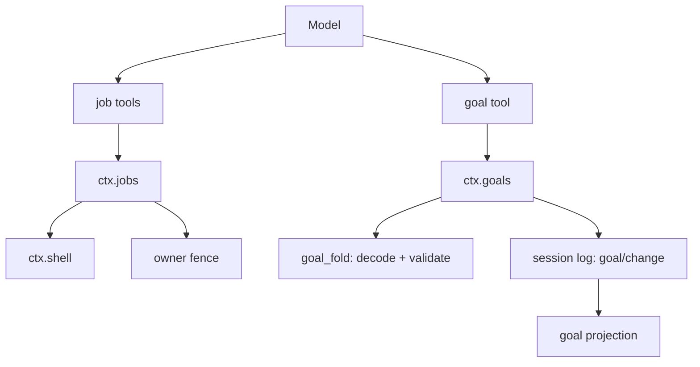
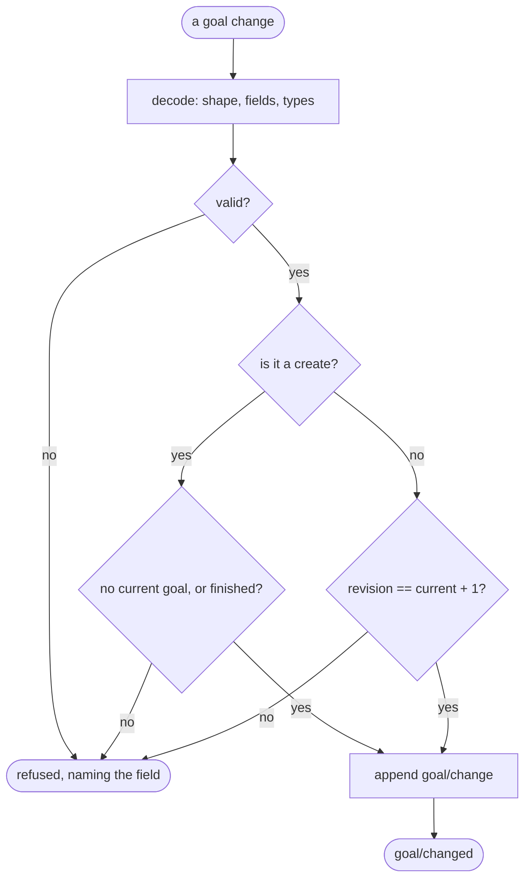
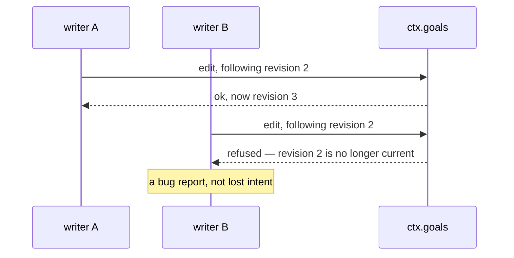

# Jobs and goals — work that outlives a step, intent that outlives a turn

# 1 · Requirements

## Introduction

Two services that share a shape and nothing else. Both are about something
persisting past the boundary a step or a turn would naturally give it.

**Jobs** are work that outlives the tool call that started it. A model asks for
a long build; waiting for it burns the whole step budget, so instead the call
returns a job id and the model gets on with something else, checking back or
being told when it finishes. The interesting part is ownership: a job belongs
to the session that started it, and another session must not be able to read
its output or kill it.

**Goals** are intent that outlives a turn. A conversation drifts; a goal is the
thing that was actually being pursued, recorded in the log so it survives a
restart, a compaction, and the model forgetting. It is event-sourced with
**compare-and-set** semantics — every change names the revision it expects to
follow — which is what stops two writers silently overwriting each other.

## Glossary

- **Job**: background work with an id, a status, and readable output.
- **Owner**: the session a job belongs to. The fence for every operation on it.
- **Terminal status**: completed, killed, or failed. A job in one never changes
  again.
- **Goal change**: one full-value snapshot of a goal, or a tombstone clearing
  it.
- **Revision**: a goal's version, advanced by exactly one per change.
- **Armed**: a process-local flag saying the goal should continue driving work.
  Never persisted.

## Mental Model & Invariants

**Model:**

- A job is *owned*, not global. The owner is a fence, and every read, kill and
  wait checks it — otherwise one conversation can reach into another.
- A goal is a fold over the session log, exactly like every other projection.
  There is no goal store; there are goal *events*.
- A goal change carries the **whole** goal, never a delta. That is what makes
  each event self-describing and every transition cheap to validate.
- Arming is a process-local decision about whether to keep going. It is not
  part of the goal, so it is never written to the log — a restart should not
  silently resume driving something.

**Invariants:**

- **I1 — A job's owner fences it.** A caller that does not own a job cannot
  read, kill, or wait on it, and is told it does not exist rather than that it
  exists and is forbidden.
- **I2 — A terminal job never changes.** Once completed, killed, or failed, its
  status and outcome are fixed.
- **I3 — Output is consumed once.** Reading a job's output returns what has
  accumulated since the last read, so a poller does not re-read the same
  megabyte.
- **I4 — A goal change must advance the revision by exactly one.** A change
  naming any other revision is rejected, which is what makes concurrent writers
  safe.
- **I5 — A goal change carries a full snapshot.** Never a partial update.
- **I6 — Armed state is never persisted.**

## Decisions & Corrections (log)

- 2026-08-25 — `schedule` split out: durable reminders are a third concern with
  their own domain and timer semantics.

## Dev Environment (config-as-code — pointers only)

- Deps: `pyproject.toml` (`uv sync`) · Gate: `uv run pytest tests -q`
- Reference: `services/jobs.py`, `jobs_local.py`, `goal.py`, `goal_fold.py`,
  `plugins/tool_jobs.py`, `tool_goal.py`

## Requirements

### Requirement 1: The job registry

#### Acceptance Criteria

1. THE registry SHALL provide `ctx.jobs` as an interface, with a local
   implementation over `ctx.shell`.
2. `start` SHALL accept a specification, return a job id, and run the work
   without the caller waiting for it.
3. `list` SHALL return only the jobs the caller owns (I1).
4. `get`, `read`, `kill` and `wait` SHALL refuse a job the caller does not own,
   reporting it as absent rather than as forbidden.
5. A job SHALL carry a status from the known set and move only to a terminal
   one (I2).
6. `read` SHALL return output accumulated since the previous read (I3).
7. `kill` SHALL stop the work and settle the job as killed; killing a terminal
   job SHALL be a no-op rather than an error.
8. `wait` SHALL return when the job settles or the timeout elapses, saying
   which.
9. THE registry SHALL notify listeners when a job finishes and when the set of
   jobs changes.
10. WHEN the registry is unmounted, every running job SHALL be stopped.

### Requirement 2: The jobs tool

#### Acceptance Criteria

1. THE plugin SHALL register tools to start, list, read, and kill jobs.
2. Every call SHALL be fenced by the calling agent's session (I1).
3. Output SHALL be bounded the same way other tool output is.
4. A call with no calling agent SHALL be refused.

### Requirement 3: Goal changes

#### Acceptance Criteria

1. A goal change SHALL be one of: create, edit, pause, resume, complete, block,
   or clear.
2. A snapshot change SHALL carry the complete goal, with an id, a revision,
   a status, text, and timestamps (I5).
3. A clear SHALL carry a tombstone naming the goal and revision it clears.
4. Decoding SHALL reject an unknown operation, a missing field, an extra field,
   a non-positive revision, or an `updated_at` before `created_at`.
5. `create` SHALL be valid only when there is no current goal, or the current
   one is finished.
6. Every non-create change SHALL advance the current goal's revision by exactly
   one, and name the same goal id (I4).
7. Folding a log of changes SHALL yield the current goal, its revision, and its
   history.

### Requirement 4: The goals service

#### Acceptance Criteria

1. THE service SHALL provide `ctx.goals`, folded from the session log.
2. `current` SHALL return the session's goal, or nothing.
3. Applying a change SHALL append a `goal/change` event and refuse anything the
   fold rejects.
4. THE service SHALL arm and disarm a goal in memory only (I6).
5. THE service SHALL bound how many rounds a goal may drive, refusing to arm
   past the limit.
6. WHEN the projection registry is mounted, THE service SHALL register a `goal`
   projection.
7. A change SHALL broadcast `goal/changed`.

### Requirement 5: The goal tool

#### Acceptance Criteria

1. THE plugin SHALL register a tool letting the model set, update, and complete
   the session's goal.
2. THE tool SHALL construct the full snapshot itself, so the model supplies
   intent rather than bookkeeping.
3. A rejected change SHALL come back as an error result naming why.

### Non-Functional

- **NF 1**: stdlib only.
- **NF 2**: bounds (rounds, output) are named constants (EP1).

## Out of Scope

- `schedule` / `schedule_domain` — durable reminders, their own sprint.
- `subagent` jobs — the `subagent` kind is accepted in the vocabulary but only
  the `bash` kind runs here; child sessions are their own work.
- `command_goal` — the slash command, with the other commands.

# 2 · Design

## End-to-End Walkthrough

**A job.** The model calls the start tool with a long-running command. The
registry spawns it through `ctx.shell`, records it against the calling agent's
session, and returns an id immediately. The step ends; the model does something
else. Later it reads the job: it gets whatever output has accumulated *since
the last read*, because a poller that re-reads from the beginning turns a
megabyte of build log into ten megabytes of context.

Ownership is checked on every operation, and a job the caller does not own is
reported as **absent**, not forbidden. "You may not read job 7" tells a caller
that job 7 exists and belongs to someone else; "no such job" tells it nothing
it did not already know.

**A goal.** The model sets one: "get the test suite green". That becomes a
`goal/change` event carrying the *whole* goal — id, revision 1, status, text,
timestamps. Later it edits the text; that is revision 2, and the change says so
explicitly.

The explicitness is the point. Every non-create change names the revision it
expects to follow, and the fold rejects anything that does not advance by
exactly one. Two writers racing cannot silently overwrite each other: the
second one's change names a revision that is no longer current and is refused,
which is a bug report rather than lost intent.

Arming is separate and deliberately unpersisted. A goal being *recorded* and a
process *actively driving it* are different facts, and writing the second to
the log would mean a restart silently resumes pursuing something nobody asked
it to resume.

## Tech Stack

- Python 3.13+, stdlib only · `ctx.shell` for the local job runner
- Test command: `uv run pytest tests -q`

## Directory Structure

```
src/pydsh/work/
  __init__.py
  jobs.py        # JobRegistry interface, LocalJobs over ctx.shell
  goal_fold.py   # change decoding + the pure fold
  goals.py       # GoalService (ctx.goals)
  tools.py       # the jobs and goal tools
tests/
  test_jobs.py
  test_goals.py
```

## Architecture Overview



## Workflow



## Module Design

### `work.jobs`

```
JOB_STATUSES = ("running", "stopping", "completed", "killed", "failed")
class JobRegistry(Service):        # provide = "jobs"
    async start(spec, owner) -> str
    list(owner) ; get(id, owner) ; read(id, owner) ; async kill(id, owner)
    async wait(id, timeout_ms, owner)
    on_job_done(listener) -> dispose
class LocalJobs(JobRegistry)       # runs bash jobs through ctx.shell
```

### `work.goal_fold`

```
GOAL_CHANGE_VERSION = 1
GOAL_STATUSES = ("active", "paused", "completed", "blocked")
decode_goal_change(value) -> dict          # raises GoalError
fold_goals(changes) -> {"current", "history"}
class GoalError(Exception): code
```

### `work.goals.GoalService` — `provide = "goals"`

```
current(session) ; apply(session, change) ; history(session)
arm(session) ; disarm(session) ; is_armed(session) ; rounds(session)
```

## Key Algorithms (pseudo-code)

```
ALGORITHM apply a goal change
  1. change <- decode(raw)         # shape, exact keys, types, timestamp order
  2. state  <- fold(the session's existing goal/change events)
  3. if change is a create:
       refuse unless there is no current goal, or the current one is finished
       # Two live goals in one session means "what are we doing" has two
       # answers, and nothing downstream can pick.
     else:
       ref <- the revision this change claims to follow
       refuse unless ref.id == current.id and ref.revision == current.revision + 1
       # Compare-and-set. Two writers racing cannot silently overwrite: the
       # loser names a revision that is no longer current and is told so.
  4. append goal/change ; broadcast goal/changed
```

```
ALGORITHM read a job's output
  1. refuse unless the caller owns this job          (I1 — reported as absent)
  2. text  <- the buffer accumulated since the last read
  3. clear the buffer                                (I3)
  # Consumed once: a poller that re-read from the start would turn a megabyte
  # of build log into ten megabytes of context, which is the opposite of why
  # the work was backgrounded.
```

## Sequence Diagrams

```mermaid
sequenceDiagram
    participant Model
    participant Tool as the jobs tool
    participant Jobs as ctx.jobs
    participant Shell as ctx.shell
    Model->>Tool: start("make test")
    Tool->>Jobs: start(spec, owner=this session)
    Jobs->>Shell: run it, unwaited
    Jobs-->>Tool: job id
    Tool-->>Model: "started job 3f2a"
    Note over Model: the step ends; the model does something else
    Model->>Tool: read("3f2a")
    Tool->>Jobs: read(id, owner)
    Jobs-->>Model: output since the last read
```



## Data Models

One new session event, `goal/change`, log-only and full-value. No new store —
goals are a fold, and jobs live only in the process that started them.

| Value | Writer | Source of truth? | Read path | Reproducible? |
|---|---|---|---|---|
| goal state | `ctx.goals`, as `goal/change` events | **no — derived** from the log | `current()`, the `goal` projection | yes, by folding |
| armed flag | `ctx.goals`, in memory | no | `is_armed()` | **no, deliberately** — a restart must not resume driving |
| job records | `ctx.jobs`, in memory | yes, for the process's lifetime | `list`/`get`/`read` | no — a job is a running process |

## Error Handling Strategy

Goal changes fail loudly and specifically: the error names the field or the
revision, because the caller is either a model that needs to retry correctly or
a developer who mis-built a change. Job operations on an unowned job report
absence, which is a deliberate loss of precision (I1).

## Testing Strategy

- **Integration**: jobs over the real shell — a real background process, really
  killed.
- **Property**: compare-and-set under a simulated race.
- **Property**: ownership, checked from a second session.

## Correctness Properties

### Property 1: Two writers cannot both win
- **Statement**: *For any* two changes claiming the same predecessor revision,
  exactly one is accepted.
- **Validates**: 3.6 (I4)

### Property 2: A job is invisible to a session that does not own it
- **Statement**: *For any* job, every operation from another owner reports it
  as absent.
- **Validates**: 1.3, 1.4 (I1)

### Property 3: Output is not re-read
- **Statement**: *For any* sequence of reads, the concatenation is the output
  exactly once.
- **Validates**: 1.6 (I3)

## Edge Cases

- **Killing an already-finished job** — a no-op, because the caller's intent is
  already satisfied and an error would be noise.
- **Reading a job with no new output** — the empty string, not an error.
- **Creating a goal while one is active** — refused; two live goals mean "what
  are we doing" has two answers.
- **Creating one while the last is completed** — allowed, and the completed one
  stays in history.
- **A clear naming a stale revision** — refused like any other change.
- **A job whose owning session is gone** — still runs, and is stopped when the
  registry unmounts.

## Decisions

### Decision: an unowned job is reported as absent
**Context:** the natural error is "forbidden".
**Decision:** "no such job".
**Rationale:** "you may not read job 7" confirms that job 7 exists and belongs
to someone else, which is information the caller did not have and is not
entitled to. In a harness that will host more than one conversation, that is a
cross-tenant leak in the error message.

### Decision: goal changes are full snapshots with compare-and-set
**Context:** a delta ("set the status to paused") is smaller.
**Decision:** the whole goal, plus the revision it follows.
**Rationale:** full value makes each event self-describing, so a fold needs no
history to interpret one. The revision makes concurrency safe without a lock:
the second of two racing writers is *told* it lost, rather than silently
overwriting. Both properties come free from the session log's append-only
shape, which is why goals need no store of their own.

### Decision: armed state is never persisted
**Context:** it looks like part of the goal.
**Decision:** in memory, per process.
**Rationale:** "there is a goal" and "this process is actively driving it" are
different facts. Persisting the second means a restart resumes pursuing
something nobody asked it to resume — which is the kind of autonomy that should
require a deliberate act every time.

### Decision: output is consumed on read
**Context:** an idempotent read is usually the friendlier design.
**Decision:** reading drains what has accumulated.
**Rationale:** the caller is a model polling in a loop. A re-readable buffer
means each poll re-injects everything before it, and the context cost grows
quadratically in the number of polls — defeating the reason the work was
backgrounded at all.

### Decision: killing a job aborts its cancel signal, it does not cancel the task
**Context:** the obvious implementation of `kill` is `task.cancel()`.
**Decision:** abort the job's `CancelSignal`, which the shell seam turns into a
process-group kill.
**Rationale:** cancelling the task abandons the `await` and leaves the
subprocess running — the same defect sprint 08 fixed in `shell`, reintroduced
one layer up. Found because the test suite hung rather than failed: an orphaned
`sleep` outliving its test's event loop. A tool is thin over its seam, and that
includes using the seam's cancellation rather than inventing a weaker one.

## Security Considerations

Job ownership is the only tenancy boundary in this layer, and it is enforced on
every operation rather than at creation. It is not authentication: a caller that
can forge an owner can reach another session's jobs, and the harness has no
identity layer by design — that belongs to a consumer's own plugin.

# 3 · Tasks

## Status marks
<!-- [ ] pending | [x] done | [!] BLOCKED: reason | [-] DROPPED: <reason> |
     [>] → <spec_id> -->

## Tasks

- [x] 1. Jobs
  - [x] 1.1 `work/jobs.py` — the registry interface and its local runner
    - **Requirements**: 1.1–1.10
    - **Properties**: 2, 3
- [x] 2. Goals
  - [x] 2.1 `work/goal_fold.py` — decoding and the pure fold
    - **Requirements**: 3.1–3.7
    - **Properties**: 1
  - [x] 2.2 `work/goals.py` — the service, arming, the projection
    - **Depends**: 2.1
    - **Requirements**: 4.1–4.7
- [x] 3. Tools
  - [x] 3.1 `work/tools.py` — the jobs and goal tools
    - **Depends**: 1.1, 2.2
    - **Requirements**: 2.1–2.4, 5.1–5.3
  - [x] 3.2 Export surface
    - **Depends**: 3.1
- [x] 4. Tests
  - [x] 4.1 `test_jobs.py` — real background processes, ownership, draining
    - **Depends**: 3.1
    - **Requirements**: 1.1–1.10, 2.1–2.4
    - **Properties**: 2, 3
  - [x] 4.2 `test_goals.py` — decoding, compare-and-set, arming
    - **Depends**: 3.1
    - **Requirements**: 3.1–3.7, 4.1–4.7, 5.1–5.3
    - **Properties**: 1
- [x] 5. Wrap
  - [x] 5.1 README
    - **Depends**: 4.2
  - [x] 5.2 Close the sprint
    - **Depends**: 5.1

## Log

**[2026-08-25]** — Created and activated. `schedule` split out into its own
sprint.

**[2026-08-25]** — CLOSED / SHIPPED. All tasks done, 726 tests green, up from
690.

The sprint's find was mine, not the reference's, and it announced itself as a
**hang rather than a failure**: `kill` cancelled the asyncio task, which
abandons the `await` and leaves the subprocess running. That is the same defect
sprint 08 fixed inside `shell`, reintroduced one layer above it. Killing now
aborts the job's cancel signal, which reaches the seam's process-group kill.

Every test passed individually and the suite hung, which is the signature of
state crossing a test boundary — here, a background process outliving the event
loop that started it. The tests now tear their registries down explicitly.

Two decisions worth keeping: an unowned job is reported as **absent** rather
than forbidden (saying "you may not read job 7" confirms job 7 exists and
belongs to someone else, which is a cross-tenant leak in an error message), and
goal changes are full snapshots with compare-and-set, so the loser of a race is
*told* rather than silently overwriting the winner.
