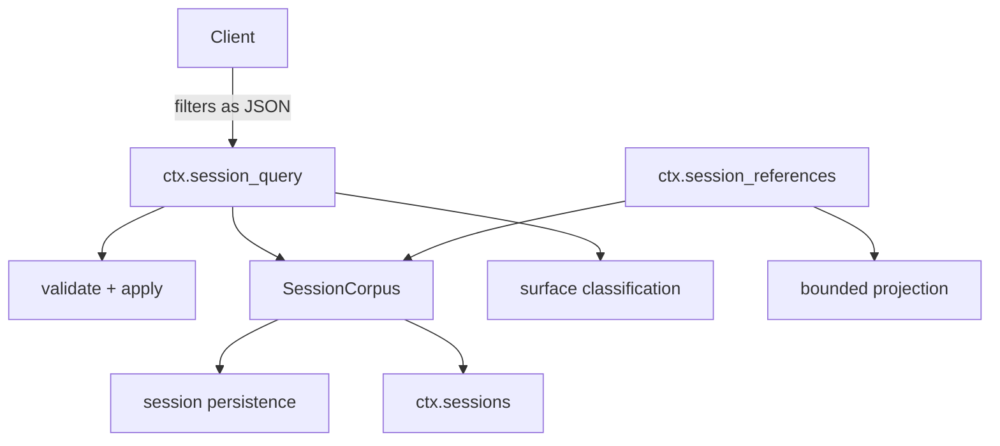
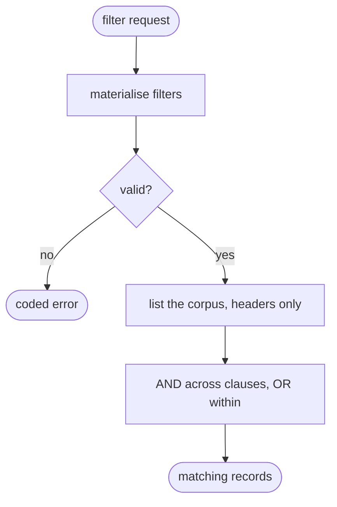
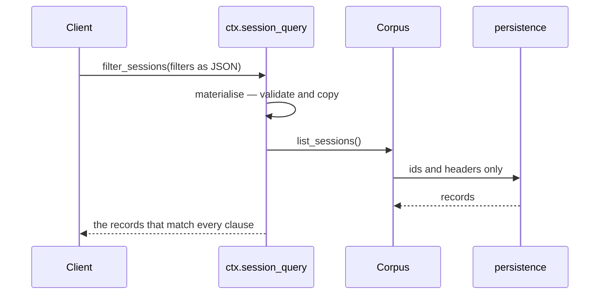

# Reading history — searching a corpus of sessions, and pointing at one

# 1 · Requirements

## Introduction

Every session so far has been read *by the thing that owns it*. A harness that
has run for a month has a corpus: hundreds of conversations, and a user asking
"what did we decide about the retry policy" or "show me the session where the
build broke".

Two services answer that.

**Query** turns the corpus into something searchable: list sessions, read one,
filter sessions by when they ran or where, filter *events* within one by type,
time, text, or where they sit on the surface. It reads the persistence layer
directly rather than loading sessions live, because loading three hundred
conversations to count them is not a search.

**Reference** is how one session points at another. A canonical URI, a
Markdown mention a host can render, and a retained projection of the referenced
conversation so it can be shown inline without pulling in the whole thing.

Both are read-only, and that is the design: nothing here writes, so nothing
here can corrupt a log.

## Glossary

- **Corpus**: every session the persistence layer holds, plus the live ones.
- **Record**: a session's summary — id, when, where, whether it is live.
- **Document**: one event, flattened for filtering: its type, time, seq,
  surface class, and searchable text.
- **Surface class**: whether an event is on the current surface, shadowed by a
  compaction, or log-only.
- **Reference**: a pointer to another session, as a canonical URI.
- **Mention**: a reference rendered for a human — `@[label](uri)`.

## Mental Model & Invariants

**Model:**

- Query reads *storage*, not live sessions. A corpus search that had to
  instantiate every session would cost the same as replaying the month.
- A filter is data, not a callback. Filters are validated, copied, and applied
  — which is what lets them arrive from a client over a wire.
- A reference identifies a session **losslessly**. Session ids are arbitrary
  strings; the URI encoding must round-trip any of them, including ones with
  spaces, slashes, or brackets.
- A retained reference is a *projection*, bounded. Pointing at a conversation
  must not mean pasting it.

**Invariants:**

- **I1 — Nothing here writes.** Every operation is a read.
- **I2 — A text filter is injection-safe.** Search text is treated as literal,
  never compiled as a pattern the searcher supplies.
- **I3 — A reference URI round-trips exactly.** Decoding an encoded id gives
  the id back, for any id.
- **I4 — Filters compose as AND across clauses, OR within one.**
- **I5 — A retained reference is bounded and says what it omitted.**

## Decisions & Corrections (log)

- 2026-08-25 — search is substring-and-whitespace-flexible, not tokenised
  ranking. Ranking without relevance feedback is guesswork dressed as a score.

## Dev Environment (config-as-code — pointers only)

- Deps: `pyproject.toml` (`uv sync`) · Gate: `uv run pytest tests -q`
- Reference: `services/session_query.py`, `session_reference.py`

## Requirements

### Requirement 1: The corpus

#### Acceptance Criteria

1. THE engine SHALL provide `ctx.session_query` and list every session the
   persistence layer holds, plus the live ones, without instantiating them.
2. Each record SHALL carry the id, creation time, working directory, and
   whether the session is live, persisted, or both.
3. Records SHALL be ordered newest first, with a stable tie-break.
4. Reading a session SHALL return its header and events.
5. Reading a session that does not exist SHALL raise a coded error.

### Requirement 2: Session filters

#### Acceptance Criteria

1. Filters SHALL be validated and copied before use; an unknown kind, a wrong
   value type, or an inverted range SHALL raise a coded error.
2. Supported session filters SHALL be: id, cwd, availability, and a
   created-at range.
3. `availability` SHALL accept only `live` and `persisted`.
4. Filters SHALL apply as AND across clauses and OR within a clause's values
   (I4).
5. A range SHALL accept an open lower or upper bound.

### Requirement 3: Event filters

#### Acceptance Criteria

1. Supported event filters SHALL be: seq range, time range, type, surface
   class, and text.
2. `surface` SHALL accept only `current`, `shadowed`, and `log-only`.
3. An event's surface class SHALL be computed from the session's current
   surface, so a compacted-away event reads as `shadowed`.
4. A text filter SHALL match literally and case-insensitively, treating runs of
   whitespace as equivalent (I2).
5. Empty or whitespace-only search text SHALL raise rather than match
   everything.
6. Searchable text SHALL be extracted from an event's messages, so a search
   finds what was said rather than what was stored.

### Requirement 4: References

#### Acceptance Criteria

1. THE module SHALL encode any session id into a canonical URI and decode it
   back exactly (I3).
2. Decoding SHALL reject a URI that is not canonical — including one that
   decodes but would re-encode differently.
3. THE module SHALL render a reference as a Markdown mention, escaping the
   label so a bracket in it cannot break the syntax.
4. THE module SHALL parse mentions and bare URIs out of a block of text,
   returning readable text plus the references in order.
5. Parsing SHALL be lossless with respect to a label containing escaped
   characters.

### Requirement 5: Retained references

#### Acceptance Criteria

1. THE resolver SHALL provide `ctx.session_references` and project a referenced
   session's conversation into readable text.
2. THE projection SHALL be bounded and SHALL say what it omitted (I5).
3. Serialised values SHALL be escaped so referenced content cannot construct
   markup the host would interpret.
4. THE resolver SHALL cap how many references one message may carry.
5. Resolving a reference to a session that does not exist SHALL be reported,
   not raised, so one bad mention does not fail a whole message.

### Non-Functional

- **NF 1**: stdlib only.
- **NF 2**: listing the corpus SHALL not load event bodies.

## Out of Scope

- Ranking, relevance scoring, or embeddings.
- Cross-session write operations of any kind.
- A UI for any of it.

# 2 · Design

## End-to-End Walkthrough

A user asks what was decided about retries. The client filters the corpus:

```python
sessions = root.session_query.filter_sessions([
    {"kind": "created-at", "from": last_month},
    {"kind": "availability", "values": ["persisted"]},
])
```

Those filters arrived over a wire as JSON, which is why they are *data* rather
than callbacks: they are validated, copied, and applied. An unknown kind or an
inverted range is refused with a code, because a client sending a filter this
service does not understand should be told, not silently given everything.

Then within a session:

```python
hits = root.session_query.filter_session_events(session_id, [
    {"kind": "text", "text": "retry policy"},
    {"kind": "surface", "values": ["current"]},
])
```

The text filter is the one with a sharp edge. It matches **literally**: the
search text is escaped and only runs of whitespace are made flexible, so a user
searching for `a.*b` finds that string and not everything. Compiling user text
as a pattern would be a regular-expression injection — cheap to write, and a
denial of service the first time someone searches for nested quantifiers.

The surface filter is the part that only exists because of compaction. An event
can be on the current surface, *shadowed* by a summary that replaced it, or
log-only. "Search what the model can currently see" and "search everything that
ever happened" are different questions, and after sprint 10 they have different
answers.

**References** are the other half. A session id is an arbitrary string, so
pointing at one needs an encoding that round-trips *any* id — including one
with a bracket, which would otherwise break the Markdown mention that carries
it. The URI is a canonical encoding, and decoding rejects anything that would
re-encode differently, so there is exactly one spelling of a reference and a
malformed one cannot be coaxed into resolving.

Resolving a reference retains a *bounded projection* of the other conversation:
pointing at a session must not mean pasting it. What comes back says what it
omitted, in the same vocabulary sprint 09 established.

## Tech Stack

- Python 3.13+, stdlib only (`re`, `base64`, `json`)
- Test command: `uv run pytest tests -q`

## Directory Structure

```
src/pydsh/query/
  __init__.py
  filters.py     # validate, copy, apply — session and event
  corpus.py      # SessionCorpus over the persistence layer
  engine.py      # SessionQueryEngine (ctx.session_query)
  reference.py   # URIs, mentions, retained projections
tests/
  test_session_query.py
  test_session_reference.py
```

## Architecture Overview



## Workflow



## Module Design

### `query.filters`

```
compile_text_filter(text) -> Pattern         # literal, whitespace-flexible
materialise_session_filters(filters) -> list
materialise_event_filters(filters) -> list
apply_session_filters(records, filters) -> list
apply_event_filters(documents, filters) -> list
class QueryError(Exception): code
```

### `query.corpus.SessionCorpus`

```
list_sessions() -> list[record]      # headers only, newest first
load(session_id) -> {"header", "events"}
```

### `query.engine.SessionQueryEngine` — `provide = "session_query"`

```
async list_sessions() ; async read_session(id) ; async read_surface(id)
async list_events(id) ; async filter_sessions(filters)
async filter_session_events(id, filters)
```

### `query.reference`

```
encode_reference_uri(session_id) -> str ; decode_reference_uri(uri) -> str
format_mention(reference) -> str ; parse_references(text) -> {"text", "references"}
tag_safe_json(value) -> str
class SessionReferences(Service)     # provide = "session_references"
```

## Key Algorithms (pseudo-code)

```
ALGORITHM compile_text_filter
  1. reject empty or whitespace-only text
     # Matching everything is never what a search meant, and returning the
     # whole corpus for an accidental empty box is worse than an error.
  2. escape every part of the text                       (I2)
  3. join the parts with a whitespace-run matcher
  # Literal, not a pattern: compiling user text would let a search for
  # `(a+)+b` become a denial of service, and one for `a.*b` silently match
  # things the user never asked about.
```

```
ALGORITHM classify an event's surface position
  1. current  <- the session's surface node seqs
  2. for each event:
       if seq in current:                 -> "current"
       elif the event's type is a surface type -> "shadowed"
       else                               -> "log-only"
  # The middle case only exists after sprint 10: an event that *would* be on
  # the surface but was replaced by a compaction. "What can the model see" and
  # "what ever happened" became different questions there.
```

```
ALGORITHM decode a reference URI
  1. reject anything not carrying the scheme
  2. reject any payload outside the URL-safe alphabet
  3. decode; reject if the result is not a string
  4. re-encode the result and reject unless it equals the input exactly   (I3)
  # Canonicality: without step 4 there are several spellings of one reference
  # — differing padding, say — and a malformed one can be coaxed into
  # resolving. One reference, one spelling.
```

## Sequence Diagrams



## Data Models

No new store. Everything is a read of the session log and its headers, which is
why the whole sprint carries no `data-architecture` row: it adds a *read path*
to stores that already exist.

## Error Handling Strategy

Coded errors throughout, because the caller is often a client over a wire that
needs to distinguish "your filter is malformed" from "no such session" from
"the store is unreachable". A reference that does not resolve is *reported* in
the result rather than raised, so one bad mention in a paragraph does not fail
the paragraph.

## Testing Strategy

- **Integration**: a real corpus of several persisted sessions, filtered.
- **Property**: URI round-trip over ids containing every awkward character.
- **Property**: a text filter treats its input literally.

## Correctness Properties

### Property 1: A reference URI round-trips any id
- **Statement**: *For any* session id, decoding its encoding gives it back.
- **Validates**: 4.1 (I3)

### Property 2: Search text is literal
- **Statement**: *For any* search text containing regex metacharacters, the
  filter matches that text and nothing else.
- **Validates**: 3.4 (I2)

### Property 3: Filters compose as AND
- **Statement**: *For any* set of filters, a record matches iff it satisfies
  every clause.
- **Validates**: 2.4 (I4)

## Edge Cases

- **A session both live and persisted** — reported as both, since a client
  choosing where to read from needs to know.
- **An id containing `]` or `)`** — the mention escapes the label and the URI
  carries the id, so the Markdown still parses.
- **A search matching across a newline** — whitespace runs are flexible, so
  "retry policy" finds "retry\n  policy".
- **A compacted session searched for shadowed events** — finds what the summary
  replaced, which is exactly why the class exists.
- **An empty corpus** — an empty list, not an error.
- **A reference to a session that was deleted** — reported as unresolved in the
  result.

## Decisions

### Decision: search is literal, not a pattern
**Context:** compiling the user's text as a regular expression is one line and
more powerful.
**Decision:** escape it, and make only whitespace flexible.
**Rationale:** a searcher-supplied pattern is an injection. `(a+)+b` typed into
a search box is a denial of service, and `a.*b` silently returns things the
user did not ask for. Whitespace flexibility gets the one ergonomic win — a
phrase that wrapped across lines still matches — without any of that.

### Decision: a reference URI must be canonical
**Context:** base64 decoding accepts several encodings of one value.
**Decision:** re-encode and require an exact match.
**Rationale:** otherwise one reference has several spellings, which breaks
equality and lets a malformed URI be coaxed into resolving. One reference, one
spelling, checked by construction.

### Decision: query reads storage, not live sessions
**Context:** `ctx.sessions` already holds sessions and is easier to reach.
**Decision:** read the persistence layer's headers.
**Rationale:** the corpus is everything that ever ran, and most of it is not
live. Instantiating three hundred sessions to count them costs the same as
replaying the month — a search has to be cheaper than the thing it searches.

### Decision: an unresolved reference is reported, not raised
**Context:** a missing session is an error by any normal reading.
**Decision:** it comes back marked unresolved.
**Rationale:** references arrive several to a message. Raising means one
deleted session makes an entire paragraph unrenderable, which is a worse
outcome than showing the rest with one mention marked missing.

## Security Considerations

Two injection surfaces, both closed deliberately. Search text is escaped rather
than compiled (I2). Serialised reference content escapes `<` so a referenced
conversation cannot construct markup that the host renders as its own — a
referenced session's content is, after all, whatever a model or a user typed
into a different conversation.

# 3 · Tasks

## Status marks
<!-- [ ] pending | [x] done | [!] BLOCKED: reason | [-] DROPPED: <reason> |
     [>] → <spec_id> -->

## Tasks

- [x] 1. Filtering
  - [x] 1.1 `query/filters.py` — validation, copying, application
    - **Requirements**: 2.1–2.5, 3.1–3.6
    - **Properties**: 2, 3
- [x] 2. The engine
  - [x] 2.1 `query/corpus.py` — the corpus over persistence
    - **Requirements**: 1.1–1.5
  - [x] 2.2 `query/engine.py` — the service, surface classification
    - **Depends**: 1.1, 2.1
    - **Requirements**: 1.1–1.5, 3.3
- [x] 3. References
  - [x] 3.1 `query/reference.py` — URIs, mentions, parsing
    - **Requirements**: 4.1–4.5
    - **Properties**: 1
  - [x] 3.2 The resolver and its bounded projection
    - **Depends**: 3.1
    - **Requirements**: 5.1–5.5
  - [x] 3.3 Export surface
    - **Depends**: 3.2
- [x] 4. Tests
  - [x] 4.1 `test_session_query.py`
    - **Depends**: 2.2
    - **Requirements**: 1.1–1.5, 2.1–2.5, 3.1–3.6
    - **Properties**: 2, 3
  - [x] 4.2 `test_session_reference.py`
    - **Depends**: 3.2
    - **Requirements**: 4.1–4.5, 5.1–5.5
    - **Properties**: 1
- [x] 5. Wrap
  - [x] 5.1 README
    - **Depends**: 4.2
  - [x] 5.2 Close the sprint
    - **Depends**: 5.1

## Log

**[2026-08-25]** — Created and activated.

**[2026-08-25]** — CLOSED / SHIPPED. All tasks done, 758 tests green, up from
726.

Mostly a clean port. The two protections worth naming both close injection
surfaces that are easy to leave open because the insecure version is *shorter*:
search text is escaped rather than compiled (a searcher-supplied pattern is a
denial of service the first time someone types nested quantifiers), and
serialised reference content escapes `<` (a referenced session's content is
whatever someone typed into a *different* conversation).

The canonicality check on reference URIs earned itself during testing. My first
attempt at a non-canonical URI tripped the *decode* guard instead, so the test
now uses a payload that decodes perfectly well — `"chat-1"` with a trailing
space in the JSON — and is refused only because re-encoding it differs. Without
that check there are two spellings of one reference and equality stops working.

The surface filter is the piece that only became possible in sprint 10: an
event can be on the current surface, *shadowed* by a compaction, or log-only,
and "what can the model see" and "what ever happened" are now different
questions with different answers.
