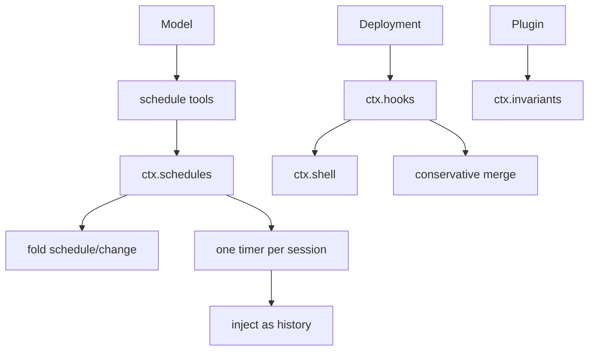
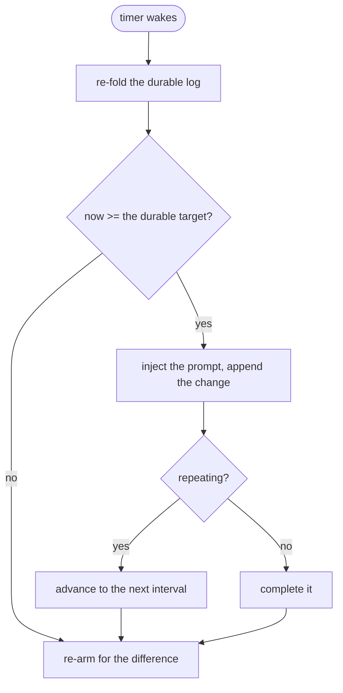
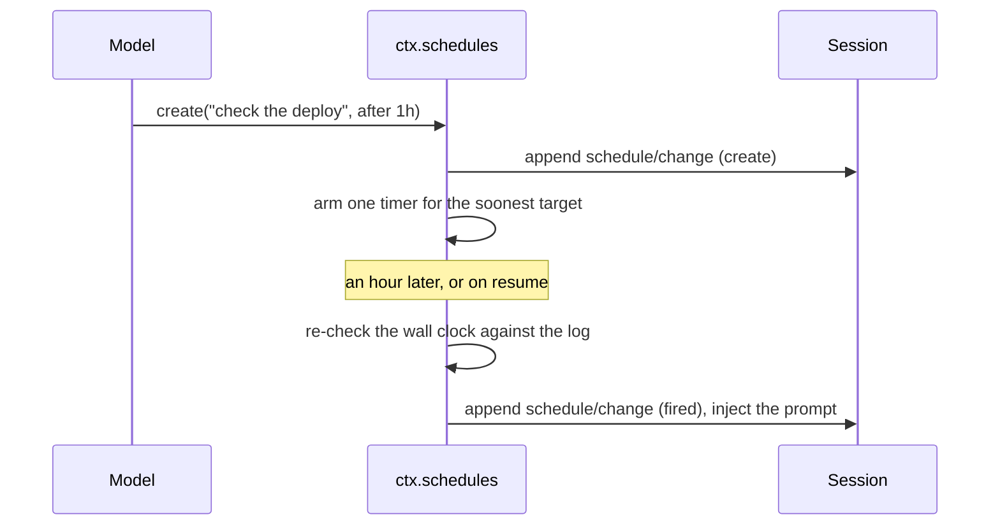

# Schedules, hooks, and invariants — the harness reaching outside itself

# 1 · Requirements

## Introduction

Three services that all involve something outside the loop having a say.

**Schedules** are durable reminders. A model says "remind me in an hour"; an
hour later, something has to inject that reminder — surviving a restart in
between, because a reminder that evaporates when the process does is not a
reminder. They live on the session log and are folded like every other durable
thing here.

**Hooks** let a deployment run its own commands at points in the loop: before a
tool, after a turn. This is the seam that lets an operator enforce policy the
harness knows nothing about. The interesting part is *merging*: several hooks
answer one question, and combining their answers has to be conservative.

**Invariants** are runtime checks a plugin registers about state that should
always hold. They exist to make a violated assumption loud rather than
mysterious.

## Glossary

- **Schedule record**: a durable reminder — one-shot at a time, one-shot after
  a delay, or repeating on an interval.
- **Overdue**: a reminder whose time passed while the session was not running.
- **Hook point**: a named moment the harness will run external commands at.
- **Matcher**: which calls a hook applies to.
- **Merged outcome**: one decision assembled from several hooks' answers.
- **Invariant**: a named predicate over state, checked on demand.

## Mental Model & Invariants

**Model:**

- A schedule is a fold over the log, like a goal. The timer is a *projection*
  of it — armed from durable state, never the state itself.
- Delivery is session-local and honest about it. A reminder fires on time while
  the session lives; otherwise it is overdue, and says so when the session
  returns. Pretending otherwise would promise durability the design does not
  have.
- Hooks are the deployment's code, not the harness's. They can block, and the
  harness must combine several answers *without* softening any of them.
- An invariant that cannot be checked is worse than none, because it reads like
  a guarantee.

**Invariants:**

- **I1 — A reminder never fires early.** Every wake-up re-checks the wall
  clock against the durable target.
- **I2 — A repeating reminder has a floor.** An interval below the minimum is
  refused, so a schedule cannot become a busy loop.
- **I3 — Merging hooks is conservative.** Any block wins; an ask is only
  overridden by a block; nothing is quietly upgraded to allow.
- **I4 — A hook's output is bounded before it is stored.**
- **I5 — A failing invariant names what it checked.**

## Decisions & Corrections (log)

- 2026-08-25 — the Claude Code and Codex hook dialects are not ported: this
  layer provides the neutral protocol, and a dialect is a consumer's bridge.

## Dev Environment (config-as-code — pointers only)

- Deps: `pyproject.toml` (`uv sync`) · Gate: `uv run pytest tests -q`
- Reference: `services/schedule.py`, `schedule_domain.py`, `hooks_protocol.py`,
  `invariants.py`

## Requirements

### Requirement 1: Schedule records

#### Acceptance Criteria

1. THE domain SHALL support three kinds: `at` (an instant), `after` (a delay),
   and `every` (an interval).
2. A record SHALL carry an id, a prompt, its kind, and its next target instant.
3. A prompt that is empty after trimming SHALL be refused.
4. An interval below the configured minimum SHALL be refused, naming it (I2).
5. A target instant outside a four-digit year SHALL be refused.
6. Decoding a stored record SHALL reject an unknown kind, a missing field, or a
   malformed instant.

### Requirement 2: Folding schedules

#### Acceptance Criteria

1. THE domain SHALL fold a log of `schedule/change` events into the active
   schedules.
2. A create SHALL add one; a delete SHALL remove it; a fire SHALL either
   complete a one-shot or advance a repeating one.
3. Folding SHALL be deterministic and reproducible from the log alone.
4. A schedule whose target has passed SHALL be reported as overdue rather than
   silently dropped.

### Requirement 3: The schedule runtime

#### Acceptance Criteria

1. THE runtime SHALL provide `ctx.schedules`, folding durable state per
   session.
2. THE runtime SHALL arm at most one timer per session, for the soonest target.
3. On waking, THE runtime SHALL re-check the wall clock and SHALL NOT deliver
   before the durable target (I1).
4. Delivering SHALL inject the prompt as a plugin-sourced message and append a
   `schedule/change` recording the firing.
5. A repeating schedule SHALL be re-armed for its next interval after firing.
6. WHEN a session is resumed with a passed target, THE runtime SHALL deliver
   promptly and mark the delivery overdue.
7. THE runtime SHALL register tools to create, list, and delete schedules.

### Requirement 4: The hook protocol

#### Acceptance Criteria

1. THE protocol SHALL match a hook against a call by literal alternation or by
   regular expression, as the hook declares.
2. THE protocol SHALL run a hook through `ctx.shell`, inheriting its timeout
   and process-group termination.
3. THE protocol SHALL decode a hook's exit code, stdout JSON, and stderr into a
   structured output.
4. A non-zero exit with no JSON SHALL be a block carrying the stderr summary.
5. THE protocol SHALL merge several outputs conservatively: any block wins,
   an ask survives unless blocked, and additional context accumulates (I3).
6. A hook requesting an input rewrite SHALL be recorded as a warning and not
   honoured.
7. Stored hook output SHALL be summarised to a bounded length (I4).
8. THE protocol SHALL support detached runs whose output is not awaited.

### Requirement 5: Invariants

#### Acceptance Criteria

1. THE registry SHALL provide `ctx.invariants` and register a named predicate
   with a description.
2. `check` SHALL run every registered invariant and report which failed, with
   the description (I5).
3. An invariant that raises SHALL be reported as failed rather than aborting
   the sweep.
4. Registration SHALL be scoped to the calling fiber.

### Non-Functional

- **NF 1**: stdlib only.
- **NF 2**: every bound is a named constant (EP1).

## Out of Scope

- The Claude Code and Codex hook dialects — the neutral protocol ships here;
  a dialect bridge is a consumer's plugin.
- Cross-process schedule delivery. Delivery is session-local by design and
  says so.
- `message_feedback`, attachments, `typert`, `long_term_memory` — next sprint.

# 2 · Design

## End-to-End Walkthrough

**A reminder.** The model calls the schedule tool: "in an hour, check whether
the deploy finished". That becomes a `schedule/change` event on the session
log — durable, folded, replayable, exactly like a goal.

The *timer* is a projection of that. The runtime folds the log, finds the
soonest target, and arms one timer for it. When it wakes it re-checks the wall
clock against the durable target and refuses to deliver early, because a timer
is an approximation and the log is the truth. It fires by injecting the prompt
as a plugin-sourced message and appending another change recording that it
fired.

Delivery is **session-local**, and the design says so rather than implying
otherwise. If the process is not running when the hour passes, nothing fires;
when the session comes back, the reminder is delivered promptly and marked
overdue. The alternative — a daemon that delivers into a dead session — is a
much larger promise, and half-making it would be worse than not making it.

Repeating schedules have a floor. An interval of one second is not a reminder,
it is a busy loop with a prompt attached, so anything below the minimum is
refused at creation with the minimum named.

**A hook.** A deployment wants its own check before every write. It registers a
hook with a matcher and a command; at the hook point the protocol matches,
runs the command through `ctx.shell` — inheriting the timeout and the
process-group kill from sprint 08 rather than reinventing either — and decodes
exit code, stdout JSON, and stderr into a structured answer.

Merging is the part with judgement in it. Several hooks may answer one
question, and the rule is **restraint**: any block wins, and the first block's
reason is the one reported; an ask survives unless something blocked; extra
context accumulates from all of them. Nothing is ever quietly upgraded toward
allow. A merge that let two permissive hooks outvote one restrictive one would
mean an operator's "no" depends on how many other hooks are installed, which is
not a policy anyone can reason about.

## Tech Stack

- Python 3.13+, stdlib only · `ctx.shell` for hook execution
- Test command: `uv run pytest tests -q`

## Directory Structure

```
src/pydsh/governance/
  __init__.py
  schedule_domain.py  # records, validation, the fold
  schedule.py         # ScheduleRuntime (ctx.schedules) + its tools
  hooks.py            # matching, running, decoding, merging
  invariants.py       # InvariantRegistry (ctx.invariants)
tests/
  test_schedule.py
  test_hooks.py
```

## Architecture Overview



## Workflow



## Module Design

### `governance.schedule_domain`

```
MIN_EVERY_INTERVAL_SECONDS = 300
create_at_record(id, prompt, at_ms, now_ms) / create_after_record / create_every_record
decode_schedule_record(value) -> dict
fold_schedules(changes, now_ms) -> {"active": [...], "overdue": [...]}
class ScheduleError(ValueError): code
```

### `governance.schedule.ScheduleRuntime` — `provide = "schedules"`

```
list(session) ; create(session, spec) ; delete(session, id)
async tick(session, now_ms)          # what the timer calls, and tests call
```

### `governance.hooks`

```
matches(matcher, value) -> bool
async run_hook(ctx, hook, payload, signal) -> HookOutput
parse_hook_output(exit_code, stdout, stderr) -> HookOutput
merge_hook_outputs(outputs) -> MergedOutcome
summarize_stderr(text, max_chars) -> str
class HooksProtocol(Service)         # provide = "hooks"
```

### `governance.invariants.InvariantRegistry` — `provide = "invariants"`

```
register(name, description, predicate) -> dispose
check() -> {"passed": [...], "failed": [{"name", "description", "reason"}]}
```

## Key Algorithms (pseudo-code)

```
ALGORITHM merge hook outputs                       (I3 — restraint)
  1. outcome <- allow, no reasons
  2. for each output:
       if it says do-not-continue, or decides block or deny:
          if nothing has blocked yet: record block, and keep the FIRST reason
       if it decides ask: remember that
       accumulate any additional context and system messages
       if it asked to rewrite the input: record a warning, do not honour it
  3. if nothing blocked and something asked: the outcome is ask
  # Never upgraded toward allow. If two permissive hooks could outvote one
  # restrictive one, an operator's "no" would depend on how many other hooks
  # happen to be installed — which is not a policy anyone can reason about.
```

```
ALGORITHM the schedule timer
  1. fold the durable log for this session
  2. target <- the soonest active target ; if none, disarm and stop
  3. arm ONE timer for (target - now), bounded by the scheduler's maximum
  4. on waking:
       re-fold, and re-check now against the DURABLE target        (I1)
       if now < target: go back to 3
       # A timer is an approximation; the log is the truth. Firing on the
       # timer alone delivers early after a clock adjustment or a long GC.
       deliver, append the firing, advance or complete, go back to 1
```

## Sequence Diagrams



```mermaid
sequenceDiagram
    participant Loop
    participant Hooks as ctx.hooks
    participant Shell as ctx.shell
    Loop->>Hooks: at this point, with this payload
    Hooks->>Shell: run each matching hook command
    Shell-->>Hooks: exit codes, stdout, stderr
    Hooks->>Hooks: merge — any block wins, first reason kept
    Hooks-->>Loop: one decision
```

## Data Models

One new session event, `schedule/change`, log-only and full-value. No new
store: schedules are a fold, exactly like goals.

## Error Handling Strategy

Schedule inputs fail with a code (`invalid_prompt`, `frequency_too_high`,
`invalid_rule`) because the caller is a model that must retry differently for
each. Hook failures become *outputs*, not exceptions: a deployment's broken
script must not crash the loop, and a non-zero exit with no JSON is read as a
block carrying its stderr — the conservative reading.

## Testing Strategy

- **Integration**: schedules over a real session log, fired by driving the
  clock rather than by waiting.
- **Property**: a reminder never fires before its durable target.
- **Property**: merging is conservative under every ordering of outputs.

## Correctness Properties

### Property 1: A reminder never fires early
- **Statement**: *For any* wake-up before the durable target, nothing is
  delivered.
- **Validates**: 3.3 (I1)

### Property 2: Merging cannot be softened by adding permissive hooks
- **Statement**: *For any* set of outputs containing one block, the merged
  outcome blocks — in any order, with any number of allows.
- **Validates**: 4.5 (I3)

### Property 3: Schedules survive a restart
- **Statement**: *For any* schedule, folding a reloaded log gives the same
  active set.
- **Validates**: 2.3

## Edge Cases

- **A target in the past at creation** — refused for `at`; a reminder for a
  moment that has gone is a mistake, not an instruction.
- **A session resumed long after a target** — delivered promptly, marked
  overdue.
- **Two schedules due at the same instant** — both delivered, in creation
  order.
- **An interval just below the minimum** — refused, with the minimum named, so
  the caller can correct it in one step.
- **A hook that writes JSON *and* exits non-zero** — the JSON decides; the exit
  code is the fallback for hooks that do not speak the protocol.
- **An invariant that raises** — reported as failed with the exception as its
  reason, and the sweep continues.

## Decisions

### Decision: merging hooks is conservative, and never a vote
**Context:** several hooks answer one question, and averaging or majority is
the obvious combinator.
**Decision:** any block wins; ask survives unless blocked; nothing moves toward
allow.
**Rationale:** if permissive hooks could outvote a restrictive one, whether an
operator's "no" takes effect would depend on how many *other* hooks happen to
be installed. That is not a policy anyone can reason about, and the failure is
silent — the block simply does not happen.

### Decision: the timer re-checks the log, never trusts itself
**Context:** a timer that fires at the right moment could just deliver.
**Decision:** re-fold and compare the wall clock to the durable target.
**Rationale:** a timer is an approximation. A clock adjustment, a long pause, a
suspended laptop — all make it fire at the wrong time, and an early delivery is
indistinguishable to the model from a correct one. The log is the truth and is
cheap to re-read.

### Decision: delivery is session-local, and says so
**Context:** "remind me in an hour" implies the reminder happens.
**Decision:** it happens if the session is alive; otherwise it is overdue and
delivered on return, labelled.
**Rationale:** the alternative is a daemon that delivers into sessions nobody
is running, which is a far larger promise about process lifetime and delivery
guarantees. Half-making it is worse than not making it: a user who believes a
reminder will fire and finds it did not is worse off than one who was told it
is best-effort.

### Decision: a repeating interval has a floor
**Context:** the natural implementation accepts any positive interval.
**Decision:** refuse anything below the minimum.
**Rationale:** a one-second repeat is not a reminder, it is a busy loop with a
prompt attached — and each firing costs a model turn. The floor is the
difference between a feature and a way to spend money quickly.

## Security Considerations

Hooks execute deployment-supplied commands with the harness's privileges, which
is their purpose — they are how an operator enforces policy the harness knows
nothing about. They run through `ctx.shell`, inheriting its process-group
termination, so a hook that hangs is stopped along with anything it started. A
hook's *output* is data: it is bounded before being stored, and a request to
rewrite a call's input is recorded and refused rather than applied.

# 3 · Tasks

## Status marks
<!-- [ ] pending | [x] done | [!] BLOCKED: reason | [-] DROPPED: <reason> |
     [>] → <spec_id> -->

## Tasks

- [x] 1. Schedules
  - [x] 1.1 `governance/schedule_domain.py` — records, validation, the fold
    - **Requirements**: 1.1–1.6, 2.1–2.4
    - **Properties**: 3
  - [x] 1.2 `governance/schedule.py` — the runtime, the timer, the tools
    - **Depends**: 1.1
    - **Requirements**: 3.1–3.7
    - **Properties**: 1
- [x] 2. Hooks and invariants
  - [x] 2.1 `governance/hooks.py` — matching, running, decoding, merging
    - **Requirements**: 4.1–4.8
    - **Properties**: 2
  - [x] 2.2 `governance/invariants.py`
    - **Requirements**: 5.1–5.4
  - [x] 2.3 Export surface
    - **Depends**: 1.2, 2.2
- [x] 3. Tests
  - [x] 3.1 `test_schedule.py` — driven by the clock, not by waiting
    - **Depends**: 1.2
    - **Requirements**: 1.1–1.6, 2.1–2.4, 3.1–3.7
    - **Properties**: 1, 3
  - [x] 3.2 `test_hooks.py` — real commands, conservative merging
    - **Depends**: 2.2
    - **Requirements**: 4.1–4.8, 5.1–5.4
    - **Properties**: 2
- [x] 4. Wrap
  - [x] 4.1 README
    - **Depends**: 3.2
  - [x] 4.2 Close the sprint
    - **Depends**: 4.1

## Log

**[2026-08-25]** — Created and activated. The hook *dialects* stay out: this
layer is the neutral protocol.

**[2026-08-25]** — CLOSED / SHIPPED. All tasks done, 801 tests green, up from
758.

A clean port, and the sprint's value is in three refusals rather than three
features:

- A repeating interval below five minutes is rejected, naming the floor. A
  one-second "reminder" is a busy loop with a prompt attached, and each firing
  costs a model turn — the floor is the difference between a feature and a way
  to spend money quickly.
- A one-shot in the past is rejected rather than delivered immediately, because
  it is a mistake and delivering it hides the mistake.
- A hook asking to rewrite a call's input is recorded and refused. Approve-or-
  refuse and rewrite-the-call are very different powers, and the second needs
  its own design rather than arriving as a field on the first.

The judgement worth keeping is the merge rule. Several hooks answer one
question and the combination is **never a vote**: any block wins, an ask
survives unless blocked, nothing moves toward allow. If permissive hooks could
outvote a restrictive one, whether an operator's "no" took effect would depend
on how many *other* hooks happened to be installed — and the failure would be
silent. The test asserts it under every ordering.

Schedules are tested by passing the clock in rather than waiting for it, which
is both faster and the only way to actually check the property that matters:
delivery is decided against the durable log, not against the timer that woke.
