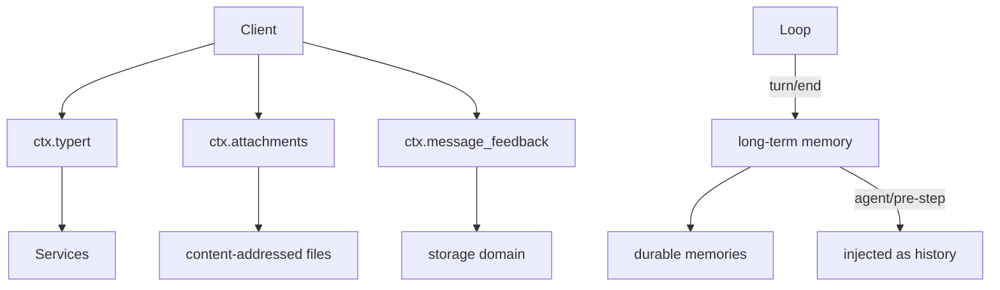
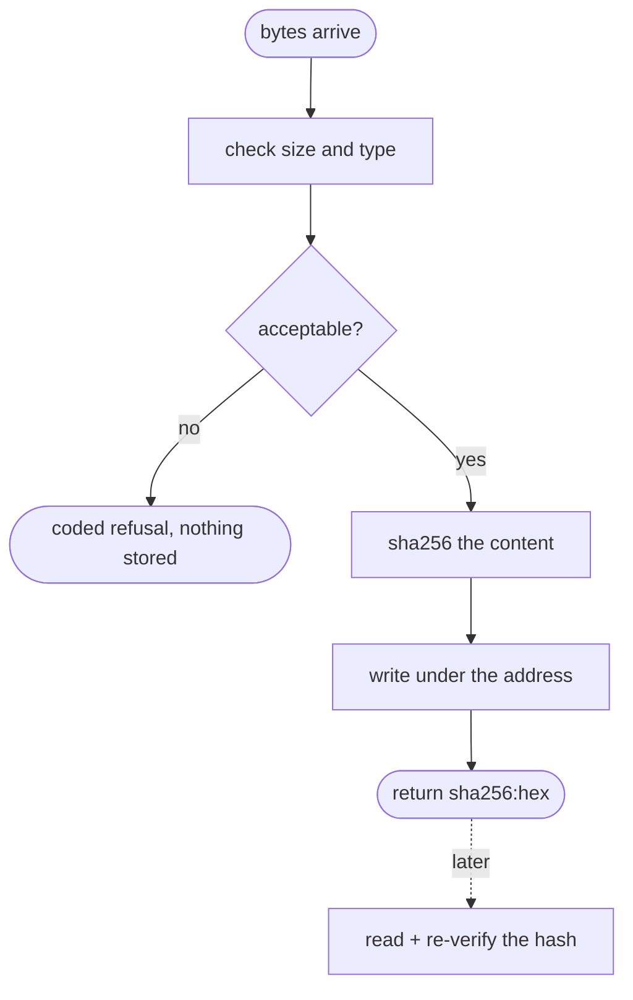

# Sidecars and memory — what hangs off a conversation without being in it

# 1 · Requirements

## Introduction

Four services that share one shape: they are *about* a conversation without
being *part* of it. None of them appends to the surface, and that is the point
— a rating on a message, a picture attached to it, a memory of a previous
conversation, and a way to expose any of it to a client are all things the
model's history should not carry.

- **Attachments** are immutable binary content — images, today — referenced by
  a content address rather than a path.
- **Message feedback** is a durable rating or note on a finished assistant
  message. Not an event: an opinion about the conversation, held beside it.
- **Typert** is the declarative remote-call protocol. A class marks methods
  remotable; the registry collects them; a client invokes by name.
- **Long-term memory** captures what was said across sessions and recalls the
  relevant parts into a later one.

## Glossary

- **Attachment id**: a content address, `sha256:<hex>`. Not a path, not a URL.
- **Sidecar**: durable data keyed to a message, stored beside the log.
- **Lifecycle fence**: the session identity that stops a reused id from
  exposing a previous life's sidecars.
- **Remote scope**: a class exposed to clients; its remotable methods are its
  endpoints.
- **Recall**: memories injected into a later conversation as history.

## Mental Model & Invariants

**Model:**

- An attachment reference is an **opaque content address**, never a path or a
  bearer URL. Handing a model a path would make the reference also an
  instruction about where to look.
- Feedback is a sidecar, deliberately not an event. An opinion about a message
  is not part of what was said, and putting it on the surface would change what
  the model reads next time.
- Typert is reflection, not code generation. The reference generates bindings
  with a TypeScript compiler; Python can read its own decorators.
- Memory is injected as history, like every other context in this port.

**Invariants:**

- **I1 — An attachment is validated before it is referenced.** Bytes are
  checked first, so a reference never points at something that was not
  accepted.
- **I2 — A reference is content-addressed.** The same bytes give the same id,
  and reading verifies the bytes still match.
- **I3 — Feedback is fenced by session lifetime.** A reused session id does not
  expose the previous life's rows.
- **I4 — Feedback writes are compare-and-set**, so two clients cannot silently
  overwrite each other.
- **I5 — A remotable method is opt-in.** Nothing is exposed by being public.

## Decisions & Corrections (log)

- 2026-08-25 — `attachment_image` ports as validation only: decoding image
  formats belongs to a consumer's chosen library, not to a stdlib-only core.

## Dev Environment (config-as-code — pointers only)

- Deps: `pyproject.toml` (`uv sync`) · Gate: `uv run pytest tests -q`
- Reference: `services/attachment.py`, `attachment_local.py`,
  `attachment_image.py`, `message_feedback.py`, `typert.py`,
  `plugins/long_term_memory.py`

## Requirements

### Requirement 1: Attachments

#### Acceptance Criteria

1. THE store SHALL provide `ctx.attachments` as an interface with a
   local-filesystem implementation.
2. An id SHALL be `sha256:<hex>` of the content, so identical bytes give one id
   (I2).
3. `validate_image` SHALL check size and declared type **without** storing.
4. `save_image` SHALL validate, then store, then return the reference (I1).
5. `read_image` SHALL verify the stored bytes still hash to the reference, and
   raise a coded error if not.
6. Failures SHALL carry stable codes so a caller routes on the code rather than
   the exception type.
7. Limits SHALL be configurable, with documented defaults.

### Requirement 2: Message feedback

#### Acceptance Criteria

1. THE service SHALL provide `ctx.message_feedback` over a storage domain.
2. Rows SHALL be keyed by session and message, and fenced by the session's
   lifetime identity (I3).
3. `put` SHALL be a whole-value replace against a version token; a mismatch
   SHALL be refused (I4).
4. A `put` identical to what is stored SHALL succeed without changing the
   version.
5. A note SHALL be refused when blank, or when it exceeds the byte limit, each
   with its own code.
6. `delete` SHALL be idempotent when absent, and version-checked when present.
7. Writes for one session SHALL be serialised.

### Requirement 3: Typert

#### Acceptance Criteria

1. `remote` SHALL mark a method remotable, optionally under a wire name.
2. `remote_scope` SHALL mark a class, optionally under a wire scope name.
3. THE registry SHALL provide `ctx.typert` and collect endpoints by scanning a
   registered object.
4. Registering an object with no remotable methods SHALL raise, rather than
   registering nothing.
5. `invoke` SHALL dispatch by scope and method, returning a structured result
   or a structured failure — never raising at the caller.
6. Invoking an unknown scope or method SHALL be a structured failure naming
   what is available.
7. `list` SHALL describe every endpoint.

### Requirement 4: Long-term memory

#### Acceptance Criteria

1. THE plugin SHALL capture a prompt-and-reply pair at each turn end, into
   durable storage, keyed by content so a repeat does not duplicate.
2. THE plugin SHALL recall relevant memories on the first step of a turn and
   inject them as plugin-sourced history.
3. Relevance SHALL be keyword overlap, with a recency fallback when nothing
   overlaps.
4. THE number of recalled memories SHALL be bounded.
5. THE plugin SHALL make no model calls.
6. Recalled messages SHALL be tagged so a renderer can tell them from user
   input.

### Non-Functional

- **NF 1**: stdlib only.
- **NF 2**: every limit is a named constant (EP1).

## Out of Scope

- Decoding image formats. Validation checks size and declared type; a consumer
  that needs real decoding brings a library.
- A JSON-RPC transport for typert — the registry ships here, the wire is the
  app-layer sprint.
- Embedding-based recall.

# 2 · Design

## End-to-End Walkthrough

**An attachment.** A client uploads an image. The store validates the bytes
*first* — size, declared type — and only then writes them, returning
`sha256:<hex>`. The order matters: a reference handed out before validation
points at something that was never accepted, and the caller has no way to know.

The id is deliberately **not a path**. A path handed to a model is also an
instruction about where to look, and a bearer URL is a credential. A content
address is neither: it names the bytes, and reading verifies they still hash to
it, so a corrupted or swapped file is caught at read rather than silently
served.

**Feedback.** A user rates an assistant message. That is an opinion *about* the
conversation, not part of it, so it is a sidecar in a storage domain rather
than an event on the log. If it were an event it would be on the surface, and
the model would read the user's rating of its last answer as part of the
conversation — which changes the conversation.

Two protections. Rows are fenced by the session's *lifetime identity*, not its
id, so a reused id does not surface a previous life's ratings. And writes are
compare-and-set against a version token, so two clients editing the same note
do not silently overwrite each other — the same reasoning as goals, for the
same reason.

**Typert.** A service marks methods remotable and the registry collects them by
*reflection*. The reference generates bindings with a TypeScript compiler
because TypeScript cannot read its own decorators at runtime; Python can, so
the code generator becomes a scan.

Exposure is opt-in. Nothing is remotable by being public — a client can reach
exactly what was marked, and adding a public helper to a service does not
quietly widen the API.

**Memory.** At each turn end the plugin stores the prompt and reply, keyed by
content so re-running the same exchange does not accumulate duplicates. On the
first step of a later turn it retrieves what overlaps and injects it as
history, tagged as a recall.

Relevance is keyword overlap with a recency fallback. That is unglamorous and
honest: without relevance feedback there is no way to know whether a cleverer
score is better, and a bad ranking that *looks* principled is harder to
diagnose than a simple one.

## Tech Stack

- Python 3.13+, stdlib only (`hashlib`, `json`)
- Test command: `uv run pytest tests -q`

## Directory Structure

```
src/pydsh/sidecar/
  __init__.py
  attachments.py  # AttachmentStore, LocalAttachments
  feedback.py     # MessageFeedback over a storage domain
  typert.py       # remote, remote_scope, TypertRegistry
  memory.py       # LongTermMemory
tests/
  test_sidecars.py
```

## Architecture Overview



## Workflow



## Module Design

### `sidecar.attachments`

```
class AttachmentError(Exception): code
class AttachmentStore(Service):     # provide = "attachments"
    image_limits() -> dict
    validate_image(data, declared_type) -> dict        # no write
    async save_image(data, declared_type) -> dict      # validate then write
    async read_image(id) -> bytes                      # verify then return
class LocalAttachments(AttachmentStore): root
```

### `sidecar.feedback.MessageFeedback` — `provide = "message_feedback"`

```
async start()
async list(session) ; async put(session, message_id, entry, version)
async delete(session, message_id, version)
```

### `sidecar.typert`

```
remote(name=None) ; remote_scope(name=None)
class TypertRegistry(Service):      # provide = "typert"
    register(obj) -> dispose ; list() ; async invoke(scope, method, args)
```

### `sidecar.memory.LongTermMemory` — `provide = "long_term_memory"`

## Key Algorithms (pseudo-code)

```
ALGORITHM save an attachment                          (I1, I2)
  1. validate the bytes: size against the limit, declared type against the
     allowed set — and DO NOT write yet
     # A reference handed out before validation points at something that was
     # never accepted, and the caller cannot tell.
  2. id <- "sha256:" + hex digest of the content
  3. write under that id, atomically
  4. return the reference
  # Reading later re-hashes and compares: a swapped or corrupted file is caught
  # at read rather than served as though it were the original.
```

```
ALGORITHM put feedback                                (I3, I4)
  1. fence <- the session's lifetime identity (created-at + cwd), not its id
     # A reused id would otherwise surface the previous life's ratings.
  2. take the session's write slot                     (R2.7)
  3. stored <- the current row, if its fence matches
  4. if the caller's version token != the stored version: refuse
     # Compare-and-set: two clients editing one note do not silently
     # overwrite each other.
  5. if the new value equals the stored value: return it, version unchanged
     # A no-op write must not churn the version and invalidate other clients.
  6. write the whole value with a new version
```

```
ALGORITHM recall
  1. only on the first step of a turn
  2. words <- the significant words of the prompt
  3. score each stored memory by overlap with `words`
  4. take the top N by score; if none scored, take the N most recent
     # Unglamorous on purpose: without relevance feedback there is no way to
     # know a cleverer score is better, and a bad ranking that looks principled
     # is harder to diagnose than a simple one.
  5. inject them as one plugin-sourced, recall-tagged message
```

## Sequence Diagrams

```mermaid
sequenceDiagram
    participant Client
    participant Feedback as ctx.message_feedback
    participant Domain as storage domain
    Client->>Feedback: put(message, rating, version=3)
    Feedback->>Domain: read the current row
    Domain-->>Feedback: version 4
    Feedback-->>Client: refused — the row moved on; re-read
```

```mermaid
sequenceDiagram
    participant Loop
    participant Memory as long-term memory
    participant Store
    Loop->>Memory: agent/pre-step (turn 5, step 1)
    Memory->>Store: what overlaps with this prompt?
    Store-->>Memory: two earlier exchanges
    Memory-->>Loop: enter, plus one recall message
    Note over Loop: history, not prompt — the same rule as every other context
```

## Data Models

Two new stores, both conforming to `data-architecture.md`:

| Store | Writer | Source of truth? | Read path | Retention | Reproducible? |
|---|---|---|---|---|---|
| attachment content | the store, content-addressed | **yes** — the only copy of the bytes | by id, hash-verified | until a consumer prunes | no |
| feedback rows | `ctx.message_feedback`, through a storage domain | **yes** for the opinion | by session and message, fenced | with the session | no |
| memories | long-term memory | **yes** | keyword recall | until pruned | no |

None of them is derived, and that is the honest reading: an opinion, a picture,
and a memory of an earlier conversation cannot be recomputed from the log.

## Error Handling Strategy

Coded errors everywhere, because every one of these is reachable from a client
over a wire: `attachment-too-large`, `attachment-corrupt`, `note-blank`,
`note-too-large`, `version-mismatch`. Typert never raises at the caller — an
invocation returns a structured failure, since the caller is on the other side
of a transport that cannot carry a Python traceback.

## Testing Strategy

- **Property**: the same bytes give the same id, and a tampered file fails to
  read.
- **Property**: compare-and-set under two writers.
- **Integration**: memory captured from one session and recalled in another.

## Correctness Properties

### Property 1: A reference names its bytes
- **Statement**: *For any* content, saving twice gives one id, and reading
  after tampering raises.
- **Validates**: 1.2, 1.5 (I2)

### Property 2: Two feedback writers cannot both win
- **Statement**: *For any* two puts claiming the same version, one is refused.
- **Validates**: 2.3 (I4)

### Property 3: Nothing is remotable by accident
- **Statement**: *For any* public method not marked, invoking it fails.
- **Validates**: 3.1 (I5)

## Edge Cases

- **The same image saved twice** — one id, one file; the second save is a
  no-op that returns the same reference.
- **A file swapped on disk** — the read fails with `attachment-corrupt`, rather
  than serving whatever is there now.
- **Feedback on a session id reused after a rebuild** — invisible, because the
  fence is the lifetime, not the id.
- **A put identical to what is stored** — succeeds, version unchanged, so a
  retry does not invalidate other clients' tokens.
- **A recall with no overlap** — the most recent memories, rather than nothing.
- **A scope with no marked methods** — registration raises, because registering
  nothing looks like success.

## Decisions

### Decision: an attachment reference is a content address, not a path
**Context:** returning a path is simpler and lets a caller read the file
directly.
**Decision:** `sha256:<hex>`, opaque, resolved only through the store.
**Rationale:** a path handed to a model is also an instruction about where to
look, and a bearer URL is a credential that leaks by being logged. A content
address is neither, and it makes the integrity check free: reading re-hashes,
so a swapped file is caught rather than served.

### Decision: feedback is a sidecar, not a session event
**Context:** everything else durable in this port is an event on the log.
**Decision:** a storage domain, keyed to the message.
**Rationale:** an event would be on the *surface*, so the model would read the
user's rating of its previous answer as part of the conversation — which
changes the conversation the rating was about. An opinion belongs beside the
log, not in it.

### Decision: typert reflects rather than generates
**Context:** the reference runs a TypeScript compiler to emit bindings.
**Decision:** decorators and a runtime scan.
**Rationale:** the generator exists because TypeScript cannot read its own
decorators at runtime. Python can, so porting the generator would be porting a
workaround for a constraint this language does not have.

### Decision: recall is keyword overlap, and says so
**Context:** embeddings would rank better.
**Decision:** overlap, with a recency fallback.
**Rationale:** without relevance feedback there is no way to tell whether a
cleverer score is actually better — and a bad ranking that looks principled is
harder to diagnose than an obviously simple one. The seam is here for a
consumer that has embeddings and can measure the difference.

## Security Considerations

Attachment ids are opaque and content-derived, so possessing one grants nothing
beyond the bytes it names, and reading verifies integrity. Feedback rows are
fenced by session lifetime, so a reused id cannot surface another life's data.
Typert exposes only what was explicitly marked — adding a public helper to a
service does not quietly widen the remote API, which is the failure mode of
expose-by-default.

# 3 · Tasks

## Status marks
<!-- [ ] pending | [x] done | [!] BLOCKED: reason | [-] DROPPED: <reason> |
     [>] → <spec_id> -->

## Tasks

- [x] 1. Attachments
  - [x] 1.1 `sidecar/attachments.py`
    - **Requirements**: 1.1–1.7
    - **Properties**: 1
- [x] 2. Feedback
  - [x] 2.1 `sidecar/feedback.py`
    - **Requirements**: 2.1–2.7
    - **Properties**: 2
- [x] 3. Typert and memory
  - [x] 3.1 `sidecar/typert.py`
    - **Requirements**: 3.1–3.7
    - **Properties**: 3
  - [x] 3.2 `sidecar/memory.py`
    - **Requirements**: 4.1–4.6
  - [x] 3.3 Export surface
    - **Depends**: 3.2
- [x] 4. Tests
  - [x] 4.1 `test_sidecars.py`
    - **Depends**: 3.3
    - **Requirements**: 1.1–1.7, 2.1–2.7, 3.1–3.7, 4.1–4.6
    - **Properties**: 1, 2, 3
- [x] 5. Wrap
  - [x] 5.1 README + the data-architecture rows
    - **Depends**: 4.1
  - [x] 5.2 Close the sprint
    - **Depends**: 5.1

## Log

**[2026-08-25]** — Created and activated. Image *decoding* stays out: a
stdlib-only core validates size and declared type, and a consumer that needs
real decoding brings a library.

**[2026-08-25]** — CLOSED / SHIPPED. 845 tests green (44 new in
`tests/test_sidecars.py`), including the capture-then-recall integration across
two sessions over a real storage domain.

Four reference defects found by reading before porting, and not carried:

1. **The scan ran every property getter.** `register` walked `dir(obj)` and
   `getattr`'d each name to look for the marker — so finding out whether a
   method is remotable *executes* every property on the object. A scan with
   side effects, and one that fails outright if any property raises. Scanning
   the class instead of the instance finds the same methods and runs nothing;
   `test_scanning_does_not_run_property_getters` holds the line.
2. **A caller's bad arguments were reported as a server fault.** `fn(**args)`
   inside the try meant a signature mismatch came back as `FAILED`, sending a
   client to look for a handler bug that never happened. Binding against the
   signature first separates `BAD_ARGUMENTS` from `FAILED`.
3. **`InvocationDescriptor.implementation` was declared and never read** — an
   S2 orphan on the wire contract, where an unread field is worse than absent
   because a client can reasonably send it. Dropped.
4. **Memory would have fed on itself.** The reference captures every
   `user/message` in the log, but a recall it injected last turn *is* a
   `user/message` on the surface — so a memory would be stored inside a memory
   and compound every turn. Capture now takes only `source.kind == "user"`;
   `test_a_recall_is_not_captured_as_a_memory` proves it over two real turns.

Two smaller deviations, both deliberate. `MemoryStore.has()` was a linear scan
of every memory per candidate pair, O(n) per check on a path that runs at every
turn end — the content digest is now the storage key, so dedup is a lookup and
R4.1's "keyed by content" is structural rather than a convention. And the
reference reads `DSH_LONG_TERM_MEMORY_DIR` out of the environment; memory here
sits on the storage domain like every other durable thing in this port, so
there is no second I/O path and no ad-hoc `os.environ` (EP1).
