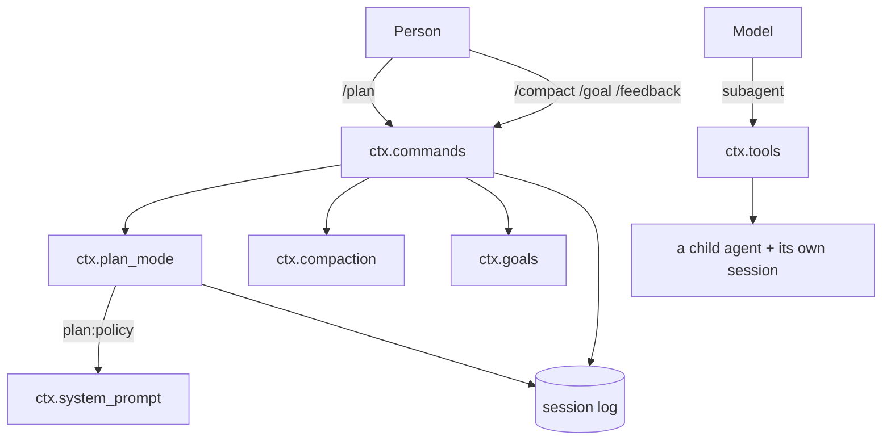
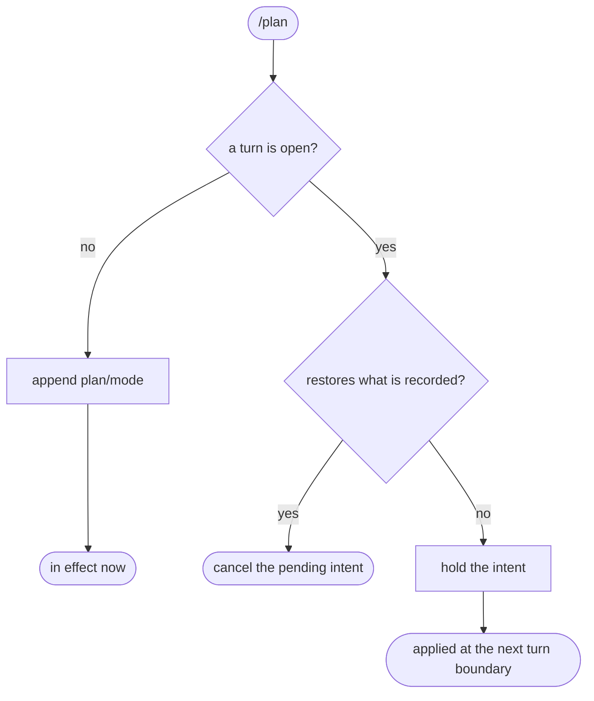

# Plan mode, subagents, and the commands a person types

# 1 · Requirements

## Introduction

Everything here was blocked on something that now exists, and each piece is the
*user-facing* half of a seam already shipped.

- **Plan mode** was deferred from sprint 04 with the note that it needs
  commands and projections first. Both exist. It is a recorded, per-session
  collaboration state: while it is on, a deployment's guidance joins the system
  prompt, and a tool presents the finished plan for review.
- **The subagent tool** spawns a child agent on a standalone prompt. The child
  cannot see the parent's conversation, which is the point.
- **`/compact`, `/goal`, `/feedback`** are the human entrances to compaction,
  goals, and session feedback. Each seam has been shipped and tested; none has
  a way for a person to reach it.

This is the last core sprint before the provider adapters. After it, everything
in the catalogue except the providers, `mcp_client`, and the app layer is
ported.

## Glossary

- **Recorded state**: state folded from the session log, so a resumed session
  has it without an in-memory mirror.
- **Pending intent**: a choice made mid-turn, applied at the next turn
  boundary rather than immediately.
- **Standalone prompt**: a subagent's whole input. It sees nothing else.
- **Branch depth**: how many agents deep *this* chain of calls is — not how
  many agents are running.

## Mental Model & Invariants

**Model:**

- Plan mode is **folded from the log**, never mirrored in memory. A resumed or
  forked session is in plan mode if its log says so, with nothing to rebuild.
- A choice made mid-turn is **pending** until a turn boundary. Flipping the
  policy under a running turn would change the rules the model is working
  under, halfway through the work.
- A subagent is a **separate conversation**, and depth is a property of the
  chain that reached it, not of the process.
- A slash command **never raises at the person who typed it**. Every failure is
  a `CommandResult` they can read.

**Invariants:**

- **I1 — Plan state comes from the log.** The last `plan/mode` event wins;
  there is no authoritative in-memory copy.
- **I2 — A flip lands on a turn boundary.** A choice made during an open turn
  is applied before the next turn's first step, never inside the one running.
- **I3 — Subagent depth is per-branch.** N siblings running at once are all at
  the same depth; only nesting increases it.
- **I4 — A subagent dies with its parent's turn.** Cancelling the parent stops
  the child, rather than leaving it to finish and charge for it.
- **I5 — A command's failure is a result, not an exception.**

## Decisions & Corrections (log)

- 2026-08-25 — The `plan` projection reports `{active}`, not `{active,
  pending}` as the reference does. A projection folds the log; a pending intent
  is by design *not* in the log, so a `pending` key there is structurally always
  `False` — a field that looks informative and can never be true. `get(agent)`
  reports it instead, because that is the object that holds it.
- 2026-08-25 — `SessionStore.remove` added (task 1.3). A subagent's scratch
  session is created outside a plugin fiber, so it is store-owned until unload;
  without a way to release it a long-running process keeps every session it
  ever spawned.
- 2026-08-25 — The command plugins go in a new top tier, `pydsh.console`, not
  beside the registry in `pydsh.operating`. `/compact` and `/goal` read
  `ctx.compaction` and `ctx.goals`, which sit *above* the operating core; a
  command living below the service it drives inverts the dependency.

## Dev Environment (config-as-code — pointers only)

- Deps: `pyproject.toml` (`uv sync`) · Gate: `uv run pytest tests -q`
- Reference: `services/plan_mode.py`, `plugins/subagent.py`,
  `plugins/command_compact.py`, `plugins/command_goal.py`,
  `plugins/command_feedback.py`

## Requirements

### Requirement 1: Plan mode

#### Acceptance Criteria

1. THE service SHALL provide `ctx.plan_mode`, with the deployment's guidance
   text as required configuration — an empty or missing section SHALL fail at
   construction, not at first use.
2. State SHALL be folded from `plan/mode` events, last one winning (I1).
3. `set` SHALL report what it did: `committed`, `queued`, `cancelled`, or
   `noop`.
4. A change requested while a turn is open SHALL be queued and applied at the
   next turn boundary (I2).
5. A queued change that would restore the state already recorded SHALL cancel
   the pending intent rather than store a no-op.
6. WHILE plan mode is in effect, `ctx.system_prompt` SHALL carry the guidance
   as a `plan:policy` section; otherwise that section SHALL be empty.
7. THE `/plan` command SHALL turn plan mode on (with optional text delivered as
   a message), and `/plan off` SHALL turn it off.
8. THE `exit_plan_mode` tool SHALL refuse outside plan mode, refuse a plan that
   is not markdown starting with a heading, and refuse — naming what is missing
   — when no review channel is mounted.
9. A `plan` projection SHALL expose the recorded state when
   `ctx.session_projections` is mounted. It SHALL NOT report a pending intent:
   a projection folds the log, and a pending intent is deliberately not in it.

### Requirement 2: The subagent tool

#### Acceptance Criteria

1. THE tool SHALL run a child agent on a new session with the caller's
   standalone prompt, returning the child's assistant text.
2. Depth SHALL be counted along the call chain, so parallel siblings do not
   exhaust the budget (I3).
3. Exceeding the depth limit SHALL be refused as a tool error, and a limit of
   zero SHALL forbid spawning entirely.
4. THE child SHALL be cancelled when the parent's turn is cancelled (I4).
5. THE child's session SHALL be released when the call returns, on every path.
6. THE returned text SHALL be bounded, and SHALL say so when it was trimmed.
7. A missing provider or model SHALL be a tool error naming what is unset.

### Requirement 3: `/compact`

#### Acceptance Criteria

1. THE command SHALL take no arguments and SHALL reject any.
2. On success it SHALL report how many surface entries were shadowed and the
   estimated tokens, carrying the summary event's seq.
3. Nothing compactable SHALL be an ordinary success, not an error.
4. A refusal SHALL be reported by code, in text a person can act on.
5. A cancelled compaction SHALL say so rather than reporting the refusal that
   the cancellation caused.

### Requirement 4: `/goal`

#### Acceptance Criteria

1. THE command SHALL parse `show` (empty), `clear`, `pause`, `resume`,
   `edit <text>`, and otherwise a new objective.
2. `edit` with no replacement text SHALL be an error naming the usage.
3. THE command SHALL never expose compare-and-set to the person typing: it
   reads the current goal and uses its revision.
4. Creating over a goal that is still running SHALL be refused with the
   alternatives named.
5. A rejected change SHALL come back as a readable error, not a `GoalError`.
6. THE rendered goal SHALL state status, objective, rounds, and the commands
   available from here.

### Requirement 5: `/feedback`

#### Acceptance Criteria

1. `record_feedback` SHALL append a **log-only** `feedback/record` event, so
   feedback never enters the model's history.
2. Empty text SHALL be refused, leaving no event.
3. THE reply SHALL name the session and the anonymous user id.
4. THE reply SHALL disclose the sharing policy, and SHALL say it is
   unconfigured when no telemetry service is mounted.

### Non-Functional

- **NF 1**: stdlib only.
- **NF 2**: every limit a named constant (EP1).

## Out of Scope

- A review channel implementation (`ctx.user_questions`). This sprint defines
  the seam `exit_plan_mode` asks for and refuses clearly without it; the
  channel itself is a client concern.
- Session telemetry. `/feedback` discloses "not configured" when absent.
- Subagent lineage in `ctx.agent_loop.roots()` — a child is not registered as
  a root, and nesting beyond the depth counter is not modelled.

# 2 · Design

## End-to-End Walkthrough

**Plan mode.** A person types `/plan`. If no turn is running, the flip is
recorded immediately and the next request carries the `plan:policy` section. If
a turn *is* running, the choice is held: applying it mid-turn would change the
rules the model is working under, halfway through the work it was asked to do.
The held choice lands at the next turn boundary, before the first step.

Everything about the state is folded from the log, so a resumed session is in
plan mode without anything having been rebuilt — and a client watching
`session/event` sees the flip commit rather than being told about it separately.

**A subagent.** The model calls `subagent` with a standalone prompt. A fresh
session and a child agent run it, and the child's assistant text comes back as
the tool result, bounded. The child sees nothing of the parent conversation,
which is what makes the prompt have to be standalone.

Two things the reference gets wrong here and this port does not. Depth is
counted along the *chain*, not in a shared counter — the reference increments
one integer, so five siblings running in parallel look like depth five and the
fifth is refused for nesting that never happened. And the child is fused to the
parent's activity signal, so cancelling the parent's turn actually stops it; the
reference leaves the child running to completion and returns its result into a
turn that has already ended.

**The commands.** `/compact` calls the compaction seam and turns each refusal
into a sentence. `/goal` reads the current goal and uses its revision, so the
person never sees compare-and-set. `/feedback` appends a log-only event —
log-only because feedback about a conversation must not become part of it, the
same reasoning that keeps message feedback in a sidecar.

## Tech Stack

- Python 3.13+, stdlib only
- Test command: `uv run pytest tests -q`

## Directory Structure

```
src/pydsh/plan/
  __init__.py
  mode.py            # PlanMode: fold, pending intents, section, command, tool
src/pydsh/agent/
  subagent.py        # SubagentTool
src/pydsh/console/
  __init__.py
  compact.py         # CompactCommand
  goal.py            # GoalCommand
  feedback.py        # FeedbackCommand, record_feedback
tests/
  test_plan_mode.py
  test_subagent.py
  test_console_commands.py
```

## Architecture Overview



## Workflow



## Module Design

### `plan.mode.PlanMode` — `provide = "plan_mode"`

```
fold_plan_mode(events) -> bool
get(agent) -> {active, pending?}       # pending is in-memory, so it is here
set(agent, active) -> "committed" | "queued" | "cancelled" | "noop"
PLAN_PROJECTION                        # {active} — folded, so no pending
```

### `agent.subagent.SubagentTool` — registers `subagent`

### `console.compact` / `console.goal` / `console.feedback`

```
CompactCommand   # /compact
GoalCommand      # /goal, parse_goal_command(raw) -> {kind, ...}
FeedbackCommand  # /feedback, record_feedback(session, text)
```

## Key Algorithms (pseudo-code)

```
ALGORITHM set plan mode                               (I1, I2)
  1. target <- the pending intent if there is one, else the folded state
  2. if the request equals target: "noop"
  3. if a turn is open:
       if the request equals the RECORDED state:
         drop the pending intent, "cancelled"
         # It restores what is already true, so there is nothing to apply and
         # storing one would queue a write that does nothing.
       else: hold it, "queued"
  4. else: append plan/mode, drop any pending intent, "committed"
```

```
ALGORITHM run a subagent                              (I3, I4)
  1. depth <- the caller's branch depth + 1
     # Counted along the chain. A shared counter measures how many subagents
     # are running, so five siblings look like five levels of nesting.
  2. if depth > the limit: refuse, naming the limit
  3. child <- an agent on a NEW session, fused to the caller's activity signal
     # So cancelling the parent's turn stops the child, rather than leaving it
     # to finish and bill for work no one is waiting for.
  4. run the standalone prompt; collect the child's assistant text, bounded
  5. release the child's session on every path, including the failing one
```

## Sequence Diagrams

```mermaid
sequenceDiagram
    participant Person
    participant Plan as ctx.plan_mode
    participant Log as session log
    participant Loop
    Person->>Plan: /plan (a turn is running)
    Plan-->>Person: entering plan mode (applies from the next step)
    Loop->>Plan: agent/pre-step (next turn, step 1)
    Plan->>Log: append plan/mode {active: true}
    Note over Loop: the request assembled after this carries plan:policy
```

## Data Models

One new event type, conforming to `data-architecture.md`:

| Store | Writer | Source of truth? | Read path | Retention | Reproducible? |
|---|---|---|---|---|---|
| `plan/mode` events | `ctx.plan_mode` | **source of truth** for the collaboration state | folded from the log, last wins | with the session | yes — the fold is pure |
| Pending plan intents | `ctx.plan_mode`, in memory | **not** durable, deliberately | `get(agent).pending` | until the next turn boundary | no — a choice not yet applied is not yet a fact |
| `feedback/record` events | `/feedback` | **source of truth** | log-only; never on the surface | with the session | no |

The pending-intent row is the interesting one: it is the *only* state here that
is deliberately lost on restart. A choice made mid-turn and never applied is
not a fact about the conversation, and persisting it would resurrect an
intention the person may have abandoned two restarts ago.

## Error Handling Strategy

Commands return `CommandResult(kind="error", …)`; nothing raises at the person
who typed. `exit_plan_mode` raises inside the tool pipeline, which turns it into
a tool error the model reads and can act on — the model is the caller there,
not a person. `CompactionRefused` grows a `code` so `/compact` can route
refusals to sentences rather than pattern-matching on message text.

## Testing Strategy

- **Property**: a flip during an open turn is invisible until the boundary.
- **Property**: parallel siblings all run at the same depth.
- **Integration**: `/plan` on, a real turn, and the section in the request the
  adapter actually received.

## Correctness Properties

### Property 1: A turn runs under one set of rules
- **Statement**: *For any* flip requested while a turn is open, every step of
  that turn assembles the same `plan:policy` text.
- **Validates**: 1.4 (I2)

### Property 2: Depth counts nesting, not concurrency
- **Statement**: *For any* N subagents started from one parent, all are at the
  same depth and none is refused for depth.
- **Validates**: 2.2 (I3)

### Property 3: A command never raises at the person
- **Statement**: *For any* input to `/goal`, `/compact` or `/feedback`, the
  result is a `CommandResult`.
- **Validates**: 3.4, 4.5, 5.2 (I5)

## Edge Cases

- **`/plan` twice** — the second is a `noop`, not a second event.
- **`/plan` then `/plan off` inside one turn** — the second cancels the first's
  pending intent; the log records nothing.
- **`exit_plan_mode` with no review channel** — refused, naming the missing
  channel, rather than silently approving.
- **A subagent whose child produces no text** — says so, rather than an empty
  result that reads as success with nothing to show.
- **`/compact` on a two-message conversation** — success, "nothing to compact".
- **`/goal edit` with no goal** — an error naming the usage.

## Decisions

### Decision: the command plugins live in a new `pydsh.console` tier
**Context:** the obvious home is beside the registry in `pydsh.operating`.
**Decision:** a new top-level package that may import from anything below it.
**Rationale:** `/compact` drives `ctx.compaction` and `/goal` drives
`ctx.goals`, both of which sit above the operating core. A command living below
the service it drives inverts the dependency, and the inversion is the kind
that only hurts later, when something in `operating` cannot be moved without
dragging compaction with it.

### Decision: subagent depth is carried, not counted
**Context:** the reference keeps one integer per plugin instance.
**Decision:** the depth of the caller's chain, resolved from the calling agent.
**Rationale:** the shared counter measures concurrency. Five subagents started
in parallel from one turn each increment it, so the fifth is refused for
nesting five deep that never happened — and the failure appears only under
parallel tool calls, which is exactly when it is hardest to see.

### Decision: a pending plan intent is never persisted
**Context:** everything else about plan mode is folded from the log.
**Decision:** in memory, keyed weakly by session, lost on restart.
**Rationale:** a choice made mid-turn and not yet applied is not a fact about
the conversation. Persisting it would let an intention the person abandoned two
restarts ago flip the policy on a session they have since resumed.

## Security Considerations

A subagent runs with the parent's tools and no conversation of its own, so a
prompt-injected instruction cannot reach the parent's history — but it *can*
spend the parent's budget, which is what the depth limit and the cancellation
fusion bound. `/feedback` writes log-only, so nothing a person says about a
conversation re-enters it as instruction.

# 3 · Tasks

## Status marks
<!-- [ ] pending | [x] done | [!] BLOCKED: reason | [-] DROPPED: <reason> |
     [>] → <spec_id> -->

## Tasks

- [x] 1. Supporting seams
  - [x] 1.1 `CompactionRefused.code`, and codes at the raise sites
    - **Requirements**: 3.4
  - [x] 1.2 `Agent.activity` — the turn's signal, readable
    - **Requirements**: 2.4
  - [x] 1.3 `SessionStore.remove`, and the `plan/mode` / `feedback/record`
        event types
    - **Requirements**: 1.2, 2.5, 5.1
- [x] 2. Plan mode
  - [x] 2.1 `plan/mode.py` — fold, intents, section, projection
    - **Requirements**: 1.1–1.6, 1.9
    - **Properties**: 1
  - [x] 2.2 The `/plan` command and `exit_plan_mode`
    - **Depends**: 2.1
    - **Requirements**: 1.7, 1.8
- [x] 3. Subagent
  - [x] 3.1 `agent/subagent.py`
    - **Depends**: 1.2
    - **Requirements**: 2.1–2.7
    - **Properties**: 2
- [x] 4. The console commands
  - [x] 4.1 `console/compact.py`
    - **Depends**: 1.1
    - **Requirements**: 3.1–3.5
  - [x] 4.2 `console/goal.py`
    - **Requirements**: 4.1–4.6
  - [x] 4.3 `console/feedback.py`
    - **Requirements**: 5.1–5.4
  - [x] 4.4 Export surface
    - **Depends**: 4.3
- [x] 5. Tests
  - [x] 5.1 `test_plan_mode.py`
    - **Depends**: 2.2
    - **Requirements**: 1.1–1.9
    - **Properties**: 1
  - [x] 5.2 `test_subagent.py`
    - **Depends**: 3.1
    - **Requirements**: 2.1–2.7
    - **Properties**: 2
  - [x] 5.3 `test_console_commands.py`
    - **Depends**: 4.4
    - **Requirements**: 3.1–3.5, 4.1–4.6, 5.1–5.4
    - **Properties**: 3
- [x] 6. Wrap
  - [x] 6.1 README + the data-architecture rows + the catalogue
    - **Depends**: 5.3
  - [x] 6.2 Close the sprint
    - **Depends**: 6.1

## Log

**[2026-08-25]** — Created and activated. `plan_mode` has waited since sprint
04, which deferred it for needing commands and projections; both shipped in 07
and 05. This is the last core sprint before the provider adapters.

**[2026-08-25]** — CLOSED / SHIPPED. 918 tests green (73 new across
`test_plan_mode.py`, `test_subagent.py`, `test_console_commands.py`).

Four reference defects found by reading before porting, and not carried:

1. **The queued flip was applied anyway.** The reference renders the *pending*
   value into the `plan:policy` section, so a flip requested during step one of
   a turn reaches step two of that same turn — applied and queued at once, and
   the queueing bought nothing. The section here renders the **recorded** state
   only. `test_a_turn_runs_under_one_set_of_rules` drives a real two-step turn
   and asserts the guidance reaches neither step.
2. **`ctx.effect(lambda: setattr(self, "_disposed", True))` ran at
   construction.** `ctx.effect` invokes its argument *now* and keeps the return
   value as teardown, so `_disposed` was True from birth — and `setattr`
   returning `None` meant no teardown was registered at all. The same scar this
   port hit in sprint 07. The field was dead anyway; it is gone.
3. **Subagent depth measured concurrency, not nesting.** One integer per plugin
   instance, incremented per call: five subagents started in parallel from one
   turn each add one, and the fifth is refused for nesting five deep that never
   happened. Depth is now carried on the calling agent, so a branch is a
   branch. The bug only appears under parallel tool calls, which is exactly
   when it is hardest to attribute — `test_parallel_siblings_are_all_at_the_same_depth`
   runs five at a limit of two.
4. **The child outlived the parent's turn.** The caller's signal was never
   passed down, so cancelling the parent left the child streaming and returning
   its answer into a turn that had already ended. The child's lifetime is now
   fused to `parent.activity`, and the test drives a real parent turn, a real
   cancel, and asserts the child's own adapter saw the abort.

Two deviations recorded as they were made:

- **A pending intent is stamped with a log sequence, not a turn number.** The
  first attempt used `payload["turn"]`, which comes from the agent's in-memory
  counter — and a test caught it disagreeing with the log the moment a turn was
  written by anything other than that agent. The seq of the most recent
  `turn/start` is assigned by the log and only goes up, so "a later turn than
  the one I was queued in" is decidable without trusting anyone's count.
- **`exit_plan_mode` refuses when no review channel is mounted.** The reference
  has the same guard, followed by unreachable code that sets approval anyway.
  Here the refusal names `ctx.user_questions`, and the approval path is real
  and tested against a stub channel — an approval nobody gave is the one
  outcome this tool must never manufacture.

Three supporting seams were added rather than worked around: a `code` on
`CompactionRefused` (so `/compact` routes on something stable instead of
matching message text), `Agent.activity` (the turn's signal, readable by
anything acting on the turn's behalf), and `SessionStore.remove` (a scratch
session created outside a plugin fiber was store-owned until unload).
