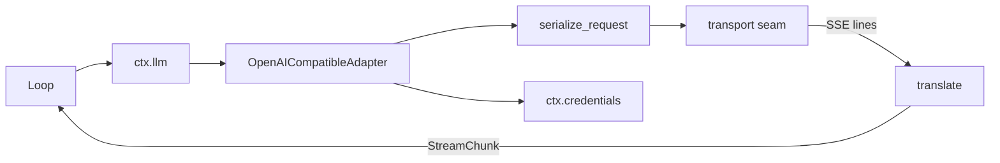
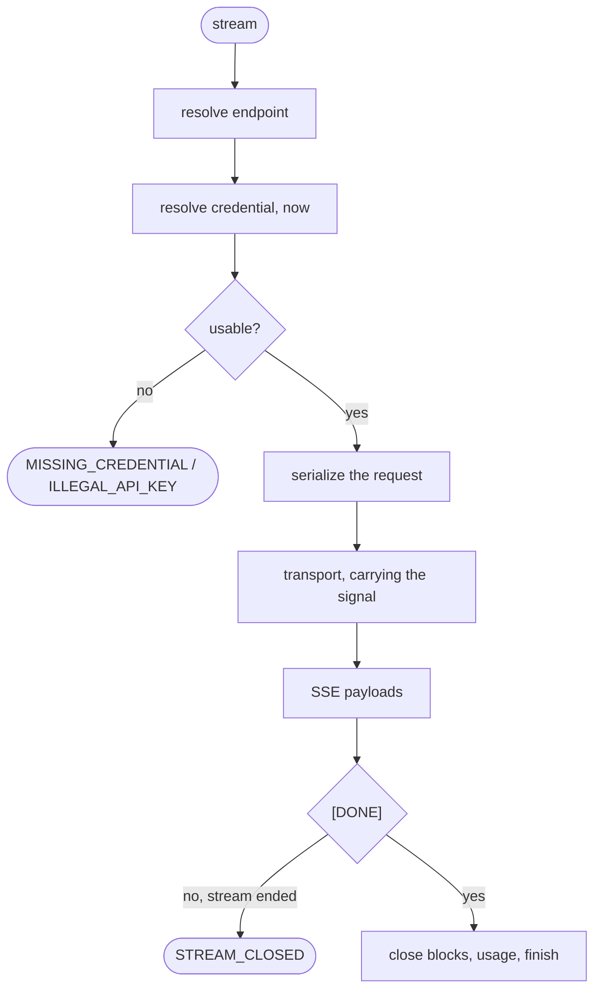
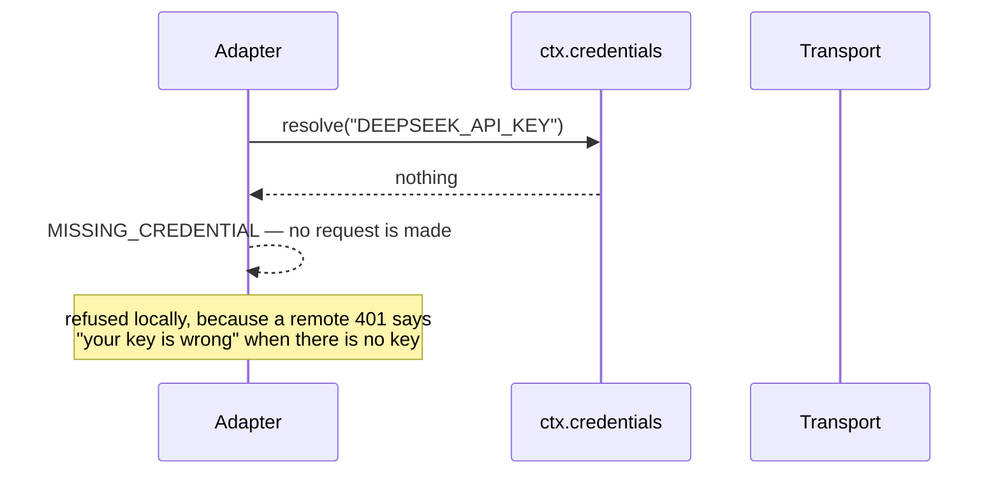

# The wire — OpenAI-compatible adapters

# 1 · Requirements

## Introduction

Everything in this repo so far stops at the seam. `ctx.llm` resolves a route,
merges a call config, and dispatches through a waterfall — and then hands off to
an adapter that has never existed here. This sprint writes the adapter.

The shape is one translation in each direction, with a transport in between:

```
harness messages → serialize → wire body → transport → SSE lines → translate → StreamChunk
```

Three pieces:

- **`openai_compatible`** — the whole `/chat/completions` dialect, and the seven
  vendors that speak it.
- **`deepseek`** — the same dialect plus reasoning content and its own error
  vocabulary.
- **The transport seam** — pluggable, so every test in this sprint runs over
  real SSE bytes and no socket.

`pi_ai` and `mcp_client` are the next sprint; the app layer follows it.

## Glossary

- **Wire format**: the JSON body an OpenAI-compatible endpoint accepts.
- **SSE**: server-sent events — `data: {...}` lines, terminated by
  `data: [DONE]`.
- **Transport**: what turns a request into a stream of SSE lines. A seam.
- **Dormant provider**: registered, routable, and unusable until its credential
  resolves — which is a different state from "not configured".

## Mental Model & Invariants

**Model:**

- A **block index is a harness identity**, allocated by the translator. The
  wire's `tool_calls[].index` is the *provider's* numbering of its own tool
  calls and shares a namespace with nothing.
- Credentials are **refs resolved per call**, never environment reads at import
  time. `ctx.credentials` already owns this.
- A stream that ends without `[DONE]` is **truncated, not finished**. Reporting
  it as a clean stop would hand a caller half an answer as a whole one.
- Cancelling a turn must reach **the socket**, not just the loop around it.

**Invariants:**

- **I1 — One index, one block.** No two blocks in a response share an index.
- **I2 — Tool results are adjacent to the call they answer.** Serialization
  never puts a user message between an assistant's `tool_calls` and the
  `role: "tool"` messages that answer them.
- **I3 — No credential is read at import time.**
- **I4 — A truncated stream raises.** Only `[DONE]` produces a finish.
- **I5 — An aborted signal stops the request.**

## Decisions & Corrections (log)

- 2026-08-25 — httpx is an **optional extra**, lazily imported, exactly as the
  reference does it. The core stays stdlib-only and a consumer that brings its
  own transport never installs it; a consumer that wants the batteries writes
  `pydsh[http]`. Hand-rolling an async TLS HTTP/1.1 client on `asyncio` to
  avoid the dependency would be a large, subtle surface (chunked encoding,
  redirects, proxies) in exchange for nothing a user asked for.

## Dev Environment (config-as-code — pointers only)

- Deps: `pyproject.toml` (`uv sync`) · Gate: `uv run pytest tests -q`
- Reference: `services/adapters/openai_compatible.py`,
  `services/adapters/deepseek.py`

## Requirements

### Requirement 1: Serialization

#### Acceptance Criteria

1. `serialize_messages` SHALL translate harness messages into wire messages:
   system and user text as `content`, assistant text plus `tool_calls`, and
   each tool result as its own `role: "tool"` message.
2. Tool-result messages SHALL be emitted **before** any user text from the same
   harness message (I2).
3. Assistant reasoning SHALL be sent back only alongside tool calls.
4. A tool result with no output SHALL send a placeholder rather than an empty
   string, and `content` SHALL never be null.
5. `serialize_request` SHALL always stream, and SHALL ask for usage.
6. Tools, temperature, max tokens, stop sequences, and reasoning effort SHALL
   be carried when present and omitted when not.

### Requirement 2: Translation

#### Acceptance Criteria

1. `translate` SHALL turn SSE payloads into `StreamChunk`s: block starts, text,
   reasoning and tool-call deltas, then block ends, usage, and one finish.
2. Every block SHALL get a distinct harness index, whatever the wire numbers
   its tool calls (I1).
3. Block ends SHALL be emitted in the order the blocks opened.
4. A `finish_reason` SHALL map to a harness finish; an unknown or filtered one
   SHALL be an error finish naming the reason.
5. Usage SHALL be mapped with cache reads deducted from input tokens, so the
   counts stay disjoint.
6. A completed response with no content at all SHALL finish as
   `EMPTY_RESPONSE`.
7. A malformed payload SHALL raise `MALFORMED_RESPONSE`.
8. A stream that ends before `[DONE]` SHALL raise `STREAM_CLOSED` (I4).

### Requirement 3: The adapter

#### Acceptance Criteria

1. `OpenAICompatibleAdapter` SHALL take endpoint and credential resolution as
   injected callables, so the registering plugin owns policy.
2. A missing key SHALL raise `MISSING_CREDENTIAL`, and an illegal one
   `ILLEGAL_API_KEY`, before any request is made.
3. A provider that allows an empty key SHALL work without one.
4. THE transport SHALL be pluggable, and SHALL receive the call's cancel
   signal (I5).
5. An HTTP error SHALL raise an `LlmError` carrying the status.
6. `provider_info` SHALL report the configured display name and limits.

### Requirement 4: The provider table and plugin

#### Acceptance Criteria

1. THE plugin SHALL register the seven default OpenAI-compatible providers,
   dormant until their credentials resolve.
2. Base URLs and credential refs SHALL come from config, never from an
   environment read at import time (I3).
3. Config SHALL be able to add providers and override defaults, by name.
4. Keys SHALL resolve through `ctx.credentials` when it is mounted, and be
   refused with a named ref when it is not.
5. An unknown provider SHALL raise `NO_ADAPTER`.

### Requirement 5: DeepSeek

#### Acceptance Criteria

1. THE DeepSeek adapter SHALL extend the OpenAI-compatible one rather than
   copy it.
2. It SHALL classify HTTP status and payload into stable error codes,
   including quota exhaustion.
3. It SHALL carry reasoning content through as reasoning blocks.

### Non-Functional

- **NF 1**: the core stays stdlib-only; httpx is an optional extra.
- **NF 2**: no test opens a socket.
- **NF 3**: every default is a named constant (EP1).

## Out of Scope

- `pi_ai` and `mcp_client` — the next sprint.
- Non-streaming completions. The seam streams; a caller wanting one answer
  collects the stream.
- Retry and backoff, which `ctx.llm` already owns per route.

# 2 · Design

## End-to-End Walkthrough

A step calls `ctx.llm.stream`. The seam resolves provider and model, merges the
call config, and hands a `GenerateOptions` to this adapter.

The adapter resolves the endpoint and the credential — the credential *now*,
through `ctx.credentials`, because a key rotated an hour ago should work
without a restart. A missing or malformed key is refused **here**, locally,
with a code that says which: a remote 401 tells a user their key is wrong when
in fact they never set one.

Then serialization. The interesting part is not the field mapping but the
*ordering*: an OpenAI-compatible endpoint requires the `role: "tool"` messages
answering a call to follow that call, with nothing in between. A harness user
message can carry both tool results and text, and the reference emits the text
first — which puts a user message between the call and its answer. Tool results
go first here.

The transport sends the body and yields SSE lines. It is a seam, and the reason
is testing: every test in this sprint feeds real SSE bytes through a transport
that never opens a socket. The default one is httpx, imported lazily.

Translation walks the payloads and maintains one open block per content kind.
The second interesting part is here: the wire numbers its tool calls from zero,
in a namespace of its own, and the reference uses that number directly as the
harness block index — so a response with text at index 0 and a tool call at
wire index 0 produces two different blocks claiming the same identity. The
translator allocates harness indices itself and keeps a wire→harness map.

At `[DONE]`, every open block closes in the order it opened, usage goes out,
and one finish follows. A stream that stops before `[DONE]` raises: the answer
is truncated, and reporting it as a clean stop hands the caller half an answer
as a whole one.

## Tech Stack

- Python 3.13+, stdlib only. `httpx` as the optional `[http]` extra.
- Test command: `uv run pytest tests -q`

## Directory Structure

```
src/pydsh/llm/adapters/
  __init__.py
  openai_compatible.py   # serialize, translate, the adapter, the plugin
  deepseek.py            # the dialect's extras
  transport.py           # the seam + the lazy httpx default
tests/
  test_openai_adapter.py
  test_deepseek_adapter.py
```

## Architecture Overview



## Workflow



## Module Design

### `llm.adapters.openai_compatible`

```
serialize_messages(messages) -> list[dict]
serialize_request(options) -> dict
map_finish_reason(reason) -> dict ; map_usage(usage) -> dict
translate(payloads) -> AsyncIterator[StreamChunk]
class OpenAICompatibleAdapter(LlmAdapter)
class OpenAICompatible(Service)     # the plugin, registers the table
ProviderConfig ; DEFAULT_PROVIDERS ; merge_providers
```

### `llm.adapters.transport`

```
Transport = (url, body, headers, signal) -> AsyncIterator[str]
httpx_transport(...)                # lazily imported, optional extra
```

### `llm.adapters.deepseek`

```
http_error_code(status) -> str ; is_quota_exceeded(status, payload) -> bool
class DeepSeekAdapter(OpenAICompatibleAdapter)
```

## Key Algorithms (pseudo-code)

```
ALGORITHM translate                                   (I1, I4)
  wire_to_harness <- {}      # the provider's tool numbering is its own
  for each payload:
    if payload is [DONE]:
      close every open block, in the order they opened
      emit usage, then exactly one finish
      if the finish is a clean stop and nothing ever opened: EMPTY_RESPONSE
      return
    for each choice's delta:
      reasoning / text: open on first sight, allocate an index, emit a delta
      for each tool call:
        harness_index <- wire_to_harness.setdefault(wire_index, allocate())
        # NOT the wire index: it is the provider's numbering of its own tool
        # calls, and using it directly collides with the text block at 0 —
        # two blocks with one identity, which the assembler cannot separate.
        emit a tool-call delta at harness_index
  raise STREAM_CLOSED
  # Falling out of the loop means the stream ended before [DONE]: the answer is
  # truncated, and a clean finish here hands back half an answer as a whole one.
```

```
ALGORITHM serialize one harness message               (I2)
  assistant -> {content, tool_calls?, reasoning_content only with tool_calls}
  user ->
    1. emit every tool-result block as its own role:"tool" message
    2. THEN emit the user text, if there is any
    # The endpoint requires the tool messages to follow the call that asked
    # for them with nothing in between. Text first puts a user message in that
    # gap, and the request is rejected — or worse, silently mis-attributed.
```

## Sequence Diagrams



## Data Models

No new stores. The adapter is stateless: everything it needs arrives in
`GenerateOptions`, and everything it produces is a `StreamChunk`. That is worth
stating rather than leaving implicit — an adapter that accumulated state across
calls would make two concurrent turns on one provider interfere.

## Error Handling Strategy

Every failure is an `LlmError` with a code: `MISSING_CREDENTIAL`,
`ILLEGAL_API_KEY`, `NO_ADAPTER`, `MALFORMED_RESPONSE`, `STREAM_CLOSED`,
`HTTP_<status>`, `QUOTA_EXCEEDED`. Codes, because the retry policy above this
routes on them and a message is not a contract.

## Testing Strategy

- **Property**: no two blocks in one response share an index.
- **Property**: a stream truncated at any point raises rather than finishing.
- **Integration**: a scripted SSE conversation with reasoning, text, and two
  tool calls, driven through a real agent turn.

## Correctness Properties

### Property 1: One index, one block
- **Statement**: *For any* response, the set of indices that open blocks are
  pairwise distinct — including when the wire numbers a tool call 0.
- **Validates**: 2.2 (I1)

### Property 2: A truncated stream never finishes cleanly
- **Statement**: *For any* prefix of a valid stream that stops before `[DONE]`,
  translation raises.
- **Validates**: 2.8 (I4)

### Property 3: Nothing separates a call from its result
- **Statement**: *For any* message list, no wire message sits between an
  assistant's `tool_calls` and the `role: "tool"` messages answering them.
- **Validates**: 1.2 (I2)

## Edge Cases

- **Text and a tool call in one response** — distinct indices, though the wire
  calls them both 0.
- **A tool call whose name arrives after its id** — accumulated, not dropped.
- **`[DONE]` with nothing before it** — `EMPTY_RESPONSE`, not a silent stop.
- **A provider that allows an empty key** (Ollama, vLLM) — works with none.
- **A key with a newline in it** — refused as `ILLEGAL_API_KEY` locally, rather
  than producing an unsendable header.
- **A cancelled turn mid-stream** — the transport sees the abort.

## Decisions

### Decision: the translator allocates block indices
**Context:** the wire hands each tool call an `index`, and using it is free.
**Decision:** allocate harness indices from one counter; map wire→harness.
**Rationale:** the wire's index numbers *tool calls*, not blocks — it starts at
0 for the first tool call regardless of how much text preceded it. Used
directly, a response with text and one tool call yields two blocks both
claiming index 0, and the assembler has no way to tell them apart. The bug
needs text *and* a tool call in one response to appear, which is the ordinary
case, not an exotic one.

### Decision: credentials resolve through `ctx.credentials`, per call
**Context:** the reference reads `os.environ` in the resolver, and builds part
of the provider table from `os.environ` at import time.
**Decision:** refs in config, resolved through the credentials service at the
moment of use.
**Rationale:** an import-time read is frozen for the life of the process, so a
rotated key needs a restart and a test cannot change it at all. It is also EP1:
a secret's location is configuration, and the service that owns that already
exists.

### Decision: the transport is a seam, and httpx is optional
**Context:** an adapter with a hard-wired HTTP client is untestable without a
socket.
**Decision:** a `Transport` callable, defaulting to a lazily imported httpx.
**Rationale:** the tests here feed real SSE bytes and never open a socket,
which is the only way to test truncation and malformed frames honestly. Keeping
httpx lazy also keeps the core's dependency list at one entry for consumers who
bring their own client.

## Security Considerations

A key is validated locally before it is put in a header, so an illegal one
cannot become a malformed request that leaks its contents into a proxy log.
`ctx.credentials.describe` is what a status line shows and it never returns a
value. HTTP errors carry a truncated body, deliberately: the whole body of a
401 from an unknown endpoint is not something to write into a session log.

# 3 · Tasks

## Status marks
<!-- [ ] pending | [x] done | [!] BLOCKED: reason | [-] DROPPED: <reason> |
     [>] → <spec_id> -->

## Tasks

- [x] 1. The wire
  - [x] 1.1 `llm/adapters/transport.py`
    - **Requirements**: 3.4, NF 1
  - [x] 1.2 `llm/adapters/openai_compatible.py` — serialize
    - **Requirements**: 1.1–1.6
    - **Properties**: 3
  - [x] 1.3 `llm/adapters/openai_compatible.py` — translate
    - **Requirements**: 2.1–2.8
    - **Properties**: 1, 2
  - [x] 1.4 The adapter and the provider plugin
    - **Depends**: 1.1, 1.3
    - **Requirements**: 3.1–3.6, 4.1–4.5
- [x] 2. DeepSeek
  - [x] 2.1 `llm/adapters/deepseek.py`
    - **Depends**: 1.4
    - **Requirements**: 5.1–5.3
- [x] 3. Export surface and packaging
  - [x] 3.1 Exports + the `[http]` extra in `pyproject.toml`
    - **Depends**: 2.1
- [x] 4. Tests
  - [x] 4.1 `test_openai_adapter.py`
    - **Depends**: 3.1
    - **Requirements**: 1.1–1.6, 2.1–2.8, 3.1–3.6, 4.1–4.5
    - **Properties**: 1, 2, 3
  - [x] 4.2 `test_deepseek_adapter.py`
    - **Depends**: 3.1
    - **Requirements**: 5.1–5.3
- [x] 5. Wrap
  - [x] 5.1 README + the catalogue
    - **Depends**: 4.2
  - [x] 5.2 Close the sprint
    - **Depends**: 5.1

## Log

**[2026-08-25]** — Created and activated. Reading the reference first turned up
the block-index collision (text and a tool call both at index 0) and the
tool-result ordering, both of which are in the requirements above rather than
waiting to be discovered during implementation.

**[2026-08-25]** — CLOSED / SHIPPED. 983 tests green (65 new across
`test_openai_adapter.py` and `test_deepseek_adapter.py`), every one of them
driving real SSE bytes through a transport that opens no socket.

The two defects named in the requirements were both real, and both are the
ordinary case rather than an exotic one:

1. **Two blocks, one index.** The reference uses the wire's
   `tool_calls[].index` directly as the harness block index. That number counts
   the provider's *tool calls*, starting at zero however much text preceded
   them — so a response with a paragraph and one tool call emits `block-start
   index=0 type=text` and `block-start index=0 type=tool-call`, and the
   assembler has no way to keep them apart. `test_text_and_a_tool_call_get_distinct_indices`
   would fail against the reference's translator.
2. **A user message between a call and its result.** Serialization emitted the
   user text before the `role: "tool"` messages, which puts a user turn in the
   one gap an OpenAI-compatible endpoint does not allow.

Three more found while implementing:

3. **Import-time environment reads.** Two base URLs in `DEFAULT_PROVIDERS` came
   from `os.environ` at module import, which freezes them for the life of the
   process and makes them untestable. They are constants overridable by config
   now, and `test_no_default_reads_the_environment_at_import_time` reloads the
   module with the variable set to prove it.
4. **The cancel signal never reached the socket.** `options.signal` was accepted
   and ignored, so a cancelled turn kept streaming and kept billing — the same
   defect sprint 16 fixed for subagents, one layer down. The signal is part of
   the `Transport` contract here.
5. **`reasoning_effort` was dropped on the floor.** The seam resolves it through
   the call config and the serializer never wrote it, so a configured setting
   silently had no effect.

Two deviations recorded as they were made:

- **Usage keys are snake_case** (`input_tokens`, not `inputTokens`). The
  reference emits camelCase, which `session_stats` does not read — the counts
  would have arrived and been ignored.
- **The "credits exhausted" pattern accepts a copula.** The reference matches
  `credits exhausted` but not `your credits are exhausted`, and the difference
  decides whether a spent account is classified as a quota (do not retry) or a
  rate limit (retry forever). Widened, with the reasoning in the code.

`DeepSeek` extends `OpenAICompatibleAdapter` through two hooks — `serialize`
and `wrap_lines` — rather than overriding `stream`. The reference copies the
whole serializer into its DeepSeek module, which is how one tool-ordering bug
became two.
