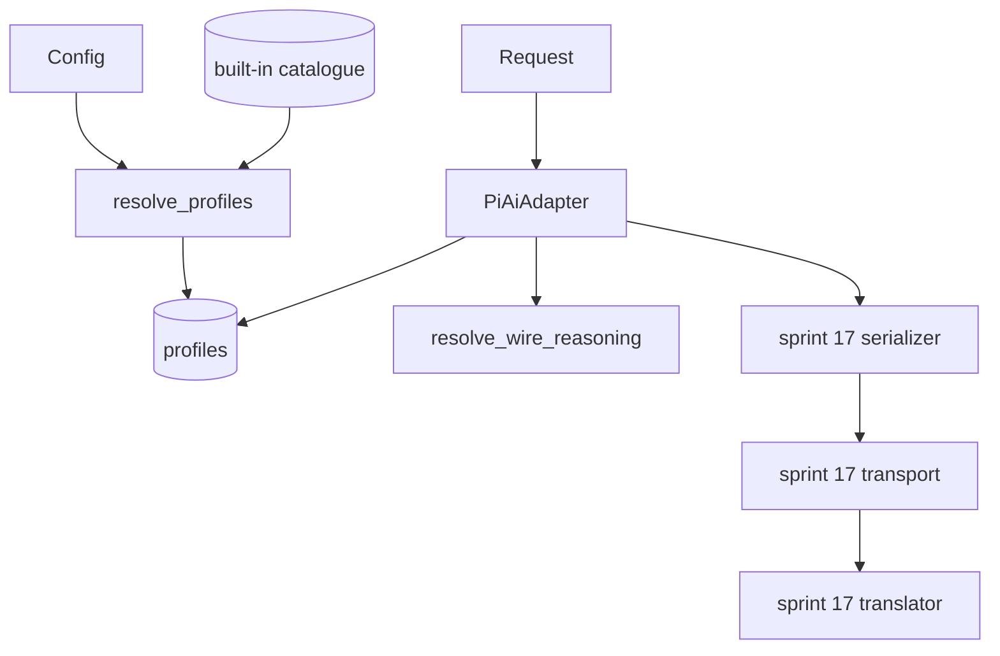
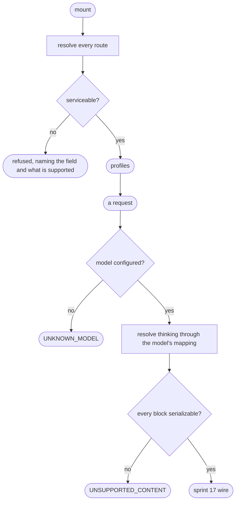

# The catalogue adapter — models with capabilities, not just names

# 1 · Requirements

## Introduction

Sprint 17's adapter has a flat table: a provider, a base URL, a credential ref.
It knows nothing about *models*. So compaction budgets against a guess,
`/model` has nothing to list, and a request for reasoning on a model that
cannot reason is discovered by the endpoint rather than here.

This sprint is the missing half: a built-in **catalogue** of providers and the
models they serve, each with its context window, output ceiling, input
modalities, and reasoning levels — overridable field by field from config, and
**fail-loud** on anything it cannot serve.

The wire is unchanged. Everything below the catalogue reuses sprint 17's
serializer, translator and transport, which is the whole reason this is a
sprint and not a rewrite.

## Glossary

- **Catalogue**: the built-in table of providers and their models.
- **Profile**: one resolved provider route — catalogue defaults with config
  laid over them, materialised once at mount.
- **Thinking format**: how a provider spells reasoning on the wire. `openai`
  sends `reasoning_effort`; `deepseek` sends a `thinking` structure.
- **Effort mapping**: a model's own `level → wire value` table, because two
  providers spell "high" differently.
- **Dormant route**: configured and routable, unusable until its credential
  resolves.

## Mental Model & Invariants

**Model:**

- A **capability is not a default.** The catalogue's `max_tokens` says what a
  model *can* produce; only an explicitly configured value becomes what a
  request *asks* for.
- The protocol and thinking-format tables are **deliberately narrow**, and a
  config naming something outside them is refused at mount with the supported
  list — not accepted and discovered to be broken at the first request.
- Config resolution happens **once, at mount**, and a bad config leaves the
  previous good routes serving rather than half-replacing them.
- A block the wire cannot carry is **refused, not dropped**.

**Invariants:**

- **I1 — An unserviceable config is refused at mount**, naming the field and
  what is supported.
- **I2 — A capability is never silently a default.**
- **I3 — Reasoning on a non-reasoning model is refused here**, not by the
  endpoint.
- **I4 — Nothing in a request is silently discarded.** A block the serializer
  would drop is a refusal.
- **I5 — Attribution headers win.** A deployment cannot overwrite them.

## Decisions & Corrections (log)

- 2026-08-25 — The reference checks for an *image block* and refuses it. This
  port's `ContentBlock` union has no image kind, so that check can never fire —
  porting it would be paper coverage. The real risk it was reaching for is
  live here: `as_text` ignores every block it does not recognise, so an
  unfamiliar block leaves the harness silently. The check is generalised to
  "any block this wire cannot carry" (I4).

## Dev Environment (config-as-code — pointers only)

- Deps: `pyproject.toml` (`uv sync`) · Gate: `uv run pytest tests -q`
- Reference: `services/adapters/pi_ai.py`

## Requirements

### Requirement 1: The catalogue

#### Acceptance Criteria

1. THE module SHALL ship a built-in catalogue of providers, each with a base
   URL, a protocol, and a list of models.
2. A catalogue model SHALL carry an id, a display name, a context window, an
   output ceiling, its input modalities, and its reasoning capability.
3. A reasoning model SHALL be able to declare a `level → wire value` mapping.
4. THE catalogue SHALL be readable without mounting anything.

### Requirement 2: Profile resolution

#### Acceptance Criteria

1. `resolve_profiles` SHALL materialise every configured route once, and SHALL
   be the only place config is interpreted.
2. A route naming a catalogue provider SHALL take that provider's endpoint,
   protocol and models as defaults, overridable field by field.
3. A route the catalogue does not know SHALL be declarable entirely from
   config, and SHALL be refused without a base URL.
4. An unsupported protocol, thinking format, reasoning level, modality or
   `compat` key SHALL be refused, naming what is supported (I1).
5. A model override SHALL be refused when it names a model the catalogue does
   not have — never skipped.
6. An empty `reasoning_efforts` SHALL be refused: declare the levels, say
   `false` for a non-reasoning model, or omit it to inherit.
7. A `reasoning_efforts` offering nothing beyond `off` SHALL be refused.
8. A credential ref SHALL be validated as a ref, and never read at mount.
9. Only an explicitly configured `max_tokens` SHALL become a request default;
   a catalogue ceiling SHALL NOT (I2).

### Requirement 3: Thinking dispatch

#### Acceptance Criteria

1. Format `openai` SHALL send `reasoning_effort` and nothing else; `off` SHALL
   send neither field.
2. Format `deepseek` SHALL send `thinking: disabled` for `off`, and
   `thinking: enabled` plus `reasoning_effort` otherwise.
3. A model's own effort mapping SHALL be preferred over the level's name.
4. Any effort other than `off` on a non-reasoning model SHALL raise
   `UNSUPPORTED_REASONING_EFFORT` (I3).
5. A request's effort SHALL override the route's default.

### Requirement 4: The adapter

#### Acceptance Criteria

1. `list_models` SHALL report every configured model with its modalities.
2. `resolve_model` SHALL report the context window, the configured output
   default when there is one, and the reasoning levels the model offers.
3. A model the route does not configure SHALL raise `UNKNOWN_MODEL`.
4. A request carrying a block this wire cannot serialize SHALL raise
   `UNSUPPORTED_CONTENT` before any request is made (I4).
5. Deployment headers SHALL be merged with attribution headers, and
   attribution SHALL win (I5).
6. Streaming SHALL reuse sprint 17's serializer, translator and transport.
7. Each route SHALL carry its own retry policy and idle timeout.

### Non-Functional

- **NF 1**: stdlib only; the transport stays the sprint 17 seam.
- **NF 2**: no test opens a socket.
- **NF 3**: every default is a named constant (EP1).

## Out of Scope

- Protocols beyond `openai-completions`. The table is narrow on purpose and
  says so when config names another.
- Thinking formats beyond `openai` and `deepseek`.
- WebSocket transports and cache-retention hints — pi-ai-specific options with
  no counterpart on an SSE wire. Config naming them is refused rather than
  silently ignored.
- Image inputs. The route is text; a request carrying anything else is refused.

# 2 · Design

## End-to-End Walkthrough

At mount, config is resolved **once**. Every route is materialised into a
profile: the catalogue's defaults for a known provider, laid over field by
field by whatever config says, with each model's capabilities resolved into a
final table. Anything unserviceable is refused right here, naming both the
field and what this build supports — a narrow table that fails loudly at mount
is far kinder than a broad one that fails at the first request, in production,
as a provider error nobody can attribute.

A request arrives. The profile and the model are looked up — an unknown model
is refused here, with the route's own name, rather than as a 400 from an
endpoint. Reasoning is resolved into wire fields through the model's declared
mapping: `high` might be `high` on one provider and something else on another,
which is exactly why the mapping is per-model rather than a global convention.

The body is built with sprint 17's serializer, which is the point of doing this
after that sprint rather than beside it. One thing is checked first: a content
block this wire cannot carry is refused. The shared `as_text` ignores anything
that is not a text block, so an unrecognised block would leave the harness
without a word — the request would go out silently short.

Headers merge the deployment's with attribution's, and attribution wins. A
deployment that could overwrite the `User-Agent` would make this port
unidentifiable to the provider it is calling, which is the one thing
attribution exists to prevent.

## Tech Stack

- Python 3.13+, stdlib only
- Test command: `uv run pytest tests -q`

## Directory Structure

```
src/pydsh/llm/adapters/
  catalogue.py    # the built-in provider/model table
  pi_ai.py        # profile resolution, thinking dispatch, the adapter
tests/
  test_catalogue_adapter.py
```

## Architecture Overview



## Workflow



## Module Design

### `llm.adapters.catalogue`

```
BUILTIN_CATALOGUE : {provider: {api, base_url, compat?, models: [...]}}
catalogue_providers() ; catalogue_models(provider) ; catalogue_base_url(provider)
```

### `llm.adapters.pi_ai`

```
resolve_profiles(providers) -> {route: profile}
resolve_wire_reasoning(options, model, route_default) -> dict
build_wire_request(options, model, profile) -> dict
request_headers(profile_headers) -> dict
class PiAiAdapter(LlmAdapter) ; class PiAi(Service)   # provide = "pi_ai"
```

## Key Algorithms (pseudo-code)

```
ALGORITHM resolve one route                           (I1, I2)
  1. base <- the catalogue's entry for this route name, if there is one
  2. refuse anything this build cannot serve — protocol, thinking format,
     reasoning level, modality, compat key — naming the supported set
     # A narrow table that fails at mount beats a broad one that fails at the
     # first request, as a provider error nobody can attribute.
  3. for each model: capabilities from the catalogue, overridden field by field
  4. record configured max_tokens SEPARATELY from the catalogue ceiling
     # The ceiling is what the model *can* do. Only a configured value is what
     # a request *asks* for, and conflating them silently caps every response.
```

```
ALGORITHM resolve thinking                            (I3)
  1. if the model does not reason:
       an effort other than "off" is an error — refuse here, not at the endpoint
       return nothing
  2. effort <- the request's, else the route's default
  3. if it is absent or "off":
       deepseek format -> thinking: disabled ; openai format -> send nothing
  4. wire <- the model's declared mapping for this level, else the level's name
     # "high" is not the same string at every provider, which is why the
     # mapping belongs to the model rather than to a global convention.
  5. deepseek -> thinking: enabled + reasoning_effort ; openai -> reasoning_effort
```

## Sequence Diagrams

```mermaid
sequenceDiagram
    participant Config
    participant Resolve as resolve_profiles
    participant Catalogue
    Config->>Resolve: {"acme": {"api": "anthropic-messages"}}
    Resolve->>Catalogue: is "acme" known?
    Catalogue-->>Resolve: no
    Resolve-->>Config: refused — api "anthropic-messages" is not served here;<br/>supported: openai-completions
    Note over Resolve: at mount, not at the first request
```

## Data Models

No new stores. The profiles are in-memory, materialised at mount from config
and the built-in catalogue, and both of those are already durable elsewhere —
config on disk, the catalogue in source.

## Error Handling Strategy

Config errors raise `ValueError` at mount, naming the route, the field, and the
supported set. Request errors are `LlmError` with codes: `NO_ADAPTER`,
`UNKNOWN_MODEL`, `UNSUPPORTED_REASONING_EFFORT`, `UNSUPPORTED_CONTENT`, plus
everything sprint 17 already raises.

## Testing Strategy

- **Property**: every catalogue model round-trips through resolution unchanged
  when config overrides nothing.
- **Property**: a config naming anything unsupported is refused at mount.
- **Integration**: a real request through the resolved profile onto sprint
  17's wire.

## Correctness Properties

### Property 1: Defaults survive resolution
- **Statement**: *For any* catalogue model, resolving with empty config yields
  the same capabilities.
- **Validates**: 2.2

### Property 2: Nothing unsupported is accepted
- **Statement**: *For any* config naming a protocol, thinking format, level,
  modality or compat key outside the tables, mounting raises.
- **Validates**: 2.4 (I1)

### Property 3: A ceiling is not a default
- **Statement**: *For any* model whose ceiling comes from the catalogue, a
  request without `max_tokens` sends none.
- **Validates**: 2.9 (I2)

## Edge Cases

- **A route named after no catalogue provider, with a base URL** — declared
  entirely from config, and serviceable.
- **The same route configured twice** — the later wins, which is a dict, not a
  surprise.
- **`reasoning_efforts: false` on a catalogue reasoning model** — a config
  saying "this deployment's build of it cannot reason", honoured.
- **An effort the model does not declare** — the level's own name is sent.
- **A deployment header called `User-Agent`** — dropped; attribution wins.

## Decisions

### Decision: the protocol and thinking tables are narrow and loud
**Context:** the reference supports more protocols than this port implements.
**Decision:** two thinking formats, one protocol, and a refusal at mount naming
the supported set.
**Rationale:** the alternative is accepting a config this build cannot serve
and failing at the first request — in production, as an unattributable provider
error. A narrow table that says so is a smaller surface *and* a better failure.

### Decision: a catalogue ceiling is not a request default
**Context:** each catalogue model carries a `max_tokens`, and using it as the
request default is one line.
**Decision:** only an explicitly configured value becomes a default.
**Rationale:** the two are different facts. The ceiling is what the model can
produce; a default is what every request will ask for. Conflating them caps
every response at a number nobody chose, and the cap is invisible — the answer
simply stops.

### Decision: refuse an unserializable block rather than drop it
**Context:** the reference checks specifically for image blocks, which cannot
occur in this port's vocabulary.
**Decision:** refuse any block the wire cannot carry.
**Rationale:** the specific check is unreachable here and would be paper
coverage. The general risk is real: `as_text` ignores what it does not
recognise, so a new block kind would leave requests silently short — the worst
kind of failure, because the answer looks fine.

## Security Considerations

Credential refs are validated as refs at mount and resolved per call, so a
config cannot name something outside the credential namespace. Attribution
headers cannot be overwritten by deployment headers, so this port stays
identifiable to the providers it calls.

# 3 · Tasks

## Status marks
<!-- [ ] pending | [x] done | [!] BLOCKED: reason | [-] DROPPED: <reason> |
     [>] → <spec_id> -->

## Tasks

- [x] 1. The catalogue
  - [x] 1.1 `llm/adapters/catalogue.py`
    - **Requirements**: 1.1–1.4
- [x] 2. Resolution and dispatch
  - [x] 2.1 `llm/adapters/pi_ai.py` — profile resolution
    - **Depends**: 1.1
    - **Requirements**: 2.1–2.9
    - **Properties**: 1, 2, 3
  - [x] 2.2 Thinking dispatch and the wire request
    - **Depends**: 2.1
    - **Requirements**: 3.1–3.5
  - [x] 2.3 The adapter and its plugin
    - **Depends**: 2.2
    - **Requirements**: 4.1–4.7
- [x] 3. Export surface
  - [x] 3.1 Exports
    - **Depends**: 2.3
- [x] 4. Tests
  - [x] 4.1 `test_catalogue_adapter.py`
    - **Depends**: 3.1
    - **Requirements**: 1.1–1.4, 2.1–2.9, 3.1–3.5, 4.1–4.7
    - **Properties**: 1, 2, 3
- [x] 5. Wrap
  - [x] 5.1 README + the catalogue doc
    - **Depends**: 4.1
  - [x] 5.2 Close the sprint
    - **Depends**: 5.1

## Log

**[2026-08-25]** — Created and activated. The reference's image-block check
cannot fire in this port's vocabulary; the requirement it becomes (I4) is the
generalisation that can.

**[2026-08-25]** — CLOSED / SHIPPED. 1041 tests green (58 new in
`test_catalogue_adapter.py`), none of them opening a socket.

Deviations from the reference, all deliberate:

1. **`compat` inherits from the provider entry, not only the model.** Caught by
   a test, not by reading: DeepSeek's `thinking_format` is a fact about the
   *endpoint*, and threading it only through the catalogue's per-model entries
   meant the official DeepSeek route dispatched reasoning in OpenAI's spelling.
   Four narrowing layers now — provider, catalogue model, route, model.
2. **The image-block check is generalised.** The reference refuses a content
   block of type `image`; this port's `ContentBlock` union has no image kind, so
   that check could never fire and porting it would be paper coverage. The real
   risk is live: `as_text` ignores every block it does not recognise, so an
   unfamiliar one leaves the harness without a word and the request goes out
   silently short. `unserializable_blocks` refuses any block the wire cannot
   carry.
3. **pi-ai-only options are refused, not ignored.** `transport_kind`,
   `cache_retention` and `websocket_connect_timeout_ms` have no counterpart on
   an SSE wire. The reference validates their enums and then does nothing with
   them, which is a config line that silently has no effect — worse than one
   that is rejected.
4. **`models` and `model_overrides` together are refused.** Overrides apply to
   the catalogue's list, so an explicit list makes them unreachable; accepting
   both means one of them silently does nothing.
5. **A route-wide reasoning default the model cannot offer is not advertised.**
   `resolve_model` reports a `default_effort` only when the model actually
   offers that level, so a bad route-wide setting misdescribes nothing.

The catalogue is deliberately **representative, not exhaustive**. Enumerating
every model of every vendor is a maintenance promise this repo cannot keep, and
a stale entry is worse than an absent one because it looks authoritative.
