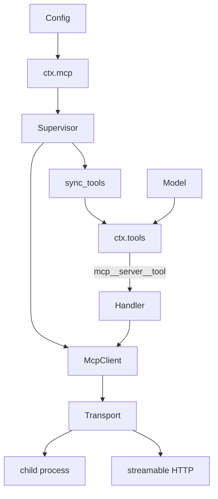
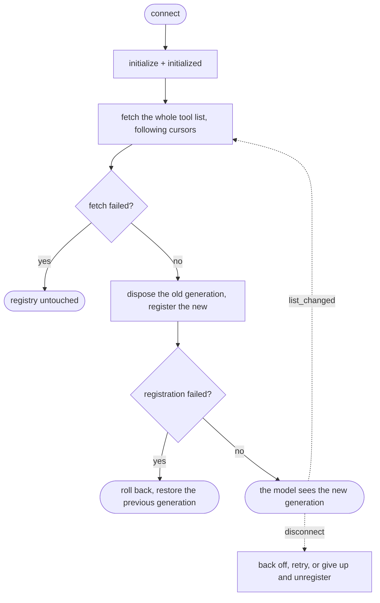
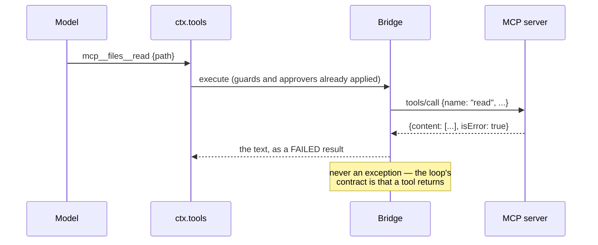

# MCP — someone else's tools, on our pipeline

# 1 · Requirements

## Introduction

An MCP server publishes tools. This sprint connects to one, lists what it
offers, and registers each on `ctx.tools` so the loop calls it exactly like a
built-in — guards, approvers, spill policy and all. The model never learns that
some of its tools live in another process.

Three pieces:

- **A minimal JSON-RPC client** — the slice of the protocol a tool bridge
  needs: `initialize`, `tools/list`, `tools/call`, and the notification that
  says the list changed.
- **Two transports** — a child process over stdio, and streamable HTTP.
- **A supervised connection** — because the other process can die, and a tool
  list that silently goes stale is worse than one that goes away.

## Glossary

- **Public name**: what the model sees, `mcp__<server>__<tool>`.
- **Raw name**: what the server calls it. Only the bridge knows this.
- **Generation**: one complete set of registered tools from one sync.
- **Supervisor**: what reconnects, re-syncs, and eventually gives up.

## Mental Model & Invariants

**Model:**

- The model sees **one flat tool list**. That a tool lives in another process
  is a fact about the bridge, not about the tool.
- A public name is **derived deterministically and never collides**. Two
  different `(server, tool)` pairs cannot produce one name, however they are
  spelled.
- A sync is **all or nothing**. The model sees a whole generation or none of
  it — never half a server's tools.
- A child process is a **process group**, so ending it ends what it started.

**Invariants:**

- **I1 — Distinct tools get distinct names.** Normalisation never collapses
  two pairs into one.
- **I2 — A failed sync leaves the previous generation serving.** Losing
  working tools to a transient failure is a worse outcome than a stale list.
- **I3 — The child's environment is scrubbed**, and the scrub actually
  removes.
- **I4 — Ending a connection ends its process group.**
- **I5 — A tool failure is a tool result**, never an exception into the loop.

## Decisions & Corrections (log)

- 2026-08-25 — The reference's env scrub is a **no-op**: it copies the whole
  parent environment and *then* updates it with the scrubbed subset, so every
  credential it removed is already present and stays. The scrubbed environment
  is the base here, not an overlay (I3).
- 2026-08-25 — Tool disposal uses plugkit's returned disposer. The reference
  reaches into `ctx.tools._tools` and pops the key, which is a private
  structure of another service and breaks the moment the point store changes.

## Dev Environment (config-as-code — pointers only)

- Deps: `pyproject.toml` (`uv sync`) · Gate: `uv run pytest tests -q`
- Reference: `plugins/mcp_client/{client,bridge,__init__}.py`

## Requirements

### Requirement 1: The JSON-RPC client

#### Acceptance Criteria

1. `connect` SHALL perform the `initialize` handshake, record the server info,
   and send `notifications/initialized`.
2. `request` SHALL match a response to its request by id, and SHALL time out
   with a coded error.
3. A JSON-RPC error response SHALL raise `McpError` carrying the protocol code.
4. Ids of any JSON type SHALL match, not integers only.
5. Notifications SHALL be dispatched to registered handlers by method.
6. `close` SHALL fail every in-flight request with a stated reason rather than
   cancelling it silently, and SHALL be idempotent.
7. `list_tools` SHALL follow pagination cursors; `call_tool` SHALL take its own
   timeout.

### Requirement 2: Transports

#### Acceptance Criteria

1. THE transport SHALL be an interface, with the client depending on nothing
   more than it.
2. `StdioTransport` SHALL spawn a child in its own process group, exchange
   newline-delimited JSON-RPC on stdin/stdout, and tolerate non-JSON lines.
3. THE child's environment SHALL be the **scrubbed** parent environment plus
   the configured additions — credential-shaped names and this project's own
   variables removed (I3).
4. Closing SHALL close stdin, then escalate to the **process group** (I4), and
   SHALL always reap the reader.
5. `StreamableHttpTransport` SHALL post requests, read a JSON or SSE response,
   carry the session id once the server issues one, and open the notification
   stream only after that.
6. THE HTTP transport SHALL deliver responses through the same callback as
   every other transport, with no type-switch in the client.
7. httpx SHALL stay an optional, lazily imported extra.

### Requirement 3: The tool bridge

#### Acceptance Criteria

1. `public_tool_name` SHALL be deterministic and SHALL not collide (I1).
2. A name that normalises or exceeds the length limit SHALL carry an identity
   hash of the original pair.
3. `extract_text` SHALL render MCP content into one string, replacing
   non-text blocks with a stated placeholder rather than dropping them.
4. `sync_tools` SHALL fetch the whole list first, and touch the registry only
   once the new generation is complete.
5. A server listing one tool twice SHALL be refused.
6. A registration failure SHALL roll back the partial generation **and restore
   the previous one** (I2).
7. A tool call SHALL return the server's text; an `isError` result SHALL come
   back as a failed tool result, and a transport failure likewise (I5).
8. Arguments that are not an object SHALL be sent as an empty object rather
   than raising.

### Requirement 4: The supervised connection

#### Acceptance Criteria

1. THE plugin SHALL provide `ctx.mcp` and start one supervised connection per
   configured server.
2. Reconnect policy SHALL be validated at mount, rejecting unknown keys and
   impossible bounds.
3. Reconnection SHALL back off exponentially between a floor and a ceiling,
   and SHALL give up after a bounded number of consecutive failures.
4. A connection that stayed up beyond a stability window SHALL reset the
   attempt budget.
5. Giving up SHALL unregister the server's tools, so the model is not offered
   what cannot run.
6. `notifications/tools/list_changed` SHALL trigger a re-sync.
7. Syncs SHALL be serialised, so two generations cannot interleave.
8. Disposal SHALL stop reconnecting, close the client, and unregister the
   tools, on every path.

### Non-Functional

- **NF 1**: stdlib only; httpx stays the optional extra.
- **NF 2**: tests use an in-memory transport and one real child process. No
  test opens a network socket.
- **NF 3**: every bound is a named constant (EP1).

## Out of Scope

- MCP resources, prompts, sampling and roots. The bridge is about tools; the
  rest of the protocol has no consumer here yet.
- OAuth flows for HTTP servers. Headers come from config.
- Serving MCP. This is a client.

# 2 · Design

## End-to-End Walkthrough

A deployment names a server: a command to run, or a URL. The supervisor starts
a connection, and the client does the handshake — `initialize`, then
`notifications/initialized`, which is what tells the server it may start
sending things.

Then the sync. The whole tool list is fetched first, following cursors, and
*only then* is the registry touched. That order is the entire point: a fetch
that fails halfway must leave the model's tool list exactly as it was, rather
than half-replaced by a server that timed out mid-page.

Each tool gets a public name, `mcp__<server>__<tool>`. Names must be
deterministic and must not collide — two servers with a tool called `search`
are ordinary, and so is a tool whose name has characters a public name cannot
carry. Normalising those to `_` is what creates the collision risk, so any name
that was normalised or truncated carries a hash of the *original* pair. Two
different pairs cannot produce one name.

Registration is where this port diverges twice. plugkit's registry rejects a
duplicate name, so the old generation must come off before the new goes on —
and the reference stops there: if the new registration then fails, it logs and
returns, having already removed a working tool list. Here the previous
generation's *definitions* are kept, so a failure rolls back the partial new
generation and puts the old one back. A transient conflict costs nothing.

A call goes out as `tools/call` under the raw name. The result's content blocks
are rendered to text — images and resources become a stated placeholder, not
silence, because a model given nothing where a picture was cannot tell that
anything happened. An `isError` result comes back as a failed tool result, and
so does a transport failure: the loop's contract is that a tool returns, and an
exception out of a bridge would end a turn that had every right to continue.

When the process dies, the supervisor backs off and retries, and gives up after
a bounded number of consecutive failures — at which point it unregisters the
tools, because offering the model something that cannot run wastes a turn to
discover.

## Tech Stack

- Python 3.13+, stdlib only (`asyncio`, `json`, `hashlib`, `re`)
- httpx for the HTTP transport, lazily imported (`pydsh[http]`)
- Test command: `uv run pytest tests -q`

## Directory Structure

```
src/pydsh/mcp/
  __init__.py
  client.py       # McpError, Transport, StdioTransport, StreamableHttpTransport, McpClient
  bridge.py       # public_tool_name, extract_text, sync_tools
  connection.py   # reconnect policy, the supervisor, the McpClientPlugin service
tests/
  test_mcp_client.py
  test_mcp_bridge.py
```

## Architecture Overview



## Workflow



## Module Design

### `mcp.client`

```
class McpError(Exception): code
class Transport(ABC): start(on_message) ; send(payload) ; close()
class StdioTransport(Transport) ; class StreamableHttpTransport(Transport)
class McpClient: connect() ; request(method, params, timeout) ; notify(...)
                 on_notification(method, handler) ; list_tools(cursor) ; call_tool(...)
scrubbed_parent_env() -> dict
```

### `mcp.bridge`

```
public_tool_name(server, raw) -> str
extract_text(content, tool_name) -> str
async sync_tools(client, ctx, server, timeout, previous) -> Generation
```

### `mcp.connection`

```
resolve_reconnect_policy(config, path) -> dict
class Connection: ready ; dispose()
class McpClientPlugin(Service)     # provide = "mcp"
```

## Key Algorithms (pseudo-code)

```
ALGORITHM sync one generation                         (I2)
  1. fetch every page of tools/list into a complete new generation
     # Registry untouched until this succeeds: a server that dies mid-page
     # must not leave the model with half a tool list.
  2. refuse a duplicate public name inside the new generation
  3. dispose the previous generation
     # Forced by the registry: plugkit refuses a duplicate name, so the old
     # entry has to come off before the new one goes on.
  4. register the new generation
  5. if any registration fails:
       dispose whatever of the new generation registered
       RE-REGISTER the previous generation from its kept definitions
     # The reference stops after the rollback and returns nothing, having
     # already removed a working tool list. A transient conflict must not cost
     # the model a server.
```

```
ALGORITHM a public name                               (I1)
  joined <- "mcp__" + server + "__" + raw
  normalized <- every character outside [A-Za-z0-9_-] replaced with "_"
  if normalized == joined and it fits: return it        # nothing was lost
  else: return a truncated normalized + a hash of (server, raw)
  # The hash is of the ORIGINAL pair, not the normalized name: normalisation is
  # what creates the collision, so hashing its output would hash the collision
  # too.
```

## Sequence Diagrams



## Data Models

No durable state. A generation is in memory and rebuilt on every sync; the
connection's client and transport live and die with the supervisor. This is
worth saying because the alternative is tempting: caching a server's tool list
on disk would make startup faster and would also mean offering the model tools
that no longer exist, discovered one wasted turn at a time.

## Error Handling Strategy

`McpError` carries the JSON-RPC code when there is one. Config errors raise
`ValueError` at mount. Everything reaching a *tool call* comes back as a failed
tool result rather than an exception (I5).

## Testing Strategy

- **Property**: distinct `(server, tool)` pairs never share a public name.
- **Property**: a failed registration leaves the previous generation serving.
- **Integration**: a real child process speaking real JSON-RPC over stdio.

## Correctness Properties

### Property 1: Names do not collide
- **Statement**: *For any* two distinct `(server, raw)` pairs, the public names
  differ — including pairs that normalise to the same string.
- **Validates**: 3.1, 3.2 (I1)

### Property 2: A failed sync costs nothing
- **Statement**: *For any* registration failure, the tools registered before
  the sync are registered after it.
- **Validates**: 3.6 (I2)

### Property 3: A tool never raises into the loop
- **Statement**: *For any* server behaviour — error result, transport failure,
  timeout — the handler returns.
- **Validates**: 3.7 (I5)

## Edge Cases

- **Two servers with a tool called `search`** — different public names, because
  the server name is in them.
- **`a/b` and `a_b` from one server** — both normalise to `a_b`, so both carry
  a hash of their own pair and stay distinct.
- **A server that logs to stdout** — non-JSON lines are skipped, not fatal.
- **A server that dies during `tools/list`** — the registry is untouched.
- **A tool returning only an image** — a placeholder, so the model knows
  something came back.
- **A `close` during an in-flight call** — the caller is told the client
  closed, rather than seeing a bare cancellation.

## Decisions

### Decision: the scrubbed environment is the base, not an overlay
**Context:** the reference copies `os.environ` and then updates it with the
scrubbed subset.
**Decision:** start from the scrub.
**Rationale:** an update with a subset removes nothing — every key the scrub
dropped is already in the copy and stays. The scrub reads as a security
control and does nothing, which is worse than not having one, because it stops
anyone looking further.

### Decision: a failed registration restores the previous generation
**Context:** plugkit refuses duplicate names, so the old generation must come
off first.
**Decision:** keep the previous generation's definitions and re-register them
on failure.
**Rationale:** the reference logs and returns, leaving the model with none of
that server's tools after a conflict that may be transient. Losing a working
tool list is a much worse outcome than a stale one, and the fix costs a dict.

### Decision: the client type-switches on nothing
**Context:** the reference special-cases the HTTP transport in `connect`,
assigning a private callback on it.
**Decision:** every transport delivers through `on_message`.
**Rationale:** an HTTP response *is* a JSON-RPC response with an id, so the
ordinary dispatch path already handles it. The special case buys nothing and
makes the Transport interface a lie — a third transport would have to know
which branch it falls into.

## Security Considerations

The child's environment is scrubbed of credential-shaped names and this
project's own variables, and the scrub is the base rather than an overlay so it
actually removes. A child is spawned in its own process group so ending the
connection ends what the child started. Tool arguments reach the server
untouched, which is deliberate — validating them here would be a second,
disagreeing copy of the server's own schema.

# 3 · Tasks

## Status marks
<!-- [ ] pending | [x] done | [!] BLOCKED: reason | [-] DROPPED: <reason> |
     [>] → <spec_id> -->

## Tasks

- [x] 1. The protocol
  - [x] 1.1 `mcp/client.py` — the client and the Transport interface
    - **Requirements**: 1.1–1.7, 2.1, 2.6
  - [x] 1.2 Stdio and HTTP transports
    - **Depends**: 1.1
    - **Requirements**: 2.2–2.5, 2.7
- [x] 2. The bridge
  - [x] 2.1 `mcp/bridge.py`
    - **Depends**: 1.1
    - **Requirements**: 3.1–3.8
    - **Properties**: 1, 2, 3
- [x] 3. Supervision
  - [x] 3.1 `mcp/connection.py`
    - **Depends**: 2.1
    - **Requirements**: 4.1–4.8
  - [x] 3.2 Export surface
    - **Depends**: 3.1
- [x] 4. Tests
  - [x] 4.1 `test_mcp_client.py`
    - **Depends**: 3.2
    - **Requirements**: 1.1–1.7, 2.1–2.7
  - [x] 4.2 `test_mcp_bridge.py`
    - **Depends**: 3.2
    - **Requirements**: 3.1–3.8, 4.1–4.8
    - **Properties**: 1, 2, 3
- [x] 5. Wrap
  - [x] 5.1 README + the catalogue
    - **Depends**: 4.2
  - [x] 5.2 Close the sprint
    - **Depends**: 5.1

## Log

**[2026-08-25]** — Created and activated. Two reference defects went into the
requirements before implementation: the environment scrub that removes nothing,
and the failed sync that leaves the model with no tools at all.

**[2026-08-25]** — CLOSED / SHIPPED. 1111 tests green (70 new across
`test_mcp_client.py` and `test_mcp_bridge.py`), including a real child process
speaking real JSON-RPC — and one that ignores SIGTERM, to prove the escalation
reaches the process group.

Six reference defects, and the first two are the ones that matter:

1. **The environment scrub removed nothing.** `child_env = os.environ.copy()`
   followed by `child_env.update(scrubbed_parent_env())` — an update with a
   *subset* of what is already there. Every credential the scrub dropped was in
   the copy and stayed. A security control that does nothing is worse than
   none, because it stops anyone looking further. The scrub is the base here,
   and a real child process reports back what it actually got.
2. **A failed sync left the model with nothing.** The registry forces
   dispose-then-register (plugkit refuses a duplicate name), and the reference
   stops after rolling back the partial new generation — having already removed
   a working tool list, over what may be a transient conflict. The previous
   generation's *definitions* are kept here, so the rollback puts them back.
3. **Tool disposal reached into `ctx.tools._tools`** and popped the key.
   plugkit's `register` returns a real disposer; the private reach would break
   the moment the point store changed shape.
4. **The client type-switched on its transport**, assigning a private callback
   onto the HTTP one. An HTTP response *is* a JSON-RPC response with an id, so
   the ordinary dispatch already handles it — the special case bought nothing
   and left a third transport with no branch to fall into.
5. **Response ids were coerced with `int()`**, which raises on the string ids
   JSON-RPC permits.
6. **`close` cancelled in-flight requests**, so a caller saw a bare
   `CancelledError` and went looking for a cancellation in their own code. They
   are failed with a stated reason.

Two smaller ones: the child was killed by pid rather than by process group (so
a server's own helpers were orphaned), and its stderr was inherited rather than
discarded.

Deliberately out of scope: MCP resources, prompts, sampling and roots. The
bridge is about tools, and the rest of the protocol has no consumer here — the
place to add it is when one exists.
