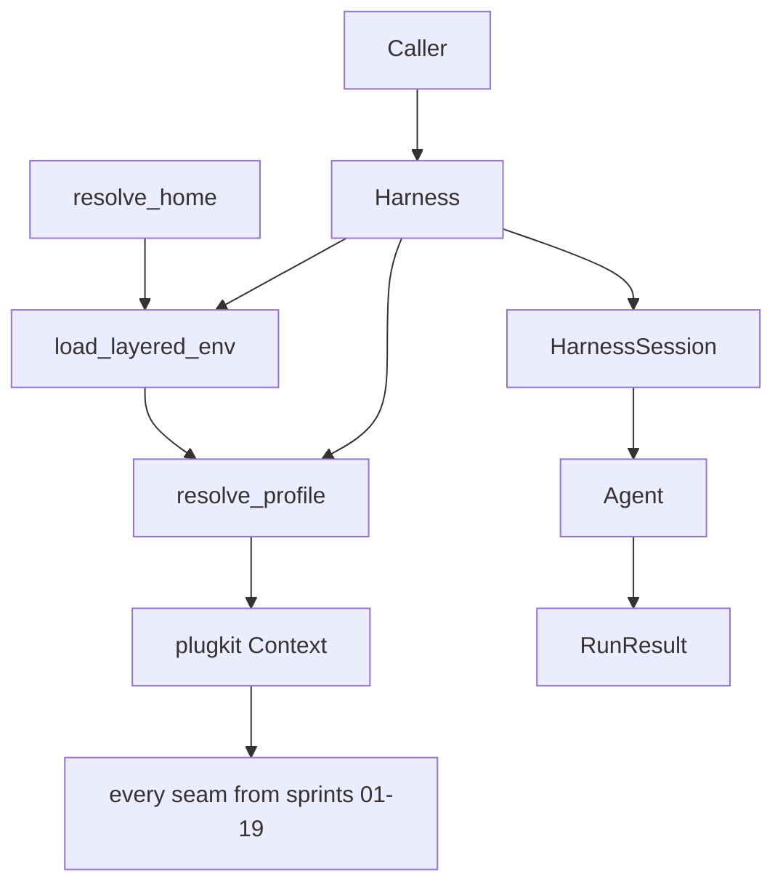
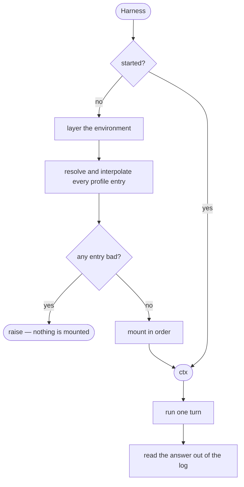
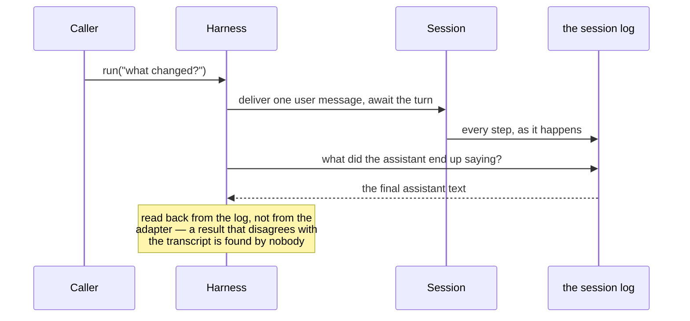

# Boot and the SDK — the shortest path from nothing to a running turn

# 1 · Requirements

## Introduction

Nineteen sprints of seams, and mounting them still means twenty lines of
`await root.plugin(...)` in the right order. This sprint is the front door:

```python
async with Harness() as harness:
    result = await harness.session().run("what changed today?")
```

Four pieces, bottom-up:

- **Home paths** — one answer to "where does this deployment keep things",
  instead of each service inventing its own.
- **Layered environment** — inherited environment, then the working
  directory's `.env`, then home's, with the layers that decide *how the process
  starts* refused from a file.
- **Profiles** — an ordered list of `(plugin, config)`, from a module or given
  inline, with `${VAR}` resolved before anything is mounted.
- **The SDK** — assemble, run a turn, collect the answer, tear down.

## Glossary

- **Home**: this deployment's data root. `~/.pydsh` unless told otherwise.
- **Profile**: what to mount and with what config, in order.
- **Bootstrap variable**: one that decides how the process starts, and
  therefore cannot come from a file the process reads after starting.
- **Run**: one turn, awaited to completion, with its answer extracted.

## Mental Model & Invariants

**Model:**

- Home resolves **once, from one place**. Every service that needs a path asks
  for it rather than reading the environment itself.
- A `.env` file may configure the application; it may **not** decide how the
  process boots. Those variables are read before any file is.
- A profile is **data**, so it can be inspected, diffed, and assembled from
  more than one source before anything is mounted.
- The SDK owns a context's whole life. Leaving its scope unmounts everything.

**Invariants:**

- **I1 — Home is one function.** No service resolves it independently.
- **I2 — A blank override is not an override.** An empty `PYDSH_HOME` must not
  resolve home to the working directory.
- **I3 — A `.env` cannot set a bootstrap variable**, and says so loudly.
- **I4 — An inherited value wins** over any file layer.
- **I5 — A profile is fully resolved before anything mounts.** A bad entry
  fails with nothing half-built.
- **I6 — Leaving the SDK's scope tears the context down**, on every path.

## Decisions & Corrections (log)

- 2026-08-25 — The class is `Harness`, not the reference's vendor-named one.
  This repo is a general core and names no product — a consumer wrapping it
  calls its own thing whatever it likes.
- 2026-08-25 — Home is `~/.pydsh` under `PYDSH_HOME`, matching the prefix the
  MCP scrub already withholds from child processes. Two spellings of "this
  project's own variables" would mean the scrub missed some.

## Dev Environment (config-as-code — pointers only)

- Deps: `pyproject.toml` (`uv sync`) · Gate: `uv run pytest tests -q`
- Reference: `util/home_paths.py`, `env.py`, `loader.py`, `config.py`, `sdk.py`

## Requirements

### Requirement 1: Home paths

#### Acceptance Criteria

1. `resolve_home` SHALL prefer an explicit argument, then `PYDSH_HOME`, then
   `~/.pydsh`, and SHALL return an absolute path (I1).
2. An empty or whitespace-only `PYDSH_HOME` SHALL be treated as unset (I2).
3. `~` and `~/…` SHALL expand.
4. `home_path` SHALL join segments beneath home, and SHALL refuse a segment
   that escapes it.
5. `home_display` SHALL render a path symbolically and SHALL NOT reveal an
   absolute machine path.

### Requirement 2: The layered environment

#### Acceptance Criteria

1. `parse_env` SHALL read `KEY=VALUE` text, ignoring blanks and comments and
   stripping matched quotes.
2. `load_layered_env` SHALL merge the inherited environment, the working
   directory's `.env`, and home's `.env`.
3. An inherited value SHALL win over any file (I4).
4. An earlier file layer SHALL win over a later one.
5. A file setting a bootstrap-prefixed variable SHALL raise, naming the
   variable and the file (I3).
6. `interpolate_env` SHALL substitute `${VAR}` and `$VAR` recursively through
   a config value, leaving an unset variable's reference intact rather than
   silently emptying it.

### Requirement 3: Profiles

#### Acceptance Criteria

1. A profile entry SHALL be a plugin and its config, and a profile SHALL be an
   ordered list of them.
2. A profile SHALL be loadable from a Python module path exposing `PROFILE`,
   and SHALL be usable inline.
3. Every entry SHALL be validated and interpolated before anything mounts, and
   a bad one SHALL name its index and what is wrong (I5).
4. `mount_profile` SHALL mount entries in order onto a context.
5. THE core profile SHALL be a named constant a consumer can extend rather
   than retype.

### Requirement 4: The SDK

#### Acceptance Criteria

1. `Harness` SHALL assemble a context from a profile, lazily and idempotently.
2. `session(id)` SHALL return a handle, generating an id when none is given.
3. `run(text)` SHALL deliver one user message, wait for the turn to finish,
   and return a result carrying the session id, the final assistant text, and
   the session's events.
4. THE final text SHALL be derived from the log, so it is the same string a
   reader of the session would see.
5. `close` SHALL unmount everything and SHALL be idempotent.
6. `Harness` SHALL be an async context manager (I6).
7. A run before any adapter is registered SHALL fail with a readable error
   rather than hanging.

### Non-Functional

- **NF 1**: stdlib only.
- **NF 2**: every default is a named constant (EP1).
- **NF 3**: no test writes outside its tmp path.

## Out of Scope

- The JSON-RPC server, WebSocket transport, gateway and CLI — the next sprint.
  This one is the in-process form they will all sit on.
- Hot reload / config watching. plugkit owns plugin lifecycle; a watcher is a
  consumer's choice.

# 2 · Design

## End-to-End Walkthrough

`Harness()` is constructed with a profile, or with none — in which case the
core profile is used. Nothing is mounted yet: construction cannot be async, and
an object that half-mounts in `__init__` cannot report a failure properly.

The first `run` (or an explicit `start`) assembles. The environment is layered
first, because the profile's configs may reference it: inherited values, then
the working directory's `.env`, then home's. Inherited wins, which is the rule
that makes a shell override work at all — and a file that tries to set
`PYDSH_HOME` is refused outright, because that variable decided where the file
was looked for.

Then the profile resolves: every entry validated, every `${VAR}` substituted,
*before* anything mounts. A profile with a typo in entry nine must not leave
eight plugins mounted and a context nobody can use.

`session()` gives a handle. `run(text)` delivers one user message, waits for the
turn to finish, and reads the answer back **out of the log** rather than
returning what the adapter happened to yield. That is the same string a reader
of the session sees later, which is the point: a result that disagrees with the
transcript is a bug nobody finds until they compare them.

Leaving the `async with` unmounts everything, on every path — including the one
where the turn raised.

## Tech Stack

- Python 3.13+, stdlib only
- Test command: `uv run pytest tests -q`

## Directory Structure

```
src/pydsh/boot/
  __init__.py
  home.py       # resolve_home, home_path, home_display
  envfile.py    # parse_env, load_layered_env, interpolate_env
  profile.py    # ProfileEntry, resolve_profile, load_profile, mount_profile, CORE_PROFILE
  harness.py    # Harness, HarnessSession, RunResult
tests/
  test_boot.py
  test_sdk.py
```

## Architecture Overview



## Workflow



## Module Design

### `boot.home`

```
resolve_home(configured=None, env=None) -> str
home_path(*segments, home=None) -> str
home_display(path, home=None) -> str
HOME_ENV = "PYDSH_HOME" ; HOME_DIR_NAME = ".pydsh"
```

### `boot.envfile`

```
parse_env(text) -> dict
load_layered_env(cwd=None, home=None, inherited=None) -> dict
interpolate_env(value, env=None) -> Any
BOOTSTRAP_PREFIXES = ("PYDSH_", "XDG_", "DYLD_", "LD_")
```

### `boot.profile`

```
@dataclass ProfileEntry: plugin ; config
resolve_profile(profile, env=None) -> list[ProfileEntry]
load_profile(module_path) -> list
async mount_profile(ctx, entries) -> ctx
CORE_PROFILE : list
```

### `boot.harness`

```
@dataclass RunResult: session_id ; final_response ; events ; session
class Harness: start() ; session(id=None) ; close() ; __aenter__/__aexit__
class HarnessSession: run(text, options=None) -> RunResult
```

## Key Algorithms (pseudo-code)

```
ALGORITHM layer the environment                       (I3, I4)
  1. result <- the inherited environment
  2. for each file layer, nearest first (cwd/.env, then home/.env):
       a. refuse ANY bootstrap-prefixed name, naming the variable and the file
          # That variable decided where this file was looked for. A file that
          # sets it is asking to be loaded from somewhere it was not.
       b. add only names not already present
          # Inherited wins, and so does the nearer file. A shell override that
          # a checked-in .env could overwrite is not an override.
```

```
ALGORITHM assemble                                    (I5, I6)
  1. if already started: return the context
  2. env <- layer the environment
  3. entries <- resolve EVERY profile entry, interpolating ${VAR}
     # All of them, before any mount. A typo in entry nine must not leave
     # eight plugins mounted and a context nobody can use.
  4. mount them in order
  5. on close: unmount, whatever happened in between
```

## Sequence Diagrams



## Data Models

No new stores. Home is a resolved path, the layered environment is a dict, and
a profile is a list — all derived, all recomputable. The one durable thing this
sprint touches is other people's: home is where *other* services put their
files, which is exactly why resolving it in one place matters.

| Store | Writer | Source of truth? | Read path | Retention | Reproducible? |
|---|---|---|---|---|---|
| The resolved home path | `resolve_home` | derived from config and environment | every service that needs a path | process lifetime | yes |
| The layered environment | `load_layered_env` | derived from the environment and `.env` files | profile interpolation | process lifetime | yes |

## Error Handling Strategy

Config failures raise `ValueError` subclasses at assembly, naming the file, the
variable, or the profile index. A run failure propagates — the caller asked for
a turn and is entitled to know it failed — but the context still tears down.

## Testing Strategy

- **Property**: an inherited value survives every file layer.
- **Property**: a bad profile entry leaves nothing mounted.
- **Integration**: a whole `Harness` run over a fake adapter, answer read from
  the log.

## Correctness Properties

### Property 1: Inherited wins
- **Statement**: *For any* variable present in the inherited environment, no
  `.env` layer changes it.
- **Validates**: 2.3 (I4)

### Property 2: A bad profile mounts nothing
- **Statement**: *For any* profile with an invalid entry, no plugin from it is
  mounted.
- **Validates**: 3.3 (I5)

### Property 3: The result matches the transcript
- **Statement**: *For any* run, `final_response` equals the last assistant text
  in the session's own log.
- **Validates**: 4.4

## Edge Cases

- **`PYDSH_HOME=""`** — treated as unset, so home does not become the working
  directory.
- **A `.env` setting `PYDSH_HOME`** — refused, naming both.
- **`${MISSING}` in a config** — left as written, so the failure is visible
  rather than an empty string that looks configured.
- **`run` before an adapter is registered** — a readable error, not a hang.
- **`close` twice** — the second does nothing.
- **A turn that raises** — the context still tears down.

## Decisions

### Decision: assembly is lazy, not in `__init__`
**Context:** a constructor that mounts would let `Harness()` be the only call.
**Decision:** `start()`, called by the first `run`, and by `__aenter__`.
**Rationale:** mounting is async and can fail. A constructor cannot await, and
an object that half-built itself has no way to report which half — the caller
gets an object that exists and does not work.

### Decision: the final response is read from the log
**Context:** returning what the adapter yielded is simpler and equally true at
the moment it happens.
**Decision:** derive it from the session's events.
**Rationale:** the log is what anyone reads afterwards. If the returned string
and the transcript can disagree — because a plugin rewrote the message, or
compaction ran — the disagreement is invisible until someone compares them,
which is usually during an incident.

### Decision: a `.env` cannot set a bootstrap variable
**Context:** it is one more variable, and refusing it is extra code.
**Decision:** refuse, naming the variable and the file.
**Rationale:** those variables decide where code and configuration are loaded
*from*. A file setting one is asking to be loaded from somewhere other than
where it was found, which is circular at best and a way to redirect a
deployment at worst.

## Security Considerations

Bootstrap variables cannot be set from a file, so a checked-in `.env` cannot
redirect where a deployment loads its code or data. Home resolution never falls
back to the working directory, so a blank override cannot scatter a
deployment's files into whatever directory it happened to start in. Profile
interpolation leaves an unset variable's reference intact rather than emptying
it, so a missing secret is a visible failure rather than a silently empty
credential.

# 3 · Tasks

## Status marks
<!-- [ ] pending | [x] done | [!] BLOCKED: reason | [-] DROPPED: <reason> |
     [>] → <spec_id> -->

## Tasks

- [x] 1. Paths and environment
  - [x] 1.1 `boot/home.py`
    - **Requirements**: 1.1–1.5
  - [x] 1.2 `boot/envfile.py`
    - **Depends**: 1.1
    - **Requirements**: 2.1–2.6
    - **Properties**: 1
- [x] 2. Profiles
  - [x] 2.1 `boot/profile.py`
    - **Depends**: 1.2
    - **Requirements**: 3.1–3.5
    - **Properties**: 2
- [x] 3. The SDK
  - [x] 3.1 `boot/harness.py`
    - **Depends**: 2.1
    - **Requirements**: 4.1–4.7
    - **Properties**: 3
  - [x] 3.2 Export surface
    - **Depends**: 3.1
- [x] 4. Tests
  - [x] 4.1 `test_boot.py`
    - **Depends**: 3.2
    - **Requirements**: 1.1–1.5, 2.1–2.6, 3.1–3.5
    - **Properties**: 1, 2
  - [x] 4.2 `test_sdk.py`
    - **Depends**: 3.2
    - **Requirements**: 4.1–4.7
    - **Properties**: 3
- [x] 5. Wrap
  - [x] 5.1 README (a quick-start that actually runs) + the catalogue
    - **Depends**: 4.2
  - [x] 5.2 Close the sprint
    - **Depends**: 5.1

## Log

**[2026-08-25]** — Created and activated. The reference's SDK class is named
after its vendor; this one is not, because this repo is a general core and a
consumer names its own product.

**[2026-08-25]** — CLOSED / SHIPPED. 1176 tests green (65 new across
`test_boot.py` and `test_sdk.py`), and the README quick-start was **run** —
verbatim, with the provider swapped for a fake so nothing left the machine —
rather than written and assumed.

Three things found while building, none of them in the reference:

1. **plugkit's own services cannot be mounted with a config.** `ToolsService`
   and `PointsService` define no `__init__`, so the second argument to
   `ctx.plugin` lands on `Service.__init__`'s **name** parameter — and a dict
   there fails deep inside the reflect layer with "unhashable type: 'dict'",
   nowhere near the profile line that caused it. An empty config is now passed
   as nothing at all.
2. **Teardown is fiber disposal, not registry deletion.** `registry.delete`
   schedules disposal without awaiting it and leaves the service resolving; the
   fiber `ctx.plugin` returns is the precise handle, and disposing it in
   reverse order actually runs the teardown effects.
3. **`ProfileError` collided.** The catalogue adapter (sprint 18) already had
   one, about a *provider* profile; this sprint's is about a *plugin* profile.
   Both reachable from `pydsh`, and the later import silently won — which the
   SDK's own test caught by failing to match the exception it expected. The
   adapter's is now `ProviderProfileError`. The second time this has happened
   (`FeedbackError` in sprint 16), which is worth noticing: a package this wide
   needs the name to say which layer it belongs to.

Deviations recorded as made: the class is `Harness`, not the reference's
vendor-named one — this repo is a general core and a consumer names its own
product. And `watcher` is not ported at all: plugkit owns plugin lifecycle, and
a config watcher is a consumer's choice rather than a seam.
