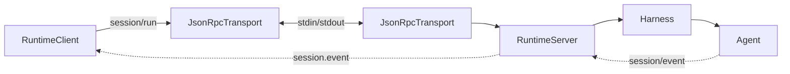
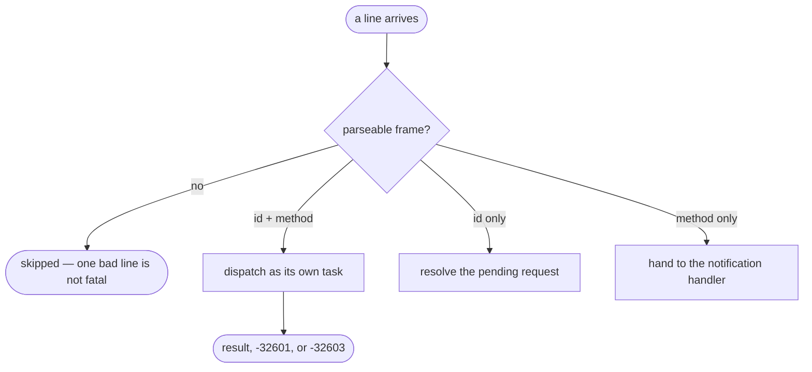
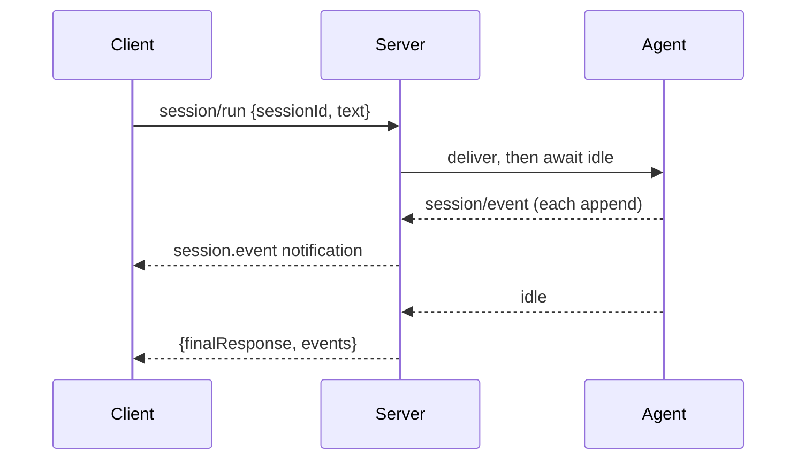

# The JSON-RPC runtime — the same SDK, one process away

# 1 · Requirements

## Introduction

Sprint 20's `Harness` runs a conversation in *this* process. Sometimes that is
the wrong process: a long-lived runtime a short-lived client talks to, a
sandbox boundary, an editor plugin that must not import the whole package.

This sprint is the same surface over a pipe. Newline-delimited JSON-RPC 2.0 in
both directions: a client sends `session/prompt`, the server streams
`session.event` notifications back as the turn happens, and the client's `run`
returns when the agent goes idle.

Three pieces:

- **The transport** — frames in, frames out, requests matched to responses.
- **The server** — a booted context behind that transport.
- **The client** — the `Harness` shape again, backed by a child process.

## Glossary

- **Frame**: one JSON-RPC message on one line.
- **Runtime**: the server process holding the assembled context.
- **Idle**: the agent has no work left, which is what ends a `run`.

## Mental Model & Invariants

**Model:**

- A request handler must not **block the read loop**. Frames keep arriving
  while one is being served, and a handler that needs an inbound frame to
  finish would otherwise deadlock against itself.
- A notification is **fire-and-forget in both directions**. Emitting one must
  never raise into whatever produced the event.
- `stdout` carries **protocol only**. Anything the runtime wants to say goes to
  `stderr` or a log.
- The server assembles **what it was given**. It does not decide a consumer's
  provider for them.

**Invariants:**

- **I1 — Requests are served concurrently**, not one at a time in the reader.
- **I2 — A cross-thread hand-off goes through the loop.** An `asyncio.Queue`
  is not thread-safe.
- **I3 — Emitting a notification never raises at the emitter.**
- **I4 — A closed transport fails every pending request**, with a reason.
- **I5 — A malformed frame is skipped, not fatal.**

## Decisions & Corrections (log)

- 2026-08-25 — The reference's `initialize` mounts a specific provider plugin
  when the requested provider is not registered and happens to be named after
  one vendor. Dropped: a core that silently mounts a vendor's adapter has named
  a vendor. The server reports what it can route and refuses what it cannot.

## Dev Environment (config-as-code — pointers only)

- Deps: `pyproject.toml` (`uv sync`) · Gate: `uv run pytest tests -q`
- Reference: `api/protocol.py`, `api/server.py`, `api/client.py`

## Requirements

### Requirement 1: The transport

#### Acceptance Criteria

1. `JsonRpcTransport` SHALL read newline-delimited frames from an injected
   reader and write them through an injected writer.
2. `request` SHALL match a response by id and SHALL support a timeout.
3. An error frame SHALL raise an error carrying the code, message and data.
4. `notify` SHALL send a notification and SHALL NOT wait.
5. An inbound request SHALL be dispatched **concurrently**, so a slow handler
   does not stall the reader (I1).
6. An unhandled method SHALL answer `-32601`; a handler that raises SHALL
   answer `-32603` with its message.
7. A malformed or empty line SHALL be skipped (I5).
8. `close` SHALL stop the reader and fail every pending request with a stated
   reason (I4), and SHALL be idempotent.
9. THE default stdin reader SHALL hand lines to the loop thread-safely (I2).
10. THE default writer SHALL write to `stdout` and flush, and nothing else in
    the process SHALL write there.

### Requirement 2: The server

#### Acceptance Criteria

1. `RuntimeServer` SHALL serve a booted context over a transport.
2. `initialize` SHALL report the server's name, version and protocol, and
   SHALL record the route a session will use.
3. `initialize` SHALL refuse a provider the context cannot route, naming what
   it can.
4. `session/prompt` SHALL find or create the session, deliver the content as
   one user message, and return its id without waiting for the turn.
5. `session/run` SHALL deliver and wait, returning the final text.
6. Session events SHALL be forwarded as `session.event` notifications, and
   agent status as `session.status`.
7. Forwarding SHALL never raise into the emitting append (I3).
8. `shutdown` SHALL unsubscribe, cancel every agent, and be idempotent.
9. An unknown method SHALL be a `-32601` answer, not a crash.

### Requirement 3: The client

#### Acceptance Criteria

1. `RuntimeClient` SHALL connect to a runtime over a transport, defaulting to a
   child process.
2. It SHALL offer `session(id)` and `run(text)` with the same shape as the
   in-process `Harness`.
3. `run` SHALL return when the runtime reports the agent idle, carrying the
   final text and the events observed.
4. Events SHALL be observable as they arrive, for a caller that wants to stream.
5. `close` SHALL shut the runtime down and stop the child, idempotently.
6. A child that dies mid-run SHALL fail the run with a stated reason rather
   than hanging.

### Non-Functional

- **NF 1**: stdlib only.
- **NF 2**: tests use in-memory pipes and one real child process.
- **NF 3**: every default is a named constant (EP1).

## Out of Scope

- The WebSocket transport, the HTTP gateway and the CLI — the next sprint,
  which sits on this one.
- Authentication. A pipe's boundary is the process boundary; a network
  transport is where credentials become the question.

# 2 · Design

## End-to-End Walkthrough

A client starts a runtime — a child process running the server — and hands it a
transport over the child's stdin and stdout. `initialize` establishes what
provider and model this connection will use, and the server refuses one it
cannot route rather than accepting it and failing at the first prompt.

`session/run` delivers a user message and waits. While the turn runs the server
forwards each session event as a `session.event` notification, so the client
sees the conversation as it happens rather than as a lump at the end. When the
agent goes idle the run returns.

Two things about the transport are the whole design.

**Requests are dispatched concurrently.** The reference awaits each handler
inside the read loop, so a slow one stalls every frame behind it — and a
handler that itself needs an inbound frame deadlocks against the loop that
would deliver it. Here each request becomes its own task.

**The cross-thread hand-off goes through the loop.** Reading stdin needs a
thread, and the reference puts lines onto an `asyncio.Queue` from that thread
with `put_nowait`. `asyncio.Queue` is not thread-safe; the correct call is
`loop.call_soon_threadsafe`. The failure is rare, timing-dependent, and looks
like a dropped frame.

## Tech Stack

- Python 3.13+, stdlib only
- Test command: `uv run pytest tests -q`

## Directory Structure

```
src/pydsh/runtime/
  __init__.py
  protocol.py   # JsonRpcTransport, readers and writers, the error types
  server.py     # RuntimeServer, the method table
  client.py     # RuntimeClient, RemoteSession
  __main__.py   # the runtime entry point a client spawns
tests/
  test_jsonrpc_protocol.py
  test_runtime.py
```

## Architecture Overview



## Workflow



## Module Design

### `runtime.protocol`

```
class JsonRpcError(Exception): code ; data
class TransportClosed(Exception)
class JsonRpcTransport: start() ; request(method, params, timeout) ; notify(...)
                        on_request(handler) ; on_notification(handler) ; close()
stdin_reader() -> Reader ; stdout_writer() -> Writer ; pipe() -> (Reader, Writer)
```

### `runtime.server`

```
class RuntimeServer: serve(ctx, transport) ; handle(method, params)
METHODS = ("initialize", "session/prompt", "session/run", "shutdown")
SERVER_NAME ; PROTOCOL_VERSION
```

### `runtime.client`

```
class RuntimeClient: start() ; session(id) ; close() ; on_event(handler)
class RemoteSession: run(text) -> RunResult ; send(text)
```

## Key Algorithms (pseudo-code)

```
ALGORITHM the read loop                               (I1, I5)
  while open:
    line <- await the reader          # None means the peer closed
    if the line is blank or unparseable: skip it
       # One bad line is noise, not a reason to drop a working connection.
    if it has an id AND a method:  dispatch it as its OWN TASK
       # Not awaited here. The reference awaits the handler inline, so a slow
       # one stalls every frame behind it — and a handler that needs an inbound
       # frame to finish deadlocks against the loop that would deliver it.
    elif it has an id:             resolve the pending request
    elif it has a method:          hand it to the notification handler
  on exit: fail every pending request with a reason
```

```
ALGORITHM read stdin on a thread                      (I2)
  loop <- the running loop, captured on the loop thread
  in a daemon thread:
    line <- sys.stdin.readline()
    loop.call_soon_threadsafe(queue.put_nowait, line)
    # NOT `queue.put_nowait(line)` from the thread. `asyncio.Queue` is not
    # thread-safe, and the failure is rare, timing-dependent, and looks exactly
    # like a dropped frame.
```

## Sequence Diagrams



## Data Models

No new durable state: the runtime's context owns whatever it owns, and this
sprint only moves messages to and from it. One thing is worth recording,
because it is a boundary rather than a store:

| Store | Writer | Source of truth? | Read path | Retention | Reproducible? |
|---|---|---|---|---|---|
| The connection's route (provider, model) | `initialize` | **source of truth** for this connection | every prompt on it | the connection | no — it is what the client asked for |

## Error Handling Strategy

Protocol failures are `JsonRpcError` (with the wire code) and
`TransportClosed`. A handler that raises becomes `-32603` carrying its message
— deliberately, because a client that cannot see the reason has nothing to act
on. A malformed frame is skipped.

## Testing Strategy

- **Property**: a slow handler does not delay an unrelated request.
- **Property**: every pending request fails when the transport closes.
- **Integration**: a real child process runtime, prompted over real pipes.

## Correctness Properties

### Property 1: Handlers do not block each other
- **Statement**: *For any* two requests where the first is slow, the second's
  answer arrives before the first's.
- **Validates**: 1.5 (I1)

### Property 2: Closing fails everything pending
- **Statement**: *For any* set of in-flight requests, closing fails each with a
  stated reason rather than leaving it awaited forever.
- **Validates**: 1.8 (I4)

### Property 3: Emitting never raises at the emitter
- **Statement**: *For any* write failure, forwarding a session event does not
  raise into the append that produced it.
- **Validates**: 2.7 (I3)

## Edge Cases

- **A line of ordinary log output on stdout** — skipped as unparseable, so one
  stray `print` does not kill the connection.
- **A response for a request that already timed out** — dropped.
- **`shutdown` twice** — the second does nothing.
- **The child dying mid-run** — the run fails with a reason, rather than
  waiting for a notification that will never come.
- **An `initialize` naming an unroutable provider** — refused, listing what is
  routable.

## Decisions

### Decision: requests are dispatched as tasks
**Context:** awaiting the handler in the read loop is simpler and keeps
ordering obvious.
**Decision:** each inbound request becomes its own task.
**Rationale:** the read loop is also how *responses* arrive. A handler that
awaits anything requiring an inbound frame — including a request back to the
client — cannot complete, because the loop that would deliver it is waiting for
the handler. It is not a slowdown; it is a deadlock, and it only appears once
someone uses bidirectional calls.

### Decision: the server does not mount a provider
**Context:** the reference mounts a specific vendor's adapter when the
requested provider is unregistered and named after that vendor.
**Decision:** refuse, listing what is routable.
**Rationale:** a general core that silently mounts a vendor's adapter has named
a vendor — and it does so at the moment a caller was told the provider was not
configured, which is exactly when they should be told the truth.

## Security Considerations

`stdout` carries protocol only, so nothing a plugin logs can be mistaken for a
frame or leak into a client's parser. The transport does no authentication and
says so: over a pipe the process boundary *is* the trust boundary, and a
network transport is where credentials become a question — which is the next
sprint's problem, not a gap in this one.

# 3 · Tasks

## Status marks
<!-- [ ] pending | [x] done | [!] BLOCKED: reason | [-] DROPPED: <reason> |
     [>] → <spec_id> -->

## Tasks

- [x] 1. The transport
  - [x] 1.1 `runtime/protocol.py`
    - **Requirements**: 1.1–1.10
    - **Properties**: 1, 2
- [x] 2. The server
  - [x] 2.1 `runtime/server.py`
    - **Depends**: 1.1
    - **Requirements**: 2.1–2.9
    - **Properties**: 3
  - [x] 2.2 `runtime/__main__.py` — the spawnable entry point
    - **Depends**: 2.1
- [x] 3. The client
  - [x] 3.1 `runtime/client.py`
    - **Depends**: 2.2
    - **Requirements**: 3.1–3.6
  - [x] 3.2 Export surface
    - **Depends**: 3.1
- [x] 4. Tests
  - [x] 4.1 `test_jsonrpc_protocol.py`
    - **Depends**: 3.2
    - **Requirements**: 1.1–1.10
    - **Properties**: 1, 2
  - [x] 4.2 `test_runtime.py`
    - **Depends**: 3.2
    - **Requirements**: 2.1–2.9, 3.1–3.6
    - **Properties**: 3
- [x] 5. Wrap
  - [x] 5.1 README + the catalogue
    - **Depends**: 4.2
  - [x] 5.2 Close the sprint
    - **Depends**: 5.1

## Log

**[2026-08-25]** — Created and activated. Two reference defects went into the
requirements before implementation: the read loop that awaits its own handlers
(a deadlock, not a slowdown, once anything calls back), and the cross-thread
`asyncio.Queue.put_nowait` that is not thread-safe.

**[2026-08-25]** — CLOSED / SHIPPED. 1232 tests green (56 new across
`test_jsonrpc_protocol.py` and `test_runtime.py`), including a real child
process running `python -m pydsh.runtime` and answering a prompt with ten
events streamed back.

The two defects named up front were both real:

1. **The read loop awaited its own handlers.** Not a slowdown — a *deadlock*.
   The read loop is also how responses arrive, so a handler that awaits
   anything needing an inbound frame (including a request back to the peer)
   waits for a loop that is waiting for it.
   `test_a_handler_can_call_back_into_the_peer` hangs against the reference's
   design and passes here.
2. **The stdin hand-off was not thread-safe.** `queue.put_nowait` called from
   the reader thread onto an `asyncio.Queue`. The correct call is
   `loop.call_soon_threadsafe`, and the test asserts lines went through it —
   because the bug's symptom is a rare, timing-dependent dropped frame that no
   ordinary test would catch.

Three more found while implementing:

3. **`notify` raised at its emitter.** Notifications are emitted from
   observers — a session append, an agent status change — where the standing
   rule since sprint 01 is that an observer cannot turn a committed fact into a
   failure. A write failure now logs.
   `test_forwarding_never_raises_into_the_append` holds it with a real append
   over a broken pipe.
4. **"Method not found" and "the handler broke" were one answer.** Everything a
   handler raised became `-32603`, so a client could not tell a wrong method
   from a server fault. `MethodNotFound` lives in the transport and answers
   `-32601`.
5. **A dead child was discovered by timeout.** The client now checks the
   child's exit code before waiting, so a runtime that died says so instead of
   costing the caller their whole timeout.

One deliberate omission, recorded up front: the reference's `initialize` mounts
a specific vendor's adapter when the requested provider is unregistered and
happens to be named after that vendor. A general core that silently mounts a
vendor's adapter has named a vendor — and does it at exactly the moment the
caller should have been told the provider is not configured. This refuses,
listing what it can route.
