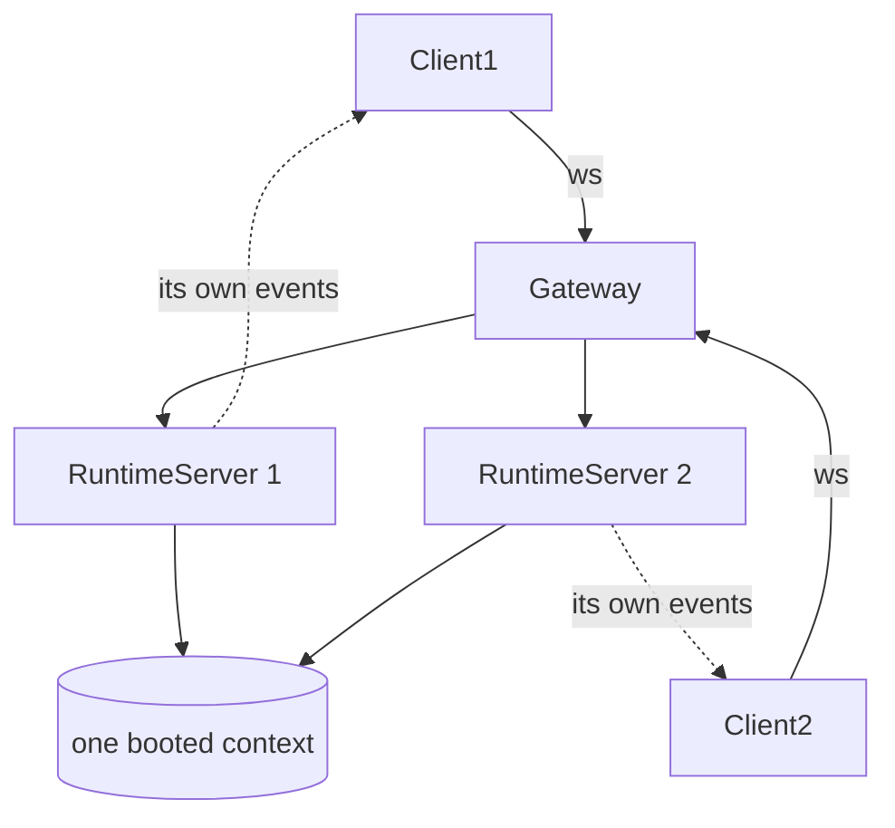
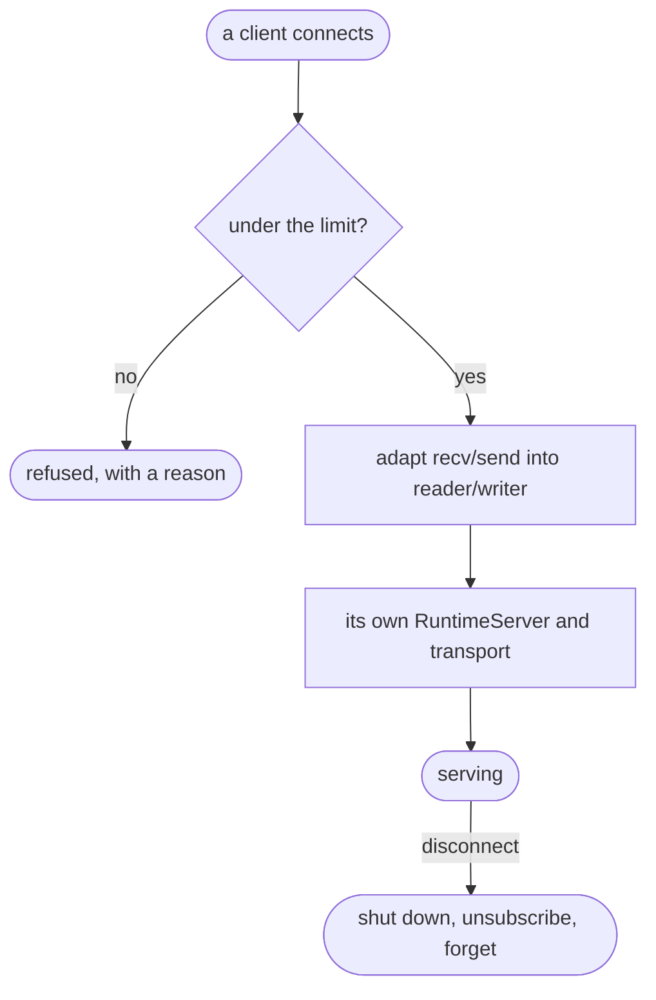
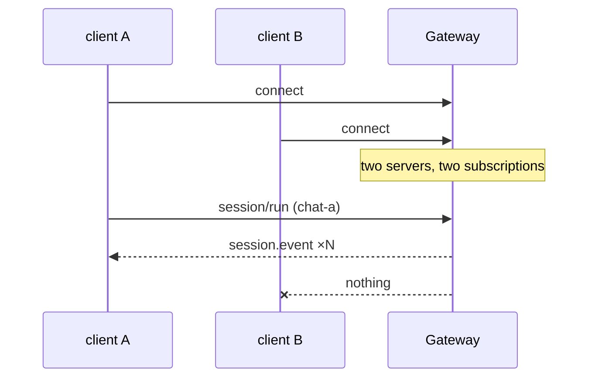

# The gateway and the CLI — the last of the app layer

# 1 · Requirements

## Introduction

Sprint 21 put the runtime behind a pipe. This puts it behind a socket, and puts
a command in someone's hands. After it, every row of the coverage contract is
either ported or recorded there as deliberately out of scope.

Two pieces:

- **A WebSocket gateway** — the same method surface, one connection per client,
  each with its own server and its own event subscription.
- **A CLI** — `pydsh chat`, `pydsh sessions`, `pydsh runtime`, `pydsh gateway`.

The interesting part is how little the gateway is. Sprint 21's transport
already takes an injected reader and writer, and a WebSocket connection *is* a
reader and a writer of text messages — so the gateway is an adapter, not a
second transport. The reference writes a whole second class that re-implements
frame dispatch; this reuses the one that works.

## Glossary

- **Connection**: one client, with its own server and event subscription.
- **Adapter** (here): the two functions that make a socket look like a reader
  and a writer.

## Mental Model & Invariants

**Model:**

- One connection, one server, one subscription. Two clients must not see each
  other's events, and one disconnecting must not disturb the other.
- The gateway is a **binding**, not a protocol. Everything about what the
  methods mean stays in sprint 21.
- A CLI command that fails should say what to do next, to a person.

**Invariants:**

- **I1 — Connections are isolated.** No client sees another's events.
- **I2 — A disconnect releases everything** that connection held.
- **I3 — A frame larger than the limit is refused**, not buffered.
- **I4 — The gateway is bounded.** A connection past the limit is refused with
  a reason rather than accepted into an unbounded set.
- **I5 — The CLI never shows a traceback for an expected failure.**

## Decisions & Corrections (log)

- 2026-08-25 — No second transport class. The reference's
  `JsonRpcWebSocketTransport` duplicates the line transport's frame dispatch;
  since `JsonRpcTransport` already takes an injected reader and writer, a
  WebSocket connection is adapted into that pair instead. One implementation of
  frame handling, not two that can drift.

## Dev Environment (config-as-code — pointers only)

- Deps: `pyproject.toml` (`uv sync`) · Gate: `uv run pytest tests -q`
- Reference: `api/websocket.py`, `gateway.py`, `cli.py`

## Requirements

### Requirement 1: The connection adapter

#### Acceptance Criteria

1. `connection_io` SHALL turn an object with `recv`/`send` into a
   `(reader, writer)` pair the existing transport accepts.
2. THE reader SHALL return `None` when the connection closes.
3. A frame larger than the limit SHALL be refused and the connection closed
   (I3).
4. THE writer SHALL not block the caller, and a write to a closed connection
   SHALL NOT raise into an event emitter.

### Requirement 2: The gateway

#### Acceptance Criteria

1. `Gateway` SHALL serve one booted context to many clients, each with its own
   `RuntimeServer` and transport (I1).
2. A client disconnecting SHALL shut its server down and release its
   subscription (I2).
3. THE number of concurrent connections SHALL be bounded, and one past the
   bound refused with a reason (I4).
4. `serve` SHALL bind a host and port using `websockets` when it is installed,
   and SHALL say what to install when it is not.
5. `close` SHALL stop accepting, close every connection, and be idempotent.
6. Connection count SHALL be observable.

### Requirement 3: The CLI

#### Acceptance Criteria

1. `pydsh` SHALL offer `chat`, `sessions`, `runtime` and `gateway`.
2. `chat` SHALL run one prompt, or read a conversation from stdin, printing the
   assistant's text.
3. `sessions` SHALL list what a store holds.
4. `runtime` and `gateway` SHALL start those servers.
5. Every command SHALL accept `--profile`, `--home` and `--log-level`.
6. An expected failure — a missing profile, an unroutable provider, a port in
   use — SHALL print one line and exit non-zero, with no traceback (I5).
7. `--json` SHALL print machine-readable output where a command has any.

### Non-Functional

- **NF 1**: stdlib only; `websockets` is an optional extra.
- **NF 2**: no test binds a real port unless `websockets` is installed, and the
  gateway's own logic is tested through a fake connection.
- **NF 3**: every bound is a named constant (EP1).

## Out of Scope

- Authentication and TLS. A gateway that ships with an auth scheme nobody
  chose is worse than one that says it has none; termination and identity
  belong to whatever fronts it.
- An interactive REPL. `chat` runs prompts; a REPL is a product decision.

# 2 · Design

## End-to-End Walkthrough

The gateway assembles one context and listens. Each client that connects gets
its own `RuntimeServer` over its own transport — which matters more than it
sounds: the server subscribes to `session/event` and forwards to *its*
transport, so one server per connection is what stops two clients seeing each
other's conversations.

The transport is sprint 21's, unchanged. A WebSocket connection is adapted into
the reader and writer it already takes: `recv` becomes the reader (returning
`None` when the socket closes), `send` becomes the writer. The reference writes
a second transport class instead, duplicating frame dispatch — two
implementations of the thing most likely to need a fix.

A disconnect shuts that connection's server down and releases its
subscription. Without that, a gateway accumulates subscriptions to a context
that will keep calling them, writing to sockets that are gone.

The CLI is four subcommands over the same boot layer, and one rule: an expected
failure prints one line and exits non-zero. A person who typed a wrong path
should read a sentence, not a stack.

## Tech Stack

- Python 3.13+, stdlib only. `websockets` as the optional `[ws]` extra.
- Test command: `uv run pytest tests -q`

## Directory Structure

```
src/pydsh/gateway/
  __init__.py
  connection.py   # connection_io, the frame limit
  server.py       # Gateway
src/pydsh/cli.py  # the `pydsh` entry point
tests/
  test_gateway.py
  test_cli.py
```

## Architecture Overview



## Workflow



## Module Design

### `gateway.connection`

```
connection_io(connection, max_frame_bytes=...) -> (Reader, Writer)
MAX_FRAME_BYTES ; FrameTooLarge
```

### `gateway.server`

```
class Gateway: __init__(ctx, options=None, max_connections=...)
               handle(connection) ; close() ; connection_count
async def serve(ctx, host, port, ...) -> Gateway     # needs the `ws` extra
```

### `cli`

```
main(argv) -> int
commands: chat | sessions | runtime | gateway
```

## Key Algorithms (pseudo-code)

```
ALGORITHM handle one connection                       (I1, I2)
  1. if at the connection limit: refuse, with a reason, and close
  2. reader, writer <- adapt this connection's recv/send
  3. transport <- the SAME JsonRpcTransport as the pipe runtime uses
     # Not a second class. The reference re-implements frame dispatch for
     # WebSockets, so a fix to one has to be remembered in the other.
  4. server <- a RuntimeServer of its OWN over that transport
     # Its own, because a server forwards events to *its* transport. One
     # shared server would send every client every other client's events.
  5. serve until the reader reports the socket closed
  6. finally: shut the server down, close the transport, forget the connection
```

## Sequence Diagrams



## Data Models

No new stores. The gateway holds a set of live connections, which is process
state and dies with it — deliberately, because a gateway that remembered
connections across a restart would be remembering sockets that no longer exist.

## Error Handling Strategy

A refused connection is closed with a reason a client can read. A frame over
the limit closes the connection rather than buffering it. The CLI catches the
expected failures — a missing profile, an unroutable provider, a bound port,
an absent extra — and prints one line.

## Testing Strategy

- **Property**: two connections never see each other's events.
- **Property**: a disconnect releases everything the connection held.
- **Integration**: the CLI's `chat` end to end over a fake adapter.

## Correctness Properties

### Property 1: Connections are isolated
- **Statement**: *For any* two connections, events from one reach only it.
- **Validates**: 2.1 (I1)

### Property 2: A disconnect leaves nothing behind
- **Statement**: *For any* connection that closes, its server is shut down and
  the gateway no longer counts it.
- **Validates**: 2.2 (I2)

### Property 3: The CLI never shows a traceback for an expected failure
- **Statement**: *For any* expected failure, `main` returns non-zero and prints
  one line.
- **Validates**: 3.6 (I5)

## Edge Cases

- **A client that connects and says nothing** — held until it disconnects, and
  counted against the limit while it is.
- **A frame over the limit** — the connection closes rather than the process
  growing.
- **A client disconnecting mid-turn** — the turn finishes on the server, and
  the notifications go nowhere; nothing raises.
- **`websockets` not installed** — `serve` says what to install; everything
  else still works.
- **`pydsh` with no arguments** — the help, and a non-zero exit.

## Decisions

### Decision: no second transport class
**Context:** the reference implements `JsonRpcWebSocketTransport` alongside the
line one, with the same frame dispatch in both.
**Decision:** adapt a connection into the reader/writer pair the existing
transport already takes.
**Rationale:** frame dispatch is the part most likely to need a fix, and two
copies means every fix has to be remembered twice. The seam for this already
existed — it was built in sprint 21 for testing — so using it costs nothing.

### Decision: one server per connection
**Context:** one server for the whole gateway is fewer objects.
**Decision:** each connection gets its own.
**Rationale:** a server forwards session events to *its* transport. Shared, it
would forward every client's conversation to every client — a correctness and a
confidentiality problem in the same line of code.

### Decision: the gateway ships no authentication
**Context:** a network listener with no auth invites one to be added badly.
**Decision:** none, stated plainly, with the boundary named.
**Rationale:** a scheme nobody chose is worse than none, because it looks like
protection. Termination, identity and TLS belong to whatever fronts this, and
saying so is more useful than a token check somebody would trust.

## Security Considerations

The gateway authenticates nobody and says so. It binds loopback by default, so
a careless start is not an open port on a network interface. Frames are bounded
and connections are counted, so neither a large message nor many clients can
grow the process without limit.

# 3 · Tasks

## Status marks
<!-- [ ] pending | [x] done | [!] BLOCKED: reason | [-] DROPPED: <reason> |
     [>] → <spec_id> -->

## Tasks

- [x] 1. The gateway
  - [x] 1.1 `gateway/connection.py`
    - **Requirements**: 1.1–1.4
  - [x] 1.2 `gateway/server.py`
    - **Depends**: 1.1
    - **Requirements**: 2.1–2.6
    - **Properties**: 1, 2
- [x] 2. The CLI
  - [x] 2.1 `cli.py`
    - **Depends**: 1.2
    - **Requirements**: 3.1–3.7
    - **Properties**: 3
  - [x] 2.2 The console entry point and the `ws` extra
    - **Depends**: 2.1
- [x] 3. Tests
  - [x] 3.1 `test_gateway.py`
    - **Depends**: 2.2
    - **Requirements**: 1.1–1.4, 2.1–2.6
    - **Properties**: 1, 2
  - [x] 3.2 `test_cli.py`
    - **Depends**: 2.2
    - **Requirements**: 3.1–3.7
    - **Properties**: 3
- [x] 4. Wrap
  - [x] 4.1 README + the catalogue, and a parity statement
    - **Depends**: 3.2
  - [x] 4.2 Close the sprint
    - **Depends**: 4.1

## Log

**[2026-08-25]** — Created and activated. The reference's second transport
class is not ported: sprint 21's transport already takes the seam a WebSocket
connection fits into, and two copies of frame dispatch is two places to
remember a fix.

**[2026-08-25]** — CLOSED / SHIPPED. 1264 tests green (32 new across
`test_gateway.py` and `test_cli.py`), and the `pydsh` console script was run
for real — a prompt answered, JSON output parsed, a missing profile reported as
one line with exit 1.

**The defect this sprint existed to find was in my own code, not the
reference's.** `test_two_clients_never_see_each_others_events` — written from
I1 before the gateway worked — failed: each connection had its own
`RuntimeServer`, but every server subscribed to the *shared context's*
`session/event`, which fires for every session in it. So client B was handed
client A's entire conversation. Forwarding is now fenced to the sessions a
connection has actually touched. The reference has the same structure and
therefore the same defect; a property test written before the feature is what
caught it.

Two more, both about the CLI as a thing a person uses:

1. **Shared options only worked before the subcommand.** `pydsh chat "hi"
   --json` was an "unrecognized arguments" error, which is not how anyone
   types. Both positions work now — `argparse.SUPPRESS` on the subparser copies
   is what makes it possible, because without it a subparser writes its own
   default over whatever came earlier and the flag silently does nothing.
2. **An unroutable provider printed a traceback.** `LlmError` is not a
   `ValueError`, so the expected-failure tuple missed it — and "you named a
   provider nobody configured" is the most ordinary CLI mistake there is.

## Parity

This sprint closes the standing order. All **84** modules of `dsh-python` are
accounted for: **77 ported**, **7 recorded in the catalogue as deliberately out
of scope** with the reason. Two are plugkit's (`tools`, `guard_timeout`), one is
a convention rather than a module (`brand`), and four are a consumer's choice
rather than a general seam (`hooks` dialects, `watcher`, `native_command`,
`launch_environment` — the last folded into `boot/envfile.py`).
